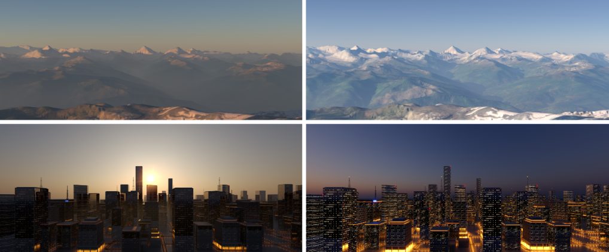
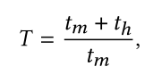
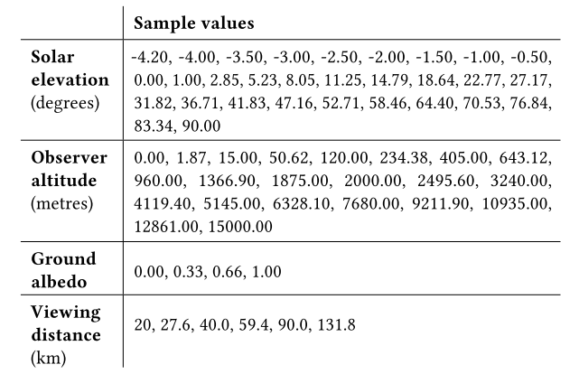

# A Fitted Radiance and Attenuation Model for Realistic Atmospheres

## 1. 介绍

为了获得**高质量的室外场景渲染**，作者需要真实的天穹辐射、大气散射模型，特别是对于交互式的使用情况，三个系列的技术已经建立起来，以弥补**大气路径追踪的性能缺陷**。

+  **HDR天穹捕捉技术**本质上是真实的，并且可以包括云层：典型的用法是作为**HDR环境图**。但它们缺乏匹配的大气散射信息，是静态的，不容易被操作，例如，修改太阳高度或大气参数。
+ **近似天空模型**，为互动设置提供了出色的结果。但是这一类的所有技术都是基于近似大气中的光传输，通常**忽略了高阶散射事件**。
+ 基于大气光传输的强行模拟的**天穹辐射度的拟合分析模型**，在离线渲染中很受欢迎。由于是基于物理模拟，这种模型至少在理论上可以提供**与HDR捕获相媲美的视觉保真度**：但还可以修改天空外观和太阳位置。最重要的是，这类模型还可以使用真实大气中发现的**垂直散射曲线**。

使用**简化的光传**输，由于·在色彩空间中进行计算，而**不是使用光谱渲染**，因此如果需要高度的准确性，就不能使用它们。拟合模型将继续使用：但这方面需要改进，因为现有的技术都缺乏一些关键特征。

特别是，目前的拟合模型中缺少**与高度有关的散射和吸收数据**。这两个特征对于渲染任意场景的能力至关重要，这些场景包括远处的风景，如远处的山脉，或飞行中的飞机的俯视图像。另外，为了准确模拟室外场景中的**镜面物体外观**，考虑**天穹辐射的偏振**是很重要的：而现有模型中没有这样的功能。

在本文中，作者推进了**第三种方法的技术水平**。作者提出了一个**天穹辐射度和衰减的综合模型**，并沿用了以前第三类模型的一般方法，即先进行**强行模拟**，然后将模型与所获得的数据**进行拟合**。但作者在这个过程的**所有组成部分方面**都推进了技术的发展。主要的贡献是：

+ 使用来自大气科学的参考数据，来定义现实的**垂直散射体分布曲线**：这些曲线随后被用于**偏振感知的路径追踪器**，以生成一个大型的**偏振参考图像数据库**。

- 完全球形的参考图像，为高达`15`公里的**观察者高度范围**生成：这比目前**只为地面观察者定义的半球形模型**有相当大的改进。
- 根据专用大气模拟软件的输出，验证这些参考图像
- 一种**新的张量分解方法**来压缩参考图像数据集。
- 提供了一个大气透射率的匹配模型。
- 最后，还有一个天穹偏振的匹配模型。

## 2. STATE OF THE ART IN SKY MODELS

关于天穹辐射度和大气传输的工作在计算机图形学中分为四大类

+ 大气中光传输的暴力模拟 （0）
+ 真实天空的捕捉和测量 （1）
+ 大气散射的交互式近似 （2）
+ 拟合分析模型（3）                    

真正的蛮力方法对于生产使用来说，速度远远不够，因此，其余三种方法都可以被看作是在**可接受的性能水平**上提供足够水平的真实性的手段。

### Fitted Sky Dome Models

这一类包含了一些相当广泛的、工业使用的模型。这些模型都是试图将**参数化的函数**与蛮力天穹辐射度模拟中观察到的属性相匹配：所有模型的共同点是它们对**快速、高质量的场景建模和渲染**非常有用。这些模型的主要缺点通常是参数范围有限，参数空间的某些区域缺乏真实性，以及**相对狭窄的适用性**：==所有这些模型都假设观察者处于地面==。作者的工作增加了这些功能，尽管代价是需要对**所需的参数范围**进行预计算，并导致模型比以前的技术具有**更大的内存需求**。图`2`说明了这些模型与作者的模型所提供的完整解决方案在概念上的区别，而图`3`则显示了省略个别组件的后果。

***Sky Dome Polarisation Patterns***

分析模型的另一个补充是[Wilkie等人，2004]的**偏振工作**`polarisation work `，他们提出了一个**天穹偏振模式的近似分析拟合**。由于作者既没有获得参考数据，也没有能够包括**该现象的蛮力模拟器**，他们完全是基于间接推理的方法。而且正如[Wang等人2016]所总结的那样，他们的结果是相当次优的。后一篇论文的作者还提出了一个**新的、高质量的天穹偏振分析模型**，可以有效计算。然而，如果没有相应的天穹辐射度和透射度的分析模型，这个很有前途的新模型在制作高精度渲染方面的作用就很有限。相比之下，作者提出的新模型提供了一个综合解决方案，涵盖了天穹辐射度的所有方面（散射辐射度、衰减、偏振）。

### Radiance Pattern Captures

多年来，为**重新打光**而在现场捕捉**天空辐射度**已成为电影业的一项标准技术，有代表性的**HDR天空图像集**是生产环境中的一种常见照明资源。然而，这种生产级别的HDR图像很少是以校准的方式拍摄的，从而使人们能够使用它们作为**以绝对单位进行渲染的基础**，或者作为验证拟合天穹模型的基础。一个非常有用的例外是Kider等人[2014]的工作。他提供了一个代表性条件下的**天穹辐射度数据集**，也可用于直接照亮场景。该工作的唯一缺点是，**它不包含采集时的确切大气参数，而只是气象数据**。这种`scatterer profile`数据的缺乏意味着不可能轻易地进行与Kider等人[2014]的数据集中捕捉到的亮度分布**相匹配的暴力渲染**：清晰的大气结构有太多的自由度，无法仅从亮度分布中得出`scatterer profile`。

## 3. PHYSICS BACKGROUND FOR ATMOSPHERIC RENDERING

图形学通常使用近似的解决方案，以达到合理的性能。在本节中，作者简要回顾一下物理学——对参与介质中的光传输的完整描述。例如在大气中，**辐射传输方程给出了完整的描述**，Pharr和Humphreys对其进行了详尽的介绍。它受制于以下参数：

+ 传输系数或消光系数 $\sigma_t$，它是**平均自由路径的倒数**。这个参数可以通过将**消光截面**`extinction cross section`乘以颗粒浓度，即每立方米的颗粒数，来获得。
+ 单一散射反照率 $\alpha$，它给出了**介质中的碰撞事件是散射事件而不是吸收事件的可能性**。
+  相位函数及其参数，它描述了散射事件后，**光的方向分布**。

### Scattering Mechanisms

在大气中，主要有两种散射机制：**瑞利散射和米氏散射**。两者都可以通过**各自的相函数和消光截面**来描述。请注意，其他类型的机制，如冰晶等非球形颗粒的散射，并不存在于所有的大气结构中，作者在模型中不考虑它们。

瑞利散射描述了**光与大气中的气相成分的相互作用**，如$N_2$和$O_2$。粒子的浓度随高度的变化而变化。

米氏散射描述了**光与气溶胶的相互作用**，更普遍的是大于光的波长的散射体。在大气中，颗粒有不同的尺寸分布，这影响了横截面和相位函数。由于散射**偏向于前向**，它在多雾的环境中会在光源周围产生**特征性的光冕**。

与瑞利散射不同，米氏散射没有简单的闭合公式，它必须进行**近似计算**，或者从**尺寸分布**中预先计算，并为每个波长单独制表。在作者的模型中，作者使用**预先计算的消光系数**、单一散射反照率和不对称性参数，以及闭合形式的Henyey-Greenstein相位函数。瑞利散射和米氏散射都是**偏振光-物质相互作用**：但对于天穹场景，**宏观上产生的偏振**在米氏散射的情况下往往相当弱。

### Actual Composition of a Typical Atmosphere

在物理上正确模拟大气层中的光需要了解**大气层的组成**。在物理模拟中，大气层被认为是由分子、气溶胶和云组成，其中云可以进一步分为水云和冰云。由于作者的模型只处理晴朗的天空，作者不进一步讨论云层。

***气相成分***

对于气相成分，有参考大气，如美国标准大气，其浓度表的范围从`0`公里到`120`公里。空气的两种主要成分，$N_2$和$O_2$，分别占空气的78.1%和20.9%，直到约`90`公里的高度，那里的**整体空气浓度已经可以忽略不计**。

这些分子负责瑞利散射，是天空的蓝色的主要原因。然而，还有一种分子与天穹外观有关：臭氧（$O^3$）。在大气研究文献中，它对**黄昏条件下天穹外观**的重要性早已为人所知。即使没有直接的联系，如果**低太阳高度的天空**要正确呈现，就必须包括$O^3$，因此作者将其纳入了作者的模型。

***气溶胶***

大气层的第二个主要部分是**气溶胶**。由于这些颗粒较大，它们引起的散射是由**米氏理论**描述的。有一个关于这些散射体的气溶胶属性数据库，叫做`OPAC`：它包含通常存在于大气中的几种基本气溶胶类型，例如水溶性（WASO）、水不溶性（INSO）和黑碳（SOOT）。每种类型的光学特性都可以从**给定的颗粒大小分布和折射率**中计算出来，并且可以在`libradtran`中找到。气溶胶浓度的垂直分布可以根据不同的环境建立模型，例如大陆（清洁、平均和污染）、城市、沙漠或北极环境。

## 4. THE BRUTE FORCE SIMULATION

### Viewing Distance as Model Parameter

为了控制室外场景的朦胧度，现有的天穹模型有一个用户可控制的参数，叫做==浊度==。这是一个相对的衡量标准，即相对于分子而言，由于气溶胶而产生的**额外散射部分**，即与理想的清洁分子大气相比，大气的散射程度有多大：

其中$t_m$是分子的**光学厚度**，$t_h$仅是气溶胶的光学厚度。这个值通常是`550nm`，并在天顶方向测量。在使用现实**散射体曲线**时，这种垂直测量值与**朦胧度**没有很好的相关性：只有在使用**指数散射体曲线**时，它们才有很好的相关性。由于作者使用的是现实的散射器曲线，有大量的
靠近地面的气溶胶，作者通过**地面的水平观察距离**（简称观察距离）来为作者的模型设定参数。

### Our Atmospheric Model

为了达到尽可能真实的外观，作者的大气模型直接基于美国标准大气，以及三种特定大气配置的曲线`profile`：平均、清洁和污染。这些标准曲线是基于实际测量的，但在**OPAC模型**中，这些曲线被简化为**两个指数**，在反演层有一个**尖锐的过渡**。为了获得实际有用的`scatterer profiles`，作者首先必须通过平滑**反演层的过渡**来稍微修改`OPAC profiles`。对于所有的大气配置，作者考虑到了WASO、INSO和SOOT粒子。它们的消光截面和单次散射反照率是由libradtran提供的。瑞利散射截面是基于Bodhaine等人[1999]，只考虑了$N_2$和$O_2$。对于$O^3$粒子，作者使用Gorshelev等人[2014]在223 K时的截面。

***气溶胶相函数***

为简单起见，作者使用的气溶胶相函数是**基于闭合形式的Henyey-Greenstein近似值**，而不是全Mie散射。作为WASO和SOOT的不对称性参数，作者用数字方法拟合了最佳的、随波长变化的参数，以匹配**OPAC计算的相函数**。对于强正向散射的INSO粒子，作者自己的拟合结果是一个接近`1`的值，这在作者的强行渲染器中造成了萤火虫伪影，并导致太阳盘周围出现一个狭窄的、难以拟合的高能量区域。由于这两个原因，作者采用了由OPAC定义的INSO不对称性参数，该参数略低，而且略微模糊了太阳周区。

### The Dataset and Views used for Model Fitting

输入是地面的太阳高度、观察者的高度、地面反照率和观察距离。这些参数的值可以在表2中找到。作者计算了与[Hošek and Wilkie 2012]相同的11个波长的光谱模型。作者尝试改变光谱通道的选择，但发现**较少的光谱通道**开始导致**明显的颜色偏移**，而更多的光谱通道则没有产生明显的好处。作者的目标是为计算机图形提供一个模型，所以**光谱带的数量**相当少并不是一个问题。如果需要纳米级的光谱精度，就需要通过libradtran或类似的专门工具进行直接计算：预先计算一个天穹模型，使其达到如此精细的光谱分辨率，需要大量的存储空间。

***侧向鱼眼视图***

与以前工作的一个重大区别是，作者的模型现在包含了描述**不同观察者高度的散射辐射**的能力。因此，这意味着作者现在必须拟合一个完全的球形函数，而不是一个半球形的。为了避免地平线上的不一致，作者使用一个**侧向的天空鱼眼视图**作为拟合算法的输入，而不是**两个朝上和朝下的鱼眼视图**。对于路径追踪中定义的理想化行星，散射数据在太阳位置的**左右是对称的**，所以作者只需要生成一个侧向视图。

## 5. CREATION OF THE ANALYTICAL MODEL

### In-scattered Radiance

由于用于表示散射辐射的、基于图像的分解方法的内部运作有些复杂，作者在**补充PDF文件的第1节**给出了详细的解释，在此只介绍该方法的主要特点。由于**大量的外观特征**存在于完全球形的天空中，特别是如果包括日落后的情况，作者不得不开发一种全新的拟合方法，与以前的技术不同。在作者的模型中，作者将**天空的辐射度模式**作为**单变量函数的外积之和**来获得。这些函数本身是自由形式的、表格化的，通过Canonical Polyadic Decomposition（CPD）获得，这个过程与**SVD低秩近似**非常相似。这种方法可以被认为是一种专门的压缩方案，然而它本质上也是将**辐射度模式**分解为一组**最佳的正交 "特征"**；作者所使用的方法都依赖于**张量和矩阵的分解**。

**CDP的性能**在很大程度上取决于使用**合适的输入参数化**，以使分离干净地进行。在这方面，作者找到了一个合适的方案，在补充PDF的第1.2节中描述，它基于**太阳角**，加上阴影和天顶角，并使太阳光的梯度和阴影/地平线与**鱼眼输入图像的两个轴**对齐，重新投影到这个空间。在那里，它们被表达为**使用CPD分解的两个向量的外积**，作者存储这两个向量以便以后检索和重建。天穹的外观随着物体高度的变化和太阳升起而发生微妙的变化。

