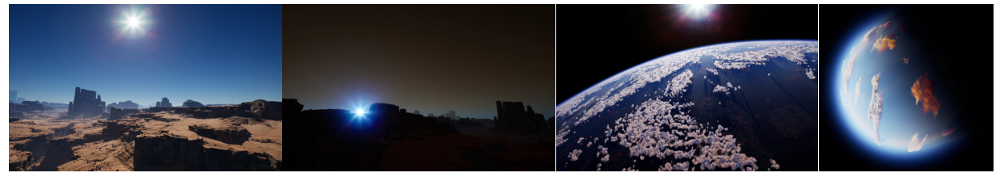
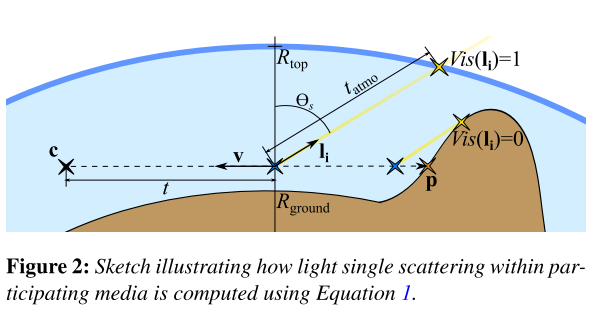

# A Scalable and Production Ready Sky and Atmosphere Rendering Technique

## 1. Introduction

目前的方法有其局限性：它们要么被限制在**从地面看**，要么**只能表现单一的大气类型**，当大气属性发生变化时，需要对**查找表**（`LUT`）进行昂贵的**计算更新**，或者甚至可能表现出**视觉伪影**。

本文提出了一种方法，从基于物理的大气层参与介质的表现中，实时渲染**星球的天空**和`aerial perspective`。贡献有以下几点。
- 提出了一种天空和`aerial perspective`的渲染技术，依靠`LUTs`在较低的分辨率下计算照明积分的昂贵部分，同时保持**重要的视觉特征**。
- 提出了一种新的方法来计算大气中**光的多重散射的贡献**。它可以**近似于无限多的散射阶数**，也可以用来加速**路径追踪**。
- 该技术支持动态时间以及**大气属性的动态更新**，同时在广泛的设备上进行有效渲染，从低端的苹果iPhone 6s到游戏机和高端游戏PC。

在本文中，将使用**光度单位**（亮度/照度）而不是**辐射单位**（辐射度/辐照度）。

## 2. Participating media rendering

**渲染参与介质**可以通过`ray marching`或**路径追踪**来实现。在这两种情况下，都需要使用代表参与介质的**材料参数化**，如辐射传输方程所描述的。在这个框架中，对于一个给定的位置，考虑到一束光在一个方向上移动，每波长的吸收$\sigma_a$和散射系数$\sigma_s$（$m^{-1}$）分别代表沿一个方向**吸收或散射的辐射比例**。此外，当散射事件发生时，散射方向需要根据由单位为$sr^{-1}$的**相位函数p**代表的分布来决定。

在强大的实时约束下，本文的方法依靠**射线行进**来计算单次散射，如图2所示。它假定有一组$N_{light}$方向的灯光，例如太阳和月亮。它还考虑到了一个虚拟的星球，根据反照率ρ，地面有一个纯粹的漫反射反应。它涉及到将散射到观测者的亮度L作为介质透射率T、阴影因子S（Vis是来自星球的阴影，T是来自大气的阴影）以及沿路径段的内散射Lscat的函数进行整合。

