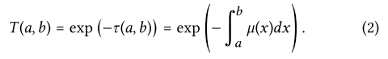

# An unbiased ray-marching transmittance estimator

## 1. INTRODUCTION

场景中两点之间的**可见度**是**光传输模拟**中的一个基本量值。在真空中，它有一个二进制的值。然而，在参与介质中，`scalar radiative transfer`被用来统计散射和吸收粒子的存在。与给定射线相交的粒子的数量是一个随机变量，可见度成为一个分数量。

在本文中，作者提出了对==方程1==进行**无偏估计**的新方法。作者提出的计算器是**基于指数函数的低阶泰勒级数扩展**。使用**低阶扩展**可以释放**采样预算**，以便更准确地计算**扩展点**和**泰勒级数项**，这进一步允许降低**计算顺序**并改善样本。这种自我强化的循环导致了一个**无偏的低方差估计器**，在大多数情况下只评估已经相当准确的**二阶项**。对这个项的评价可以与**经典的抖动射线行进方案**相提并论，而其余的项可以被看作是**概率采样的修正项**，使其成为无偏的，所以作者把技术称为**无偏射线行进**。

## 2. BACKGROUND AND RELATED WORK

透过率是**负光学深度**的指数：

使用射线行进法)或通过蒙特卡洛方法可以很容易拟合**光学深度**，但指数将导致有偏估计[Raab等人2006]。jackknife方法及其概括[Miller 1974]在某些情况下可以用来减少偏差，但对于某些应用来说，误差可能仍然不能接受。因此，**透射率估计的关键挑战**是如何在只给定点样本的情况下形成**无偏的估计**。

### Poisson point processes

许多无偏方法被设计出来，以计算类似**方程1**的指数积分，这些方法与`point processes`的**零阶估计问题**密切相关。一个点过程$N(l)$是在某个时间内（或沿着单位长度射线）ℓ发生的事件数量的**随机计数过程**。对于**泊松点过程**（`PPP`）来说，事件是独立的，并且是泊松分布的，`rate`为$\lambda$ℓ。这个`rate`是该过程的**强度函数**在区间内的积分

并允许**点的平均密度**在域内变化。众所周知，由于假设了**独立的散射中心**，这个PPP正是**经典辐射传递**中支配散射和吸收事件的过程。**两者之间的对应关系**是通过将点过程的$\lambda(x)$**等同于**从a出发时在区间内移动时的**消光系数**$\mu(x)$来建立的，$\lambda(x)=\mu(a+x)$。然后，**透射率**是沿区间没有发现**点/粒子的概率**：

由于PPP的平均值是`rate`：(下式1)，`classical radiative transfer `的**指数自由路径**遵循**泊松分布的零阶概率**（具有rate $\tau$的**泊松分布**的**概率质量函数**是 $e^{-\tau}\tau^k/k!$，对于k=0来说是一个指数)。

### Tracking estimators

最著名的`unbiased transmittance estimators`被称为`tracking estimators`，这是因为它们通过对`PPP`进行采样，确定与**介质碰撞**的有序序列，从而跟踪从`a`到`b`的粒子。对于**恒定密度的介质**，碰撞之间**指数分布的自由路径长度**很容易被采样。对于非均质介质，可以使用`delta-tracking`方法对PPP进行采样。可以对一个**更密集的过程**进行采样，其**rate/光深**很容易被计算出来

然后，**一个拒绝过程**被用来将**密集的过程**稀释到**所需的结果**，即每个采样点$x_i$，以概率$\mu(x_i)/\overline{\mu}(x_i)$被保留。这种拒绝体现了`transport`文献中的**虚构/空洞碰撞概念**（`fictitious/null collision concept`）。我们注意到，这相当于`point process`文献中的一种方法，被称为`thinning`。

