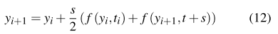

# Differential Ray Marching

本文介绍了如何应用不同的**数值方法**，来实现`RayMarching`技术，分析了一系列的数值方法，并研究了它们在不同情况下的适用性。此外，作者还展示了它们比**传统的射线行进技术**在哪里有所改进。任何基于``RayMarching``的**参与介质渲染算法**都将本文的技术应用中受益，因为它减少了所需的样本数，提高了精度。

## 1. Introduction

渲染**参与介质**最广泛使用的技术之一是`RayMarching`。它的主要思想是将**光路**划分为**均匀的片段**，并通过一个单一的样本来近似该片段上发生的所有**微分相互作用**。这在数学上表现为用**求和法**来逼近一个积分。根据这些段的大小，渲染变得更加准确（短段）或需要更短的时间（长段）。

## 2. Previous work

泛善可陈。

## 3. Overview

光线通过介质，可能发生三种情况：被介质吸收、散射（`in` and `out`）、介质自发光`emitted`。定义这种行为的方程是`Radiative Transfer Equation`：{**1**}

$\frac{\delta L(x,w)}{\delta t}$表示沿光路**辐射的微分变化**。`x`是发生相互作用的微分点，`ω`代表光的方向，$w^/$表示到达微分点`x`的其他光路的方向。其余的符号代表了介质的属性：

+ $\sigma_a$是吸收参数。
+ $\sigma_s$是散射参数。
+ $\sigma_t=\sigma_a+\sigma_s$是消光系数。吸收或被`out-scattering`
+ $p(x,w^/,w)$是相位函数。
+ $L_e$是介质的自发光。

为了渲染一个参与介质，需要求解**方程1**，得到到达眼睛的辐射度$L(x,w)$。传统的射线行进是通过近似其**积分形式**来求解该方程的：{**2**}

其中$T_r(x_0,x_t)$称为==透射率==，计算所有穿过$x_0$到$x_t$之间的介质而不因**介质的性质**而熄灭的光。$L_i(x_s,w)$表示`in-scattered`。

==传统的射线行进技术==通过使用**矩形方法**，对每个积分进行逼近，来求解这个方程。例如，**方程2**的第三个加项可以被近似为：{**5**}

距离`t`被划分为`n`个大小为$\Delta s$的分段。每一段都是沿着光路的`in-scattering`$L_i$的一个样本。通过增加分段数`n`，图像质量得到改善，但模拟时间增加。

$T_r$（见公式3）通常是通过使用与主积分相同的积分规则。$L_i$涉及到单次散射（来自光源的光），这可以很容易地计算出来，而**多次散射**，可以使用**蒙特卡洛技术**或其他诸如**光子映射**的技术进行采样。

另一方面，本文的工作试图利用**辐射传输方程**（方程1）的==微分形式==，正如下文所显示的，它比**积分形式**有几个优点。首先，有一套具有**有趣特性**的**数值方法**可以应用。另外，在其**微分形式**上求解方程可以避免计算**双重积分**。

方程1的形式如下：{**6**}

`t`是沿着光路的距离，`y`是辐射度本身。此外，**进入介质的辐射度**$y_0=L(x_0,w)$也是已知的（可以从表面的材料特性和光分布中计算出来）。因此，**方程6**和$y_0$值形成一个**初始值问题**，因此，有几种不同的数值方法来解决它。

## 4. Numerical methods

考虑到方程1具有初始值问题的形式（方程6，即**进入介质的辐射度**是其初始值），它可以通过一些专门用于解决**这种特定微分方程**的**数值方法**来解决。其关键思想是：在先前推导的基础上，从函数中推导出数值（直到初始值）。

最基本的方法是==欧拉方法==。给定在初始位置$t_0$的初始已知值$y_0$，可以按以下方式，计算不同的函数值：{**7**}	{**8**}

`s`是step size。样本是沿`t`均匀分布的。这意味着，当应用于**方程1**时，欧拉方法在数值上等同于传统的射线行进法（见图1）。然而，与射线行进法一样，欧拉方法也有几个缺点，可以通过选择更先进的方法来解决。

### Explicit Runge-Kutta

**欧拉方法**根据其在**单个数值的导数**估计**每一步的数值**。如果每步使用一个以上的样本，就可以做一个更好的近似。这就是==Runge-Kutta==方法的关键思想。一个二阶Runge-Kutta方法需要对函数`f`进行两次采样，并将欧拉方程7替换为：{**9**}

==四阶Runge-Kutta==方法之一（本文使用的方法）需要四个样本，其定义如下：{**10**}

### Implicit methods

**显式Runge-Kutta方法**容易受到方程的不稳定影响，导致在方程特别僵硬（`stiff`）的区域出现高误差。==隐式方法==处理了这个问题：它们不是盲目地按照函数一步一步地进行，而是在每一步解决**方程组**，在数值上稳定计算结果。

最简单的**隐式方法**是反欧拉法，它将公式7替换为：

这意味着，实际上需要知道$y_{i+1}$。实际上，这个方法在每一步都需要做的是：将$y_{i+1}$作为未知数来解==方程11==。作者通过使用==定点法==来实现这一目标，该方法会进行多次迭代，直到误差低于给定的**容限**`tolerance threshold`。因此，这种方法是通过两个参数来计算的：步长和定点的容差`tolerance`。

### Predictor-corrector techniques

隐式方法往往比显式方法更慢。另外，高阶方法比低阶方法更慢。==预测器-校正器技术==是基于这样的想法：有些步骤可以用更快的方法计算，而有些步骤需要更高的精度，需要更慢的方法。

在这项工作中，作者测试了梯形（实际上是**欧拉-梯形**）方法。它是由以下（二阶）隐式方法方程定义的。

### Adaptive step

最后一种经过测试的数值方法是==自适应==。它们的关键思想是较大的步长不那么准确，但比较短的步长要快。他们估计每一步的误差，如果误差很低就增加步长，如果误差太高就减少步长（与一个特定的公差参数（`tolerance parameter`）相比）。

通过比较两种不同阶数的数值方法来估计误差。在本文中，使用的方法是比较欧拉（方程7）和Runge- Kutta 2（方程9）之间的相对误差，以调整步长。

## 5. Error-time analysis

为了进行**误差分析**，需要找到一个`Ground truth`来比较结果。在实践中，这意味着要找到一个方程1的**解析解**（如果有，首先就不需要射线行进了）。然而，在几个特定条件下，有可能找到这个**解析解**。

+ 均匀介质（恒定吸收和散射特性）。没有介质自发光。
+ 统一的照明，没有阴影，这在实践中可以通过**无限方向光**和**不投射任何阴影的场景几何**来实现。
+ 没有多次散射。

在上述条件下，可以从积分中取出几个因子（变成常数），因此方程1有如下解析解（由方程2推导）：

方程13的作用是呈现出`Ground truth`（见图2，左），并有助于检查一种方法是否显示出高（见图2，中）或低的误差（见图2，右）。

关于隐式方法，相对于标准欧拉方法，使用后向欧拉方法没有明显的改进。相反，根据容忍度的不同，这种定点方法在较大的步长下可能无法收敛到足够的解（基于过高的每步误差）。欧拉梯形法（这是一种预测-修正方法）：其性能与二阶Runge-Kutta方法相当相似，在某些情况下可能无法收敛。在这种情况下，这种简单的场景设置导致了非刚性方程1，因此忽略了这些方法的优势。其他场景设置（见第6节）包括显式方法无法处理的方程上的硬性问题，但隐式方法和预测-校正方法可以轻易克服。

最后，自适应方法显示了预期的性能。对于较低的公差，步长的影响被忽略，因为该方法使其步长适应所需的总体误差(导致再次比欧拉更好的精度)。这是一个非常理想的属性，因为公差参数比步长更便于用户使用。