# Higher Order Ray Marching

## 1. Introduction

本文的工作分析了高阶方法，包括**正交规则**`quadrature rules`和**IVP求解器**，如何模拟参与介质。
以及它们与**射线行进**或**蒙特卡洛积分**相比的表现。

一些被分析的方法是**自适应的**。这种求解器适应于沿路的光贡献的数学定义（包括介质和光分布）。这种适应能力对有可见阴影或**高度异质介质的场景设置**有很大帮助，在这种情况下，**标准光线行进法**会导致**带状伪影**，而**蒙特卡洛法**会产生**高频噪声**。

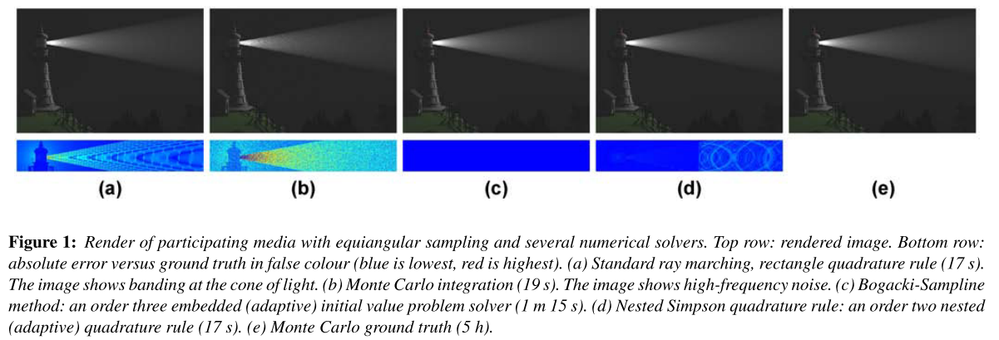

## 2. Previous Work

## 3. Radiative Transfer

当光穿过参与其中的介质时，它在路径上的每一个微分点上都与之相互作用，有三种可能的方式：可能被介质吸收、散射或发射。定义这种行为的方程是==RTE==：

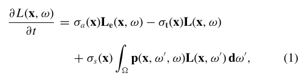

为了渲染**参与介**质，我们需要求解方程1，并获得辐射亮度==L(x，ω)==。方程3为**线性常微分方程**，因此有**解析积分解**：

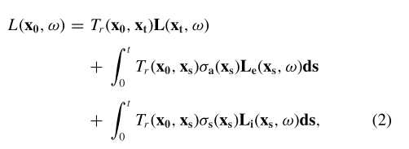

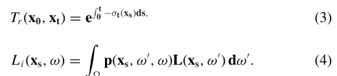

既有**微分形式**（方程1），也有**积分形式**（方程2）。$L_i$涉及**单次和多次散射**。多重散射（光在介质中反弹了几次）可以通过**蒙特卡洛积分**或**光子图**来取样[Jen01]。**单次散射**可以通过追踪**从采样点到光源的射线**来计算。直接来自光源的光线在介质中传播了一段距离，因此也必须根据$T_r$来消光。在**均质介质的情况**下，$T_r$是 一个分析项：

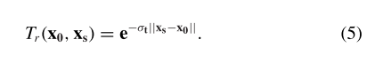

**渲染参与媒体**包括解决RTE，要么是它的==积分形式==（方程2，最常见的选择），要么是它的==微分形式==（方程1）。每种方法都转化为一种新的`Ray arching`策略，即**沿路径采样**，如图2所示：每种技术都选择不同的采样点和权重，以便收敛到解决方案。**自适应技术**可能会根据**误差估计启发式**和**适应策略**拒绝一些样本（图2中红色标记），并相应地选择**新的样本点**。

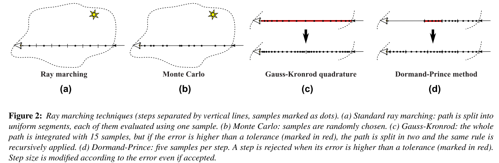

## 4. Solving the RTE

### Quadrature rules

**方程2**可以通过==正交法则==进行**数值计算**，该法则通过**加权函数之和**来逼近积分。例如，**方程2的第三项**将被近似计算如下。

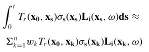

从一组`n`个采样点$x_k$，每个样本点的权重为一个特定的因子$w_k$。样本点${x_k}$和权重${w_k}$是**正交规则`Quadrature rules`**的具体数值。在每个$x_k$处的**每个函数评估**都需要计算$T_r$和$L_i$，它们又是**积分**。在**均质介质**的情况下，$T_r$（见公式5）是分析性的。

然而，对于**不均匀介质**，必须计算**透射率**$T_r$，例如，将**应用于积分RTE（公式2）的正交规则**应用于**公式3的指数**。在单次散射的情况下，$L_i$成为一个加法（对所有光源），$T_r$也必须应用于从**光源**直接到**采样点**的光。

标准的`ray marching`是将`Quadrature rules`应用于方程2：采样点沿光路**均匀分布**，每个采样点的权重是一个**同质值**，即**步长**。通过增加分割点的数量，图像质量得到改善（步长减少），但模拟时间也增加。图2(a)说明了这一点。蒙特卡洛方法也是一个`Quadrature rules`，样本点$x_k$根据一个**pdf**分布，$w_k=\frac{1}{pdf(x_k)}$，如图2(b)所示。

### Nested quadrature

`Nested quadrature`规则同时应用**高阶和低阶规则**，以计算解和误差：

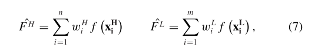

$F^H$和$F^L$分别表示来自**高阶或低阶求积规则**的计算（$n>m$），$e =||F^H - F^L||$是计算的误差。低阶采样点是高阶采样点的子集。当误差超过一定的**公差tol**（e> tol）时，$F^L$被拒绝，**积分范围被分成两部分**。然后，`Quadrature rules`被递归地应用于每个子段。在实践中，设置最大和最小的步长是很方便的，因此**自适应方法**能够对**高频细节**进行采样。

**公差**是误差控制的基本参数。在这项工作中，作者检验了**嵌套辛普森规则**（标准辛普森和梯形求积规则）和**高斯-克朗罗德方法**（`Gauss-Kronrod method`）。

### IVP solvers

与以前的工作一样，本文的工作利用了==RTE的微分形式==（方程1）。它的形式是$y^/(t)=f(y, t)$（`t`是沿光路的距离，`y`是辐射度本身）。此外，进入介质的辐射度$y_0 = L(x_0,ω)$也是已知的（它来自表面）。因此，==RTE==实际上是一个==IVP==，因此，有几种方法可以对其进行数值求解，如**Runge-Kutta方法**。一般==Runge-Kutta==方法定义如下：

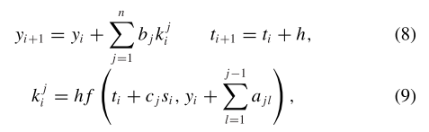

其中`h`是步长，`n`是每步的函数求值数，通常与方法的顺序有关。数值${b_j }、{c_j }、{a_{jl}}$是每个方法所特有的，通常被安排在`butcher's tableau`中。不同方法的Butcher's tableau很容易在专业文献上找到[PTVF07]。**Euler方法**是**最简单的Runge-Kutta方法**，$n=1，c_1=0，b_1=1$。

我们还需要考虑到**透射率Tr**的问题。在均质介质的情况下，这是一个分析项（方程5），而对于异质介质，我们使用**与RTE相同的求解器**来解决以下IVP。

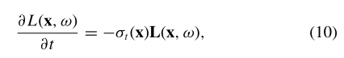

这只是RTE（公式1）的消光项。请注意，方程（3）将是方程（10）的积分形式（分析解），定义了透射率$T_r$ 。在这项工作中，我们分析了欧拉方法与`Quadrature rules`（标准射线行进法）和标准四阶Runge-Kutta方法（RK4）的并列比较。由于**RTE是一个线性常微分方程**（方程1），RK4方法每步只需要两个样本，而不是通常的四个[PTVF07]。

### Embedded Runge-Kutta methods

==嵌入的Runge-Kutta方法==由两个不同的`order methods`组成，这两个方法共享相同的${c_j }$和${a_{jl}}$值，但${b_j }$的权重不同。

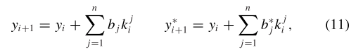

其中，$y_i$和$y_i^*$是来自两个方法论的计算值。${b_j }$和${b^∗_j }$是相应的权重系数。计算$k^j_i$值（如公式9所示，涉及到函数评估）对两种方法来说是相同的。

如果**每步计算的相对误差**$e_i$大于**特定的容忍度`tol`，**该步将被拒绝，并以**新的步长**重新计算。即使该步骤被接受，步骤大小也会被修改。我们对所有的嵌入式方法使用以下默认的步骤适应策略。

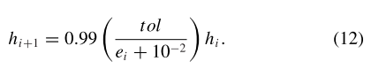

与`nested quadrature rules`一样，我们也为**步长**设置了**全局的上下限**。在这项工作中，我们考虑了三阶Bogacki-Shampine方法和五阶Dormand-Prince方法。由于RTE是线性的，Dormand-Prince步骤需要五个函数计算，而不是通常的六个（如RK4方法）。对这两种方法的分析不仅使人们对嵌入式方法有了深入的了解，而且还可以对不同阶数的两种方法进行比较。

## 5. Importance Sampling

**重要性采样**是一种通用技术。不同的pdf导致**沿积分域的不同采样策略**，最好是使获得准确结果所需的采样数量最小。识别**合适积分的正确pdf**涉及到在pdf公式中尽可能多地考虑积分的知识，这也是渲染界自己感兴趣的话题。在这一节中，我们将展示如何通过改变变量，将**几种重要性采样策略**适应于任何正交规则或IVP求解器。

==距离采样[RSK08]==。这一策略的关键思想是：将较少的样本放置在**消光使其不被注意的区域**。为了将这种策略纳入我们的方法（基于IVP求解器或正交规则），我们应用了以下变量的变化。

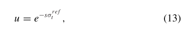

其中，$σ^{ref}$是每条射线的==参考消光系数==。将方程（13）应用于RTE的积分形式的微分和散射项（方程1和2），我们得到：

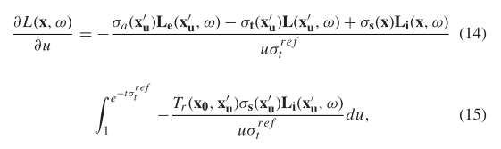

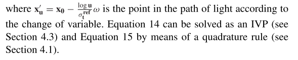

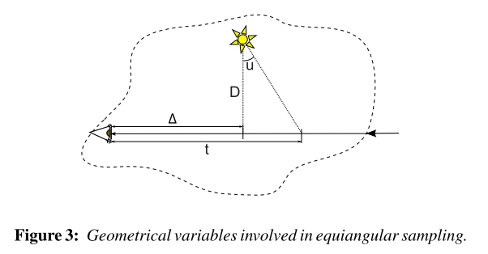

==等角取样[KF12]==。给定一个由**点光源**照亮的参与介质，这种策略将更多的样本定位在靠近光源的地方。同样，变量的改变使我们能够利用这种取样策略。给定光源与射线的距离为D：

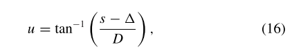

这导致了RTE的微分形式和积分形式的散射项的如下变换：

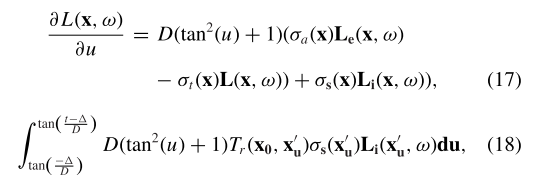

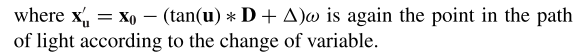

## 6. Results and Discussion

前面几节介绍的求解器在应用于**渲染参与介质时**都表现出不同的行为。为了更好地理解每种方法在**采样数量**和**结果辐射度的准确性**之间的权衡，我们设置了三个简单的场景。对于每个场景，我们将穿越**相应参与介质**的射线所给出的辐射度与`ground Truth`进行比较。用100 000个样本的蒙特卡洛正交法则来计算基本事，并将其与特定的数字方法的结果进行比较。对于一个`L`的`ground truth`解决方案和一个ˆL的**估计辐射度**，**误差度量**是相对的：

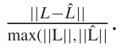

这三种情况是：一个单一的定向光，一个单一的点光和一个有遮挡物的单点光。对于这个测试（以及本节中的大多数结果），多重散射被忽略了，只是计算了单一散射。多重散射模拟时的误差将不可能从每个求解器的误差中分辨出来，从而使分析变得复杂。此外，多重散射倾向于模糊表观辐射度，因此平滑了与**射线行进技术的性能分析**相当相关的不连续现象（不连续现象实际上是一种最坏的情况，在下文中讨论）。图（4）显示了这些测试的结果。我们没有分析单一光线的渲染时间，而是计算每种方法所需的函数评估（样本）的数量。这个指标更加可靠，因为参与介质渲染的瓶颈来自于可见度测试和间接光照，每个样本所需的时间与场景有关。

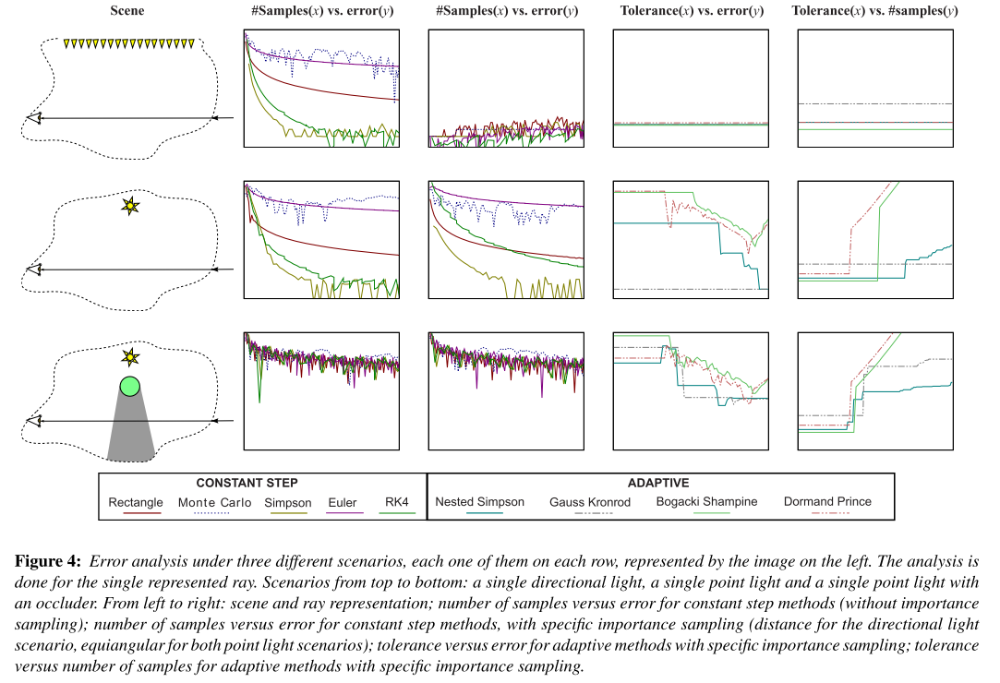

重要性抽样。应用==距离重要性抽样==，对于第一种情况（上排，单一方向的光）是最佳的抽样策略（pdf等于积分）：即使是单一的抽样，任何数值方法都能给出一个准确的解决方案。因此，恒定步长方法产生的误差（第二列）仅仅归功于数值精度。此外，自适应方法只需一步就能收敛，不管是什么公差（第四栏）。然而，在有定向光源的一般情况下，这种最佳行为会被遮挡物和介质系数的异质性所改变。

==等角取样==有助于一些正交规则的收敛，如第二种情况下的蒙特卡罗和矩形规则。诸如Monte Carlo和第二种情况下的矩形规则。然而，它似乎阻碍了IVP求解器的性能。这是由于IVP求解器通常对刚性方程比较弱：由于某种原因，微分方程呈现出细微的不稳定行为。看来等角取样的变量变化（方程16）在某些情况下可能会导致僵硬方程。这也可以从自适应IVP求解器的性能上看出来。

