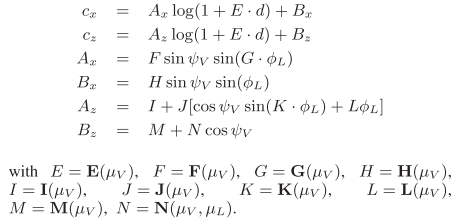

# Interactive multiple anisotropic scattering in clouds

## 1. Introduction

**云的真实感渲染**仍然是一个具有挑战性的问题。==多重各向异性散射==必须模拟在一个体积`volume`中，**缺乏吸收**使收敛非常缓慢，详细的云需要**高分辨率的体积**。

预计算方法无法实现云和光源的动态变换。大多数实时算法没有考虑视相关效果，缺少重要的视觉特征，如`backscattering`。为了解决这些问题，本文方法将云层表示为==表面约束的体积==，并优化计算云层内部从**被照亮的云层表面**到**渲染的云层像素**的光传输。为此，作者研究并表征了每一阶散射的光传输。

本文方法的特点：

- 考虑高阶散射，负责`diffusion and backscatter`。
- 使用基于物理的**==强各向异性Mie相位函数==**；
- 不需要遍历`volume`；
- 不依赖于任何形状的**预计算**。

在表面网格上用`Hypertexture`表示云的形状，能够有效渲染**不均匀的边界**以及像积云`cumulus`这样**尖锐的细节云**，这与基于切片体积（`sliced volumes`）的方法相反。因此，我们可以用很少的成本渲染锐利、蓬松、复杂的薄云。

## 2. cloud physics

### Density and size of droplets in clouds

真正的**对流云**`convective clouds`在边界上并不**模糊**，它们通常是锐利或纤细的。**塌缩云团**`Collapsing cloud turrets`或**弱云**`weak clouds`可能有较大的细层。云中**液态水含量**的**不均匀性**（即质量密度）是云的一个强烈的视觉特征。在云的内部，由于水滴的凝聚，这种密度也会发生变化——特别是在接近下雨的情况下。

在任何位置，**液滴的大小**都是由液滴大小分布（==DSD==）来表征的，文献中一般用`lognormal`或**修正的Gamma函数**来建模。云的光学特性高度依赖于液滴的大小。考虑DSD会从根本上改变**结果的相位函数**，从而改变**视觉外观**。

然而，云的这些数据并不经常可用，其物理原理（如**合并机制**或`DSD`的演化）也没有被完全理解。举例来说，密度变化在云的边界上（在那里它们可以直接看到）比在云的核心（在那里它们只是间接地影响外观）更为重要，通过高阶多次散射。通常，**云上的DSD**假设是**恒定的**。

### Phase function

没有**后向峰**意味着没有**光辉**`glory`或`fogbow`。没有**狭窄的前向峰**意味着**全局透射率**和**各向异性**的缺失。**高斯函数**和`Henyey-Greenstein函数`确实编码了一个`lobes`，便于计算，但它们给出的视觉效果远远不够准确。这些近似值忽略了云层的特征，如`glory`和`fogbow`，并模糊了狭窄的前向散射峰。`Rayleigh`散射更不合适，因为它是对称的，它在物理上对应于==分子散射==（使天空呈现蓝色），而不是由于**液滴的散射**。

在可见光谱中，`water cloud`的反照率可认为为`1`，因为没有吸收（所有的光不是反射就是透射）。

### Anisotropy

==多重散射==在云层中很强，并且经常显示出**各向异性的行为**。云层横跨数百至数千米，光线的**平均自由路径**约为`20`米。因此，大多数光线在离开云层之前会被多次散射。由于`Mie`相位函数的**高度各向异性**（`99%`的光线是在前进方向散射的），即使是多次散射也是各向异性的。根据作者对`slab`中光传输的分析，估计只有在大约`30`个散射事件之后，光的行为才是**各向同性的**。

## 3. Previous Work

用**蒙特卡罗积分法**实时模拟==多重各向异性Mie散射==是不现实的。以前的优化方法依赖于各种简化，我们将在下面讨论。

### Phase function

由于`Mie`相位函数复杂，计算成本高，所以通常使用其他函数进行近似，如`Henyey- Greenstein`、高斯甚至`Rayleigh`（见第2.2节的评论）。[Riley等人，2004；Bouthors等人，2006]为给定的`DSD`预先计算**Mie相位函数**，这再现了现实生活中的特征。这里的**相位函数**使用同样的方法。

### Cloud densities representation

由于**真实的云密度数据**难以测量或模拟，早期的工作采用**程序模型**。最近的方法是使用**流体模拟技术**或**大气数据**。然而，对于实时应用来说，流体模拟只能在粗略的水平上进行计算，而大气数据的分辨率很低。因此，增加高频细节是必要的，以避免模糊的外观（见图5）。[Ebert 1997]结合了==Perlin solid noisy==和==隐式曲面==。[Schpok等人，2003]贴出了一个噪声纹理，但在光传输计算中没有考虑到噪声，这使他们有一个统一的外观（见图5（e））。这些想法启发作者结合两种表现形式——网格和三维纹理——来建立两种不同尺度的云的模型。

各种**渲染基元**都被考虑用来渲染云。由于云是**水滴的三维分布**，体积网格经常被用来描述它们，并使用体积渲染技术来渲染它们。使用**广告牌**或==体积切片==` volume slices`的方法会导致大量的过度绘制，这在计算上很昂贵。虽然==纹理切片==`textured slices`是渲染气体现象的有效方法，但对于密集的云层来说，它们并不是最好的选择，因为后面切片的大部分像素都被前面的像素所隐藏，因此渲染起来很浪费。此外，**三维纹理内存**限制了这类模型的分辨率，导致轮廓模糊，缺乏细节（见图5（a），5（b））。

由于**积云**`cumulus clouds `很密集，而且往往有一个`sharp interface,`，它们也被表示为**表面边界的体积**，如椭圆体的集合。为了避免多边形表面的 "硬 "外观，他们使用**程序性着色器**来模拟**详细的轮廓**，并给出一个体积印象（见图5（f））。光线通过体积的传输没有被模拟。

我们利用`volumes `和`surfaces`的优势，用**网格**表示**高尺度的云边界**，用==Hypertexture==表示**云边界的高频密度变化**。云层内部的其他部分被认为是均匀的，所以只需要一层体素。

## 4. Overview of our method

本文的渲染方法是基于**对每个散射阶的光传输**的分析。由于不同阶次的路径具有不同的**各向异性**和**传播行为**，将它们分别对待：

+ 第1阶（==单次散射==）是**最各向异性的**，依赖于最精细的细节，使用**散射方程的解析形式**计算（见6.2节）；
+ 第$2-\infty$阶（==多重散射==）是使用**基于收集器的算法**（见第6.1节），在8个单独的集合（2，3-4，5-6，7-8，9-12，13-18，19-30，31-∞）中计算。
+ ==不透明度==是通过对云量的**消光函数**进行积分计算的（见第6.3节）。

本文==基于收集器的方法==遵循并扩展了**最可能路径**（`MPP`）的思想。我们考虑**每组散射顺序**的一个**最可能的路径和传播**。更具体地说，考虑一个==收集器区域==，即在视图方向上。到达当前渲染像素的`95%`的光线通过这块表面进入（见图7（b））。这个**收集器**由其在云表面的中心`c`和宽度`σ`定义。对于一个给定的像素，对于每一组**散射阶数**，我们寻找这个收集器，并计算相应的光传输。

为了在**被照亮的云层表面**找到这个**收集器区域**，依靠一种算法，将**云层表面**与最可能的收集器区域反复匹配。这个算法将在第6.1节中描述。根据定义，收集器外的云层表面的作用可以忽略不计，因此我们可以将**云层形状**局部近似为在收集器上排列的==平面平行板块==`slab`，以简化**光传输**的计算（见图7（b））。

计算**各向异性的光传输**，即使是像`slab`这样简单的形状，仍然是非常复杂的。为了加速光传输的计算，我们通过一个**典型的传输函数**来描述**板块中的辐射传输**。这将在第5节描述。我们通过分析**不同板块参数**的大量**蒙特卡洛模拟**得到它（见附录A）。

## 5. Characterizing canonical light transport

### Simulation

在这一节中，作者描述了在厚度为`t`的**平面平行板**的典型情况下的实验装置（见图7（a））。对于每一组散射阶，计算光传输`T`（即传输能量的比例），收集器中心`c`和收集器标准偏差`σ`。

这些值$<T,c,\sigma>$是根据`5`个输入参数计算的：板厚`t`、视点深度`d`、视角（$\phi_V$、`ψV`）和**照明仰角**$\phi_L$。作者定义$\mu_V=cos(\phi_V)$，$\mu_L=cos(\phi_L)$。$w_V$ = 视图方向，$w_L$ = 照明方向，$cos\theta=w_V\cdot w_L$，$p=(0,-d,0)$= **视点位置**。由于我们想描述光传输到**体积内任何一点**`p`的特征，我们考虑板块内**视点深度**`d`的值（0≤d≤t）。**板块外的视点**对应于$d=0$或$d=1$。

作者对这`5`个参数的不同值进行了无数次光路的**蒙特卡洛模拟**（详见附录A）。将结果$<T,c,\sigma>(\phi_V,\psi_V,\phi_L,d,t)$存储在一个5D表中，用于每一组散射阶。称$<T,c,\sigma>(\phi_V,\psi_V,\phi_L,d,t)$为`canonical transport function`。

### Data compression

这样一组**5D表格**不能存储在GPU内存中。作者通过用==经验函数==近似计算结果来压缩它们。附录A描述了实验和拟合设置。

+ 对于光输运`T`，这个拟合结果成立：

  

  

  T的5**D表**简化为**解析函数**和**7个2D表**。`P`编码**结果的各向异性**，如果光的行为是各向异性的（31-∞阶），则等于1。`X`根据**照明角度**调节结果，其灵感来自Chandrasekhar的X-函数。`A、B1、B2、C、D`是一个 "倾斜的 "高斯函数的参数，根据视点的深度来编码光线的行为。图8显示了这种拟合的结果。

+ 对于收集器中心`c`$(c_x,0,c_z)$，压缩结果是：

  

+ $\sigma$的结果是：

  

## 6. Estimating light transport in clouds

### Multiple scattering

考虑到要渲染的一个**给定的云层像素**（对应于**云层中的一个位置**`p`），对于每个散射阶，我们寻找收集器区域$(c,\sigma)$，即在眼睛方向上以`p`为终点的、云层表面的散射光路的原点。由于云是一个**不均匀密度的体积**，定义其表面是很困难的。作者选择将其定义为**密度**`ρ`越过用户定义的**阈值**$\rho_o$的边界。正如在概述中所解释的，假设**云**在局部表现得像一个与**采集器位置的表面**相切的板块`slab`。这里，**表面朝向**是一个与**尺度**有关的概念。由于我们对传入的**分散光路的表面**感兴趣，局部表面方向是根据分散标**准偏差**`σ`（图7(b)和9中的虚线云形）过滤云层表面得到的。第7和第8节给出了关于这种过滤的更多细节。

为了找到这个采集器的位置，按照图9所示进行**迭代**。

+ 从第1步开始，在$c_0$的位置有一个尺寸为$\sigma_0$的收集器，
+ 在第2步沿着云层表面的**光照方向**投射到$c_o^,$上。相应的板块在$c_0^,$处与表面相切（根据$\sigma_0$进行过滤）。 这个板块的视图和光参数$(\phi_V,\psi_V,\phi_L,d,t)$通过简单的几何变换得到。
+ 在第三步，`canonical transport function`为我们提供了与这种配置相对应的柱状体位置$c_1(\phi_V,\psi_V,\phi_L,d,t)$和尺寸$\sigma_1(\phi_V,\psi_V,\phi_L,d,t)$，它很可能与$c_0^,$不同。
+ 在步骤4中，我们将$c_1$投射到由$\sigma_1$过滤的云表面的$c_1^,$处，并且一直迭代到收敛，即`cn ≃ c′ n` 。然后取$(c,\sigma)=(c_n,\sigma_n)$。一旦找到了收集器，就可以用相同的输入参数获得相应的光传输T（即从这个收集器传输到眼睛的能量）。我们在GPU上对每一组散射阶运行这个算法（见第7节）。

这种迭代算法实际上是一种应用于c的定点方法，也就是说，我们要寻找满足f(x)=x的值`x`，这里的x是我们的**收集器参数**$(c,\sigma)$，`f`代表我们的`canonical transport function`。由于这个收集器的搜索空间被限制在云计算的表面，这个算法不能发散。然而，像任何基本的固定点方法一样，它可以在**两个值之间循环**而**不收敛**。它也可能采取过大的`step`而错过解决方案。为了避免这些情况，作者限制每一步的大小（约束$c_i$，使$c_i-c_{i-1}<\sigma_i$）。我们以一个初始位置$c_0=p$开始算法，使用一个大的初始尺寸$\sigma_0$。

### Single Scattering

对于第一个散射阶，简单地沿眼睛方向，分析积分`Mie`单次散射。这使我们能够考虑到不均匀的密度和**沿视线方向的精细细节**。

如图10所示，积分是通过考虑在**云层表面**取样的**分片线性段**来完成的（即沿**观测方向**读取**指数间隔的样本**）。对于一个片段`i`，单一散射公式如下：

其中，$Mie(\theta)$是`Mie相位函数`，$\kappa$是消光系数。注意，因为Mie相位函数是波长相关的，编码并使用`Mie`作为**RGB函数**。在多次散射中，这种相关性被模糊了，因此T只需要是一个标量。

### Opacity

**不透明性**$\alpha$是通过沿**观测方向**的消光量积分计算出来的。其结果是：$\alpha=\int^l_0e^{-\kappa x}dx$。由于**消光系数**$\kappa$在空间中是变化的，我们通过沿视线方向的采样来离散这个积分，就像单次散射一样。对于每个段`i`，我们在`cloud volume`中读取κ，并累积不透明度：

这是射线行进的标准流程。

## 7. Implementation on the GPU

在渲染的时候，` cloud mesh`是用一个片段着色器来渲染的，该着色器计算来自`lit surface`的光传输，如第6节所解释的。由于这个过程相当复杂，在很大程度上依靠GPU的能力来使其高效，特别是计算到**过滤后的云层表面**的距离，作者将在这一节进行解释。

第5.2节中描述的计算典型传输函数所需的`22`个中间函数，A到X，被离散化并存储在纹理中，还有用于单一散射的**米氏相位函数**。总的来说，这些纹理在内存中的占用率不到2MB。

依靠深度图，有效地管理GPU上的表面处理（例如，过滤，计算距离）。作者创建了两个深度图`ZminL`和`ZmaxL`，以及一个从`light`角度看的法线图`NL`。

根据一个大小为$\sigma$的**核**对表面进行**近似过滤**的方法是：依靠深度图中`Z`值的==MIP映射==。为了正确计算MIP映射（即不考虑没有云的像素），添加了一个alpha通道`A`，并遵循与**alpha预乘纹理**相同的方案。事实上，预乘法是在将默认的Z值设置为0时自动完成的。在MIP-MAP（Z0，...，Zn）被计算出来后，一个过滤的Z值可以这样计算：$\frac{Z^i(P)}{A^i(p)}$。

通过简单地访问MIP映射的深度图，就可以计算出光照方向上过滤表面的距离`d`和$l_i$。为了计算厚度`t`，要减去`ZmaxL-ZminL`。滤波表面的方向是通过读取MIP映射的法线图`NL`得到的。由于这种表示方法，所有的参数$(\phi_V,\psi_V,\phi_L,d,t)$都可以被计算出来，第6节中描述的整个算法可以在一个片段着色器中实现。对于每一组散射阶数，着色器首先使用我们在第6.1节中描述的算法找到采集器$(c,\sigma)$，然后使用第5节中描述的典型传输函数计算相关的强度T。

## 8. Volumetric enrichment of the cloud model

### Final rendering

当前帧的预计算仅限于重建深度和法线贴图。这让我们可以改变视点、照明条件和云的形状。首先绘制地形和不透明物体。然后使用我们的像素着色器通过延迟渲染，来绘制云网格。这个像素着色器：

