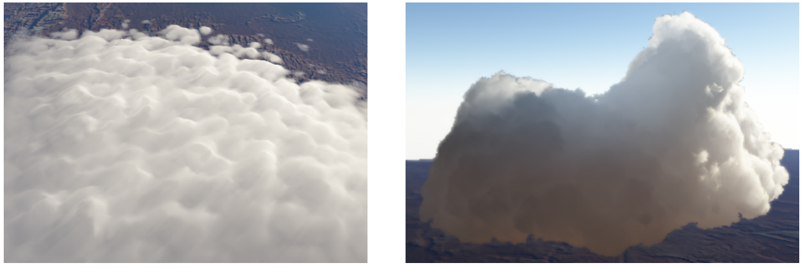

# Interactive multiple anisotropic scattering in clouds

## 1. Introduction

**云的真实感渲染**仍然是一个具有挑战性的问题。==多重各向异性散射==必须模拟在一个体积`volume`中，**缺乏吸收**使收敛非常缓慢，详细的云需要**高分辨率的体积**。

预计算方法无法实现云和光源的动态变换。大多数实时算法没有考虑视相关效果，缺少重要的视觉特征，如`backscattering`。为了解决这些问题，本文方法将云层表示为==表面约束的体积==，并优化计算云层内部从**被照亮的云层表面**到**渲染的云层像素**的光传输。为此，作者研究并表征了每一阶散射的光传输。

本文方法的特点：

- 考虑高阶散射，负责`diffusion and backscatter`。
- 使用基于物理的**==强各向异性Mie相位函数==**；
- 不需要遍历`volume`；
- 不依赖于任何形状的**预计算**。

在表面网格上用`Hypertexture`表示云的形状，能够有效渲染**不均匀的边界**以及像积云`cumulus`这样**尖锐的细节云**，这与基于切片体积（`sliced volumes`）的方法相反。因此，我们可以用很少的成本渲染锐利、蓬松、复杂的薄云。

## 2. cloud physics

### Density and size of droplets in clouds

真正的**对流云**`convective clouds`在边界上并不**模糊**，它们通常是锐利或纤细的。**塌缩云团**`Collapsing cloud turrets`或**弱云**`weak clouds`可能有较大的细层。云中**液态水含量**的**不均匀性**（即质量密度）是云的一个强烈的视觉特征。在云的内部，由于水滴的凝聚，这种密度也会发生变化——特别是在接近下雨的情况下。

在任何位置，**液滴的大小**都是由液滴大小分布（==DSD==）来表征的，文献中一般用`lognormal`或**修正的Gamma函数**来建模。云的光学特性高度依赖于液滴的大小。考虑DSD会从根本上改变**结果的相位函数**，从而改变**视觉外观**。

然而，云的这些数据并不经常可用，其物理原理（如**合并机制**或`DSD`的演化）也没有被完全理解。举例来说，密度变化在云的边界上（在那里它们可以直接看到）比在云的核心（在那里它们只是间接地影响外观）更为重要，通过高阶多次散射。通常，**云上的DSD**假设是**恒定的**。

