# Physically Based Sky, Atmosphere and Cloud Rendering in Frostbite

天空、大气和云层是需要模拟的三个主要组成部分，以实现动态的时间和天气状况。由于它们非常详细的体积特性，它们很难被渲染。这些元素也是相互影响的，比如云层影响大气层的照明，反之亦然。

## 1. Participating Media

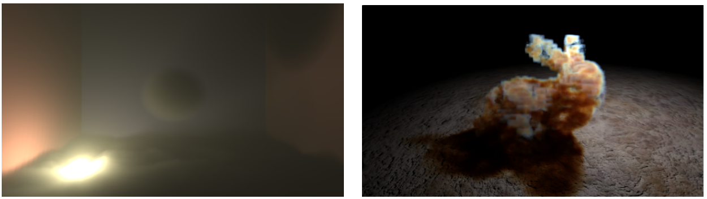

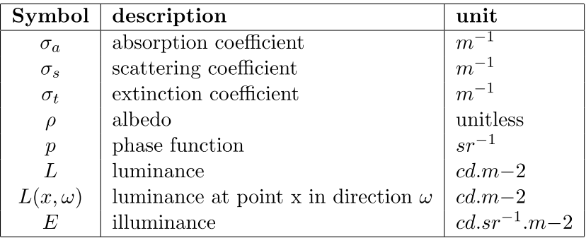

### Single scattering

考虑到光直接穿过介质，不同的事件可以使**输出的亮度**与**进入的亮度**不同：

- 吸收$\sigma_a$：光子被介质物质吸收。
- `out-scattering`$\sigma_s$：光子通过在**介质物质中的粒子**上反弹，而被散射出去。这将根据描述反弹方向分布的==相位函数==p来完成。
- `in-scattering`$\sigma_s$：光子在被粒子反弹后，可以在**当前的光路径**上散射，并对**最终的亮度**作出贡献。这也是根据==相函数==p来做的。
- `emission`：当介质达到**高热量**时，例如**火**，就会发出**光**。在本文中，将忽略此组件。

总而言之，在路径上**增加光子**是$\sigma_s$的函数，去除光子是==消光==（$\sigma_t=\sigma_a+\sigma_s$）的函数，表示吸收和外散射。这些事件中的每一个都与**波长**有关。这意味着不同的光频会以不同的概率被吸收或散射。为了提高实时性，只考虑红色（680纳米）、绿色（550纳米）和蓝色（440纳米）的光谱。

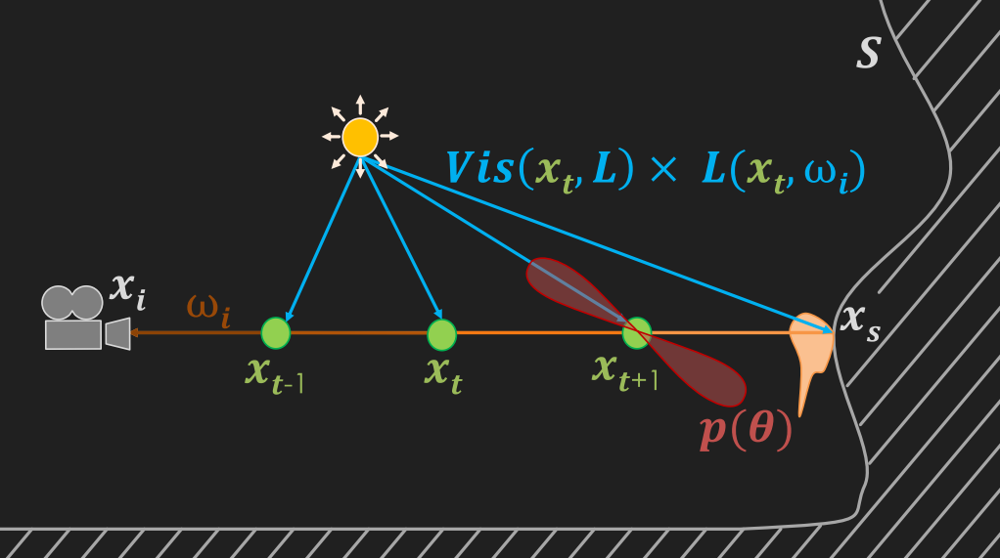

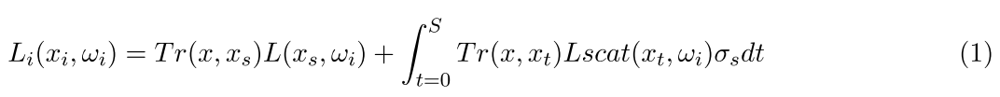

透射率$Tr(x,x_t)$是==消光函数==。消光或距离越大，**光学深度**$\tau=\sigma_t(x_t)dt$就越高，通过介质的光就越少。**透光函数**的特性如下图所示。`Transmittance`需要适用于`(1)`不透明表面的亮度$L(x_s,w_i)$，`(2)`由**内散射事件**产生的亮度$L_{scat}(x_t,w_i)$，以及`(3)`从散射事件到光源的每个路径。

- `(1)`会导致表面视觉上的==雾状遮挡==。
- `(2)`会导致参与介质的==自遮挡==。
- `(3)`会导致参与介质内部的==体阴影==。由于$\sigma_t=\sigma_a+\sigma_s$，**透射率**同时受到散射分量（即外散射分量）和吸收分量的影响。

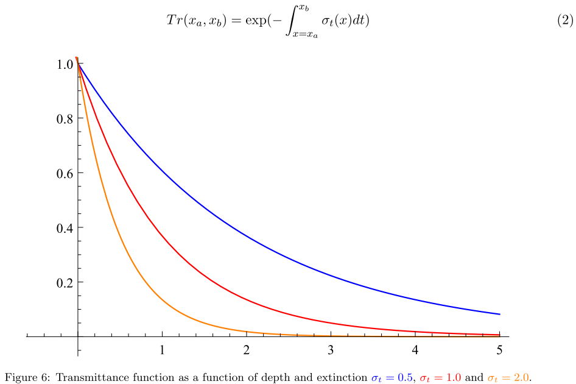

一个==单一的内散射事件==在公式3中用$L_{scat}(x,w_i)$表示，描述了根据场景的**所有点状光源**、**可见度函数**$Vis(x,L)$以及第2.3节中描述的==相位函数p==散射回某个方向的**亮度值**。

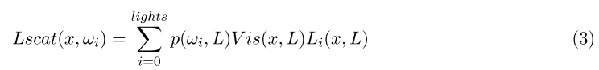

方程4中的==可见度函数==$Vis(x,L)$表示到达光源的光量。例如，如果一个**不透明的物体**位于光源和样本点x之间，从而遮挡了样本，那么$shadowMap(x, L)$将简单地返回0。

$volumetricShadow(x, L)$表示从样本点`x`到**光线位置**$x_L$的==透射率==，从而使参与的介质能够自遮挡。这通常是通过向每个**光源**的进行==二次射线行进==来实现的。作为质量性能的权衡，特定的**体积阴影采样/存储技术**可以用来存储从**一个光的出射方向的透射率**。

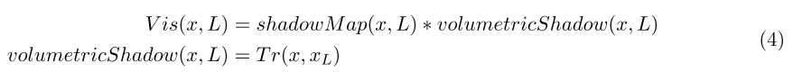

### Albedo

==反照率公式5==：

- 反照率接近`0`表示大部分的光被吸收，导致一个非常黑暗的介质（例如，黑暗的废气烟雾）。
- 反照率接近`1`表示大部分光线被散射而不是被吸收，导致一个较亮的介质（如空气、云或地球大气）。

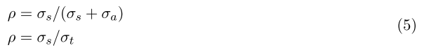

###  Phase function

如前所述，**参与介质**是由具有**不同半径的粒子**组成的。这些粒子半径的**分布**将影响参与介质内**任何一点的光散射方向的分布**。描述这种概率分布是通过==相位函数==来实现的，**相位函数在评估内散射时使用**，如**公式3**所示。

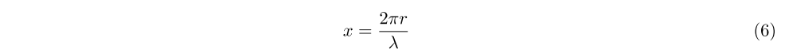

**相位函数**将改变一个点`x`的**内散射**，作为到达该点的**方向性亮度信息的函数**。不同类型的散射可以从`x`中识别出来，即**粒子的相对大小**，由**公式6**定义，其中`r`是粒子半径，`λ`是考虑的波长

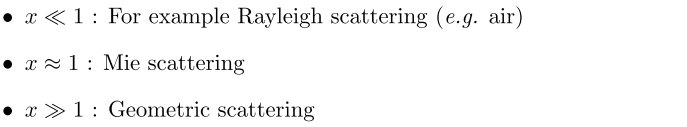

#### Isotropic scattering phase

在这种情况下，光将均匀地向各个方向散射。这当然不是一个非常现实的场景，但由于它的简单性，它经常被使用。相位函数用**公式7**表示，其中$\theta$为入射光方向与出射方向的夹角。

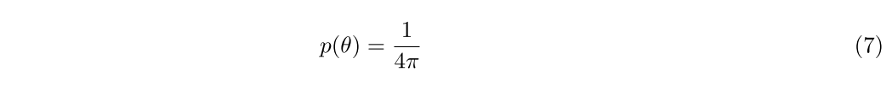

#### Rayleigh scattering phase

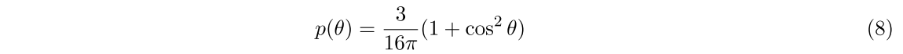

`Rayleigh`推导出了空气中分子对光的散射表达式。例如，被用来描述发生在地球大气层中的光散射，并通常是非常低的吸收或没有吸收。这个相位是一个**双球函数**，如下图所示，可以用**公式8**进行评估。

`Rayleigh`也高度依赖于**光的波长**。这是由[Jar08]中提出的与波长有关的散射系数**$\sigma_s$方程式**表示的。一个常用的近似值是为常用的R、G和B光谱带设置$\sigma_s$常数。

#### Mie scattering phase

`Mie scattering`是当Mie scattering与**光的波长**相似时可以使用的模型。然而，米氏散射的模拟很复杂，需要许多功率函数。
	另一种方法是使用**Henyey-Greenstein相位函数**。 可以表示**星际尘埃的散射**。它也可以用来表示任何烟、雾或尘埃之类的参与介质。这种介质可以表现出**非常强的后向或前向散射**，导致光源周围出现**大的视觉光晕**，例如雾中的聚光灯，或者在太阳方向的云层边缘出现**强烈的银边效应**`silver lining effect`。

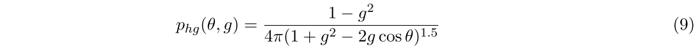

**前向或后向散射的强度**是用`g`参数控制的：

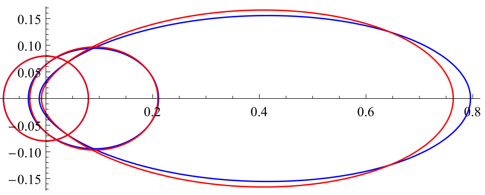

近似==Henyey-Greenstein相位函数==的一个快速方法是使用`Schlick`提出的一个近似值。这个**方程10**没有任何复杂的幂函数，而只是一个平方，计算起来要快得多。为了能够将该函数映射到**原始的Henyey-Greenstein相位函数**上，需要用`g`来计算`k`参数。对于具有**恒定g值**的参与介质，这只需要做一次。值得注意的是，对于非常大的**正负g值**，误差会变得相当大，并导致较低的**银边效应**。

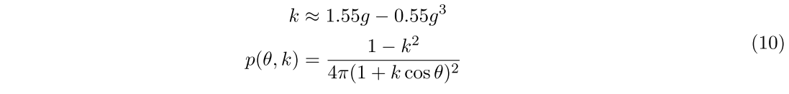

#### Geometric scattering phase

==几何散射==发生在非常大的颗粒上。在这种情况下，光可以在每个颗粒内折射和反射。这可能导致**复杂的散射相位函数**，也取决于光的偏振。例如，一个现实生活中的例子，就是视觉上的==彩虹效应==。它是由空气中的水粒子内部的光反射引起的，将太阳光分散到一个小的视觉角度（≈3度）上的可见光谱中，从而产生后向散射。这种复杂的相位函数可以用==MiePlot软件==进行评估。这个软件使用米氏散射理论、德拜级数和射线追踪来评估**相位函数**。得到的相位函数可以被可视化，并输出到一个文件中供应用程序使用。

### Example

本节介绍了**体积化渲染**的不同组成部分，以及它们如何影响体积的**最终视觉效果**。如果开始尝试使用这些类型的算法，本节希望能让你对**不同参数的作用和影响**有一个很好的**直观感受**。

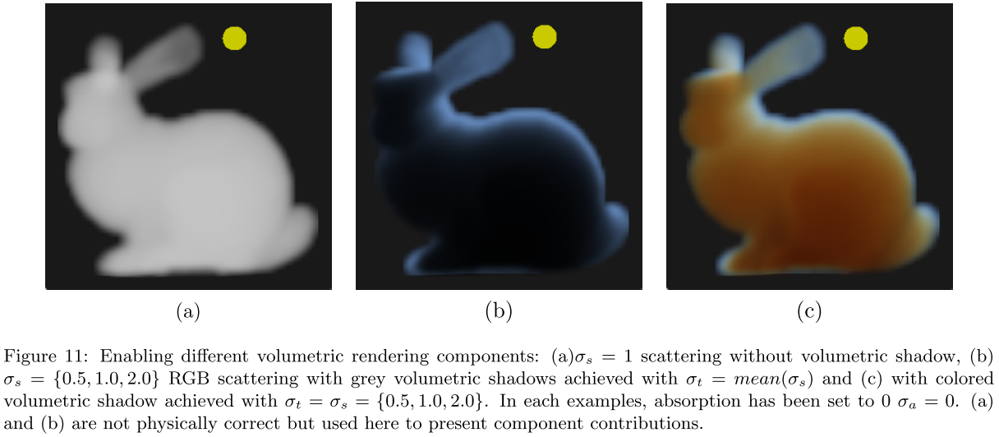

图11展示了正在启用的不同参数。图片（a）显示了在**白光**和**白色散射**$\sigma_s=1$下的、斯坦福兔子形状的参与介质。图片（b）显示了相同的介质，但现在$\sigma_s=\{0.5, 1.0, 2.0\}$。由于蓝色的散射更多，兔子的整体颜色为蓝色。==体积阴影==是用**公式4**评估的灰色阴影。==灰度阴影==是用$\sigma_t=2.0$实现的。这只是为了显示体积阴影的增加，在物理上是不正确的。为了在物理上正确，体积阴影应该用$\sigma_t = \sigma_s + \sigma_a = \{0.5, 1.0, 2.0\}$进行计算。

由此产生的**视觉效果**见`图11（c）`。在空气和介质的界面上，当光没有经过很长的路径时，蓝光被散射得更多，从而形成蓝色。对于从进入点深入的**长光路**，蓝光被散射得更多。因此，只剩下其他成分：这就是为什么**红色**更加明显。这种行为实际上类似于**光在大气中传播的行为**。它只是发生在更大的范围内，因为大气中空气分子的浓度要低得多。为了用相同的系数来说明这个观点，在图12中给出了R、G和B**波长和颜色梯度**的一维散射曲线图。

> 这里也解释了为什么天空是蓝色的，而黄昏时接近橙色（红色）

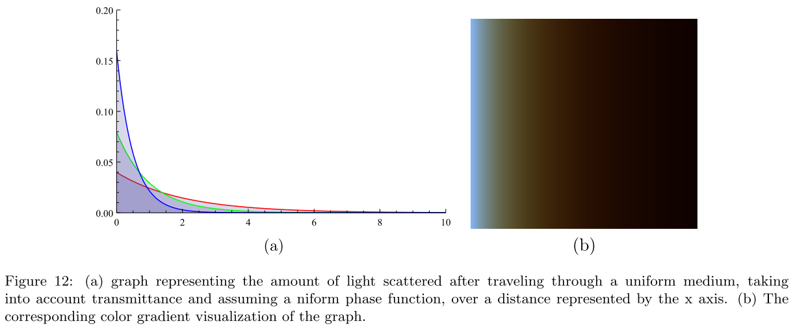

**图13**展示了斯坦福兔子和龙，其参与介质相同（$\sigma_s=\{0.5, 1.0, 2.0\}$）但密度不同。对于低密度介质，**散射系数**将给出主要的参与介质颜色。当密度增加时，所产生的行为将更加复杂，如前所述，即由于`absoprtion`和`out-scattering`。在最右边的情况下，物体开始几乎看起来像`sklin`。

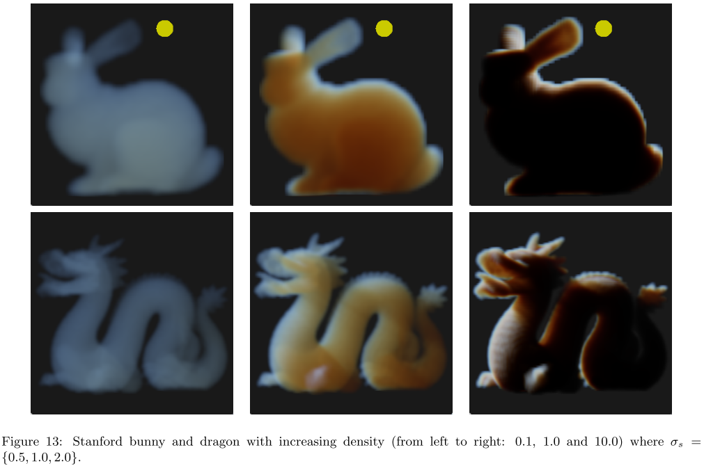

==相位函数==也将极大地影响参与介质的最终外观。例如，为了获得云层特有的**片状视觉效果**，实现云层的特征外观至关重要。而这对于许多类型的烟雾来说也是一样的，例如。这种现象在**图14**中可以看到，特别是在**密集的材料**阻挡光线穿过它的情况下（底行）。你还可以注意到，对于**强的前向散射**，`g>0`，当看向光源时，介质会看起来更亮。事实上，**强正向散射介质会使越来越多的光向它的行进方向散射**，**而使其他区域更暗。这就在光源周围产生了光晕**，产生了大家都知道的光芒，例如在雾天看街灯的时候。介质越厚，能够通过它的光线就越少。然而，**强烈的前向散射光**仍然可以通过体积边缘附近的、小的光学深度，从而产生`silver lining visual effects`。

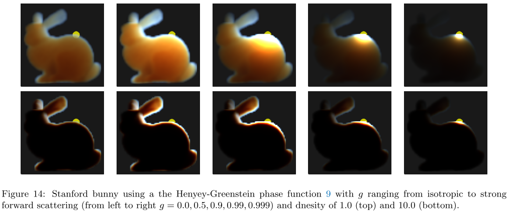

## 2. Sky and Atmosphere

本节介绍了如何模拟和渲染**天空和大气的散射**。在这个领域已经有很多非常详细的资源。因此，本节将很简短，我们将尽可能地参考外面的文章和**开放源代码**。

### Previous work

**渲染一个世界**本来就需要渲染一个星球的**天空和大气效果**。在地球上，我们所说的蓝天是太阳光在参与媒介的大气中散射的结果。**大气层**也是一个关键的视觉线索：它的颜色与当前的时间，即**太阳方向**有关，它的雾状视觉外观有助于感知距离和相对大小。

天空渲染方法可以分为两类：

- 分析模型
- 迭代模型

==分析模型==建立了一套用于评估**天空外观**的参数。例如，[PSS99]依赖于==浊度==`turbidity`，天顶的亮度，当然还有视图和太阳方向。然而，这些模型仅限于**地面视角**`ground view `或大气参数，不能自由改变，以模拟**地外行星**，或达到特定的**艺术驱动视觉效果**。

> 在许多模型中，**天空的光谱渲染**可以用来提高精确度，但对于当今平台上的实时游戏来说，无法承受。在这种情况下，限制在可见光范围的3个波长：红色（λ=680nm）、绿色（λ=550nm）和蓝色（λ=440nm）。

:star:从现在开始，将专注于依靠==LUTs==进行大气模拟和渲染的==迭代式大气模型==。如果想了解更多关于如何实现这些天空模拟模型的细节，建议详细阅读[BN08]、[Ele09]和[Yus13a]。他们的实现有很好的描述，详细的和开放的源代码也分别在以下地址提供[Bru17]和[Yus13b]。

**迭代模型**主要依靠==射线行进==，以积分散射光。这个结果通常存储在**查找表**（==LUT==）中，以避免射线行进的昂贵成本。然后，这些纹理可以简单有效地利用**图形卡的硬件过滤功能**。例如，Bruneton等人[BN08]生成以下的LUTs：

- 二维透光LUT：由于地球的**球面对称性**，只对**视图高度**和**方位角**进行索引。
- 4D散射LUT：这取决于高度、视角和光线方向，它是根据这些值的**自定义重映射**来索引的，以避免在地平线上出现某些视觉伪影。

然后，==4D散射LUT==可以用来迭代多阶散射，从而**预积分**已经包含多阶散射的LUT。

Elek等人[Ele09]提出通过**忽略散射的变化**，来降低**4D散射LUT**的维度。**忽略散射的变化是由视线方向和太阳方向之间的水平/方位角决定的。**这种简化基本上消除了大气层多散射解决方案中的地球阴影。这导致了一个更简单的**3D LUT**，在GPU上更快地进行实时计算。此外，Yusov[Yus13a]提出了一个改进的参数化，有助于获得更多的地平线细节，并减少一些可能出现在地平线的视觉伪影。

### Sky and atmosphere participating media definition

为了能够渲染**天空和大气**，我们需要考虑到几个组成部分。首先，我们必须把**大气层**看作是围绕地球的**一个恒定高度的板块**，其中的**空气分子呈指数分布**。

光与**比光的波长小得多的空气粒子**相互作用的结果是 ==高度依赖波长的瑞利散射==。考虑到地球上的大气，蓝光被散射得更多，这就是为什么天空在白天看起来是蓝色的。然而，当太阳在地平线上时，光将不得不在大气层中旅行更长的距离，大多数蓝光将被散射掉。蓝光不会像绿光和红光那样在大气层中传播那么远。这就是为什么日落和日出看起来是红色的。

**大气层**的另一个重要组成部分是：**集中在地面附近的大颗粒**。这些颗粒的浓度在很大程度上取决于天气条件，或污染。这些颗粒会引起与波长无关的==米氏散射==。因此，描述光如何散射的相位函数通常不是均匀的，而是**偏向于光的行进方向**，即**前向散射**。**这种现象将导致我们通常在太阳周围看到的明亮的光晕**。

### Atmosphere composition

在这一小节中，描述应该使用哪些**参数和分布**。经过与[BN08]的讨论，作者了解到，这些参数并不代表根据人类感知从所有波长收集到的、与**RGB可见光谱**积分的散射系数。相反，**R, G和B的散射系数**只取对应波长680,550和440纳米。

作者遵循[Ril+04]和[BN08]中对大气层的通常描述。在此基础上，还增加了**臭氧的贡献**，这对日落和日出时天空的外观很重要。==表2==总结了所有的系数和它们在大气中的分布。作者选择使用与[Ril+04]和[BN08]**相同的瑞利散射系数**，尽管
等式11的计算给出了不同的数字$(5.47e^{-6}, 1.28e^{-5}, 3.12)^{-5}$，**空气折射指数**n = 1.0003，每米立方体的分子数$N = 2.545 × 10^{25}$和**标准空气去极化系数**$p_n = 0.035$ [PSS99]。米氏系数实际上取决于大气状况：透明度、污染、灰尘、沙暴等。

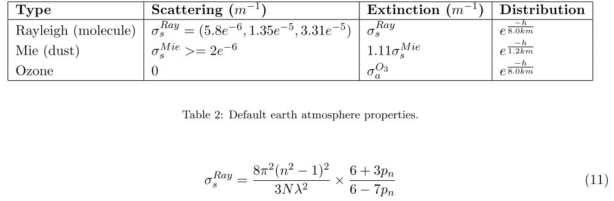

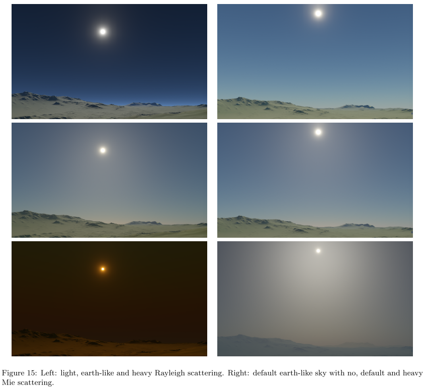

使用这种系数的结果在图15中可见。可以注意到，增加**瑞利散射**会增加天空的蓝度，直到由于外散射而使光的消减变得更加重要。增加**米氏散射**只是使大气看起来更多的灰尘，就像有严重的污染或沙尘暴一样。

### Ozone absorption

正如Adams[CK74]所报告的那样，考虑到**臭氧粒子的吸收**对于再现**天顶天空的蓝色**是必不可少的。Kutz在他的硕士论文博客中提出了考虑到臭氧的视觉改善结果[Kut13]。不幸的是，吸收系数没有共享：作者在这里介绍了如何恢复它们：使用公式12和13恢复$\sigma_a^{O^3}$。首先用**公式12**恢复每单位体积的空气分子（分子/$m^3$），其中$airConcentration = 41.58mol/m^3$ 是海平面的空气密度，$N_A = 6.022140857 × 10^{23}$是**阿伏加德罗常数**。然后使用**公式13**，根据**臭氧横截面**和**空气密度**计算吸收系数。臭氧横截面取自[Ser13]的测量数据：该值是所有测量温度下R、G和B波长范围的平均值。根据大气空气中的总体臭氧百分比[Kut13]，最终恢复的臭氧吸收值为$\sigma_a^{O^3} = (3.426, 8.298, 0.356) × 0.06 × 10^{-5}$。

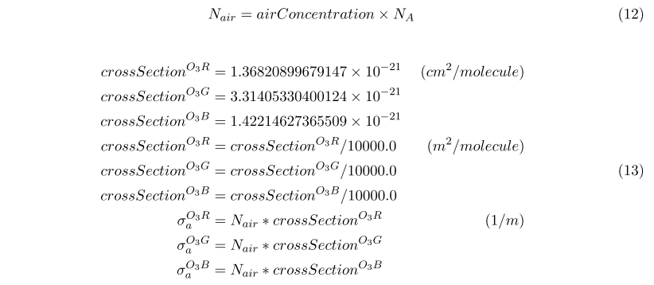

图16中可以看到使用**臭氧的结果**。如果没有臭氧，天空总体上会显得太黄。在消光系数中考虑到臭氧可以在日落和日出时带回更一致的蓝色天空。

> 作为附带说明，我们已经尝试使用来自[PSS99]的与波长有关的臭氧吸收系数和来自[WSS13]的光谱到XYZ函数。我们尝试了不同的变换和sRGB色域空间剪切，但无法恢复与模拟距离相一致的吸收系数。这种方法被证明是不稳定的，我们希望得到任何反馈以及我们可能做错的原因/方法。恢复这些系数的尝试可以在ShaderToy[Hila]中公开获得。图17显示了ShaderToy呈现的多个图形：波长到RGB的权重，每个波长范围内灰色的臭氧吸收曲线，以及每个波长带基于距离的吸收后恢复的RGB颜色，并转换回RGB空间。你可以注意到，负的吸收系数有时会被恢复，这完全是无效的。这就是为什么我们欢迎帮助和/或建议

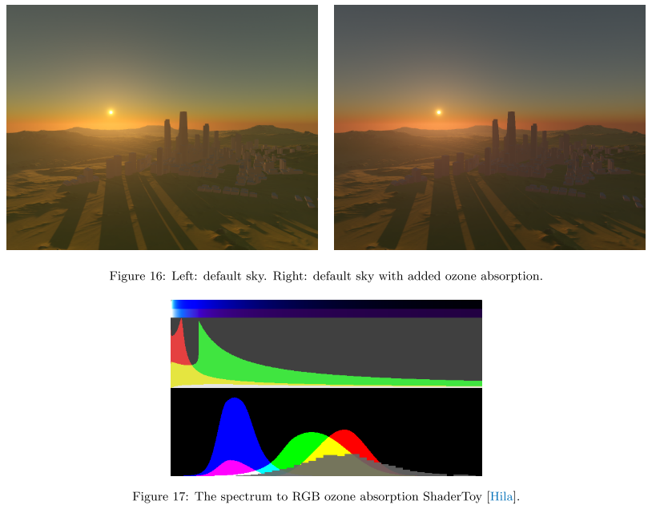

### Our approach

==Frostbite==中**基于物理的天空系统**借鉴了许多研究成果。下面是一个清单。

- 使用的是[Ele09]中的==三维查找表==，而不是4D原始查找表[BN08]。这只意味着忽略了视图/太阳方位角：例如，我们不能在**散射查询表**中表示**地球的阴影**。对于目前遇到的大多数用例，这是一个合理的假设。
- 正如Bruneton等人[BN08]所描述的那样，==散射LUT==在地平线上可能存在**精度问题**，当视图靠近地面时，在仰角为0的情况下会产生视觉伪影。依靠Yusov[Yus13c]提出的参数化改进。
- 在不透明的表面上渲染`aerial perspective`时，多次使用`LUT`来评估**散射亮度**可能会很昂贵。为了降低成本，在每一帧中计算当前视图的散射亮度，并将其存入**低分辨率三维纹理**中（默认分辨率：32x32，16个深度切片）。这使得**雾的计算**更便宜，并且具有**易于评估**和**应用于所有透明网格**的优势，以确保一致性。在Frostbite上，在透明的每个顶点上对这个体积纹理进行采样。
- 一旦LUT被计算出来，太阳就可以被自由移动。但是，改变一些大气参数，如高度、散射或消光系数，将触发查找表的更新，而这一更新的成本太高。为了解决这个问题，将查找表的更新成本在多个帧上进行时间上的摊销（见3.5.1节）。

#### Results

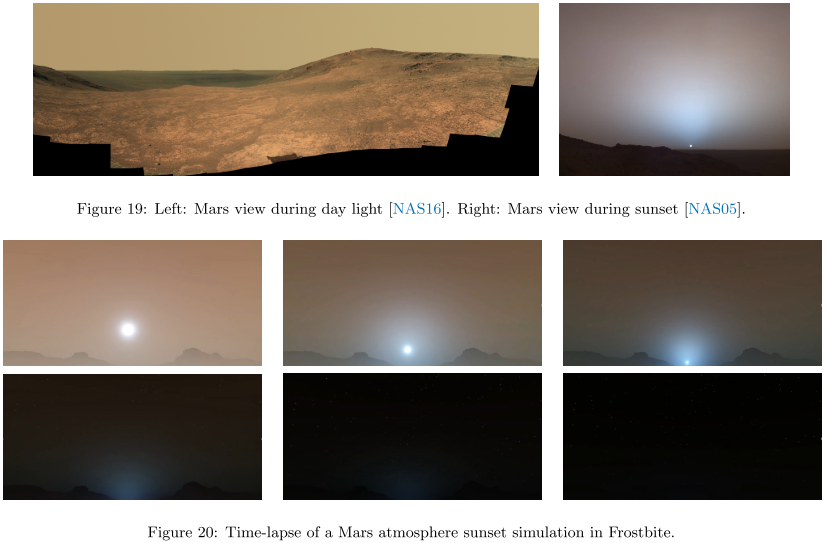

## 3. Sun, Moon and Stars

渲染天空涉及到许多其他远处的元素的渲染。

-  太阳
- 月亮
- 星星
- 天体 

当渲染这些元素时，需要注意许多小细节。人们还需要知道它们的属性，如亮度或角直径。

### Sun

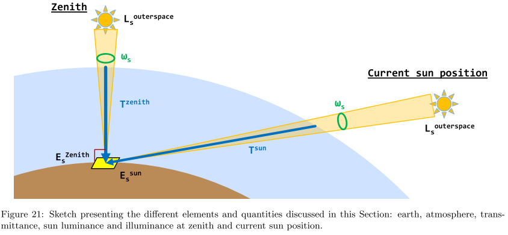

太阳是地球围绕着的星星。从看到的层面来看，它的角直径在`32.7`到`31.6`minutes of arc之间，取决于一年中的时间，也就是说，根据它的轨道位置。它对应的角直径为`0.527`度到`0.545`度。

#### Sun illuminance

据报道，地面上的太阳照度$E_s$是一个介于`100000`至`120000`Lux之间的数值。在==Frostbite==中，艺术家们通过给出天顶的照度$E^{zenith}_s$来编写太阳的贡献。在**大气层的透射率**被应用到太阳上之后，也给出了太阳在天顶的**透射率**。这样，艺术家们就更容易抽象出地球的透射率，从而形成大气中粒子的**非微观分布**和**散射/吸收系数**。  

#### Sun luminance

因此，我们需要将艺术家给出的**太阳光照度**$E^{zenith}_s$转换为太阳盘上的`luminance`$L_s$。为了实现这一目标，采用了以下过程：

1. 考虑到太阳是一个完美的圆盘，计算其实体角$w_s$（假设在地球上是恒定的）

2. 根据$w_s$和$E^{zenith}_s$，计算地面上的太阳亮度$L^{zenith}_s$

3. 考虑到地球的**透光率**和天顶的太阳，计算外太空的亮度$L_s^{outerspace}$

4. 使用$L_s^{outerspace}$渲染太阳，并对其应用**大气层透射率**。

对于一个孔径为$\theta$ 弧度的圆锥体，可以用**公式14**来计算实体角。因此，有可能恢复太阳的实体角$w_s$（对于上述报告的物理角直径，在`0.0000664`sr和`0.0000711`sr之间）。

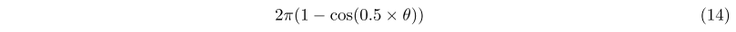

在太阳的情况下，地面的照度`illuminance`是由艺术家在天顶的太阳，和独立于它的实体角的情况下给出的。如果我们认为太阳有一个相对较小的实体角和相对均匀的亮度，我们可以用**公式15**将其照度$E^{zenith}_s$近似为**其实体角的积分**。然后，我们可以用**公式16**简单地恢复太阳的亮度$L^{zenith}_s$

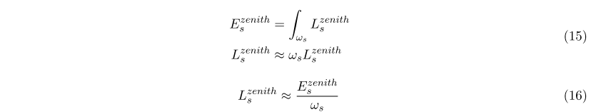

对于一个给定的**地球/大气层设置**，可以通过对**来自地面的消光**，沿**up vector**直到所考虑的**大气层上边界**，进行积分，来计算**天顶大气层的透射率** $Tr_{atmosphere}^{zenith}$。**外层空间的亮度**现在可以计算为$L_s^{outerspace} = L^{zenith}_s/Tr_{atmosphere}^{zenith}$。作者在这里做的合理假设是，**大气层的透射率**对于每个波长的分量都不会达到`0`。

有了**太阳外太空的亮度**，我们就可以把`sun sprite `渲染成一个完美的圆盘，与它的**角直径**相匹配，并把它的亮度$L_s^{outerspace}$贡献添加到**光缓冲区**。然而，如果只这样做，太阳看起来就会像一个非常明亮的圆盘，因为大气层的透射率$Tr_{atmosphere}^{sum}$被忽略了。这可以通过使用第3节中描述的**大气层透射率查询表**来解决。一旦对每个像素进行采样，我们就可以简单地计算太阳的最终亮度，即$L_s=Tr_{atmosphere}^{sum} \times L_s^{outerspace}$ 。这个最终的正确和匹配结果在**图22**中可见。

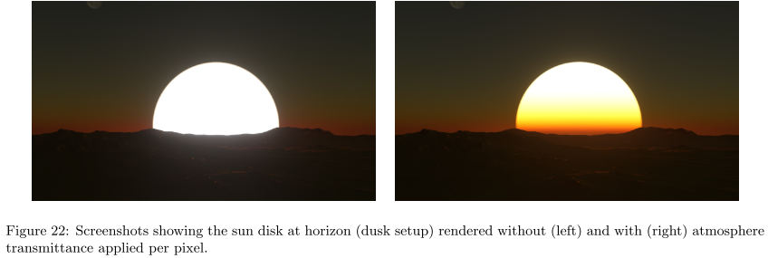

随着这一过程的完成，太阳将有一个正确的外观，匹配它的天顶角和大气属性。当**太阳移动**来模拟一天中的时间时，这一点尤为重要。这对于低曝光的场景也很重要，如黄昏或黎明。另外，由于太阳亮度是由它的**照度**和**立体角**恢复的，使太阳变大将自动暗淡它的亮度。这一过程自动确保了**整个视觉场景的照明**与**太阳的外观**保持一致。

太阳在地球上的数值示例：

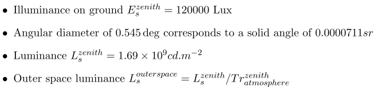

使用第三节中==Frostbite==默认的、基于物理的天空模拟，**透射率**在天顶可以得到一个$0.925、0.861、0.755$的值，当太阳在地平线上时，透射率为$.0499、0.004、4.10e^{-5}$。**图23**显示了根据太阳高度的不同，透射率的不同特性。

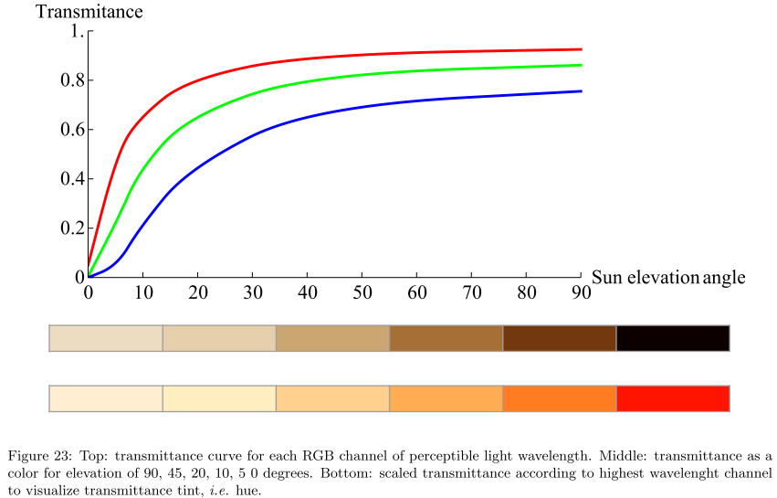

#### Limb darkening

太阳在天空中显示为一个圆盘。但是，由于太阳是一个球体，圆盘不会有一个均匀的亮度。这是由于，对于一个给定的视角，当沿法线（圆盘中心）观察表面时，比沿切线（圆盘边缘）观察时，**会有更多的光线可见**。事实上，在切线区域，光线必须更多地穿过太阳气体，因此也会被更多地吸收。这种现象导致了**太阳盘在其中心的视觉效果，比其边缘的视觉效果更强烈**。天体物理学研究人员已经测量了太阳盘上发射的光线的亮度变化，并提出了一些模型。

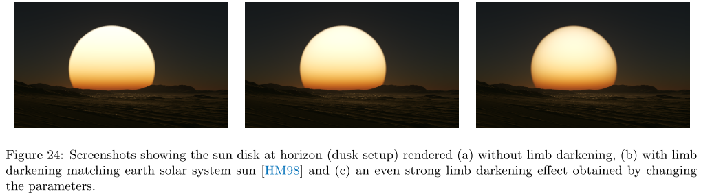

本文档中给出了[Nec96]和[HM98]模型的实现。**HLSL源代码的实现见附录B**。图25中可以看到由[Nec96]中提出的模型所产生的梯度。在实时背景下，甚至可能想把这些模型简化和优化为一个简单的梯度纹理查找。

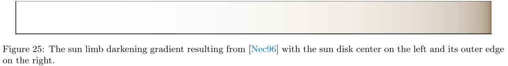

### Moon

月球是一颗围绕地球运行的卫星，平均距离为`384000`公里。它的角直径在`29.3`到`34.1`minutes of arc之间，取决于每年的时间。这相当于角直径在`0.488`度到`0.568`度之间。

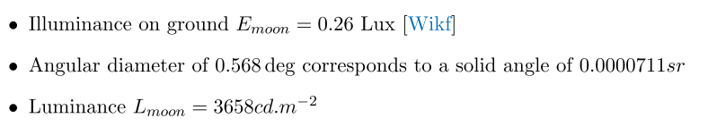

由于$E_{moon}$是地面上的照度（在大气层透射率之后），$L_{moon}$可以用来渲染月球在乘以**呈现其反照率的纹理**之后的亮度。

### Stars

恒星是散布在宇宙中的光发射体。其中最著名的是太阳。我们没有发现任何关于恒星的平均实体角、照度或亮度的数据。我们只能收集到以下数据。

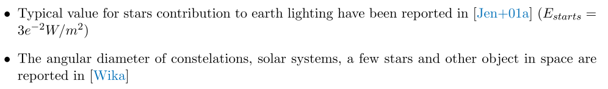

在Neyret的一个`shader toy`中也提出了一种渲染星星的方法。它是根据温度来渲染彩色的恒星。颜色是通过**Plank定律**来恢复的，该定律描述了每个温度下电磁辐射的光谱密度[Wikl][Wikb]。

### Results

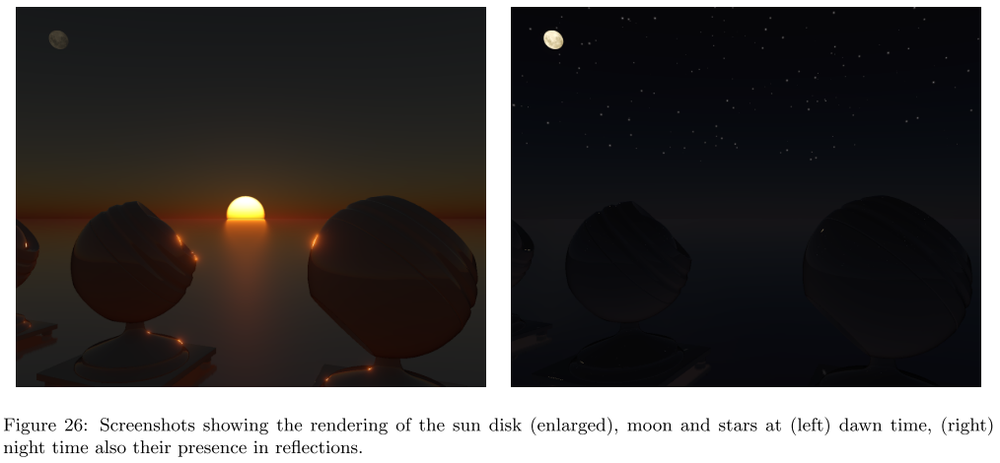

## 4. Clouds

### Background and Previous work

