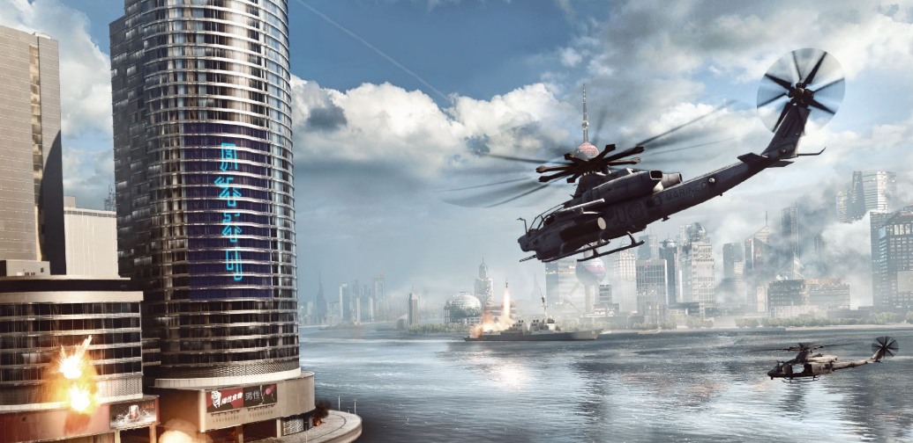

# Physically Based Sky, Atmosphere and Cloud Rendering in Frostbite

天空、大气和云层是需要模拟的三个主要组成部分，以实现动态的时间和天气状况。由于它们非常详细的体积特性，它们很难被渲染。这些元素也是相互影响的，比如云层影响大气层的照明，反之亦然。

## 1. Participating Media

### Single scattering

考虑到光直接穿过介质，不同的事件可以使**输出的亮度**与**进入的亮度**不同：

- 吸收$\sigma_a$：光子被介质物质吸收。
- `out-scattering`$\sigma_s$：光子通过在**介质物质中的粒子**上反弹，而被散射出去。这将根据描述反弹方向分布的==相位函数==p来完成。
- `in-scattering`$\sigma_s$：光子在被粒子反弹后，可以在**当前的光路径**上散射，并对**最终的亮度**作出贡献。这也是根据==相函数==p来做的。
- `emission`：当介质达到**高热量**时，例如**火**，就会发出**光**。在本文中，将忽略此组件。

总而言之，在路径上**增加光子**是$\sigma_s$的函数，去除光子是==消光==（$\sigma_t=\sigma_a+\sigma_s$）的函数，表示吸收和外散射。这些事件中的每一个都与**波长**有关。这意味着不同的光频会以不同的概率被吸收或散射。为了提高实时性，只考虑红色（680纳米）、绿色（550纳米）和蓝色（440纳米）的光谱。

透射率$Tr(x,x_t)$是==消光函数==。消光或距离越大，**光学深度**$\tau=\sigma_t(x_t)dt$就越高，通过介质的光就越少。**透光函数**的特性如下图所示。`Transmittance`需要适用于`(1)`不透明表面的亮度$L(x_s,w_i)$，`(2)`由**内散射事件**产生的亮度$L_{scat}(x_t,w_i)$，以及`(3)`从散射事件到光源的每个路径。

- `(1)`会导致表面视觉上的==雾状遮挡==。
- `(2)`会导致参与介质的==自遮挡==。
- `(3)`会导致参与介质内部的==体阴影==。由于$\sigma_t=\sigma_a+\sigma_s$，**透射率**同时受到散射分量（即外散射分量）和吸收分量的影响。

一个==单一的内散射事件==在公式3中用$L_{scat}(x,w_i)$表示，描述了根据场景的**所有点状光源**、**可见度函数**$Vis(x,L)$以及第2.3节中描述的==相位函数p==散射回某个方向的**亮度值**。

方程4中的==可见度函数==$Vis(x,L)$表示到达光源的光量。例如，如果一个**不透明的物体**位于光源和样本点x之间，从而遮挡了样本，那么$shadowMap(x, L)$将简单地返回0。

$volumetricShadow(x, L)$表示从样本点`x`到**光线位置**$x_L$的==透射率==，从而使参与的介质能够自遮挡。这通常是通过向每个**光源**的进行==二次射线行进==来实现的。作为质量性能的权衡，特定的**体积阴影采样/存储技术**可以用来存储从**一个光的出射方向的透射率**。

### Albedo

==反照率公式5==：

- 反照率接近`0`表示大部分的光被吸收，导致一个非常黑暗的介质（例如，黑暗的废气烟雾）。
- 反照率接近`1`表示大部分光线被散射而不是被吸收，导致一个较亮的介质（如空气、云或地球大气）。

###  Phase function

如前所述，**参与介质**是由具有**不同半径的粒子**组成的。这些粒子半径的**分布**将影响参与介质内**任何一点的光散射方向的分布**。描述这种概率分布是通过==相位函数==来实现的，**相位函数在评估内散射时使用**，如**公式3**所示。

**相位函数**将改变一个点`x`的**内散射**，作为到达该点的**方向性亮度信息的函数**。不同类型的散射可以从`x`中识别出来，即**粒子的相对大小**，由**公式6**定义，其中`r`是粒子半径，`λ`是考虑的波长

#### Isotropic scattering phase

在这种情况下，光将均匀地向各个方向散射。这当然不是一个非常现实的场景，但由于它的简单性，它经常被使用。相位函数用**公式7**表示，其中$\theta$为入射光方向与出射方向的夹角。

#### Rayleigh scattering phase

`Rayleigh`推导出了空气中分子对光的散射表达式。例如，被用来描述发生在地球大气层中的光散射，并通常是非常低的吸收或没有吸收。这个相位是一个**双球函数**，如下图所示，可以用**公式8**进行评估。

`Rayleigh`也高度依赖于**光的波长**。这是由[Jar08]中提出的与波长有关的散射系数**$\sigma_s$方程式**表示的。一个常用的近似值是为常用的R、G和B光谱带设置$\sigma_s$常数。

#### Mie scattering phase

`Mie scattering`是当Mie scattering与**光的波长**相似时可以使用的模型。然而，米氏散射的模拟很复杂，需要许多功率函数。
	另一种方法是使用**Henyey-Greenstein相位函数**。 可以表示**星际尘埃的散射**。它也可以用来表示任何烟、雾或尘埃之类的参与介质。这种介质可以表现出**非常强的后向或前向散射**，导致光源周围出现**大的视觉光晕**，例如雾中的聚光灯，或者在太阳方向的云层边缘出现**强烈的银边效应**`silver lining effect`。

**前向或后向散射的强度**是用`g`参数控制的：

近似==Henyey-Greenstein相位函数==的一个快速方法是使用`Schlick`提出的一个近似值。这个**方程10**没有任何复杂的幂函数，而只是一个平方，计算起来要快得多。为了能够将该函数映射到**原始的Henyey-Greenstein相位函数**上，需要用`g`来计算`k`参数。对于具有**恒定g值**的参与介质，这只需要做一次。值得注意的是，对于非常大的**正负g值**，误差会变得相当大，并导致较低的**银边效应**。

#### Geometric scattering phase

==几何散射==发生在非常大的颗粒上。在这种情况下，光可以在每个颗粒内折射和反射。这可能导致**复杂的散射相位函数**，也取决于光的偏振。例如，一个现实生活中的例子，就是视觉上的==彩虹效应==。它是由空气中的水粒子内部的光反射引起的，将太阳光分散到一个小的视觉角度（≈3度）上的可见光谱中，从而产生后向散射。这种复杂的相位函数可以用==MiePlot软件==进行评估。这个软件使用米氏散射理论、德拜级数和射线追踪来评估**相位函数**。得到的相位函数可以被可视化，并输出到一个文件中供应用程序使用。

### Example

本节介绍了**体积化渲染**的不同组成部分，以及它们如何影响体积的**最终视觉效果**。如果开始尝试使用这些类型的算法，本节希望能让你对**不同参数的作用和影响**有一个很好的**直观感受**。

图11展示了正在启用的不同参数。图片（a）显示了在**白光**和**白色散射**$\sigma_s=1$下的、斯坦福兔子形状的参与介质。图片（b）显示了相同的介质，但现在$\sigma_s=\{0.5, 1.0, 2.0\}$。由于蓝色的散射更多，兔子的整体颜色为蓝色。==体积阴影==是用**公式4**评估的灰色阴影。==灰度阴影==是用$\sigma_t=2.0$实现的。这只是为了显示体积阴影的增加，在物理上是不正确的。为了在物理上正确，体积阴影应该用$\sigma_t = \sigma_s + \sigma_a = \{0.5, 1.0, 2.0\}$进行计算。

由此产生的**视觉效果**见`图11（c）`。在空气和介质的界面上，当光没有经过很长的路径时，蓝光被散射得更多，从而形成蓝色。对于从进入点深入的**长光路**，蓝光被散射得更多。因此，只剩下其他成分：这就是为什么**红色**更加明显。这种行为实际上类似于**光在大气中传播的行为**。它只是发生在更大的范围内，因为大气中空气分子的浓度要低得多。为了用相同的系数来说明这个观点，在图12中给出了R、G和B**波长和颜色梯度**的一维散射曲线图。

> 这里也解释了为什么天空是蓝色的，而黄昏时接近橙色（红色）

**图13**展示了斯坦福兔子和龙，其参与介质相同（$\sigma_s=\{0.5, 1.0, 2.0\}$）但密度不同。对于低密度介质，**散射系数**将给出主要的参与介质颜色。当密度增加时，所产生的行为将更加复杂，如前所述，即由于`absoprtion`和`out-scattering`。在最右边的情况下，物体开始几乎看起来像`sklin`。

==相位函数==也将极大地影响参与介质的最终外观。例如，为了获得云层特有的**片状视觉效果**，实现云层的特征外观至关重要。而这对于许多类型的烟雾来说也是一样的，例如。这种现象在**图14**中可以看到，特别是在**密集的材料**阻挡光线穿过它的情况下（底行）。你还可以注意到，对于**强的前向散射**，`g>0`，当看向光源时，介质会看起来更亮。事实上，**强正向散射介质会使越来越多的光向它的行进方向散射**，**而使其他区域更暗。这就在光源周围产生了光晕**，产生了大家都知道的光芒，例如在雾天看街灯的时候。介质越厚，能够通过它的光线就越少。然而，**强烈的前向散射光**仍然可以通过体积边缘附近的、小的光学深度，从而产生`silver lining visual effects`。

## 2. Sky and Atmosphere

本节介绍了如何模拟和渲染**天空和大气的散射**。在这个领域已经有很多非常详细的资源。因此，本节将很简短，我们将尽可能地参考外面的文章和**开放源代码**。

### Previous work

**渲染一个世界**本来就需要渲染一个星球的**天空和大气效果**。在地球上，我们所说的蓝天是太阳光在参与媒介的大气中散射的结果。**大气层**也是一个关键的视觉线索：它的颜色与当前的时间，即**太阳方向**有关，它的雾状视觉外观有助于感知距离和相对大小。

天空渲染方法可以分为两类：

- 分析模型
- 迭代模型

==分析模型==建立了一套用于评估**天空外观**的参数。例如，[PSS99]依赖于==浊度==`turbidity`，天顶的亮度，当然还有视图和太阳方向。然而，这些模型仅限于**地面视角**`ground view `或大气参数，不能自由改变，以模拟**地外行星**，或达到特定的**艺术驱动视觉效果**。

> 在许多模型中，**天空的光谱渲染**可以用来提高精确度，但对于当今平台上的实时游戏来说，无法承受。在这种情况下，限制在可见光范围的3个波长：红色（λ=680nm）、绿色（λ=550nm）和蓝色（λ=440nm）。

:star:从现在开始，将专注于依靠==LUTs==进行大气模拟和渲染的==迭代式大气模型==。如果想了解更多关于如何实现这些天空模拟模型的细节，建议详细阅读[BN08]、[Ele09]和[Yus13a]。他们的实现有很好的描述，详细的和开放的源代码也分别在以下地址提供[Bru17]和[Yus13b]。

**迭代模型**主要依靠==射线行进==，以积分散射光。这个结果通常存储在**查找表**（==LUT==）中，以避免射线行进的昂贵成本。然后，这些纹理可以简单有效地利用**图形卡的硬件过滤功能**。例如，Bruneton等人[BN08]生成以下的LUTs：

- 二维透光LUT：由于地球的**球面对称性**，只对**视图高度**和**方位角**进行索引。
- 4D散射LUT：这取决于高度、视角和光线方向，它是根据这些值的**自定义重映射**来索引的，以避免在地平线上出现某些视觉伪影。

然后，==4D散射LUT==可以用来迭代多阶散射，从而**预积分**已经包含多阶散射的LUT。

Elek等人[Ele09]提出通过**忽略散射的变化**，来降低**4D散射LUT**的维度。**忽略散射的变化是由视线方向和太阳方向之间的水平/方位角决定的。**这种简化基本上消除了大气层多散射解决方案中的地球阴影。这导致了一个更简单的**3D LUT**，在GPU上更快地进行实时计算。此外，Yusov[Yus13a]提出了一个改进的参数化，有助于获得更多的地平线细节，并减少一些可能出现在地平线的视觉伪影。

### Sky and atmosphere participating media definition

为了能够渲染**天空和大气**，我们需要考虑到几个组成部分。首先，我们必须把**大气层**看作是围绕地球的**一个恒定高度的板块**，其中的**空气分子呈指数分布**。

光与**比光的波长小得多的空气粒子**相互作用的结果是 ==高度依赖波长的瑞利散射==。考虑到地球上的大气，蓝光被散射得更多，这就是为什么天空在白天看起来是蓝色的。然而，当太阳在地平线上时，光将不得不在大气层中旅行更长的距离，大多数蓝光将被散射掉。蓝光不会像绿光和红光那样在大气层中传播那么远。这就是为什么日落和日出看起来是红色的。

**大气层**的另一个重要组成部分是：**集中在地面附近的大颗粒**。这些颗粒的浓度在很大程度上取决于天气条件，或污染。这些颗粒会引起与波长无关的==米氏散射==。因此，描述光如何散射的相位函数通常不是均匀的，而是**偏向于光的行进方向**，即**前向散射**。**这种现象将导致我们通常在太阳周围看到的明亮的光晕**。

### Atmosphere composition

在这一小节中，描述应该使用哪些**参数和分布**。经过与[BN08]的讨论，作者了解到，这些参数并不代表根据人类感知从所有波长收集到的、与**RGB可见光谱**积分的散射系数。相反，**R, G和B的散射系数**只取对应波长680,550和440纳米。

作者遵循[Ril+04]和[BN08]中对大气层的通常描述。在此基础上，还增加了**臭氧的贡献**，这对日落和日出时天空的外观很重要。==表2==总结了所有的系数和它们在大气中的分布。作者选择使用与[Ril+04]和[BN08]**相同的瑞利散射系数**，尽管
等式11的计算给出了不同的数字$(5.47e^{-6}, 1.28e^{-5}, 3.12)^{-5}$，**空气折射指数**n = 1.0003，每米立方体的分子数$N = 2.545 × 10^{25}$和**标准空气去极化系数**$p_n = 0.035$ [PSS99]。米氏系数实际上取决于大气状况：透明度、污染、灰尘、沙暴等。

使用这种系数的结果在图15中可见。可以注意到，增加**瑞利散射**会增加天空的蓝度，直到由于外散射而使光的消减变得更加重要。增加**米氏散射**只是使大气看起来更多的灰尘，就像有严重的污染或沙尘暴一样。

### Ozone absorption

正如Adams[CK74]所报告的那样，考虑到**臭氧粒子的吸收**对于再现**天顶天空的蓝色**是必不可少的。Kutz在他的硕士论文博客中提出了考虑到臭氧的视觉改善结果[Kut13]。不幸的是，吸收系数没有共享：作者在这里介绍了如何恢复它们：使用公式12和13恢复$\sigma_a^{O^3}$。首先用**公式12**恢复每单位体积的空气分子（分子/$m^3$），其中$airConcentration = 41.58mol/m^3$ 是海平面的空气密度，$N_A = 6.022140857 × 10^{23}$是**阿伏加德罗常数**。然后使用**公式13**，根据**臭氧横截面**和**空气密度**计算吸收系数。臭氧横截面取自[Ser13]的测量数据：该值是所有测量温度下R、G和B波长范围的平均值。根据大气空气中的总体臭氧百分比[Kut13]，最终恢复的臭氧吸收值为$\sigma_a^{O^3} = (3.426, 8.298, 0.356) × 0.06 × 10^{-5}$。

图16中可以看到使用**臭氧的结果**。如果没有臭氧，天空总体上会显得太黄。在消光系数中考虑到臭氧可以在日落和日出时带回更一致的蓝色天空。

> 作为附带说明，我们已经尝试使用来自[PSS99]的与波长有关的臭氧吸收系数和来自[WSS13]的光谱到XYZ函数。我们尝试了不同的变换和sRGB色域空间剪切，但无法恢复与模拟距离相一致的吸收系数。这种方法被证明是不稳定的，我们希望得到任何反馈以及我们可能做错的原因/方法。恢复这些系数的尝试可以在ShaderToy[Hila]中公开获得。图17显示了ShaderToy呈现的多个图形：波长到RGB的权重，每个波长范围内灰色的臭氧吸收曲线，以及每个波长带基于距离的吸收后恢复的RGB颜色，并转换回RGB空间。你可以注意到，负的吸收系数有时会被恢复，这完全是无效的。这就是为什么我们欢迎帮助和/或建议

### Our approach

==Frostbite==中**基于物理的天空系统**借鉴了许多研究成果。下面是一个清单。

- 使用的是[Ele09]中的==三维查找表==，而不是4D原始查找表[BN08]。这只意味着忽略了视图/太阳方位角：例如，我们不能在**散射查询表**中表示**地球的阴影**。对于目前遇到的大多数用例，这是一个合理的假设。
- 正如Bruneton等人[BN08]所描述的那样，==散射LUT==在地平线上可能存在**精度问题**，当视图靠近地面时，在仰角为0的情况下会产生视觉伪影。依靠Yusov[Yus13c]提出的参数化改进。
- 在不透明的表面上渲染`aerial perspective`时，多次使用`LUT`来评估**散射亮度**可能会很昂贵。为了降低成本，在每一帧中计算当前视图的散射亮度，并将其存入**低分辨率三维纹理**中（默认分辨率：32x32，16个深度切片）。这使得**雾的计算**更便宜，并且具有**易于评估**和**应用于所有透明网格**的优势，以确保一致性。在Frostbite上，在透明的每个顶点上对这个体积纹理进行采样。
- 一旦LUT被计算出来，太阳就可以被自由移动。但是，改变一些大气参数，如高度、散射或消光系数，将触发查找表的更新，而这一更新的成本太高。为了解决这个问题，将查找表的更新成本在多个帧上进行时间上的摊销（见3.5.1节）。

#### Results

## 3. Sun, Moon and Stars

渲染天空涉及到许多其他远处的元素的渲染。

-  太阳
- 月亮
- 星星
- 天体 

当渲染这些元素时，需要注意许多小细节。人们还需要知道它们的属性，如亮度或角直径。

### Sun

太阳是地球围绕着的星星。从看到的层面来看，它的角直径在`32.7`到`31.6`minutes of arc之间，取决于一年中的时间，也就是说，根据它的轨道位置。它对应的角直径为`0.527`度到`0.545`度。

#### Sun illuminance

据报道，地面上的太阳照度$E_s$是一个介于`100000`至`120000`Lux之间的数值。在==Frostbite==中，艺术家们通过给出天顶的照度$E^{zenith}_s$来编写太阳的贡献。在**大气层的透射率**被应用到太阳上之后，也给出了太阳在天顶的**透射率**。这样，艺术家们就更容易抽象出地球的透射率，从而形成大气中粒子的**非微观分布**和**散射/吸收系数**。  

#### Sun luminance

因此，我们需要将艺术家给出的**太阳光照度**$E^{zenith}_s$转换为太阳盘上的`luminance`$L_s$。为了实现这一目标，采用了以下过程：

1. 考虑到太阳是一个完美的圆盘，计算其实体角$w_s$（假设在地球上是恒定的）

2. 根据$w_s$和$E^{zenith}_s$，计算地面上的太阳亮度$L^{zenith}_s$

3. 考虑到地球的**透光率**和天顶的太阳，计算外太空的亮度$L_s^{outerspace}$

4. 使用$L_s^{outerspace}$渲染太阳，并对其应用**大气层透射率**。

对于一个孔径为$\theta$ 弧度的圆锥体，可以用**公式14**来计算实体角。因此，有可能恢复太阳的实体角$w_s$（对于上述报告的物理角直径，在`0.0000664`sr和`0.0000711`sr之间）。

在太阳的情况下，地面的照度`illuminance`是由艺术家在天顶的太阳，和独立于它的实体角的情况下给出的。如果我们认为太阳有一个相对较小的实体角和相对均匀的亮度，我们可以用**公式15**将其照度$E^{zenith}_s$近似为**其实体角的积分**。然后，我们可以用**公式16**简单地恢复太阳的亮度$L^{zenith}_s$

对于一个给定的**地球/大气层设置**，可以通过对**来自地面的消光**，沿**up vector**直到所考虑的**大气层上边界**，进行积分，来计算**天顶大气层的透射率** $Tr_{atmosphere}^{zenith}$。**外层空间的亮度**现在可以计算为$L_s^{outerspace} = L^{zenith}_s/Tr_{atmosphere}^{zenith}$。作者在这里做的合理假设是，**大气层的透射率**对于每个波长的分量都不会达到`0`。

有了**太阳外太空的亮度**，我们就可以把`sun sprite `渲染成一个完美的圆盘，与它的**角直径**相匹配，并把它的亮度$L_s^{outerspace}$贡献添加到**光缓冲区**。然而，如果只这样做，太阳看起来就会像一个非常明亮的圆盘，因为大气层的透射率$Tr_{atmosphere}^{sum}$被忽略了。这可以通过使用第3节中描述的**大气层透射率查询表**来解决。一旦对每个像素进行采样，我们就可以简单地计算太阳的最终亮度，即$L_s=Tr_{atmosphere}^{sum} \times L_s^{outerspace}$ 。这个最终的正确和匹配结果在**图22**中可见。

随着这一过程的完成，太阳将有一个正确的外观，匹配它的天顶角和大气属性。当**太阳移动**来模拟一天中的时间时，这一点尤为重要。这对于低曝光的场景也很重要，如黄昏或黎明。另外，由于太阳亮度是由它的**照度**和**立体角**恢复的，使太阳变大将自动暗淡它的亮度。这一过程自动确保了**整个视觉场景的照明**与**太阳的外观**保持一致。

太阳在地球上的数值示例：

使用第三节中==Frostbite==默认的、基于物理的天空模拟，**透射率**在天顶可以得到一个$0.925、0.861、0.755$的值，当太阳在地平线上时，透射率为$.0499、0.004、4.10e^{-5}$。**图23**显示了根据太阳高度的不同，透射率的不同特性。

#### Limb darkening

太阳在天空中显示为一个圆盘。但是，由于太阳是一个球体，圆盘不会有一个均匀的亮度。这是由于，对于一个给定的视角，当沿法线（圆盘中心）观察表面时，比沿切线（圆盘边缘）观察时，**会有更多的光线可见**。事实上，在切线区域，光线必须更多地穿过太阳气体，因此也会被更多地吸收。这种现象导致了**太阳盘在其中心的视觉效果，比其边缘的视觉效果更强烈**。天体物理学研究人员已经测量了太阳盘上发射的光线的亮度变化，并提出了一些模型。

本文档中给出了[Nec96]和[HM98]模型的实现。**HLSL源代码的实现见附录B**。图25中可以看到由[Nec96]中提出的模型所产生的梯度。在实时背景下，甚至可能想把这些模型简化和优化为一个简单的梯度纹理查找。

### Moon

月球是一颗围绕地球运行的卫星，平均距离为`384000`公里。它的角直径在`29.3`到`34.1`minutes of arc之间，取决于每年的时间。这相当于角直径在`0.488`度到`0.568`度之间。

由于$E_{moon}$是地面上的照度（在大气层透射率之后），$L_{moon}$可以用来渲染月球在乘以**呈现其反照率的纹理**之后的亮度。

### Stars

恒星是散布在宇宙中的光发射体。其中最著名的是太阳。我们没有发现任何关于恒星的平均实体角、照度或亮度的数据。我们只能收集到以下数据。

在Neyret的一个`shader toy`中也提出了一种渲染星星的方法。它是根据温度来渲染彩色的恒星。颜色是通过**Plank定律**来恢复的，该定律描述了每个温度下电磁辐射的光谱密度[Wikl][Wikb]。

### Results

## 4. Clouds

### Background and Previous work

当使用**单一全景纹理**渲染天空和云的经典方法时，Guerette建议使用一种著名的**视觉流技术**，以便给人一种天空运动的错觉。云层看起来朝着设定好的方向移动，比如全球风向。这是一个有效方法，但不涉及任何云形状，天气或照明的变化。

在飞行模拟器的案例中，Harris提出了将云渲染成**粒子的体积**`volumes of particles `[Har02]。该方法在近处渲染所有的粒子，而在距离较远的情况下，用`impostors`来代表粒子群。这样就有可能根据摄像机的距离和相对位移，以较低的速度更新`impostors`。另一种基于粒子的云计算方法是由Yusov[Yus14]提出的。通过考虑到太阳和天空的动态照明，使用每一个粒子的预积分照明，可以渲染出==层积云==。通过使用**深度感知的混合**，避免了简单的颗粒状外观，这种混合是通过使用一种叫做`Rasterizer Ordered Views`的新硬件功能实现的，见上图。这两种基于粒子的方法在渲染云层时非常有效，但大多限于类似积云的形状。

一些**基于体积的云计算渲染技术**也已经在研究。例如，Bouthors用网格和`ray mached hyper textures`的混合渲染云。最终的散射光是通过位于云形表面的**盘状集光器**收集的。光线转换是在实时的`ray Marching`过程中积分的，并使用离线预计算的转换表进行加速。如图28所示，最终结果具有非常高的视觉质量，但它也有不可忽视的GPU成本。此外，组合的**网格**和**超纹理数据**对于艺术家来说并不容易理解、创建和编辑。

在实时游戏中，`Reset`是第一个展示了先进的云渲染和大气交互的游戏[Ltd]。然而，并没有太多关于算法细节的披露。[Sch15] 施耐德提出了一种视觉上类似的`ray marching`方法，允许渲染**动态照明的体积云**。通过少量的参数，该方法允许呈现复杂的云形状，如上图所示。使用包含`Perlin-Worley`噪声的体积纹理被认为是一个很好的拟合，来表示菜花状的积云形状。由此产生的云是**完全动态的**，可以根据时间和天气演变。这一技术非常适用于实时游戏，因为它使用了**散射光解决方案的时域积分**，允许时域积分最终的散射结果。

对于Frostbite，使用[Ltd]和[Sch15]，因为有以下优势：

+ 真实的云形状
+ 大规模云
+ 随天气变化
+ 动态体积光和阴影支持

> 总结来说，需要符合基于物理的Frostbite框架：材料信息与照明解耦，并且是能量守恒的。这可以确保在处理一天中的动态时间和天气时，可以适应任何照明环境。

### Cloud participating media material Clouds

云是由非常厚的**参与介质**构成的。Hess et la. [HKS98]测量了水云`water clouds`，并总结出了`single scattering albedo`$\rho=1$和**高消光系数**$\sigma_t$，对于层云来说，在[0.04, 0.06]范围内，对于积云来说，在[0.05, 0.12]范围内。鉴于$\rho$非常接近于1，可以假设$\sigma_t=\sigma_s$。

**云的单次散射**是其**定义外观**的一个非常重要的部分。如果只有单一散射，并且由于它们的厚度，云看起来像`dirty/smoky element`，在其表面只有散射光。为了避免这种情况，必须考虑到**云层外观的另一个决定性组成部分**：在它们内部发生的许多散射事件。第5.7节将详细介绍如何接近这一特性。

### Cloud authoring

艺术家可以创作云，它们的分布方式与[Sch15]中的方式非常相似，但在我们的游戏和使用案例中需要一些额外的控制。这种用于**生成云朵形状的体积方法**被称为`procedural`，它使用算法从几个参数中生成内容。**使用算法来生成艺术数据是很难控制的**，而且也不总是与艺术家的设想兼容。这就是为什么为艺术家定义一组有意义的输入参数，以实现他们的设想是很重要的。本节解释了艺术家在==Frostbite==中创作体积云的控制方法。

作为一种程序方法，可以很容易地想到成千上万种方法来生成**参数和控件**，这些参数和控件将使用公式**混合在一起**生成体积云。作者将在此呈现符合游戏和美工需求的方法。

#### Cloud distribution and density

**云层**被假定保持在**围绕地球的一个恒定高度的单一板块**内。它们是由**单一的参与介质**制成的，只是**密度**不同。艺术家创建的天气纹理`weather texture`具有世界空间大小和世界范围。如果有必要，该纹理会被缩放，并在全世界范围内重复。具体可见下图：

**云类型**`cloud type`沿纹理空间的`X`轴用来索引另一个**云类型纹理**。沿纹理空间的`Y`轴是云层内的**归一化高度**。而对于云类型纹理有：

+ 红色通道：the density of the cloud within the layer height.
+ 绿色通道：应用的==侵蚀量==（小尺度噪声侵蚀大尺度噪声）。这直接映射到云表面的==湍流量==。`0`映射为平滑，`1`映射为完全被**三维侵蚀纹理**侵蚀，参数类似于[Sch15]。

**云类型纹理**`cloud type texture`允许艺术家沿大气层高度指定云层轮廓。使用这样的纹理给予艺术家很多自由。

在对云层进行**射线行进**时，作者根据天气纹理、类型纹理以及与[Sch15]类似的两种不同的**体积噪声纹理**来评估云的密度。一个**低频噪声**`L`首先被用来给云提供一个基础形状，并打破天气纹理的可重复性，也称为==基础形状==。然后用一个**高频噪声**`H`来侵蚀该基础形状，并**在边缘增加细节**。在接下来的第5.4节中介绍了一种生成这些**体积噪声纹理**的方法。

### Cloud noise

在[Sch16]中描述的**云计算渲染算法**提出使用一个特定的、`tile-able`体积噪声纹理设置，但没有给出源代码。作者在这一节中描述了纹理的生成，并链接到一个可以访问源代码的开放源码库。

$noise_L$体积纹理是由==Perlin-Worley噪声==和多个八度`octaves`的**Perlin噪声**组合生成的。$noise_H$纹理是以多个八度的**Worley噪声**生成的。

这种纹理可以表现为4分量的RGBA纹理。在Frostbite中，简单地使用一个单分量的体积纹理，代表最终的单通道噪声。由于减少了所需的内存带宽，这使得云计算的渲染速度快了很多，但仍能得到相同的最终视觉效果。

> 请参考附录D的描述和更多关于如何获取代码的细节。

#### Cloud material

**云参与媒体材质**被描述为`single participating media materia`。它由以下参数组成：

+ 吸收系数$\sigma_a$
+ 散射系数$\sigma_s$
+ 双叶相位函数（之后介绍）

### Cloud rendering

#### Ambient lighting

云的**环境光**`ambient`是用球面谐波表示的**全局光探针**来采样的。出于性能的考虑，在计算环境照明时，没有考虑**环境光的遮挡**。考虑到目前的游戏预算，这是不实际的，而且由于**体积云的程序性很强**，涉及到复杂的噪声形状和侵蚀过程，**预积分遮挡**也很棘手。作者只考虑Frostbite`global probe`的第一个非方向项。因此，**环境贡献光的亮度往往会太亮**。为了消除这种影响，作者给艺术家提供了一种方法，根据`[0, 1]`的比例缩小环境成分。考虑到天空，即大气散射，如果不使用**多重散射解决方案**，可能会导致云层略微发蓝。为了解决这个问题，还为艺术家提供了一种方法，使环境光产生的亮度**去饱和化**。

作者还使用从云层底部到顶部的`[0, 1]`的**线性梯度**对环境照明进行加权。这种方法假设天空是环境光的唯一贡献，并且忽略了来自地球的反弹光照。这可以用**两种不同的方法**进行近似：

+ 将梯度范围重置为$[a, 1]$，以考虑$\%a$的环境照明是由于**地面的**反弹造成的。
+ 对来自半球顶部和底部的`global probe`的**环境光贡献**进行采样。当`global probe`在积分来自底部半球/`earth`的亮度时，考虑到一些整体色调`overall tint`。这就是上述的改进版。

这一小节中所呈现的**环境光贡献控制**并不是基于物理，而是为了到达预定的视觉效果。

#### Sun shadow sampling

为了产生**体积阴影**，作者对沿**视线矢量**的每个采样，向太阳进行射线行进。这里的`ray marching`是根据**当前样本的抖动位置**向太阳方向**直线行进**的（见下一节重点介绍的时域散射积分）。阴影样本根据**基本的阴影采样距离**进行`4`次取样，每次取样都要乘以一个**恒定系数**。这样做是为了逐步地从源样本中获取更远的样本。这种**渐进式阴影采样方案**与时间抖动一起导致了**平滑/柔和的阴影**。

#### Temporal scattering integration

作者用`single pass`渲染云层。每一帧，样本在其`sample step`/深度范围内被随机偏移。一旦当前帧的解决方案被计算出来，它就会根据一个**恒定的混合系**数与前一帧的解决方案进行**混合**。这导致了使用==指数移动平均法==实现散射解决方案的时间积分。为了使最后一帧在摄像机快速移动/旋转时不显得模糊，作者根据**以前和现在的摄像机属性**，即投影和变换，重新投射以前的结果。

这种技术可以在保持视觉质量的同时，减少每帧的采样量。

### Improved scattering

当**实时积分**参与介质中的散射光时，必须使用尽可能少的样本，以提高效率。在这种情况下出现的一个问题是，单个样本将代表一个较大距离的$\delta$。**距离越大，这个样本的代表性就越差**，从而降低了积分的准确性。作者在这里描述了不同的积分方法，并提出了一个新的方法，它能提供更高的质量，而且还**能量守恒**。

#### Usual scattering integration

在下列代码中介绍了沿射线积分散射和透射的通常方法。散射光被初始化为$(0,0,0)$，透射率为`1`。每一步都取一个材质采样和一个光采样，用于更新散射光和透射率。

这个表述有一个问题：`inScattTrans.rgb`是用`inScattTrans.a`（S）更新的，然后inScattTrans.a（T）被更新。但这个步骤的顺序是否正确呢？事实上，如图35所示，没有一个是正确的。如果(S)在(T)之前执行，那么散射将被添加，而不考虑采样范围$ds$的透射率，导致**非能量守恒积分**。如果(T)在(S)之前执行，那么产生的参与介质看起来太亮了，因为**散射光线**将在已确定的ds范围内被过度遮挡。

总的来说，对于松散材料，上面提出的误差将保持非常小。然而，对于非常密集的材料，当$\sigma_S$变得很高时，则不行。

#### Better numerical integrations

为了用较少的样本数，更好地逼近曲线的定积分，可以使用不同的数值方法，如梯形法[Wikn]或辛普森规则[Wikm]。作者将在本节中以**梯形规则**为例。

**梯形法则**描述了如何使用几个样本和**梯形表面积方程**来近似地计算曲线积分。在上左图中，把透射率看作是绿色曲线，散射光亮度为1。用上面的代码计算透射率，在（S）之前执行（T）（$\sum(t_{x}/(d_{x+1}-d_x))$），将导致过多的吸收：**红色方块Y轴顶盖**将总是在要积分的绿色曲线之下。然而，在(T)之前执行(S)（$\sum(t_{x+1}/(d_{x+1}-d_x))$）将导致一个**非能量守恒的积分**，因为红色方块的Y轴顶盖将总是在绿色曲线之上。

使用**梯形曲线**将允许在每个区间$[d_x, d_{x+1}]$之间进行积分。梯形积分代表图36中**橙色曲线**的积分。你可以看到，橙色曲线与要积分的**绿色参考曲线**比较接近。然而，仍然可以注意到，这种积分不是能量守恒的：如图36的右图所示，橙色曲线仍然总是在绿色参考曲线之上。因此，参与的介质材料仍然会散射出比它们应有的更多的光，而且对于高$\sigma_s$值来说，差异会更大，也就是说，在这个例子中，绿色曲线会更快地收敛到`0`，但橙色曲线不会。

#### Energy-conserving analytical integration

为了解决这个问题，作者建议根据**消光率**$\sigma_t$和散射光采样$S = L_{scat}(xt, ω_i)$以及积分深度`d`，在一个范围内对散射光进行**分析积分**。如果考虑对散射光样本采取**单一样本**，我们只需要根据**透射率**对这块曲线上的每个点进行积分，直到范围的前深度。这可以用公式17[Hil15]实现。

使用**公式17**是很简单的：只需要在每个`slab`上取一个$\sigma_t$和S。如list 5.6.3所示，**综合散射光**可以使用上述方程进行计算，同时应用和更新以前的**综合透射率**。你可能已经注意到，当消光率$\sigma_t=0$时，方程17的结果是不确定的。只需通过将消光率夹在一个小的ε值中，来解决这个问题。

利用这种**积分改进**，有可能让**参与介质**看起来正确，而在增加材料密度时，无需太多的样本。下图左边显示，使用第5.6.1节中提出的采样，需要采取`512`个样本才能使结果朝着正确的结果收敛。然而，在右边，当使用散射积分方程时，只有`21`个样本就足以达到预期的结果。使用`512`个样本的图片会使**云的形状**得到更准确的表达，但至少现在的照明结果更独立于采样器的数量。

### Cloud phase function

在第2.3节中，已经描述了**相位函数**作为一种数学工具，代表了散射时的**反弹光方向分布**。这是参与介质的一个重要属性，因为它定义了一些非常重要的视觉特征：从前向散射导致的云层上**强烈的银边**，到波长相关的、几何散射导致的**彩色雾弓**`colored fogbow`。

正如[Bou+08]中提出的，**云的相位函数可能非常复杂**。云是由相对较大的水滴组成的，可以具有**几何散射的特征**（见第2.3节）。上图可以看到这样一个云相函数的例子。可以注意到右侧强烈的**前向散射尖峰**，或者在`120`度左右的复杂雾弓`fogbow`视觉效果[Wikc]。其他的云视觉特征是伪镜面`pseudo specular`和光晕`glory halo`[Wikd]。

在游戏这样的实时环境中，我们没有能力计算这样复杂的相位函数。因此，通常要计算一个**单一的相位函数**，（例如==Henyey-Greenstein相位函数==）。但是，当表现具有**强烈前向散射特征**的材料时，如云层，**后向散射成分**可能会消失，从与太阳方向相反的方向看云层，会显得暗淡，缺乏细节，如上左图所示。事实上，如果有一个强大的前向峰值，当太阳在相机后面时，看云时就只剩下环境照明了。为了解决这个问题，作者使用一个==双叶相位函数==`dual-lob phase function`$p_{dual}$，由两个==Henyey-Greenstein相位函数==组成，根据权重`w∈[0，1]`混合在一起，如公式18所示：

使用**双叶相位函数**使艺术家对光线在参与云的介质中的反弹方式有了更多的控制。现在可以**更好地平衡前向和后向散射**。图39右图，显示了通过使用双叶相位函数可以实现更多的细节，既允许强大的前向散射峰值，同时也保持一定量的后向散射，在云层形状中带来更多的细节。

### Multiple scattering

云会散射很多光，其**明亮和白色的外观**很大一部分是由**多重散射**产生的。如果没有多重散射，云的边缘会有太阳和环境光，而其他地方就会非常暗。==多重散射也是使云看起来不像烟的一个关键因素==。由于大量的水悬浮在空气中，蓬松的云看起来非常白和明亮，即使被非常强烈的**蓝色调环境天空光**散射照亮。正如本节开头所述，云的反照率非常接近于`1`。

可以使用不同的方法来计算**多重散射解**：

+ 路径追踪。
+ 预计算：这类似于[Bou+08]提出的基于收集器的方法。然而，**程序内容**可能很难预先计算。
+ 迭代：类似于[Ele+14] ，可以在体积中传播多散射光。虽然这是自动的，但是由于所需的**内存量**，最终可能仍然会超出预算。

最后，作者决定使用 [WKL13] 等人提出的**非常简单的多次散射近似**。该方法基本上是对多个**散射倍频程**`octave of scattering`进行积分并求和。基本上，最终的积分散射是：

进行了以下的替换：

为了确保这项技术在计算$L_{multiscat}(x,w_i)$时**能量守恒**，必须确保$a <= b$。否则，可能会有比预期更多的光被散射，因为公式$\sigma_t=\sigma_a+\sigma_s$将不再遵守，因为$\sigma_s$最终可能大于$\sigma_t$。

这种解决方案的好处是：可以在`ray marching`过程中，一次性积分每个不同八度`octaves`的散射光。缺点是它不能很好地表现==复杂的多重散射行为==：例如，侧向或后向散射，没有锥体扩散`cone spread`，等等。尽管有这些缺点，该技术在实践中效果很好，为艺术家提供了对体积云外观的细微控制。

现在，可以产生高度散射，即厚重的参与介质，同时仍然确保**散射光可以冲破介质**，以揭示阴影部分的内部细节。

### Other interactions

==Frostbite体积云阴影==完全建立为引擎的一部分。云将与场景中的每个元素进行一致的互动。为了使一切看起来都一致，无论在什么星球、什么时间、什么天气下，都能做到这一点。

在计算**阴影**或**大气散射**时，云层被考虑在内，这使得许多**全局效应**得以发生。

+ 阴影：**体积云的阴影**被烘烤成一个**存储透射率的2D纹理**，并投射到世界上。它被应用于所有不透明和透明的表面，也被发射器系统取样以正确点亮粒子。投影是非常简单的，并假设摄像机周围是一个整体平坦的星球，这对典型的行星来说是合理的。
+ GI：在更新动态全局照明系统的输入时，体积云阴影图也被采样。这导致动态全局照明受到云、天气和太阳方向的影响。
+ 影响空中透视的云层。
+ 影响云层的空中透视。

> ### The Law of Aerial Perspective
>
> + + [明暗变化](https://blog.csdn.net/qq_41452267/article/details/104900605?utm_medium=distribute.pc_relevant.none-task-blog-2~default~BlogCommendFromBaidu~default-5.vipsorttest&depth_1-utm_source=distribute.pc_relevant.none-task-blog-2~default~BlogCommendFromBaidu~default-5.vipsorttest#_2)
>   + [形体变化](https://blog.csdn.net/qq_41452267/article/details/104900605?utm_medium=distribute.pc_relevant.none-task-blog-2~default~BlogCommendFromBaidu~default-5.vipsorttest&depth_1-utm_source=distribute.pc_relevant.none-task-blog-2~default~BlogCommendFromBaidu~default-5.vipsorttest#_4)
>   + [色彩变化](https://blog.csdn.net/qq_41452267/article/details/104900605?utm_medium=distribute.pc_relevant.none-task-blog-2~default~BlogCommendFromBaidu~default-5.vipsorttest&depth_1-utm_source=distribute.pc_relevant.none-task-blog-2~default~BlogCommendFromBaidu~default-5.vipsorttest#_7)
>
> 
> 物体因空间距离不同，而发生的明暗、形体、色彩变化的视觉现象。亦称 **空气透视**。其规律如下：
>
> 
>
> ## 明暗变化
>
> 近处物体的明暗对比强，调子层次丰富，变化明显。反之，明暗对比变弱，层次变少，明暗色调渐变趋于接近而呈现一片灰色。且这种变化，不受光照角度的影响。
>
> ## 形体变化
>
> 近处的物体形体轮廓清晰，物体愈远，形体轮廓愈模糊。这种因空间距离而发生的形体轮廓清晰度的变化，也叫“隐形透视”。近处物体立体感强，远处的立体感弱，渐变为平面状。远处高大物体，上部清晰度大于下部，呈现上实下虚。
>    强调减少对比度与模糊图像是不一样的。模糊是通过仅降低高空间频率的对比度来实现的。空中透视降低了所有空间频率的对比度。
>
> ## 色彩变化
>
> 色彩的明度、纯度、彩度，由于空间距离的拉大而逐渐降低和变灰。近处的色彩、色相标准、清晰，远处的模糊，暖色逐渐变冷变灰，冷色逐渐变暖变灰。因此，近处的色冷暖对比强，远处的对比弱，最远处冷暖不分而形成为一片蓝灰色。**但在某些情况下可能是某种其他颜色**（例如在日出或日落时，远处的颜色可能会转向红色）。

#### Aerial perspective affecting clouds

云通常在大气层中非常高，而且离摄像机很远。因此，它们的外观会受到==空中视角==的影响，也就是说，**大气中的光散射**发生在云粒子和视点之间。下图左显示，如果在渲染云时不考虑空中视角，在**云和地球之间的地平线**上会出现**视觉差异**。中间的图片显示了同样的场景，但在云中应用了**空中透视**。地平线处的问题不再可见。

在云层上应用**空中透视**的==直接方法==是：在云层**射线行进**过程中，积分散射光和透射率时，对其进行采样。然而，所有这些额外的纹理采样会使云层的传递更加昂贵。作者建议分两步实现这一目标。

+ 用**公式21**计算云的==平均锋面深度==，并以**透射率**加权到观测点。这可以计算一个平滑的前沿深度，同时考虑到每个样本的可见度，并忽略**被遮挡的样本的深度**。如果没有云粒子被击中（例如，当透射率为1时），我们就跳过样本。这将产生一个平滑的深度缓冲区，如图42所示。

  

+ 只计算一次`the aerial perspective scattering/transmittance texture`，并将其应用于**最终的综合云散射亮度**和透射率。

#### Clouds affecting aerial perspective

由于**云层的覆盖**和它们散射在周围的光线，覆盖天空的云层将影响**空中的透视效果**。在云层下：

+ **厚厚的云层**会阻挡**天空光线**在大气中的散射。
+ **高反照率产生的明亮的云**会在大气中传播更多的光。参与的介质和密度系数将影响散射光的数量和颜色。

如[Hil16]所述，见下图，对云的平均透射率$Tr_{cloud}$进行采样，并从**地面的相机视角**对半球的散射亮度$L_{cloud}$进行积分。这是通过在**黑色背景**上渲染云层，并存储每个像素的散射亮度和透射率来实现的。

这个结果然后被用来影响第3.5节中的**空中透视纹理**，使用**公式22**。作者根据**云层的平均透射率**简单地减弱了**空中视角的散射太阳亮度**，而增加了**云层综合散射亮度**的贡献。在图41中可以看到这种改进，中间的图像的空中视角没有受到云层的影响，而右边的图像则受到影响。可以注意到大气中的散射少了很多，而且**深蓝色的散射色**也可以从**深色不透明的云层**中看到。

### Performance

### Results

除了前几节显示的结果外，在此介绍一些试图匹配不同云层类型后，获得的额外视觉效果。事实上，如图44所示，云的形状、密度、高度等方面确实可以得到很大的变化。非常感谢Soren Hesse在此分享他的一些工作。

## 6. Conclusion

在此给出一些可以改进本文中所介绍的技术的想法和研究领域：

+ 空中透视来自云层的太阳体积阴影（Aerial perspective sun volumetric shadow from clouds.）。以前的论文[BN08][Yus13a]中已经提出了解决方案，但它们只针对不透明几何体的体积阴影。我们需要一个解决方案，同时考虑到不透明以及参与的介质，例如云或局部雾气体积[Hil15]。也许可以使用一个相机包裹的模糊体或一个映射在地壳上的特殊阴影投影。
+ 云层是在所有东西后的一个层中渲染的。如果想让云层与不透明的几何体相交，比如一座大山，只需要`ray marching`到最接近的深度。由于云层是以较低的分辨率渲染的，因此需要额外的合成步骤：深度降采样、从低分辨率到全分辨率的双边升采样。
+ 目前，云环境是一种单一的颜色，没有方向性也没有遮挡。我们可以通过使用Frostbite的球面谐波探头来提高质量，或者根据云层中每一帧的不同方向，将单一的环境遮挡进行时间上的整合。还可以考虑到地形的反弹颜色。
+ 实施Bruneton的模型（4D多散射LUT）或找到一种廉价的方法来接近大气层的地球阴影，这将是一个有趣的选项。在某些情况下，作者发现有这样一个视觉选项会很有趣。

 