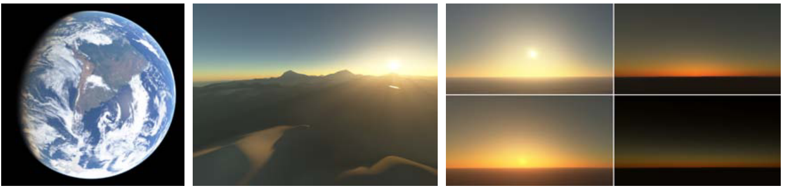
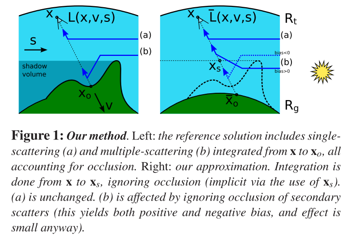
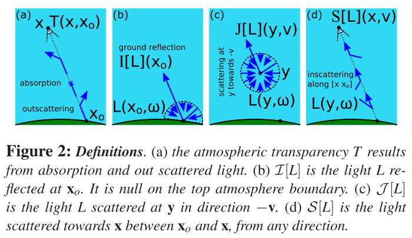
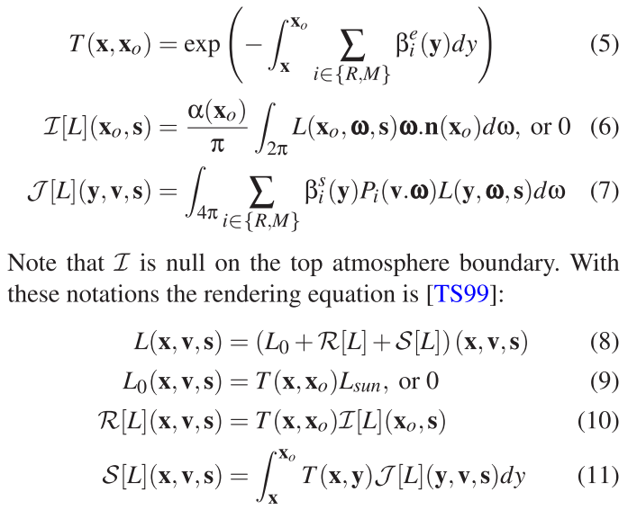
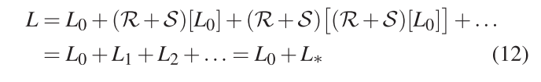
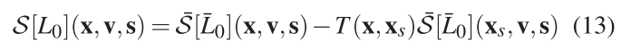
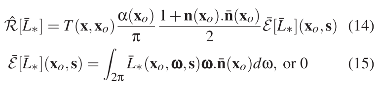
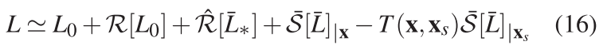
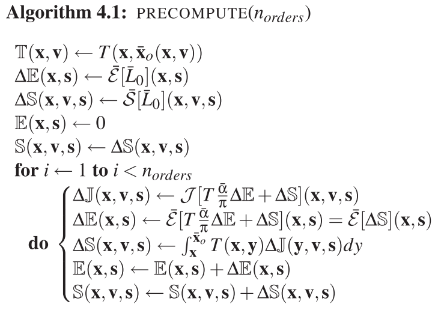
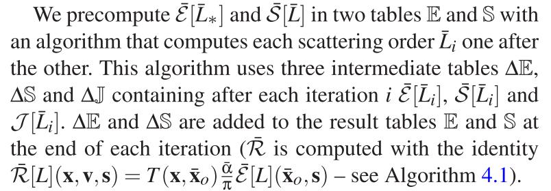

# Precomputed Atmospheric Scattering

本文方法基于考虑所有视点、视线方向、太阳方向和多重散射，预先计算**光传输方程式**，同时考虑了阴影和光轴`light shafts`。

## 1. Introduction

乏善可陈

## 2. 渲染方程

总结来说，如果我们发出的射线击中了一个物体，例如地面，那么最后这个像素的`color`是由哪几部分组成呢？1、$L_0$（**公式8**），这里指明了为`0`的条件（v不等于s，或遮挡），这里我觉得作者这样写很容易引起迷惑。实际上，是这个意思：一切击中物体的，比如地面，这项必然为`0`，因为$v=s$必然导致遮挡（视线向量和太阳向量），所以说，这项只有在我们直接看向太阳时才不为`0`；2、$S(L)$，就是我们最为熟悉的`in-scattering`，这里还是完整式，考虑了多次散射（因为对球域积分）；3、$R(L)$，也是老朋友，漫反射项积分。

## 3. 本文方法

为了提高效率和逼真度，作者的目标是尽可能地以最小的近似值对`L`进行预先计算。 其解决方案基于零散射和单散射的精确计算，并使用==遮挡效应的近似值==来计算多重散射。 实际上，为了获得正确的地面颜色，阴影和`light shafts`，零和单次散射考虑到了**详细的地面形状**。 但是我们用一个恒定反射率的完美球体来近似它（毕竟地球嘛），以计算**多重散射**，以便进行预计算。

### Notations（符号）

地球这个完美球体具有恒定反射率$\overline{\alpha}$。由于地面的==球对称性==，`x`和`v`可以减小为一个高度（决定`x`）和一个视图天顶角（决定`v`）——$(h,\theta)$。因此上诉诸多方程可以减少为4个参数的方程（x,v以及剩下s的球坐标）。此外，**头上带横杠都是指这个参数考虑的环境是完美球体的地球**（主要针对的是$L_0$，毕竟它考虑了地形的遮挡）。

还要注意，$L(resp.\overline{L})$可以用线性算子`R、S`序列表示，其中第`i`项对应于正好被反射或散射`i`次的光：

### Zero and single scattering

在渲染过程中，精确地计算了$L_0$和$R[L_0]$。 为此，我们使用阴影算法来计算太阳的遮挡（参见公式9），并使用==透射率T==的LUT，该表仅取决于2个参数（请参见第4节）。$S [L_0]$更复杂，它是$x$和$x_o$之间的积分，但是由于$L_0$中的闭塞项，在阴影中的所有**点y**上积分都是零（这就是产生`light shaft`的原因）。 我们在这里假设这些点在$x_s$和$x_o$之间（参见图1——第5节中讨论了一般情况），然后可以将积分域缩小为$[x，x_s]$。 此时可以忽略遮挡，即可以将$L_0$替换为$\overline{L}_0$。最后简单分析可以有如下方程：

### Multiple scattering

如上所示，尽管有遮挡，仍可以精确计算$L_0$和$L_1$。但之后来考虑**遮挡**要困难得多。 这个时候希望对**遮挡**进行**近似估计**。 与白天的单次散射相比，**多重散射效应**很小，而当地面不直接被太阳照亮时，其地面散射很小。因此，我们通过对`x`和$x_s$之间无遮挡的多次散射进行积分，来近似估计$S[L_*]$中的遮挡效果。 这会产生正bias和负bias（请参见图1）。

在数学上，该近似值可得出$S[L_*]\approx \int^{x_s}_{x}T\cdot J[\overline{L}_*]$。根据地面的切平面$\frac{1+n\cdot \overline{n}}{2}$，作者还用**水平半球的环境光遮挡**来估计$R[L_*]$中的光遮挡效应。所以有约等式，且近似值为：

总结来说：

现在，上诉公式的前三项可以用一个2D的LUT计算（预计算$T, \overline{\varepsilon}[\overline{L}_*]$），而$S[L]$则用一个四维的LUT。

## 4. 预计算

首先对于透光率，x到y的透光率，可以通过x处的读表值**除以**y处的读表值得到。预计算透光率不是一个问题。

关于预计算，还有很多细节问题，具体之后要是搞再看吧。

