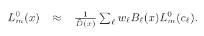

# Real-Time Smoke Rendering Using Compensated Ray Marching

本文提出了一种名为`compensated ray marching`的实时算法，用于渲染**动态低频环境照明**下的烟雾。方法是将**输入的烟雾动画**分解为一组**径向基函数**（`RBFs`）和一组**残差场**，然后表示为一连串的**体积密度场**。为了加快渲染速度，烟雾中的**源辐射分布**只从密度场的**低频RBF近似值**中计算，因为在低频环境照明下，**高频残差对全局照明的影响很小**。此外，在计算源辐射量时，仅在**RBF中心**计算来自**单次和多次散射的贡献**，然后使用**基于RBF的内插法**在体积的其他点上进行近似。然后沿着每条视线对这些源辐射值进行**基于切片的积分**，以呈现出最终的图像。**高频残差场**是烟雾局部外观的一个重要组成部分，在这个**射线行进**过程中被补偿回**辐射度积分**，以生成**高细节的图像**。

## 1. Introduction

略

## 2. Related Work

略

### 3. Light Transport in Scattering Media

将照明表示为低频环境图$L_{in}$，由**球面谐波系数**描述。**输入的烟雾动画**被建模为一连串的**体积密度场**。我们把每一帧的**烟雾密度**表示为$D(x)$，烟雾的**消光系数**表示为$\sigma_t$，**散射系数**表示为$\sigma_s$，**单次散射反照率`albedo`**表示为$\Omega$。

图2说明了光在烟雾中的传输情况。沿$w_o$方向`x`点的辐射度由**减少的入射辐射度**$L_d$和**介质辐射度**$L_m$组成：

**减弱的入射辐射度**描述了沿$w_o$方向直接到达`x`的源照明$L_{in}$，并有一些介质的衰减：{**1**}

其中，$\tau_{\infin}(x,w_o)=exp(-\int_x^{\infin}{\sigma_tD(v)dv})$。另一方面，**介质辐射度**$L_m$包括在沿$w_o$方向到达`x`之前在介质中**至少散射过一次的光**。它是通过沿着相应的视线，积分**辐射度贡献**来计算的：{**2**}

其中，**源辐射度**$J(u,w_o)$表示在`u`点向$w_o$方向散射的光。在**非辐射介质**中，如烟雾，这种**源辐射度**是由**单一散射**$J_{ss}$和**多重散射**$J_{ms}$组成的：

单一散射项$J_{ss}$在介质中的第一次散射作用发生在`u`：{**3**}

多重散射项$J_{ms}$，说明了介质辐射的散射情况： {**4**}

在一个`optically thick`的介质中，经过多次散射的介质辐射度可以用**扩散过程**来近似。用**双项泰勒扩展**来表示**介质辐射度**，我们可以得到：

其中，$L_m^0(x)=\frac{1}{4\pi}\int_SL_m(x,w)dw$是所有角度的**平均辐射度**。$L_m^1(x)=\frac{3}{4\pi}\int_SL_m(x,w)wdw$是主要的**方向性成分**。平均辐射度$L_m^0(m)$是由**扩散方程**决定的：{**5**}

$J_{ss}^0,J_{ss}^1$是单次散射$J_{ss}$的泰勒展开前两项。$L_m^1(x)$可以表示为：{**6**}

## 4. Algorithm Overview

利用了低频环境照明的基本假设，可以合理地假设**源辐射度**在烟中**平稳变化**，因此其角度变化可以用**低阶球面谐波**来近似，其空间变化可以用**相对较少的径向基函数**（`300∼1200`）来很好地建模。作者还假设介质为`optically thick`，因此**多重散射**可以用**扩散过程**来近似。本文算法包括**一个预处理步骤和一个运行时渲染算法**。

### 预处理

密度场`D`被分解为`RBFs` $B_ℓ$的加权和以及残差`R`：

每个`RBF` $B_ℓ$由其**中心**$c_ℓ$和**半径**$r_ℓ$定义：

在本文实现中，将**内核支持**限制在半径为$3r_ℓ$的范围内，这样可以减少预处理和运行时的计算。通过这种**密度场的分解**，使用**低频RBF表示**来有效地计算介质内的全局光照，并在渲染局部外观细节时考虑**高频残余**。

由于其大小，**原始密度场**`D`一般不能在GPU上有效地处理。然而，这种分解为**低频RBF近似值**˜D和**残差场**R的做法，可以大大减少数据的大小。通过利用**残差场**中通常存在的**相对较少的有效值**，可以进一步节省内存。为了促进压缩，通过**量化残差值**来获得一个**稀疏的残差场**。

### 实时算法

在参与介质模拟中，计算费用主要在于从**密度场**`D`计算**源辐射量**`J`。为了加快这一过程，从密度场的低频RBF模型`˜D`计算源辐射量的低频近似值`J˜`。具体来说，只计算RBF中心的单次和多次散射引起的`J˜`。

然后，介质中任何一点的源辐射度被近似地理解为这些中心的源辐射度的**加权组合**：{**7**}

这种源辐射的低频表示法可以快速计算，并在低频环境照明下提供合理的近似值。

在计算完**源辐射**后，我们通过执行**光线行进**来获得**介质辐射度**$L_m$，该**光线行进**收集了对视角的辐射度贡献。这些辐射度贡献包括从近似的源辐射度`˜J`和**RBF密度模型**中计算出的成分$˜L_m$，以及补偿**密度场残余**的成分$˜C_m$：{**8**}

补偿项$˜C_m$将**密度残差**的消光效应带入**射线行进**中，如图4（c）所示。通过以这种方式纳入**高频烟雾细节**，可以产生高质量的烟雾渲染。与Schpok等人的工作相反，他们在生成的云中加入**程序三维噪声**来丰富粗略的照明，本文补偿射线行进中使用的**高频残差**代表了真正的烟雾特征，其精细的独特细节和运动很难用噪声动画来令人信服。

在这个公式中，只在对公式（8）有直接影响的地方，即在**烟雾密度值**中考虑**残差场**。对于这些烟雾密度，可以使用完美的**空间散列法**从**哈希表**中有效地检索出**残差**。在公式（8）的其他因素中，残差只有间接的影响，也不能迅速地被计算在内。因此，我们在计算**源辐射率和透射率**时排除了残差，以大大加快处理速度，而不会造成烟雾外观的明显退化。

## 5. Algorithm Components

### Density Field Approximation

对于指定数量的`RBFs`，通过解决以下**最小化问题**来计算**烟雾密度场**的最佳近似值：{9}

采用`L-BFGS-B`最小化器。`L-BFGS-B`是一种基于导数的方法，因此在每次迭代时，向**最小化器**提供目标函数和每个变量的**偏导数**。作者将**RBF半径**限定在最大密度值的`0.01∼1.0`倍之内。为了避免在算法的早期阶段陷入`0.015∼0.09`和权重的**局部最小值**，还采用了类似于[Cohen-Steiner]的传送方案，即在逼近过程中记录**最大误差的位置**，然后将具有**最不重要的积分值的RBF**移到那里。作者在最小化器的每`20`次迭代中利用传送，当最小化器结束时，将最不重要的RBF交替传送到最大误差的位置或一个具有非零数据的随机位置。当两种**传送策略**都不能减少目标函数时，该算法就会终止。在**最小化过程**中加入**远程传输**，往往会导致**目标函数**进一步减少`20%∼30%`。

为了加速这一过程，作者利用烟雾动画中的**时间共线性**，用**前一帧的优化结果**来初始化一帧的`RBFs`。这增加了收敛速度并提高了性能。然而，**大量的远距传输可能会降低时间上的一致性，导致最终动画的闪烁**。通过采用一个**自适应插入方案**来避免这个问题，该方案从上述初始帧的远程传输和最小化程序开始。然后，这第一帧的相对误差被记录为：

在序列中的每个后续帧，首先删除用户指定数量的**最不重要的RBF**，然后按`L-BFGS-B`最小化进行**无远距传输**。将收敛的相对误差与第一帧的相对误差进行比较，如果它们的比率高于一个给定的阈值，对于本文使用的所有数据来说，这个阈值是`1.05∼1.2`，在最大误差的位置插入一个**固定半径的RBF**，并再次最小化。额外的RBF以这种方式插入，直到**相对误差率**被驱动到阈值以下，或者已经插入了指定的最大数量的**RBFs**。在目前的实施中，在初始帧中使用了`1000`个**RBFs**，在随后的每一帧中，删除`3`个**RBFs**，最多可插入`8`个**RBFs**。

### Residual Field Compression

在计算完**密度场的RBF近似**后，残余密度场$R(x)=D(x)-D^/(x)$被压缩以用于**GPU处理**。虽然**残余场**与**密度场**的分辨率相同，但它通常由**小数值**组成。作者将$R(x)$量化，以进一步**减少存储**。对于论文中使用的所有数据，作者发现`8`位量化足以获得视觉上合理的结果。然后，通过**完美的空间散列**来压缩得到的**稀疏残差场**，这是无损的，非常适合在图形硬件上进行**并行计算**。

在**完美空间散列**的实现中，利用了一些针对应用的修改。与[Lefebvre和Hoppe 2006]不同的是，**数据中的非零值主要位于体积的表面**，而本文的残差字段中的**非零值则分布在整个体积中**。因此需要**更大的偏移表**，所以将初始表的大小设置为$^3\sqrt{K/3}+9$（K是指体积中非零项的数量）。

在处理一连串的残余字段时，作者将几个连续的`frames`拼接成一个**较大的`volume`**，并在上面进行**散列**。由于计算与**域槽的数量**呈**非线性关系**，作者构建了一组较小的哈希`volume`，而不是将所有的`frame`拼成一个单一的`volume`。通过较小的`hash volume`，避免了在解码大型`packed volumes`的域坐标时出现的**精度问题**，并促进了**哈希表的加载**。在实现中，将27个`frame`编入每个`volume`中，

### Single Scattering

为了提高运行性能，烟体中的**源辐射度值**是用**密度场的低频RBF近似值**˜D计算的。根据公式（3）计算RBF中心的单一散射：{**10**}

其中，$\tau_{\infin}(c_l,w_i)=exp(-\int_{c_l}^{\infin_{w_i}}{\sigma_tD(v)dv})$。在**散射介质**中，相位函数通常由入射和出射方向之间的角度$\theta$参数化。为了计算方便，将$p(ω_o, ω_i)$重写为**圆周对称函数**$p(z)$，其中$z=cos θ$。**公式(10)**可以使用**SH三阶乘法**`triple product`和卷积算子在**球面谐波域**中有效地计算：{**11**}

SH投影$L_{in}$和`p`各计算一次并**重复使用**，直到用户修改**照明或相位函数**。

#### 计算消光率

直接用`RBF`来表示**透射率**，有：

为了有效地计算$T_h(c_l)$，对不同距离的单位半径`RBFs`使用了表格化的**光学深度向量**。如图5所示，通过RBF $B_h$的光学深度可以简单地计算为：$r_h$乘以通过一个单位半径RBF $B_u$的相对于`c`具有相同的半角`β`的**光学深度**。因此，建立了不同角度β的单位半径RBFs的**光学深度向量表**

其中`d`是$c_ℓ$到$B_u$中心的距离，而$c_ℓ$存在于$B_u$内的情况是通过将`β`的定义扩展到`[0, π]`范围内的一个**平滑变化的单调量**来处理。由于**RBF核函数**是对称的，**光学深度向量的构造**相当于一维的ZH向量（zonal harmonic）的列表。在制表中，通过在`[0, π]`中的`256`个值对`β`进行**均匀取样**而获得满意的结果。

为了在运行时计算$T_h(c_l)$，首先从表中检索出相应的**ZH向量** $T(β_{ℓ,h})$，其中$β_{ℓ,h}$是在$c_ℓ$处相对于RBF $B_h$计算的角度β。这个**ZH向量** $T(β_{ℓ,h})$然后被旋转到由$c_ℓ$和$c_h$决定的轴线上，再乘以半径$r_h$，得到$T_h(c_l)$。

然后，计算**透射率矢量** $˜τ(c_ℓ)$是直截了当的。对于每个RBF中心$c_ℓ$，我们通过**RBF的集合**进行迭代。它们的**光学深度向量**被检索、旋转、缩放，然后相加，得到**总的光学深度向量**。最后，将其乘以**负消光系数**，并将其**指数化**。有了这个透射率向量，**单次散射引起的源辐射度**就可以通过公式（11）计算出来。

### Multiple Scattering

考虑到单散射源的辐射度，**多散射介质的辐射度**是通过解决公式（5）和公式（6）中的扩散方程得到的。如[Stam 1995]，扩散方程以**RBF**表示，并在**RBF中心**构建。形成一个**线性系统**，并通过**最小二乘法**优化求解，以获得**RBF中心的介质辐射**。

**扩散方程的解**可以简单地转换为**2阶SH介质辐射度矢量**，然后与相位函数进行卷积，得到**多重散射源辐射度**
$J_{ms}(c_l)$。最终的源辐射度被计算为：

与源辐射度一样，平均介质辐射度$L^0_m(x)$可以用**RBF插值**进行近似。{**12**}

### Compensated Ray Marching

根据RBF中心的源辐射度，我们对体积中每个体素的源辐射度进行插值，并沿每个视图射线积分辐射度

通过两个`pass`来计算$L(x, ω_o)$：一个`volume pass`来获得**密度场**$D(u)$和**近似的源辐射度场**
$J˜(u, ω_o)$，和一个`view pass`来积分**辐射度**。

`volume pass`以**体积分辨率**进行渲染。它在体积的每个`slice`上迭代，重建密度场$˜D(u)$。残差$R(u)$从哈希表中获得，$D(u)$被计算为$D=˜D(u)+R(u)$。同时，近似的源辐射度场$J˜(u, ω_o)$被计算出来，然后乘以$D(u)$，得到$J˜_D(u, ω_o)$。

更具体地说，从远到近逐片计算公式（14）的离散积分：

其中，$\gamma$是视线与视壳中心轴之间的角度。

