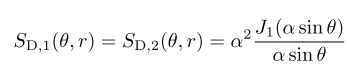

# Rendering Discrete Participating Media with Geometrical Optics Approximation

## 1. INTRODUCTION

渲染介质是一个长期存在的问题。基于物理的渲染中做出了一些妥协。**两个主要的假设**是**独立散射**和**局部连续性**。第一个**独立散射**的假设是指**构成介质的粒子**彼此相距甚远，并且相互不受影响。

**局部连续性**的第二个假设意味着，即使存在**宏观的异质性**，介质在每个**微分体积**中也是**均匀和紧凑**的。在这种情况下，光对散射体的**离散空间分布**不敏感，而只对它们的**局部平均特性**敏感。只有当**颗粒大小**与**传感器**（如人眼）的分辨率相比**小得多且数量足够大**时，连续介质的假设才会成立。否则，在放大的情况下可以观察到**单个颗粒**。为了突破这个限制，应该考虑到**介质的颗粒性**。

本文试图提出一种更普遍的方法来模拟和渲染**具有大量散射体的离散参与介质**，这些散射体的**粒度分布**（`PSD`）范围很大。这些介质在自然和人工环境中无处不在，如飞扬的尘土、飞雪。

与传统的连续介质不同，**离散介质**具有**空间变化的光学特性**（例如，**消光系数**），这些特性不能预计算。它们与每个粒子的散射行为和`PSD`的波动密切相关。一般基于`Lorenz-Mie`理论，它在渲染**参与介质**方面提供了大量的真实性。然而，当粒子**尺寸较大**时，`Lorenz-Mie`系数的数值计算是困难和耗时的。为了改善这个问题，作者引入了**几何光学近似法**（`GOA`），并利用它来简化计算。

## 2. RELATED WORK

略

## 3. LIGHT SCATTERING BY A SINGLE PARTICLE

首先研究**单个粒子的光散射**。假设粒子是**近似球形**的，并且有一套物理特性，包括其**半径**`r`和**折射率**$\eta_p$。假设形成介质的粒子具有相同的组成，只有它们的**大小不同**。在这种情况下，折射率$\eta_p$是**固定的**。假设主介质的折射率为$\eta_m$，可以将粒子的**相对折射率**定义为$\eta=\eta_p/\eta_m$。**球形粒子的尺寸**也可以用**无量纲尺寸参数**$\alpha=kr=2\pi\eta_mr/\lambda$来表示，其中`k`是由$k=2\pi \eta_m/\lambda$定义的波数`wave number`，$\lambda$是介质中**光的波长**。

为了描述**散射**，需要两个**散射振幅函数**。$S_1(\theta,\phi,r)$和$S_1(\theta,\phi,r)$，其中$\theta$是**散射角**，$\phi$是**方位角**。下标1和2分别表示**垂直和平行极化**。对于球形粒子，$S_1$和$S_2$相对于$\phi$是不变的，但它们会随着半径`r`变化。对于**非偏振光**，这两个函数定义**单个粒子的相位函数**为：{**1**}

由`scattering cross section`$C_s$归一化：{**2**}

粒子的另一个重要属性是消光`cross section` $C_t$，其计算方法是：{**3**}

$S(0,r)=S_1(0,r)=S_2(0,2)$。符号$R_e$是指一个**复数的实部**。对于有**吸收**的粒子，`absorption cross section`由$C_a(r)=C_t(r)-Cs(r)$给出。

对于**同质球形粒子**的电磁波散射，两个散射振幅函数的精确解是由`Lorenz-Mie`理论给出的。然而，随着粒子尺寸的增加，`Lorenz-Mie`系数的数值计算变得非常繁琐和耗时，这是由于$S_1(\theta,\phi,r)$和$S_1(\theta,\phi,r)$需要**计算的项数**与**尺寸参数**$\alpha$成正比。==几何光学近似法==（`GOA`）提供了一个简化但很好的解决方案。

### Geometrical Optics Approximation

在GOA的框架内，**光的散射**是由经典的**衍射**、**几何反射**和**透射**的叠加来计算的。**衍射与粒子的组成（即折射率）无关**。它在前进方向的**振幅函数**很容易被`Fraunhofer diffraction`描述为：{**4**}

$J_1$是一阶**贝塞尔函数**。

撇开衍射不谈，一条光线以入射角$\theta_i$击中一个球形的粒子，根据界面的特性，部分被反射，部分被折射，如图1所描述。被折射的光线在离开粒子之前可能会经历**若干次内部反射**。对于每条光线，我们用一个整数`p`来表示它在球形粒子内部的**弦数**`number of chords`。很明显，外部反射的射线的$p=0$，而其他的射线是$p-1$的内部反射。第p次，与**入射方向**之间的偏转角$\theta_p$由以下公式给出：{**5**}

散射角$\theta$由偏转角$\theta_p$进一步确定为：{**6**}

其中，$q\in \{-1,1\}$，`l`是一个整数，确保散射角在$[0,\pi]$内定义良好。反射光线和透射光线取决于粒子的形状和组成。它们对每个偏振的**散射振幅**可推导为：{**7**} {**8**}

$R_j(\theta_i)$是**菲涅尔反射系数**，**相位差**$\phi=\phi_p+\phi_f$包括由于光路长度引起的$\phi_p$：{**9**} {**10**}

能够得到`GOA`的总振幅函数为：{**11**} {**12**} {**13**}

### Discussions on p

在计算`GOA`的$S_1$和$S_2$时也有一个**无限的求和**。然而，与`Lorenz-Mie`理论不同的是，**所需的项数与粒子大小无关**，在大多数情况下，小的`p`就足够了。如图22所示，当在`GOA`中以$p=3$计算$(|S1|+|S2|)/2$时，我们得到的曲线与$p=100$的曲线几乎相同。这是因为**高阶反射**（p>3）携带的能量要少得多，对**散射光强度**的影响也很小。

此外，可以进一步简化：{**14**}

### Comparisons between GOA and Lorenz-Mie Theory

为了研究`GOA`在模拟**球形粒子散射模式**方面的有效性范围，作者在图4中把结果与严格的`Lorenz-Mie`结果在广泛的**粒子半径范围**内进行比较。在所有的计算中，入射光线的波长被设定为`0.6`微米，相对折射率为$η = 1.33$。图4显示，对于r>1 µm的大颗粒，GOA的散射振幅分布与Lorenz-Mie理论得到的散射振幅分布很一致。当半径足够大时（如r = 100 µm），这两种方法在几乎所有方向上的一致性特别好。然而，当r≈1 µm时，这两种方法之间出现了一些差异。这些差异随着粒子半径的进一步减小而变得很大

r=1微米的情况下，Lorenz-Mie和GOA之间**相位函数的差异**导致了外观的不一致。然而，当r上升到2微米时，这种不一致性几乎完全消失了

## 4. BULK OPTICAL PROPERTIES WITH GRAININESS

现在，考虑由**相同成分但不同大小的球形颗粒**组成的**云的光散射。**假设这些粒子处于彼此的**远场状态**，它们的尺寸可能从波长范围到比波长大得多的范围。

### Particle Size Distribution

使用**粒度分布**（`PSD`）$N(r)$来描述**离散参与介质中的颗粒群**。因此，$N(r)dr$是在尺寸落在**域**[r, r + dr]中颗粒的**总浓度**。在尺寸区间$[r_{min}, r_{max}]$内的总粒子数浓度由积分得到。一般说来，颗粒大小遵循**对数正态分布**：{**15**}

其中$\sigma_g$是**几何标准偏差**，$\overline{r}_g$是**几何平均半径**。

### Bulk Optical Properties

假设$V_x$是一个以`x`为中心的小体积，这个体积的**体消光系数**$\sigma_t$的计算方法是：{**16**}

对于**散射系数和吸收系数**，可以用类似的方式定义，即分别用Cs(r)和Ca(r)代替Ct(r)。 一般来说，这些特性在Vx的大小方面表现出**多尺度效应**。**集合相位函数**推导为 ：{**17**}

其中$\sigma_s(V_x)$作为**归一化系数**。图8直观地显示了由上述公式产生的相位函数。这里，我们使用了rmin和rmax之间的**均匀采样**。通过固定其他属性，我们在图8中显示了这些相位函数对光滑均质介质最终外观的影响。

同样地，可以推导出沿着长度为`s`的光束的**透射率**为：{**18**}

其中，C=A×s代表光束周围的一个**小圆柱体**，A是**其截面**。其推导结果见附录D。对于具有单分散分布的粒子，透射率被简化为：{**19**}

## 5. RENDERING SOLUTION

有了这些**体积光学特性**，我们能够推导出一个多尺度的**体积渲染方程**（`VRE`），描述离散随机介质中的**辐射传输**。然后，开发了一个基**于蒙特卡洛采样**的解决方案来解决`VRE`。这个解决方案只需要**每个粒子的位置和大小**，避免了对其形状的明确细分。在**预处理阶段**，生成并存储了$N_{tot}$个具有随机位置和**对数正态分布**半径的离散粒子。在渲染过程中，对存储的粒子进行查询，以确定每条追踪光线的**光学特性**。

### Multi-scale Volumetric Rendering Equation

传统上，描述参与介质中**宏观光散射**的`VRE`被写为

多尺度版本：

### Query Cylinder

在多尺度`VRE`中，每一个光学特性都取决于一个`PSD`，而PSD是定义在一个差分体积上。为了评估介质中任何两个位置`x`和`y`之间的透射率$T_A(x, y)$，我们需要一个围绕射线x → y的**差分体积**。 在实现中，作者把它设计成一个以x → y为中心的薄圆柱体，如图9所示。 把这样一个圆柱体命名为**查询圆柱体**。在这个意义上，把每条射线看作是一条 "**胖射线**"，沿着它的轨迹聚集小颗粒。

理论上，截面`A`应该是无限小的。 然而，太小的截面可能会有数值上的问题，导致**大的方差**。反之，当A非常大时，$T_A(x, y)$中会引入**偏差**。在实践中，按如下方式选择A，并在射线穿越介质时保持其不变。假设$z_{near}$和$z_{med}$分别表示**近平面的深度**和视域中**介质的最小深度**，`A`的大小根据以下公式选择：{**23**}

这里，$S_{pix}$是像素的大小，而`k`可以被看作是像素在距离$z_{med}$分处的`footprint`的百分比。通常情况下，当k在$[0.5,1]$范围内时，可以得到满意的结果。

### Gathering Particles

在一个**查询圆柱体**（中心射线：x→y，半径：$r_c$和横截面：A）内**收集粒子**，需要对介质中的每个粒子进行**球体-圆柱体相交测试**。给定一个位置为`p`、半径为$r_p$的粒子，如果从p到中心射线x → y的距离小于$r_p+r_c$，那么它就应该在查询圆柱体内。

为了提高性能，使用**三维数字差分分析器**（`3D-DDA`）**加速射线穿越介质**的过程。具体来说，为介质构建一个`uniform grid`，并采用**射线遍历算法**来寻找与**查询圆柱体**相交的**活动体素**。这引入了可忽略不计的偏差，因为横截面的半径比体素的边长要小两个数量级。在收集了所有粒子后，根据公式（18）累积它们对**透射率**$T_A(x, y)$的贡献。

### Computing Q(θ)

为了解决多尺度`VRE`，还必须计算任何样本位置`y`的$Q(θ)$。$Q(θ)$描述了`y`处**散射的角度分布**。为了快速计算它，应该在`y`周围定义一个**小的查询区域**。把这个查询区域设定为一个半径为$r_c$的小球体。如果这个查询区域包含$N_q > 0$的粒子，用以下公式：{**24**}

### Importance Sampling

略

## 6. RESULTS

