# Simulating the Colors of the Sky

## 1. Introduction

**Rayleigh**和**aerial perspective**的介绍。

主要是关于天空模型的发展历史的介绍。本文将展示==Nishita的算法==是如何模拟这些现象的。


## 2. Atmospheric Model

**大气层**是行星周围的一层气体。这种大气由于行星的引力而保持不变。大气的定义主要是它的**厚度**和**介质元素**。地球大气的厚度约为`100`公里，由氧气、氮气、氩（瑞利发现的一种气体）、二氧化碳和水蒸气组成。然而，在模拟中，我们将使用`60`公里的厚度（只考虑地球大气层的前两层，**对流层**和**平流层**的散射）。光子是分散的，当他们与粒子碰撞。当光以一定的方向穿过一个体积（大气层）时，**光子**在与**粒子**碰撞时向其他方向偏转。

这种现象被称为==散射==。光被粒子散射的频率取决于粒子的特性（主要是它们的**大小**）和它们在体积中的**密度**。我们现在已经知道了地球大气层中分子的大小，也知道了它们的 **浓度/密度**。我们将把这些**科学测量结果**用于**大气散射模拟**。地球周围的大气层还有一个重要的方面，那就是这些**颗粒的密度随着高度的增加而减少**。

换句话说，我们发现在海平面上**每立方空气中的分子**要比在海平面以上2公里处**多得多**。这是一个很重要的事实，因为散射的量取决于分子密度。当光从**上层大气**传播到**地上**，我们将需要沿**射线**定期对**大气密度**进行采样，并根据这些采样位置的大气密度来计算**散射量**。大多数论文（包括Nishita的论文）都假设**大气密度随高度呈指数下降**。换句话说，它可以用一个简单的方程式来模拟：

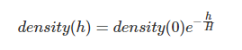

其中，$density(0)$是海平面处的大气密度。H是大气的厚度，如果它的密度是均匀的（在科学论文中`H`被称为`scale height`。H取决于温度)。一些论文声称这个模型是一个很好的近似，然而另一些则声称它是不正确的，他们倾向于将**天空密度**建模为**一系列由厚度和密度决定的同心层**。

> 将天空密度建模为一系列的层（在Nishita的论文中称为==球壳==），从计算的角度来看也是一个优势。由于我们将沿着光线进行**数值积分**，在大气层中**密度高的位置采取的样本**比**密度低的位置采取的样本**更重要。因此，==沿着光线进行 "恒定步长 "的积分会导致收敛效果不佳==。现在的计算机非常快，我们可以通过有规律的步骤来强行计算，但在Nishita的时代，优化算法是必要的。因此，他提出了一个模型，在这个模型中，大气被表示为一系列的球壳，在低空有小间隔，在高空有长间隔。然而，请注意在论文中发表的图表中，各层的厚度似乎有一个指数的变化。这并不令人惊讶，因为在他的模型中，每个壳的半径是由空气分子的密度分布精确决定的（他用来计算这个密度的公式与我们上面写的非常相似）。
>
> 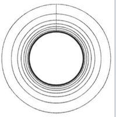

==大气层==是由小颗粒（空气分子）组成的，在低空也与**较大的颗粒**混合在一起，称为**气溶胶**。这些颗粒可以是任何由风扬起的灰尘或沙子，也可以是由于**空气污染**而存在的。它们肯定会对大气层的外观产生影响，特别是它们不会像空气分子那样散射光线。空气分子对光的散射被称为==瑞利散射==，而气溶胶对光的散射被称为==米氏散射==。 

 简而言之，瑞利散射（空气分子对光线的散射）负责天空的蓝色（以及日出和日落时的橘红色），而米氏散射（气溶胶对光线的散射）通常负责在受污染的城市上方看到的**白灰色雾霾**。

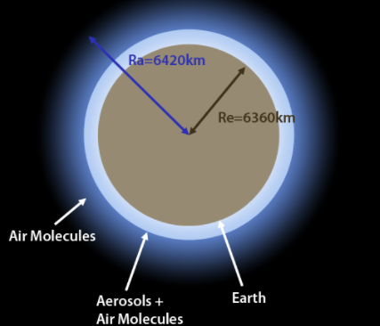

如果没有提到**需要用户指定行星和天空的半径**，这个模型将是不完整的。这些数字将被用来计算沿着视图和光线**采样的位置的高度**。对于地球，我们将使用$R_e = 6360$公里（e表示地球）和$R_a = 6420$公里（a表示大气）。我们模型中所有与距离相关的距离和参数都应该用**相同的单位系统**表示（km, m等）。

> 对于大气模型，这可能很棘手，因为**行星的尺寸**可能很大。对于这样的尺寸，千米通常是一个更合适的选择。然而散射系数是非常小的，它们更容易用米或毫米来表示（对于光的波长甚至是纳米）。选择一个好的单位也是由浮动精度的限制所驱动的（也就是说如果数字太大或者太小，计算机对这些数字的浮动表示会变得不准确，这将导致计算错误）。模型的输入参数可以用不同的单位表示，并由程序进行内部转换。

最后，天空的主要照明来源是太阳。太阳离地球很远，我们可以假设所有到达大气层的光线是相互平行的。

## 3. Rayleigh Scattering

空气分子对光的散射是由`Rayleigh`在19世纪末发现的。他特别表明，这种现象有很强的**波长依赖性**，更准确地说，空气分子对蓝光的散射比对绿光和红光的散射更多。我们在大气中发现的散射系数，只适用于尺寸比**构成可见光的波长小得多的粒子**（粒子应该至少比**散射的波长**小**十分之一**）。可见光的波长从`380`到7`80`纳米不等，`440`、`550`和`680`分别被认为是蓝、绿和红光的峰值。**瑞利散射方程**提供了一个体积散射系数（知道分子密度）。在关于大气散射的文献中，**散射系数**用希腊字母β来表示。

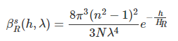

上标`S`代表散射，下标`R`代表瑞利。在这个公式中，h是高度，$\lambda$是波长，`N`是**海平面的分子密度**，`n`是空气的折射率，$H_R$是比例高度。在我们的模拟中，将使用$H_R=8$公里。从这个公式可以看出，短波长的光（如蓝光）会比长波长的光（红光）给出更高的**β值**，这就解释了为什么白天的天空会呈现**蓝色**。当太阳光穿过大气层时，更多的蓝光散射到观察者身上（这也解释了为什么日光是橙色的：红 + 绿）。那么，为什么在日出和日落时会出现**橘红色**？在这种特殊的结构中，来自太阳的光线必须穿过更长的大气层才能到达观察者的位置（蓝光都散射掉了），而不是当太阳在你的头上时（天顶位置）。这个距离相当长，大部分的蓝光在到达观察者的位置之前就已经被散射掉了，而红光仍然存在。因此，在日出和日落时，天空呈现出橘红色。

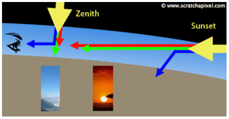

我们可以使用N、n等的测量值来计算β的值；我们也可以直接使用**预计算值**，这些值与**海平面的天空散射系数**相对应（波长440、550和680的==散射系数==分别为$33.1e^{-6}m^{-1}、13.5e^{-6}m^{-1}、5.8e^{-6}m^{-1}$。 只要加上方程的**指数部分**，我们就可以为任何给定的高度`h`调整这些系数。

> Nishita的论文和我们在本课中提到的其他论文的一个主要问题是，它们要么没有给出用于产生论文中所示图像的N、n等值。如果使用了测量值，论文的作者通常不会引用他们的来源。找到海平面分子密度的科学数据并不明显，如果你有关于这个主题的任何有用的链接或信息，你可以提供给我们，我们希望听到你的意见。我们在本课中使用的海平面散射系数可以在两篇论文中找到。"Riley等人的《Efficient Rendering of Atmospheric Phenomena》和Bruneton等人的《Precomputed Atmospheric Scattering》。
>
> 我们不会过多地讨论空气的密度，但在互联网上可以找到关于这个问题的有趣信息。在本课中，我们真正需要的是**海平面的平均散射系数**，这些系数对再现天空的颜色很有效，但学习如何计算这些系数，任何希望对大气模型有更多控制权的读者都会感兴趣。

用于渲染参与介质的物理模型是散射系数、吸收系数和相位函数，**相位函数描述了光线与粒子碰撞时的散射程度和方向**。在本课中，到目前为止，我们只给出了**地球大气层的散射系数值**（并解释了如何计算）。**对于大气层的散射，通常承认吸收是可以忽略不计的**。换句话说，我们将假设**大气层不吸收光**。

The Raleigh phase function looks like this：（$\mu=dot(w_{Light},w_{V})$）

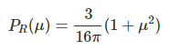

## 4. Mie Scattering

**米氏散射**在某种程度上与瑞利方程相似，但适用于**尺寸大于散射波长的粒子**。这就是我们在地球大气层的低空发现的气溶胶情况。用于计算**散射系数**的**米氏方程**看起来像这样：

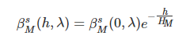

米氏散射有一个特定的比例高度值$H_M$，通常被设定为`1.2`公里。与**瑞利散射**相反，我们不需要一个方程式来计算米氏散射系数。我们将使用**来自海平面的测量值**来代替。对于米氏散射，我们将使用$210e^{-5}m^{-1}$。**气溶胶的密度也会随着高度的增加而呈指数下降**，就像瑞利散射一样，我们将通过在方程的右边加入一个指数项来模拟这种效应（由比例高度系数$H_M$控制）。==米氏消光系数大约是其散射系数的1.1倍==。而米氏相函数方程为：

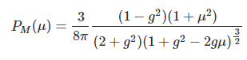

米氏相位函数包括一个项`g`，它控制**介质的各向异性**。气溶胶表现出很强的**正向指向性**。一些论文使用$g=0.76$（我们也将使用它作为默认值）。


## 5. The Concept of Optical Depth

在我们研究该算法在`C++`中的实际实现之前，我们将把所有的拼图放在一起。首先，我们应该注意到，**天空**只不过是一个围绕着**固体球体**的球形体。因为它只不过是一个体积，所以要渲染天空，我们可以使用`ray marching`算法，**这是渲染参与介质的最常见的技术**。我们在 "体积渲染 "一课中详细研究了这种算法。当我们渲染一个体积时，观察者（或摄像机）可以在体积内，也可以在体积外。

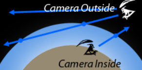

当摄像机在内部时，我们需要找到`view ray`离开体积的点。当它在外面时，我们需要找到`view ray`进入和离开体积的点。因为天空是一个球体，我们将使用一个**射线-球体交汇的程序**来分析计算这些点。我们在基础部分介绍了一些计算射线与球体相交的技术（Ray-Quadratic Shapes Intersection）。我们通过以地面为参照物，测试相机的高度来知道相机，是在大气层内还是大气层外。如果这个高度大于**大气层厚度**，那么相机就在大气层之外，`view`射线可能在**两个地方**与**大气层**相交。

现在我们假设**摄像机**在地面上（或离地面`1`米高），但该算法对任意的摄像机位置都有效（我们将在本课结束时渲染一幅来自外太空的天空图像）。让我们假设我们有一条`view ray`（对应于画面中的一个像素），并且我们知道这条射线与大气层的上限相交的位置。在这一点上，我们需要解决的问题是，找出有多少光线沿着这条射线向**观看者的方向**传播。正如我们在下图中看到的，我们的相机或观察者不太可能直接看着太阳（这对你的眼睛很危险）。


在逻辑中，如果你看的是**天空的方向**，你不应该看到任何东西，因为你看的是**外太空**，而外太空是空的（天体之间的空间）。然而，事实是，你看到的是一种**蓝色**。这是由于来自太阳的光线进入大气层，并被**观察方向的空气分子**所偏转而引起的。换句话说，没有**来自太阳的直接光线**沿着观察方向传播（除非观察方向直接指向太阳），但由于来自太阳的光线被大气层散射，其中一些光线最终沿着你眼睛的方向传播。这种现象被称为`single scattering`。

我们将首先从$P_C$点（相机位置）向感兴趣的方向投下一条观察光线（V）。我们将计算出这条射线与大气层相交的点$P_a$。最后，我们需要计算由于单次散射而沿这条射线传播的光量。这个值可以用体积渲染方程来计算。

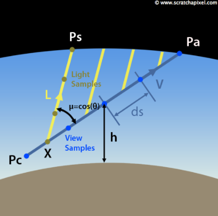

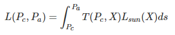

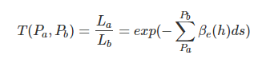

回到我们所说的**瑞利散射**，βs可以用**海平面的散射系数**来计算：

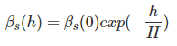

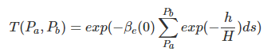

指数函数内部的**黎曼和**可以看作是$P_a$和$P_b$之间的平均密度值，该方程式本身在文献中通常被称为$P_a,P_b$点之间的==大气光学深度==。


## 6. Adding the Sunlight


现在来看看术语$L_{sun}(X)$，并解释如何计算它。$L_{sun}(X)$对应于沿**观察方向**在样本位置`X`处散射的阳光量。首先我们需要计算到达X的光量。直接取**阳光强度**是不够的。事实上，如果光在$P_S$处进入大气层，它在到达`X`时也会被衰减。因此，我们需要用一个类似于用来计算沿观察射线从$P_a$到$P_c$的**光衰减方程式**，来计算这种衰减（方程式1）：

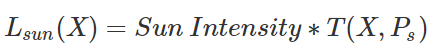

### Equation 1

从技术上讲，对于沿**观察光线**的每个采样位置`X`，我们将需要在太阳光方向（`L`）上投射光线，并找到该光线与大气的交点（$P_s$）。 然后，我们将使用与观察光线相同的**数值积分技术**，来计算等式1中的**透射率（或光学深度）项**。光线将被切成`segment`，并且每个光段中心处的**大气密度**将被计算。

 然后需要考虑的是==相位函数==。 瑞利散射和米氏散射具有它们自己的相位函数，我们将进一步介绍。**Mie相位函数**包含一个额外项`g`，称为**平均余弦**，它定义光是主要沿向前方向（L）还是向后方向（-L）散射。 对于前向散射，g在$[0,1]$的范围内，对于后向散射，g在$[-1,0]$的范围内。 当g等于零时，光在所有方向上均等地散射，该散射是各向同性的。 对于米氏散射，我们将`g`设置为`0.76`。

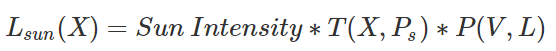

最后，我们需要考虑一个事实，主要是蓝光沿`view ray`散射。 为了反映这一点，将前面方程的结果乘以**散射系数**$\beta_s$：

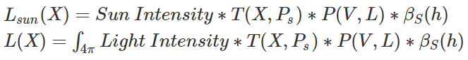

> 对于地球大气层，太阳是天空中唯一的光源，但是要写出前面方程式的**一般形式**，我们应该考虑光可能来自多个方向的事实。 在科学论文中，您通常会看到该方程写为$4\pi$上的积分。 它描述了传入方向的范围。 这个更通用的方程还将说明**地面反射的阳光**（多次散射），我们将在本章中将其忽略。


## 7. Computing the Sky Color

总结之前的处理，现在我们有如下（公式2和3）：

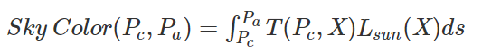

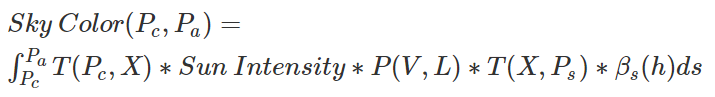

提取定值：（公式4）

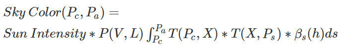

这是针对特定`view ray`和`light ray`，渲染天空颜色的最终方程式。 因此，并不复杂。 由于我们计算积分并多次调用**指数函数**（通过透射率项），因此对计算的要求更高。 另外，天空颜色实际上是**瑞利散射**和**米氏散射**的共同结果。 因此，对于每种类型的散射，我们需要`2`次计算此方程式：

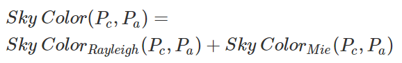

而积分内的两个透射率的指数函数，我们可以通过$e^ae^b=e^{a+b}$来减少调用指数函数的次数。


## 8. 实现（C++）

首先，我们将创建一个==大气层类==，用于指定系统的所有参数：行星和大气的半径$(R_e,R_a)$，海平面上的瑞利和米氏散射系数，瑞利和米氏**比例高度**（$H_r,H_m$），太阳方向，太阳强度和平均余弦`g`。 所有距离均以==米==（以及散射系数）表示。

```c++
class Atmosphere 
{ 
public: 
    Atmosphere( 
        Vec3f sd = Vec3f(0, 1, 0), 
        float er = 6360e3, float ar = 6420e3, 
        float hr = 7994, float hm = 1200) : 
        sunDirection(sd), 
        earthRadius(er), 
        atmosphereRadius(ar), 
        Hr(hr), 
        Hm(hm) 
    {} 
 
    Vec3f computeIncidentLight(const Vec3f& orig, const Vec3f& dir, float tmin, float tmax) const; 
 
    Vec3f sunDirection;     // The sun direction (normalized) 
    float earthRadius;      // In the paper this is usually Rg or Re (radius ground, eart) 
    float atmosphereRadius; // In the paper this is usually R or Ra (radius atmosphere) 
    float Hr;               // Thickness of the atmosphere if density was uniform (Hr) 
    float Hm;               // Same as above but for Mie scattering (Hm) 
 
    static const Vec3f betaR; 
    static const Vec3f betaM; 
}; 
 
const Vec3f Atmosphere::betaR(3.8e-6f, 13.5e-6f, 33.1e-6f); 
const Vec3f Atmosphere::betaM(21e-6f); 
```

我们将渲染天空，就像用鱼眼镜头看到的一样。 相机朝上看，可以捕捉**360度**的天空。 为了创建针对太阳的不同位置渲染的天空动画，我们将渲染一系列帧。 在第一帧，太阳在天顶（中心帧）。 在最后一帧，太阳略微在地平线以下。

```c++
void renderSkydome(const Vec3f& sunDir, const char *filename) 
{ 
    Atmosphere atmosphere(sunDir); 
    auto t0 = std::chrono::high_resolution_clock::now(); 
 
    const unsigned width = 512, height = 512; 
    Vec3f *image = new Vec3f[width * height], *p = image; 
    memset(image, 0x0, sizeof(Vec3f) * width * height); 
    for (unsigned j = 0; j < height; ++j) { 
        float y = 2.f * (j + 0.5f) / float(height - 1) - 1.f; 
        for (unsigned i = 0; i < width; ++i, ++p) { 
            float x = 2.f * (i + 0.5f) / float(width - 1) - 1.f; 
            float z2 = x * x + y * y; 
            if (z2 <= 1) { 
                float phi = std::atan2(y, x); 
                float theta = std::acos(1 - z2); 
                Vec3f dir(sin(theta) * cos(phi), cos(theta), sin(theta) * sin(phi)); 
                // 1 meter above sea level
                *p = atmosphere.computeIncidentLight(Vec3f(0, atmosphere.earthRadius + 1, 0), dir, 0, kInfinity); 
            } 
        } 
        fprintf(stderr, "\b\b\b\b\%3d%c", (int)(100 * j / (width - 1)), '%'); 
    } 
 
    std::cout << "\b\b\b\b" << ((std::chrono::duration)(std::chrono::high_resolution_clock::now() - t0)).count() << " seconds" << std::endl; 
    // Save result to a PPM image (keep these flags if you compile under Windows)
    std::ofstream ofs(filename, std::ios::out | std::ios::binary); 
    ofs << "P6\n" << width << " " << height << "\n255\n"; 
    p = image; 
    for (unsigned j = 0; j < height; ++j) { 
        for (unsigned i = 0; i < width; ++i, ++p) { 
#if 1 
            // Apply tone mapping function
            (*p)[0] = (*p)[0] < 1.413f ? pow((*p)[0] * 0.38317f, 1.0f / 2.2f) : 1.0f - exp(-(*p)[0]); 
            (*p)[1] = (*p)[1] < 1.413f ? pow((*p)[1] * 0.38317f, 1.0f / 2.2f) : 1.0f - exp(-(*p)[1]); 
            (*p)[2] = (*p)[2] < 1.413f ? pow((*p)[2] * 0.38317f, 1.0f / 2.2f) : 1.0f - exp(-(*p)[2]); 
#endif 
            ofs << (unsigned char)(std::min(1.f, (*p)[0]) * 255) 
                << (unsigned char)(std::min(1.f, (*p)[1]) * 255) 
                << (unsigned char)(std::min(1.f, (*p)[2]) * 255); 
        } 
    } 
    ofs.close(); 
    delete[] image; 
} 
 
int main() 
{ 
#if 1 
    // Render a sequence of images (sunrise to sunset)
    unsigned nangles = 128; 
    for (unsigned i = 0; i < nangles; ++i) { 
        char filename[1024]; 
        sprintf(filename, "./skydome.%04d.ppm", i); 
        float angle = i / float(nangles - 1) * M_PI * 0.6; 
        fprintf(stderr, "Rendering image %d, angle = %0.2f\n", i, angle * 180 / M_PI); 
        renderSkydome(Vec3f(0, cos(angle), -sin(angle)), filename); 
    } 
#else 
    ... 
#endif 
 
    return 0; 
} 
```

最后，是用于计算==方程式4==的函数。 我们要做的第一件事是找到相机光线与大气的交点（第4行）。 然后，我们计算Rayleigh和Mie相位函数的值（使用太阳和相机射线方向，第14和16行）。 第一个循环（第17行）沿摄影机射线创建样本。 请注意，样本位置（方程式中的X）是线段的中点（第19行）。 从那里，我们可以计算样本（X）的高度（第19行）。 对于瑞利散射和米氏散射（使用$H_r$和$H_m$），我们计算将$exp(-h / H)$乘以ds。 累积这些值（第23和24行）以计算X处的光学深度。我们稍后还将使用它们来缩放等式4（第42和43行）中的散射系数$\beta_s(h)$。

然后，我们计算X处来自太阳的光量（第31至38行）。我们向太阳方向投射光线（光线是平行的），并找到与大气的交点。该射线被切成段，我们评估段中间的密度（第35和36行）。累积这些值将为我们提供光线的光学深度。请注意，我们测试每个**光样本**是否在地面之上或之下。如果它在地下，可以安全丢弃此射线的贡献（第34和39行）。注意，Mie消光系数约为Mie散射系数（线40）的1.1倍。最终，使用等式5的技巧，我们可以通过在一个指数调用（第40和41行）中累积光和相机光线的光学深度，来计算光和相机光线的累积透射率。在函数的最后，我们返回该特定射线的天空的最终颜色，该颜色是瑞利散射和米氏散射透射率的总和乘以它们各自的相位函数和散射系数。该总和还乘以太阳强度（第48行）。

```c++
Vec3f Atmosphere::computeIncidentLight(const Vec3f& orig, const Vec3f& dir, float tmin, float tmax) const 
{ 
    float t0, t1; 
    if (!raySphereIntersect(orig, dir, atmosphereRadius, t0, t1) || t1 < 0) return 0; 
    if (t0 > tmin && t0 > 0) tmin = t0; 
    if (t1 < tmax) tmax = t1; 
    uint32_t numSamples = 16; 
    uint32_t numSamplesLight = 8; 
    float segmentLength = (tmax - tmin) / numSamples; 
    float tCurrent = tmin; 
    Vec3f sumR(0), sumM(0); // mie and rayleigh contribution 
    float opticalDepthR = 0, opticalDepthM = 0; 
    float mu = dot(dir, sunDirection); // mu in the paper which is the cosine of the angle between the sun direction and the ray direction 
    float phaseR = 3.f / (16.f * M_PI) * (1 + mu * mu); 
    float g = 0.76f; 
    float phaseM = 3.f / (8.f * M_PI) * ((1.f - g * g) * (1.f + mu * mu)) / ((2.f + g * g) * pow(1.f + g * g - 2.f * g * mu, 1.5f)); 
    for (uint32_t i = 0; i < numSamples; ++i) { 
        Vec3f samplePosition = orig + (tCurrent + segmentLength * 0.5f) * dir; 
        float height = samplePosition.length() - earthRadius; 
        // compute optical depth for light
        float hr = exp(-height / Hr) * segmentLength; 
        float hm = exp(-height / Hm) * segmentLength; 
        opticalDepthR += hr; 
        opticalDepthM += hm; 
        // light optical depth
        float t0Light, t1Light; 
        raySphereIntersect(samplePosition, sunDirection, atmosphereRadius, t0Light, t1Light); 
        float segmentLengthLight = t1Light / numSamplesLight, tCurrentLight = 0; 
        float opticalDepthLightR = 0, opticalDepthLightM = 0; 
        uint32_t j; 
        for (j = 0; j < numSamplesLight; ++j) { 
            Vec3f samplePositionLight = samplePosition + (tCurrentLight + segmentLengthLight * 0.5f) * sunDirection; 
            float heightLight = samplePositionLight.length() - earthRadius; 
            if (heightLight < 0) break; 
            opticalDepthLightR += exp(-heightLight / Hr) * segmentLengthLight; 
            opticalDepthLightM += exp(-heightLight / Hm) * segmentLengthLight; 
            tCurrentLight += segmentLengthLight; 
        } 
        if (j == numSamplesLight) { 
            Vec3f tau = betaR * (opticalDepthR + opticalDepthLightR) + betaM * 1.1f * (opticalDepthM + opticalDepthLightM); 
            Vec3f attenuation(exp(-tau.x), exp(-tau.y), exp(-tau.z)); 
            sumR += attenuation * hr; 
            sumM += attenuation * hm; 
        } 
        tCurrent += segmentLength; 
    } 
 
    // We use a magic number here for the intensity of the sun (20). We will make it more
    // scientific in a future revision of this lesson/code
    return (sumR * betaR * phaseR + sumM * betaM * phaseM) * 20; 
} 
```

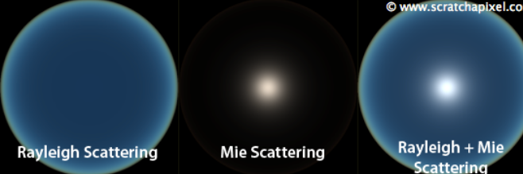

> 优化：Nishita观察到，天空相对于太阳位置和地球中心所定义的轴是对称的。 基于这种观察，本文提出了一种在2D表中烘焙光学深度的技术，您可以使用μ（视图和光方向之间的角度的余弦值）和h（采样点的高度）进行访问。 您将需要为每个散射模型（Rayleigh和Mie）创建一个表。 这些表可以在手工保存到文件中之前进行计算，并在每次运行程序时重新使用。 对光学深度使用预先计算的值，而不是即时进行计算（这需要一些昂贵的指数调用）会大大加快渲染速度。 如果速度对您的应用程序很重要，则此优化可能是您可以实现的第一个优化（有关详细信息，请参见Nishita的论文）。

## 9. Light Shafts


大气效果有时会产生壮观的视觉效果。 `Light shafts `通常使这些效果更加显着。 如果光线自由穿过该体积，则该体积将均匀照明。 但是，如果在场景中放置一些对象，则这些对象**所遮盖的体积区域**将比未遮挡的区域更暗。 `Light shafts `是光束，其对应于被光源（太阳）照亮的体积区域。 

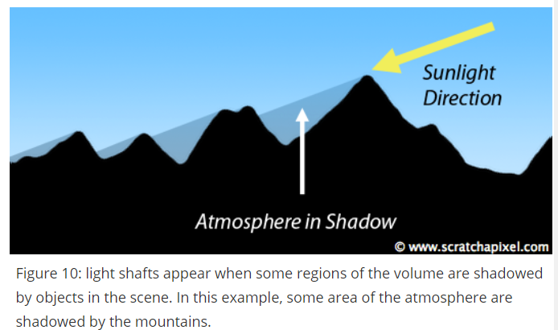


## 10. Simulating Aerial Perspective

计算==空中透视==实际上不需要对我们的代码进行太多更改。 从下图可以看到，山色受蓝色大气的影响。 因为**射线A**的眼睛到地面的距离比**射线B**的短，所以大气对射线A的颜色的影响比对射线B的颜色的影响要小。


首先，应该渲染几何体（地形）的颜色。 然后，应渲染透射率（即不透明度）和大气颜色，并使用以下**alpha混合公式**将这两种颜色合成在一起：

```c++
Ray Color = Object Color * (1 - Transmittance) + Atmosphere Color
```

```c
void renderSkydome(const Vec3f& sunDir, const char *filename) 
{ 
    Atmosphere atmosphere(sunDir); 
    ... 
#if 1 
    // Render fisheye
    ... 
#else 
    // Render from a normal camera
    const unsigned width = 640, height = 480; 
    Vec3f *image = new Vec3f[width * height], *p = image; 
    memset(image, 0x0, sizeof(Vec3f) * width * height); 
    float aspectRatio = width / float(height); 
    float fov = 65; 
    float angle = std::tan(fov * M_PI / 180 * 0.5f); 
    unsigned numPixelSamples = 4; 
    Vec3f orig(0, atmosphere.earthRadius + 1000, 30000); // camera position 
    std::default_random_engine generator; 
    std::uniform_real_distribution distribution(0, 1); // to generate random floats in the range [0:1] 
    for (unsigned y = 0; y < height; ++y) { 
        for (unsigned x = 0; x < width; ++x, ++p) { 
            for (unsigned m = 0; m < numPixelSamples; ++m) { 
                for (unsigned n = 0; n < numPixelSamples; ++n) { 
                    float rayx = (2 * (x + (m + distribution(generator)) / numPixelSamples) / float(width) - 1) * aspectRatio * angle; 
                    float rayy = (1 - (y + (n + distribution(generator)) / numPixelSamples) / float(height) * 2) * angle; 
                    Vec3f dir(rayx, rayy, -1); 
                    normalize(dir); 
                    // Does the ray intersect the planetory body? (the intersection test is against the Earth here
                    // not against the atmosphere). If the ray intersects the Earth body and that the intersection
                    // is ahead of us, then the ray intersects the planet in 2 points, t0 and t1. But we
                    // only want to comupute the atmosphere between t=0 and t=t0 (where the ray hits
                    // the Earth first). If the viewing ray doesn't hit the Earth, or course the ray
                    // is then bounded to the range [0:INF]. In the method computeIncidentLight() we then
                    // compute where this primary ray intersects the atmosphere and we limit the max t range 
                    // of the ray to the point where it leaves the atmosphere.
                    float t0, t1, tMax = kInfinity; 
                    if (raySphereIntersect(orig, dir, atmosphere.earthRadius, t0, t1) && t1 > 0) 
                        tMax = std::max(0.f, t0); 
                    // The *viewing or camera ray* is bounded to the range [0:tMax]
                    *p += atmosphere.computeIncidentLight(orig, dir, 0, tMax); 
                } 
            } 
            *p *= 1.f / (numPixelSamples * numPixelSamples); 
        } 
        fprintf(stderr, "\b\b\b\b%3d%c", (int)(100 * y / (width - 1)), '%'); 
    } 
#endif 
    ... 
} 
```

通过更改“大气层”模型的参数，可以轻松创建外观与地球天空截然不同的天空。 例如，可以想象火星星球的大气，或者创造自己的天空。 ==散射系数和大气层厚度==是可以用来改变其外观的最明显的参数。 `Mie`散射的贡献迅速增加，使大气变成雾蒙蒙的天空，再加上`light shaft`，可以创建富有表现力的图像。


## 关于多重散射

天空颜色是光在大气中向观察者散射一次或多次的结果。 然而，在文献中，强调**单一散射**占主导。 因此，通过忽略多重散射来渲染天空图像仍然会给出非常合理的结果。 文献中的大多数模型都忽略或不提供将**多重散射**考虑在内的技术。 但是，布鲁内顿（Bruneton）认为，地面反射的光量足够大，足以影响天空的颜色。 他提出了一个模型，其中考虑了地面散射的光（在该模型中，地球被假定为完美的球形）。

