# Deep Shadow Maps

***Proceedings of the ACM SIGGRAPH Conference on Computer Graphics 2000***

***Tom Lokovic；Eric Veach***

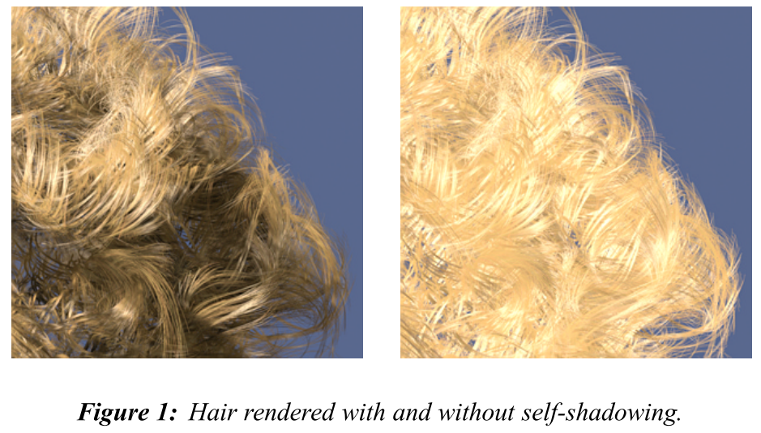

## 1. 介绍

渲染**头发、毛发和烟雾**是很困难的，因为**准确的自阴影**对它们的外观非常重要。传统的阴影贴图需要**非常高的分辨率**来准确地捕捉这种类型的自阴影。在阴影查找过程中还必须访问**更多的深度样本**，以补偿阴影图中的**高频细节**。这在动画中尤其明显，采样不足会导致**闪烁伪影**。

此外，`Shadow Map`不能处理**体积效应**，如**云层**或**烟雾**。传统的方法，如沿着阴影射线**对大气密度进行积分**，是非常低效的。

我们提出一种==新型的阴影图==来解决这些问题，即`Deep Shadow Maps`。`Deep Shadow Maps`不是在每个像素上存储一个单一的深度，而是存储一个`fractional visibility function`，记录通过像素并穿透到每个深度的**近似光量**。==可见度函数==不仅考虑到所遇到的表面和体积元素的**不透明度**，而且还考虑到它们**对像素的过滤区域的覆盖**。这使得`Deep Shadow Maps`能够准确地表现出光线通过密集的毛发和雾气时发生的**部分衰减**。

与`Shadow Maps`相比，`Deep Shadow Maps`有以下优点：

- 它们支持**半透明的表面**和**体积化图元**，如烟雾。
- 对于高质量阴影，它们比同等的阴影贴图**小一个数量级**，而且**访问速度明显加快**。
- 与`Shadow Maps`不同，它们支持`mip-mapping`。当物体在很宽的比例范围内被观察时，这可以极大地**降低查找成本**。

此外，`Deep Shadow Maps`可以有效地支持**高质量的运动模糊阴影**。虽然`Shadow Maps`也可以实现这种效果，但由于需要**较大的滤波器宽度**，使得这种技术在过去相当昂贵。

## 2. Deep Shadow Maps

### 2.1 定义

`Deep Shadow Maps`是一个==由像素组成的矩形阵列`rectangular array`==，其中每个像素都存储了一个**可见度函数**。直观地说，==可见度函数的定义==是：考虑一束从**阴影相机原点**开始，并通过给定像素的**光束**`beam`。一个**给定深度的函数值**是光束（`beam`）的初始功率中**穿透到该深度的剩余部分**。

请注意，**光束**`beam`不一定是方形的——它可以根据任何**所需的像素过滤器**来塑造和加权。**图`3`**给出了几个例子，显示了**可见度函数**如何解释**半透明表面、像素覆盖`pixel coverage`和烟雾**。每个可见度函数开始时的值是`1`，随着遇到**各种类型的阻挡物**，可见度函数随深度的增加而减少。如果所有的光线都被阻挡了，该函数值就会下降到`0`。

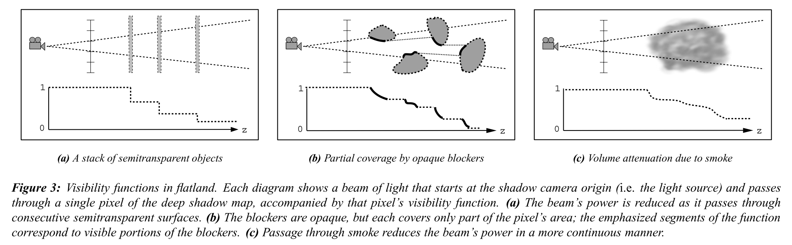

为了使这一定义更加精确，考虑一条从阴影相机原点开始，并通过图像平面上的点$(x,y)$的射线。沿着这条射线**发射的光线**中，有一部分会被**表面**或**体积散射和吸收**所衰减。穿透到给定深度`z`的**光的部分**被称为==透射率== $\tau(x,y,z)$。当我们想考虑在一个固定图像点的透射率时，我们把$\tau$作为**z的函数**。

现在，**每个像素的可见度函数**是通过==过滤==附近的**透射率函数**和在像素中心重新取样得到的。如果我们限制在一个特定的深度`z`上，这就更容易理解了。这个`Z`平面上**每一点的透射率**由$\tau(x,y,z)$给出，每个像素的**可见度函数** $V_{i,j}$ 是通过**过滤这些值**得到的：

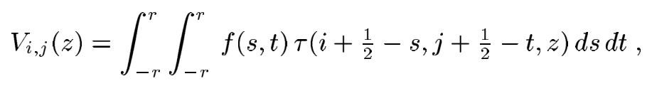

其中，$(i+\frac{1}{2},j+\frac{1}{2})$是**像素中心**，`f`是所需的**带限像素滤波器**（`bandlimiting pixel filter`），`r`是滤波器半径。==这个定义类似于普通的图像滤波，只是它分别适用于每个Z值==。

请注意，**可见度函数**与用于图像合成的**alpha通道**密切相关。**alpha通道**也只为每个像素存储一个单一的值，对应于在平面上**被阻挡的光线**。因此**可见度函数**和**alpha通道**之间的关系可以表示为：

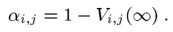

`Deep Shadow Maps`相当于计算出在所有深度的$1-\alpha$的近似值，并将结果存储为**Z的函数**。这样，==每个像素都包含**每个深度的综合衰减和覆盖信息**==。

### 2.2 采样

在这一节中，我们将描述如何使用**标准渲染器**，来生成`Deep Shadow Maps`。我们的策略类似于**普通的图像采样**。为了生成`Deep Shadow Maps`，在**阴影相机的图像平面**上选择一组样本点（例如，在一个抖动的网格上，每个像素有`16`个样本）。对于每个样本点，确定**相应的透射率函数**，它描述了**沿特定主射线的光线衰减**。最后，**每个像素的可见度函数**是通过对附近采样点的透射率函数，进行**加权组合**计算出来的。

 我们首先描述**如何计算一个单一的透射率函数**。给定一个图像点$(x,y)$，我们计算与相应主射线**相交的表面和体积图元**。**表面的交叉点**可以用**射线追踪器**或**扫描转换渲染器**（`scan conversion renderer`）找到，我们假设**体积物体的属性**可以在任何需要的点上计算。然后，**点$(x,y)$的透射率函数**可以表示为**表面透射率函数** $\tau^s$ 和**体积透射率函数** $\tau^v$ 的乘积，如下所述。

**表面透射率是**用沿主射线在$(x,y)$处的所有表面交点来计算的。每个`surface hit`都有一个**深度值** $z_i^s$ 和一个**不透明度** $O_i$。这些都以**通常的方式**合成，从透明度为`1`开始，在每个`surface hit`处乘以$1-O_i$，得到一个**piecewise常数函数** $\tau^s$（见图`4a`）。请注意，每个`surface hit`都会产生**两个具有相同`z`值的顶点**，以便将不连续的`step表现为**一条片状线性曲线**。位于$z=0$和$z=\infin$的 "顶点 "是**隐式表示的**，不属于输出的一部分。

为了计算**体积透射率**，我们沿着射线，以**固定的间隔**，对**大气密度**进行采样。每个体积样本都有一个**深度值** $z_i^v$ 和一个**消光系数** $\kappa_i$。我们在这些样本之间进行**线性插值**，得出==消光函数==$\kappa$（见图`4b`）。然后，穿透到给定深度`z`的光由公式给出：

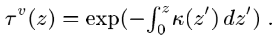

由于这个函数不是**片状线性的**，我们通过计算消光函数**每个顶点的透射率**和**线性内插**来近似它。通过计算**每个线性段的透射率**来实现这一目的，即：

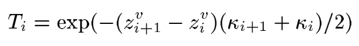

像我们对**表面透明度**所做的那样进行**合成**，只是我们在顶点之间进行插值。这样就得到了**体积透射率函数** $\tau^v$（见图`4c`）。然后，我们将表面和体积部分相乘（见图`4d`）：

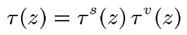

由于这个函数同样不是**片状线性的**，我们在$\tau^s$和$\tau^v$的组合顶点中计算它，并在它们之间进行**线性内插**。

最后，描述如何将**透射率函数**结合起来，以产生像素的**可见度函数** $V_{i,j}$。在每个深度`z`附近的透射率函数就像普通图像样本一样过滤：

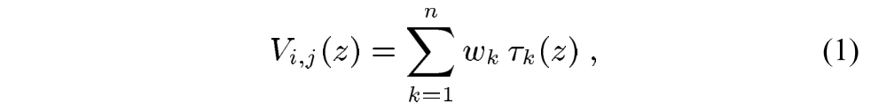

> 以上这步也会进一步加大曲线的顶点数，按照作者的意思，无论当前像素的曲线在深度`z`是否有顶点，但只要采样的这几个领域像素在`z`有顶点，那么都会使用上诉公式，在深度`z`处开辟一个顶点。这样的话，如果我们采样`n`个像素，每个像素曲线的顶点数平均是`m`，那么过滤之后的极端情况（每个像素曲线的顶点所在`z`都没有重合），当前像素的顶点数就会是 $n\times m$。

 

### 2.3 Compression

:one:以这种方式采样的可见度函数**可能有大量的顶点**，这取决于**过滤器半径**和每个阴影像素的**采样数量**。幸运的是，这些函数通常是**相当平滑的**，使它们很容易被压缩。==压缩后的函数==被存储为一个**浮点对数组**，每个都包含一个`Z`值和一个分数可见度 $V$。

非常重要的是，压缩方法要保留**重要特征的Z值**，因为即使是**Z值的小误差**也会导致==自阴影伪影==。该方法还必须适用于**无边界的域** $z\in[0,\infin]$。这意味着，$L_1$和$L_2$**误差度量**是不合适的，因为**可见性误差**是很重要的，即使它们发生在**非常小的Z值范围**内。相反，作者使用**$L_{\infin}$误差度量**（最大误差），并且使用下面描述的**简单贪婪算法**来压缩函数。

给定一个**可见度函数** $V$ 和一个误差容限 $\varepsilon$（见图`5a`），我们的算法会输出一个**新的可见度函数** $V^/$：

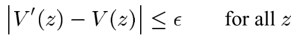

而**$V$的控制点的数量**通常要少得多（图`5d`）。该算法的主要特点是它是**增量的**：它以**递增的Z顺序**逐一读写控制点，并且只需要恒定的状态信息。

:two:其==基本思想==是：在每一步中，算法绘制**尽可能长的线段**，但保持在误差范围内。当前**线段的原点**是固定的，我们只需要选择**线段的方向和长度**。为了简化实现，我们将**输出的`Z`值**限制为**输入`Z`值的一个子集**。

让当前输出段的原点为$(z_i^/,V_i^/)$。在每一步，获得该段的**可允许斜率范围**$[m_{lo},m_{hi}]$：

- 输入函数`V`的每一个**新的控制点** $(z_j,V_j)$ 都会对**当前的斜率范围**施加一个**约束**，迫使线段通过由线段原点到两点 $(z_j,V_{j\pm\varepsilon})$ 定义的**目标窗口**（见图`5b`）。
- **当前的斜率范围**被初始化为$[\infin,-\infin]$，并依次与**每个目标窗口**相交，直到进一步的进展会使其为空（见图`5c`）。具体来说，就是用当前的目标窗口和新的输入点的目标窗口进行求交，如果有重复区域，则以此为当前窗口和又一个新的输入点目标窗口进行比较；如果没有重复区域，则终止这个过程。
- 然后输出**斜率为$(m_{lo}+m_{hi})/2$的线段**，其终点是最后一个控制点。此段的终点成为下一段的原点，
- 整个过程重复进行。

#### 2.4 Lookups

像纹理一样，`Deep Shadow Maps`是通过对像素值的`rectangular array`应用**重建和重采样滤波器**来获取的。在本文的例子中，像素值是通过在一个恒定的深度`z`计算可见度函数而获得的。给定一个要进行查找的点$(x,y,z)$和一个**二维滤波核**`f`，==滤波后的阴影值==由以下公式给出：

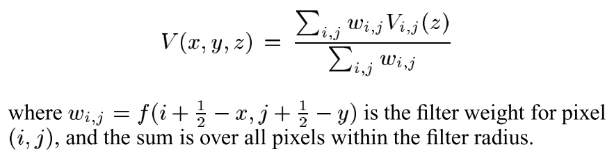

**计算可见度函数需要在其数据点中进行搜索**，以确定哪一段包含**给定的Z值**。这可以使用**线性或二进制搜索**来完成——取决于数据点的数量。在我们的实现中，我们利用了这样一个事实，即许多阴影的查找通常是在附近的z值上进行的，我们在每个像素上存储一个指针，**指向最近访问的段**。在每次查找时，我们从这个位置向前或向后进行线性搜索，以减少平均成本。

## 3. Discussion

与`Shadow Maps`相比，==`Deep Shadow Maps`的主要优势之一是它们支持预过滤==。每个`Deep Shadow Maps`像素总结了许多单独的深度样本，相当于在像素的过滤半径内进行`PCF`。

主要是讨论**此技术的优点和缺点**，详细的见原论文。

## 4. Implementation Issues

### 4.1 Incremental Updates

回顾一下，根据公式`1`，每个可见度函数被定义为`n`个**片状线性透射率函数**的加权平均值。生成这个函数的朴素方法是对所有输入顶点进行**z排序**，并按顺序进行处理，在每个顶点计算贡献函数。不幸的是，这种方法有$O(n^2)$的复杂性。当每个像素使用大量的样本时，这是很低的效率。

相反，我们描述了一种$O(n\log{n})$==扫频算法==，它的每个顶点的更新成本是**不变的**。如果我们首先假设**透射率函数**是的`piece-wise`常数，那么这个算法就更容易理解。在这种情况下，可以有效地计算**输出函数**。在$z=0$时，**加权平均数**很容易计算为：$V(0)=1$。然后以**递增的z顺序**处理所有的输入顶点，这可以通过在堆中存储每个透射函数的下一个顶点，在$O(\log{n})$时间内完成。对于每个顶点，通过简单地减去这个透射函数的旧贡献，并加入其新贡献，来更新**当前的总和 **`V`：

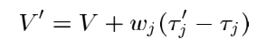

### 4.2 Colored Shadows

基本算法一致，无非是输出是$(z,V_R,V_G,V_B)$。

### 4.3 Mip-mapping

Todo.

## 5. Result

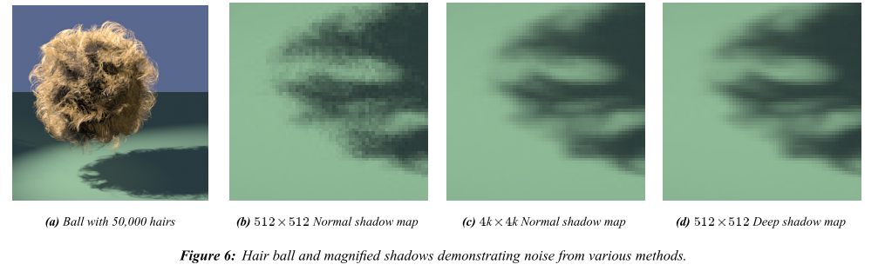

