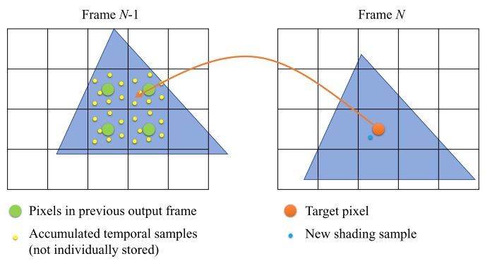

# A Srvey of Temporal Antialiasing Techniques

## 1. 介绍

==时域抗锯齿==（`Temporal Antialiasing`）是一个技术系列，它利用在多个帧中收集的数据进行**空间抗锯齿**。传统上，时间抗锯齿这一名称被用于旨在减少**时间锯齿**（`temporal aliasing`）的技术（也被称为**马车轮效应**）。如今，这个术语有点名不副实，因为它一直被用于**使用时间采样的空间抗混叠**。我们选择遵循这个新的命名惯例，因为它在实时渲染界被广泛接受。

`MSAA`和**延迟渲染**的矛盾，导致了许多后处理抗锯齿技术，但缺乏足够的信息来恢复**真实的像素值**，其中许多技术都存在**时间稳定性问题**。

### 1.1 算法前瞻

`TAA`的关键思想是：==重用以前帧中积累的子像素样本，以有效实现超采样==。上图说明了这个概念性的过程。假设在第`N`帧之前为每个像素收集了一些样本（**黄点**），并已被平均化，作为每个像素的单色值（**绿点**）存储在**历史缓冲区**。对于第`N`帧中的每个像素，我们根据**场景运动**将其**中心位置（橙点）**映射到前一帧`N-1`，并在该位置对历史缓冲区重新取样，以获得**该像素的历史颜色**。通过重新取样，==历史颜色代表该点周围先前积累的样本的平均值==。对于当前的第N帧，我们在一个抖动的位置渲染**一个新的样本（蓝点）**，并将结果与重新采样的历史颜色合并。这就产生了**第N帧的输出像素颜色**，然后成为第`N+1`帧的历史。

上图显示了一个**典型的TAA算法**的组成部分和数据流。**前一帧输出（历史）的时间累积样本**被重新投影（重采样），使用应用程序生成的**运动矢量**，来说明相机和物体运动。由于遮挡、照明或表面内容的变化，获取的历史数据可能是**陈旧的**，与当前帧的数据不一致。使用陈旧的数据而不进行检查会产生**重影和图像滞后的伪影**。==历史验证==是`TAA`算法的一个重要组成部分，因为它可以识别陈旧的历史数据，并**拒绝或纠正这些数据**，以避免给当前帧带来错误。

最近有一种趋势，就是在`TAA`中把输入的渲染样本密度降低到**每像素一个样本以下**，这实际上使它成为一种空间升频解决方案。这种技术通常被称为`temporal upsampling`。

## 2. 时空抗锯齿的简史

todo.

## 3. Accumulating temporal samples

### 3.1 Jittering samples

**大多数TAA实现**在每一帧中为每个像素渲染一个样本。在每一帧中为所有像素生成不同样本的常用方法是：==在摄像机投影矩阵中添加**视口子像素抖动偏移**==。每一帧的抖动偏移通常是从**一个分布良好的样本序列**中提取的，因此每一个像素都被多个帧中产生的样本均匀地覆盖。

由于一个物体可以在任何时候出现或消失，一个像素开始累积的第一个样本可以从序列中的任何索引开始。为了允许**快速收敛**，一个理想的序列因此必须具有这样的特性：**任何长度的子序列都必须在一定程度上均匀地分布在像素域**。某些低差异序列，如`Halton`或`Sobol`，具有这种特性。根据目标质量和有效的累积样本数，序列的长度通常可以被限制在一个相对较小的数字。例如，虚幻引擎4默认使用Halton(2, 3)的`8`个样本序列，Inside使用Halton(2, 3)的`16`个样本序列，SMAA T2x使用Quincunx，Quantum Break使用旋转的网格偏移。当**目标抗锯齿滤波器内核**是除普通盒式滤波器之外的**任何非负数内核**时，可以使用**重要性采样**，来有效地对域进行采样，并避免对单个样本进行明确的加权处理。

**场景中的运动**可能会扰乱一个精心设计的采样模式，使各帧积累的样本发生位移。对于一个**短的循环序列**，某些运动速度可能会导致**多个帧的样本位置在世界空间中聚集**，导致有偏差的结果（模糊或锯齿）。这是运动下`TAA`质量下降的原因之一。通过**随机化抖动模式**，我们可以打破模式中的规律性循环，降低遇到这些情况的风险。

> TAA和Mip Map的一些关系，具体见论文。

由于`TAA`本质上是一个==摊销的采样过程==，它也可以应用于其他需要积分采样的效果，如环境遮蔽、阴影、与次序无关的透明度、反射和漫反射全局照明。为这些效果提供**随机的输入**（最好是**高维低差异序列**），允许`TAA`将它们与**屏幕空间抗锯齿样本**一起积分。例如，`UE4`依靠`TAA`对许多**使用随机采样和抖动的效果**进行==去噪==。

### 3.2 Data reprojection between frames

由于帧之间的场景运动，每个像素需要计算其**在前一帧中的相应位置**，以获取**历史数据**。==反向重投影==被广泛用于执行这一步骤。在场景光栅化过程中，几何体被转换了两次，一次使用前一帧的数据，另一次使用当前帧的数据。然后，每个像素的当前位置和先前位置之间的偏移量被存储到==运动矢量纹理==中（在某些引擎中也称为`velocity`），随后被**TAA算法**用来获得每个目标像素的**重新投影的历史缓冲区坐标**。

 为了节省**帧缓冲区的带宽**，一些引擎只明确地计算和存储**动画和移动物体的运动矢量**，所有受影响的像素都被标记在**模版纹理**中。对于没有被标记的像素，它们在前一帧中的位置可以在`TAA pass`中通过使用**深度缓冲器**重建每个像素的**三维裁剪空间坐标**来确定，并使用**前一帧和当前帧的摄像机矩阵**将其投射到前一帧：
$$
p_{n-1}=M_{n-1}M_{n}^{-1}p_n
$$
其中，$p_n=(\frac{2x}{w}-1,\frac{2y}{h}-1.z.1)$是**当前帧像素**在同质坐标中的**三维裁剪空间位置**，$M_{n-1}$和$M_n$分别是先前和当前帧的**视图投影矩阵**（VP矩阵）。所得到的位置是在进行**透视除法**之后得到的。`UE4`默认使用这种方法。

**==历史缓冲区中的重投影坐标==**往往包含一个**子像素的偏移**，源帧和目标帧之间不再有**$1:1$的像素映射**。为了获得每个像素的历史记录，需要一个重采样步骤，这样就不会引入**失真伪影**。通常，硬件加速的双线性纹理获取或双三次元纹理过滤被用于这一目的。

**由于运动矢量不能抗锯齿**，使用运动矢量的重投影可能会重新引入**锯齿伪影**。避免这种伪影的一个简单方法是：在对**运动向量**采样时，对前景物体进行扩张，这样所有被边缘触及的边界像素都会和这些物体一起被重新投影。通常情况下，使用一个小的`4-tap`扩张窗口。

### 3.3 Sample accumulation

存储每个像素在以前帧中积累的所有样本是不现实的。在大多数`TAA`实现中，每个像素的累积样本被**平均化**，并存储为一种颜色，它既是当前帧的输出，又是下一帧的历史输入。这个迭代累积的过程可以写成：
$$
f_n(p)=\alpha \cdot s_n(p)+(1-\alpha)\cdot f_{n-1}(\pi(p))
$$
其中，$\alpha$是混合因子，$s_n(p)$是当前帧在`p`点的渲染颜色，$f_{n-1}(\pi(p))$是**前一帧的重投影输出**（历史颜色），使用**重投影算子**$\pi(\cdot)$和**重采样**。**混合因子**$\alpha$平衡了新样本和历史颜色的相对贡献。目前大多数`TAA`的实现都使用==固定的α==，这实际上导致了**一个递归的指数平滑过滤**：
$$
f_n(p)=\alpha \cdot(s_n(p)+(1-\alpha)s_{n-1}(p)+(1-\alpha)^2s_{n-2}(p)+\cdots)
$$
**这个方程逐步赋予较早的样本较低的权重**，在某些情况下，这是一个理想的属性，因为较早的样本更有可能因为**场景的变化**而变得陈旧。请注意，从减少方差的角度来看，这是次优的。当所有样本在总和中的权重相同时，就能实现**最佳的方差减少**。当使用==固定的α==时，情况并非如此，这可能会影响到低和高样本数的结果质量。

下图显示了如果使用**统一的权重**，在方差减少的匹配程度下，$\alpha$和**积累的有效样本数**之间的关系。例如，在常用的$α=0.1$的情况下，**5帧累积的结果相当于每个像素2.2个样本**，`10`帧相当于`5.1`个样本，而`15`帧相当于`9.8`个样本。在稳定状态下，在累积了**无限多的输入帧**时，$α=0.1$的结果在最佳状态下是`19`个有效样本。

作为对样本加权的替代方法，我们可以在**历史缓冲区的α通道**中存储一个**每个像素的累积样本数**$N_t(p)$。每当像素被刷新时，这个值就被初始化为`1`，并且每一帧都被增加。通过设置 $α=1/N_t (p)$，**公式2**给所有历史样本**分配相同的权重**。然后，它以**额外的存储通道**为代价实现**最佳收敛率**。这种方法被用于一些需要在排除后快速收敛的应用中，特别是当**目标帧率**较低时。

当`α`较小时，结果容易受到**重采样误差或时间滞后**的影响。为了避免这些假象，α通常被钳制在一个下限，以确保**最小的历史刷新量**。各大厂商的方法具体见论文。

#### Sample accumulation in HDR color space

在大多数渲染引擎中，**物理校正的后期处理效果**是在**线性HDR色彩空间**中实现的。最好是将TAA放在所有这些效果之前，以避免伪影被诸如`bloom`或`lens flare`的效果所夸大。这就要求`TAA`在**线性HDR空间**中获取输入样本。另一方面，由于**色调映射**通常是**非线性的**，过滤操作（如抗锯齿）最好在**色调映射后的空间**中应用，以便在显示时产生**正确的边缘梯度**。解决这个冲突的==一个变通方法==是：在应用`TAA`之前对样本进行`tonemap`，并将`tonemap`输出反转为**线性HDR空间**，以供给后期处理链的其余部分。在实践中，这通常是通过一个**可倒置的色调映射算子**来实现的，比如**Reinhard算子**``1/(1+x)``，它可以作为最终色调映射函数的替代。

为了避免**色调映射时的颜色不饱和**，卡里斯在将新的样本积累到历史中时，使用了一个**亮度适应性的权重**：
$$
w(c)=\frac{1}{1+L(c)}
$$
其中，$L(c)$是颜色`c`的**luma通道**，$w(c)$是在使用**公式2**混合当前帧样本和历史颜色时作为**双边权重**应用。 这有效地映射了输入样本，可以避免在输出中产生**极高能量的颜色像素**，被称为 "萤火虫（`fireflies`）"。

## 4. Validating history data

从上一帧重新投射的**历史像素数据**不应该在没有检查的情况下重复使用。它们可能由于**场景遮挡的变化**而无效，或者由于**光照和渲染的变化**而变质。如果不能正确处理这些情况，就会导致==强烈的时间伪影==，如重影`ghosting`。在本节中，我们将回顾**常用的验证历史数据的技术**。

### 4.1 History rejection

处理**陈旧或无效数据**的一个直接方法是：在检测到错误时==拒绝数据==。==拒绝==是通过在**公式2**中将`α`设置为`1`来完成的。==软刷新==也可以通过将``α``限制在一个**下限阈值**，允许对累积的历史颜色进行**比常规更快的更新**。一般来说，有两类来源可以用来确定==历史的可信度==：

- 几何数据（深度、法线、物体ID和运动矢量）
- 颜色数据

==几何数据==通常用于识别由于**遮挡变化**而从不匹配的表面重新投影出来的**无效历史数据**。下图显示了一个例子。通过比较重新投射和以前帧的深度，加上一个**小的误差容限**，我们可以识别出像 $p_1$这样的被排除的像素，避免在那里重复使用历史数据。为了实现**更稳健的匹配**，其他几何信息，如表面法线和物体ID，也可以作为一致性的额外指标。在《孤岛惊魂2》的**TAA实现**中，除了基于深度的一致性检查外，Sousa还提出：**在运动速度增加时增加α**。

请注意，尽管几何信息往往与渲染颜色密切相关，但它只是渲染输入的一部分，像照明、阴影和反射等效果中的渲染变化不能用**几何信息**来检测。**几何数据的不可过滤性**可能会将**不连续性**重新引入平滑的、抗锯齿的边缘。因此，==仅仅依靠几何信息来拒绝历史，往往是一个脆弱的解决方案==。

比较历史缓冲区$f_{n-1}$和当前帧之间的颜色，可以为**历史数据的有效性**提供一个更直接的指标。这对于检测**历史数据**是否因**可见的光照或阴影变化**而过时，或因**重采样误差和不正确的运动矢量**而失真，是很有用的。由于当前帧样本$s_n$预计会有**锯齿**，直接比较$f_{n-1}(p)$和$s_n(p)$会使我们对**误差的估计**有偏差，这意味着它在空间和时间上都可能是不稳定的。Yang等人观察到了这一点，并建议对**误差估计**进行过滤：
$$
\epsilon = B_3* (f_{n-1}-s_n)(p)
$$
其中，$B_3$是半径为`3`的盒式滤波器。然后，**误差估计被用来设置``α``的下限**，以强制执行**最小刷新量**。Herzog等人计算**重建颜色的时间梯度**，并对梯度进行**空间和时间上的平滑**以提高稳定性。Malan计算**当前帧样本中邻域的颜色范围**（边界框），如果历史颜色在边界框内或接近边界框，则保留**历史颜色**。该技术还根据颜色边界框的范围对`α`进行偏置：一个小的边界框（平坦的颜色）会增加``α``以避免**可见的重影**，而一个大的边界框（尖锐的不连续）会减少``α``以增加累积样本并**抑制时间伪影**。

==可靠地检测时间变化==的一个方法是：比较在不同的帧中，在完全相同的表面位置的原始样本。在Killzone: Shadow Fall中，在**HRAA技术**之后，使用了一个==交替的奇偶帧采样模式==，这样`N`帧和`N-2`帧的采样位置相匹配。因此，在没有运动的情况下，这些帧中的样本可以直接比较。对于具有较高渲染率预算的光线追踪应用，Schied提出将**以前的渲染样本子集**向前投射到当前帧，并在**完全相同的位置**上对新的样本进行渲染处理，以可靠地计算渲染变化（时间梯度）；然后用**联合双边滤波器**对稀疏计算的梯度进行放大，并用于控制`α`，以**保持历史始终是最新的**。

### 4.2 History rectification

**拒绝陈旧或无效的历史数据**可以有效地重设**每个像素的积分过程**，并可能导致**时间伪影的增加**。==历史修正==通过使**原本被拒绝的数据**与新的样本更加一致来改善这一问题。如同目前大多数TAA的实现一样，**修正后的历史数据会与当前帧相混合**，导致视觉上更容易接受的结果。

**大多数历史修正算法**假定当前帧样本提供了**每个像素所覆盖颜色的范围（或分布）的可靠信息**。由于当前帧的样本通常是**稀疏的和锯齿的**，所以每个像素的**3×3或更大的邻域**被考虑用来提取颜色信息（下图`a`）——这是假设**更多的邻域样本**提供了对**局部颜色变化分布**的更好估计。色彩空间中邻域样本的`convex hull`代表了我们对**中心像素周围颜色的预期范围**。如果历史颜色落在凸壳内，它就被认为与当前帧数据一致，可以安全地被重新使用。如果它落在`convex hull`之外，我们需要对它进行==修正==，使其与当前帧数据一致。我们通过将历史颜色与当前帧的样本颜色相连接，并将线段与`convex hull`夹住。**交叉点是对历史的最佳估计**。

在实践中，计算每个像素的`convex hull`和交点可能是非常昂贵的。一个常见的近似方法是使用**最小/最大滤波器**计算==颜色的轴对齐边界盒==（`AABB`），然后将历史颜色夹在`AABB`中（上图`c`）。这与Malan的拒绝技术有关，同样的`AABB`被用来接受或拒绝历史数据。虽然`AABB`的计算很简单，但近似值以牺牲时间稳定性为代价，**增加了重影假象的可能性**。Karis通过在**YCoCg空间**中剪切来**进一步减少重影**。与RGB相比，YCoCg空间通常会导致更严格的AABB。

请注意，对**非常暗或非常亮的离群点**进行**最小/最大滤波**会使**边界盒的体积膨胀**，导致接受本应被修正的历史数据。==方差裁剪通==过使用**局部颜色的平均值和标准差**来处理异常值，用于修正**颜色范围的中心和大小**：
$$
C_{min}=\mu-\gamma \sigma,\\
C_{max}=\mu+\gamma \sigma
$$
 

## 5. Temporal upsampling

==时间上采样==是`TAA`的自然延伸，通过进一步**降低有效采样率**，从每像素一个样本到每像素少于一个样本。这通常是像素工作量大的应用所需要的，而且在**以高分辨率显示器为目标的游戏**中也越来越流行。==时间上采样==本质上是积累**低分辨率的着色结果**，并产生**高分辨率的图像**，通常比纯空间上采样结果包含更多的细节。尽管它与`TAA`共享许多基本构件，如**样本抖动、重投影和历史验证技术**，但**累积步骤**需要特殊处理以达到**最佳图像质量**。在这一节中，我们提出了==一个涵盖现有各种上采样技术的一般框架==，并讨论了一些**改进策略**。

### 5.1 Scaling-aware sample accumulation

**时间上采样**与`TAA`不同的是，**输入样本**被累积到**一个像素密度更高的缓冲区**。由于输入样本和输出像素之间不再有$1:1$的映射关系，我们首先将输入样本升格为输出分辨率，使用：
$$
\overline{s}_n(p)=\frac{1}{w(p)}\sum_{i\in \Omega(p)}\delta(o_i)s_i
$$
其中，$\Omega(p)$是输出像素`p`的**固定大小的邻域内的输入样本集合**，$s_i$是$\Omega(p)$中的第`i`个样本，$o_i$是$s_i$和$p$之间的距离，$\delta$是为目标像素选择的**重建滤波器核**。归一化因子$w(p)$是权重之和：
$$
w(p)=\sum_{i\in\Omega(p)}\delta(o_i)
$$
从本质上讲，**公式7**计算的是属于目标像素的、重建核δ下的、输入样本的加权和。==重建核δ==可以是一个高斯核，或其他具有比输入样本网格大小更宽支持的过滤核。$\Omega(p)$这个固定大小的邻域被选择为**与滤波器大小相匹配**。

虽然可以将**放大的输入样本**$\overline{s}_n(p)$直接插入**公式2**进行累加，但这样做将不会产生具有所需清晰度的输出图像。根据**升频的性质**，数值$\overline{s}_n(p)$的集合包含了**混合质量的输出样本**，其中一些与输入样本相近的样本得到了这些样本的直接拷贝（==质量较高==），而其他的则是从较远的样本中插值出来的（==质量较低==）。在公平的每帧抖动模式下，**一个输出像素应该每隔几帧就收到一个更高质量的样本**。在所有像素中产生一致的高质量的关键是：根据为每个输出像素`p`定义的==质量置信度系数==β(p)，有选择地将输入样本混入历史。为此，==递归累积步骤==（**公式2**）可以改写为：
$$
f_n(p)=\alpha \cdot \beta(p)\cdot s_n(p)+(1-\alpha\cdot \beta(p))\cdot f_{n-1}(\pi(p))
$$
置信度系数β(p)是一个[0,1]的值，旨在当$\overline{s}_n(p)$的质量预期较低时，偏向于**保留历史**。虚幻引擎4使用以下公式来计算**置信度**：
$$
\beta(p)=\max_{i\in\Omega(p)} { \delta(o_i)}
$$
作为一个例子，考虑这样的特殊情况：输入样本在每个维度上都是**2倍的低分辨率**，而**内核δ(p)**是一个目标像素大小的`box`。在输入样本和输出像素之间有一个固定的$1:4$的映射。由于样本在源像素内抖动，在每一帧中，**目标2×2像素块的四个像素中只有一个有效样本落入其覆盖区域**。在该像素中，**β(p)**被评估为`1`，并且样本被累积到$f_n(p)$中。其他三个像素的**β(p)值**都为`0`，历史值保持不变。请注意，这个方案支持任意的升采样率。下图展示了不同升采样率的例子：

### 5.2 Miscellaneous improvements

**时间上采样中的历史验证**与`TAA`中的历史验证有相同的挑战，但它更难，因为相对于输出像素而言，==更稀疏的输入样本==提供了关于真实内容的==更不可靠的信息==。当输入样本稀疏时，历史修正的质量会受到影响，这最终会导致在重影、时间不稳定和模糊伪影之间进行**更坏的权衡**。

在**时间上采样**过程中，在输入图像中，**用于计算颜色边界框的3×3邻域**现在覆盖了目标图像中超过3×3像素的区域，导致高估色域的机会增加。为了避免这种情况，`UE4`计算了一个基于子像素偏移的缩小的邻域，用于计算**颜色边界框**。**远离目标像素中心的样本**不包括在边界框中，从而减少了**重影伪像**。同样地，Andersson等人建议将每个历史像素`clamp`在其紧邻的2×2样本中.

为了提高**时间上采样的稳定性和清晰度**，Quantum Break选择根据**像素的运动速度**自适应地`soft`颜色边界框。在接近静止的物体上，鼓励**积累样本**，而不是`clamp`。这将导致在静态拍摄中获得**更稳定和更清晰的图像**，但代价是在动态照明或动画纹理上可能出现重。

### 5.3 Checkerboard rendering

==棋盘式渲染==（`CBR`）是一种特殊类型的==时间上采样技术==。在PlayStation 4 Pro和XBox One X等游戏机平台将其作为目标4K分辨率的工具之后，它开始流行起来。与其他依靠**随机抖动的样本**来覆盖目标像素网格的**时间上采样技术**不同，`CBR`在一帧中确定地对每个2×2像素四边形的**对角线上的两个相对的像素**进行着色（因此被称为 "==棋盘=="），并在下一帧中翻转该模式，来对**四边形的其他两个像素**进行着色。在棋盘模式中渲染样本的技术可以是：$45^o$旋转的帧缓冲器，硬件加速的$2×MSAA$，可编程的样本位置。这类技术通常是利用依赖于硬件的方式，与本文的主题正交。

由于**每一帧都只渲染一半的目标像素**，所以需要**时间上的数据重用**，以便在每一帧中生成完整的图像。常见的`TAA`和**时间上采样**技术，如重投影、样本积累和`history clamp`，直接适用于`CBR`。新样本在棋盘模式中的分布也在本质上比早期的**时间上采样**，如`temporal interlaced rendering`，对**插值**或**邻域钳制步骤**更友好。

像**时间上采样**一样，`CBR`技术通常在一个单一`pass`中解决`upscaling`和抗锯齿。一个特殊的后处理通道可以用来避免在最终渲染中产生**可见的锯齿状图案**。与时间上采样不同，`CBR`假设了一个固定的$1:2$的**输入/输出像素比**。因此，它有时会与传统的分辨率缩放技术结合起来，以支持不同的工作负载。

## 6. Challenges

**摊分多帧的采样和渲染**有时会导致图像质量的缺陷。在这一节中，我们回顾了常见的问题、其原因和现有的解决方案。

### 6.1 Blurriness

有两个来源可以解释`TAA`结果的`soft`外观：当历史被重新投射时，重新取样引入的误差，以及历史修正引入的误差，其中**历史颜色中累积的细节**被裁剪或`clamp`。

#### Resampling blur

当运动导致目标像素重新投射到前一帧中的分数像素位置时，就会发生==重采样==。使用**硬件加速的双线性纹理滤波**可以有效地插值历史缓冲区中四个最近的像素的颜色值，围绕重新投影的像素中心。然而，双线性滤波器==软化（`soft`）==了重采样的图像，因为它们在保留**高频内容**方面表现不佳。由于历史数据在每一帧中都被重新投射，**滤波误差不断累积**，很快就会造成令人讨厌的**模糊外观**。这种模糊可以通过统计分析来量化。这种分析导致了**避免过度模糊的策略**，即根据**运动速度**将`α`夹紧到一个**自适应的较低阈值**，并使用**更高分辨率的历史缓冲区**。在不需要常规采样输出的应用中（例如**光线追踪**），可以使用**前向重投影**来避免重采样，同时使用明确的`hole filling steps.`。

> 除了**限制α**和**提高历史分辨率**外，==高级重采样滤波器==也常用来减少**重投影的模糊**。Drobot [Dro14]使用Back and Forth Error Compensation and Correction (BFECC) [DL03, NABW12]来大大减少双线性采样的误差。像Catmull-Rom[CR74]这样的立方插值样条也通常被用作TAA的再采样函数，以避免模糊累积。例如，虚幻引擎4中的TAA[Kar14, Epi15]和SMAA T2x[Jim16]都使用了Catmull-Rom插值器的近似优化版本，只有五次双线性纹理取样。如图8所示，BFECC和Catmull-Rom在对累积的历史进行重复重采样100帧后，都比双线性结果有明显的改进。最近，Nehab和Hoppe[NH14]研究了广义的滤波器核，显示出比传统卷积滤波器更出色的重采样质量。这类最新的滤波器[SN15]在100帧重采样后产生了几乎视觉上无损的结果（图8，最后一栏是使用他们的立方准插值器的结果）。广义的滤波器被实现为传统的线性、二次或三次重采样滤波器，然后是线性递归滤波通道，这可以在GPU上使用并行递归滤波有效实现[NM16]

#### History rectification-induced blur

==历史修正技术==是基于这样的假设：当前帧**每个像素的领域样本**包含该像素所覆盖的**整个表面颜色范围**。由于当前帧样本是稀疏的（每个像素≤1个样本），我们希望**几何或渲染中的任何细小特征**至少被它所接触**3×3邻域中的一个像素所覆盖**。不幸的是，对于**高度详细的内容**，这个假设经常被违反。下图`a`展示了一种常见的情况，即在某些帧的输入中缺少一条亚像素宽的细线，导致被低估的颜色边界框从`history`上裁剪或`clamp`了线条颜色。这种情况通常发生在**高度详细的场景**中，==小而尖锐的特征在输出中被平滑掉==（下图`b-d`）。由于==历史修正==在大多数**现代TAA实现**中是必不可少的，而且必须进行调整以避免更严重的伪影，如重影，所以有时会牺牲细节。为了恢复一些锐利的细节外观，一些渲染器对**TAA的输出结果**应用了**一个锐化滤波器**，比如离散拉普拉斯滤波器。==自适应锐化滤波器==可以用来避免在锐化中产生**失调的颜色**。

### 6.2 hosting and temporal lag

==重影（`Ghosting`）==是屏幕空间**时间数据重用技术**中常见的一种伪影。`Ghosting`通常出现在由移动物体引起的、新的排除区域，**无效的历史数据**没有被**历史拒绝或矫正技术**从当前帧中完全删除。然后，该区域可能会出现**移动物体的第二份拷贝**，并可能在随后的帧中被延续。除了剔除之外，**不正确的运动矢量**也会导致运动物体的错误形状中**无效的重投历史**。产生不正确的运动矢量的常见效果是==透明度、粒子和反射==，这些都是已知的对`TAA`有挑战性的情况。当没有运动，但由于快速变化的渲染（如镜面高光或动画阴影），历史数据是陈旧的，结果可能显示为**模糊**或混合在多个帧中。这通常被称为==时间上的滞后==（`temporal lag`）。

如果**历史修正机制**有效，**重影和时间滞后**都可以避免。然而，在**高对比度的物体边界**附近，**历史修正技术**（如历史裁剪或夹紧）的效果往往会受到影响。下图显示了游戏中的一个常见情况，**当前帧的输入样本**包含密集的高对比度边缘（`b`），这导致该区域出现**大的颜色边界框**（`c`）。**大的边界框**不能有效地代表像素颜色的色域，从而使**无效的历史颜色**在剪裁或钳制过程中通过。

为了避免**重影伪影**，`UE4`中的`TAA`在半透明材料上添加了一个`responsive AA`标志，该标志被写入一个**模板缓冲区**，并被**TAA通道**用来增加`α`，允许更快地刷新**错误的历史**。`INSIDE`中使用的TAA技术，随着运动速度的增加，TAA输出过渡到运动模糊的像素，以隐藏一些**重影伪像**。

### 6.3 Temporal instability

`TAA`的主要目标之一是：**减少异化帧的时间不稳定性**，例如**闪烁或闪亮的假象**。由于每一帧都有不同的抖动偏移量被应用到视口中，因此即使摄像机保持静止，为一个像素计算的渲染样本每一帧都会发生变化。通常情况下，该差异被**样本积累步骤**吸收，以提供**正确的过滤像素**。然而，由于抖动引起的样本颜色变化，历史拒绝或修正算法可能会错误地使历史无效或钳制。下图显示了这样一个例子，==低频摩尔纹==导致一些像素附近的色域完全改变，迫使**历史颜色**被**剪切或钳制**到每一帧的新样本值，使积累失效。禁用或`spft`历史修正可以避免闪烁（第三行），但可能会使输出出现**重影或时间滞后**。事实上，==避免重影和闪烁==往往是设计历史拒绝或修正算法的**矛盾目标**。

导致时间不稳定的基本问题与前面介绍的问题的原因相似：**欠采样的输入**没有携带足够的信息，来允许**可靠地检测无效或陈旧的历史**。检测中的`False positives`（有效的历史被当作无效的）导致**模糊和时间不稳定**，而`false negatives`（无效的历史被当作有效的）导致**重影和时间滞后**。在时间上采样算法中，**伪影往往比普通的TAA更明显**，因为输入的欠采样更严重。在第4.1节中讨论的交替采样[Dro14]和选择性重影[SPD18]技术旨在缓解这一问题，但它们与前面讨论的**主流TAA技术**不兼容。

有几种启发式算法可以在某些情况下减少**时间上的不稳定性**。对前一帧和当前帧之间的运动一致性的测试可以提供额外的输入，使`clamp`偏向于保留更多的历史，但前提是已知阴影是稳定的。Karis在历史接近夹紧时减少混合系数α，以`soft`钳制发生后的时间变化。Jimenez对该方法进行了扩展，提出跟踪帧之间的**空间对比度变化**作为闪烁伪影的指标，并在检测到闪烁时增加收敛时间。

### 6.4 Undersampling artifacts

由于TAA是通过在一段时间内累积采样来减少锯齿，所以在**累积样本数较少的地方**可能存在**明显的锯齿**。这种情况通常出现在摄像机切分时，在切分后的前几帧通常会出现过于尖锐和混杂的现象。新排除的区域或有快速阴影变化的区域也很容易包含欠采样伪影。

缓解这种欠采样伪影的常用技术是**==增加这些区域的空间重用==**。一些TAA的实现在新的样本上使用低通滤波器，以减少锯齿伪影和新的渲染像素的**过度锐利的外观**，这与收敛的结果不同。Todo.

## 7. Performance

Todo.

