# Checkerboard Rendering for Real-Time Upscaling on Intel Integrated Graphics

在本白皮书中，介绍了实时`upsampling`的棋盘式渲染（`CBR`）。本文提供了一个参考实现的源代码。

## 1. 介绍

==棋盘式渲染==是一种能够产生**全分辨率像素**的技术，它大大减少了渲染消耗，对视觉质量的影响最小。**棋盘式渲染**与**现代抗锯齿的后处理方法**完全兼容，它可以在前向和延迟渲染管道中实现。

### 动机

鉴于最近在索尼`PS4 Pro`上采用了**棋盘式渲染**来提升分辨率，作者认为在**英特尔集成显卡**上探索这种技术会很有意义。特别是，作者想开发一种解决方案，以解决**为更高的原始目标分辨率而设计的内容**在集成GPU上可能无法执行的问题。

本文的第二个动机是创建一个简单易行的、非侵入性的、独立于硬件的实现，使**集成和独立GPU**在各种分辨率下都受益。

## 2. 之前的工作

许多技术集中在减少**几何层面的细节**。然而，我们的目标是：==在应用了几何`LOD`技术后，减少着色量==。为了实现这一目标，我们采用了一种叫做==棋盘式渲染（CBR）==的技术，其他开发者在面对类似的挑战时也一直在使用这种技术。我们的目标与之前`CBR`工作的目标有一个微妙的区别，那就是之前在索尼`PS4 Pro`上的工作动机主要是围绕着从`1080p`到`4K`显示器的升级，以及在**资产和渲染架构**上考虑中端到高端。在这里，则是`540P`到`1080P`。在开始讨论**CBR算法的细节**之前，我们将讨论一些**早期的动态分辨率渲染**（`DRR`）的工作，它可以与`CBR`相结合。

### Dynamic Resolution Rendering

Doug Binks提出了一个解决`upscaling`问题的方案。这项技术可以根据**GPU的工作量**动态调整**分辨率**，而且效果很好。然而，正如文章中所指出的，它只是按照**渲染目标的分辨率**进行渲染。在这种情况下，所有常见的**上采样伪影**都会出现。

//Todo

## 3. 技术前瞻

回顾一下传统`upscaling`的基本知识。我们首先回顾一下在**标准的全分辨率渲染**中，==像素覆盖率和像素颜色是如何关联的==。

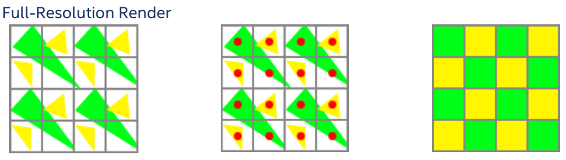

在图`1`中，一个像素的颜色是基于**像素的覆盖率测试结果**。左边的图片展示了要栅格化的三角形，而中间的图片显示了每个像素的样本覆盖位置。最后一张图片，在右边，包含了覆盖率测试的结果；

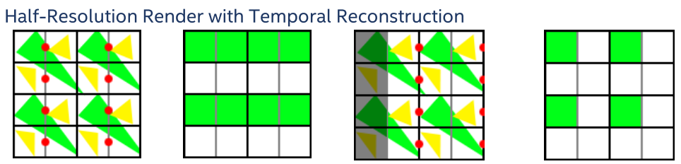

为了在保持分辨率降低的同时，对更多的像素进行着色，引入了利用**以前帧的着色数据**的时间技术。利用这些技术，每一帧视口抖动，交替渲染；然后从渲染目标`N-1`和`N`重建全分辨率渲染目标。如上图3所示，前两幅图像代表了第`N-1`帧的渲染。第三张图片将视口抖动到`N`帧的右边。注意，像素覆盖位置错过了黄色和绿色的三角形。右边的图像显示，**全分辨率渲染目标**没有被准确重建。

在一个理想的情况下，以**降低的分辨率**进行渲染，并对视口进行抖动，将**样本覆盖位置**放在与全分辨率对应的确切位置上。幸运的是，`2x MSAA`标准的样本覆盖位置就在这些位置。

可以对`2x MSAA`**样本覆盖位置**进行时间上的抖动，使其与**全分辨率渲染的每个覆盖位置**相重叠（第一个和最后一个像素列除外）。左边的图像显示了`2x MSAA`表面的两个样本位置。在下一张图片中，我们在**四分之一大小的图片**中向右移动了**半个像素**，这在**最终渲染目标**中是一个**完整的像素**。

## 4. 如何修改渲染器以支持CBR

在这一节中，我们将描述对两个简单的典型管道的修改，一个是正向的，一个是延迟的，并展示`CBR`如何在两种情况下使用。

### 前向

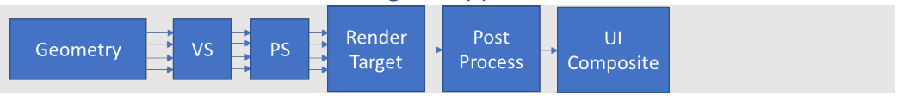

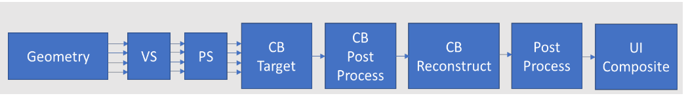

对前向渲染管线的修改是直接的，我们提供了完整的示例代码。==传统的前向渲染管道==被修改为在`2`个**四分之一分辨率的棋盘式渲染目标**之间交替进行。棋盘的结果以及`CBR`的最后阶段都有可选的后处理，在那里**最终的全尺寸渲染目标**被重建。

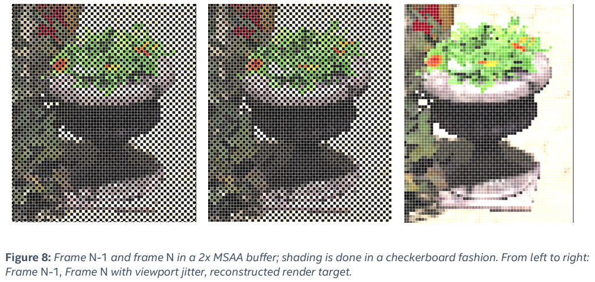

我们在此概述了修改后的前向渲染管道的步骤：

1. 创建两个**颜色和深度缓冲区**（用于`N-1`和` N `帧），它们是所需分辨率的$1/4$（宽度/2，高度/2）。这些缓冲区应该被设置为使用`2x MSAA`，每个样本有一个`shade`（而不是每个像素）。 
   - 为了获得**更高的纹理分辨率**，需要对纹理应用`MIP LOD`偏差。
2. 渲染帧`N-1`。
3. 渲染N帧，视口在四分之一分辨率缓冲区中**向右抖动**一个全分辨率像素。
4. 运行**棋盘重建着色器**，使用两个帧来重建一个**全分辨率的渲染目标**。

### 延迟

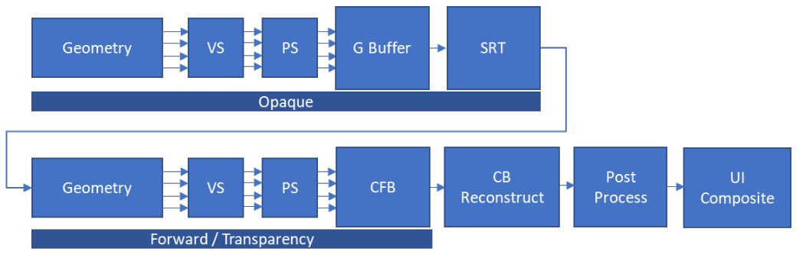

**延迟管道的CBR**比正向渲染的情况更复杂。在前向中，不透明和透明的物体在渲染时都会被分类和着色。将它们渲染到棋盘式缓冲区只需要改变它们的渲染目标。在这里，我们总结了一个延迟渲染管道，然后描述了为支持`CBR`而进行的修改。

基本的延迟过程回顾一下：

- 材质信息被渲染到**独立的渲染目标**上，通常被称为`G-Buffer`。在我们的例子中，我们有一个`G-Buffer`，由三个渲染目标组成：反照率、法线和镜面。
- 然后，G-Buffer被用于解析步骤。G-buffer解析使用渲染目标（albedo, normal, specular）来确定像素的渲染颜色，并将结果写入渲染目标。
- 最后，更适合前向渲染的对象（例如，透明对象）会直接在渲染目标上着色。

对于我们的==棋盘式延迟管道==，所做的第一个修改是在第一阶段。`G-Buffer`的渲染目标被创建为**棋盘式缓冲区**：**最终分辨率为四分之一**，启用`2x MSAA`，如下图所示。

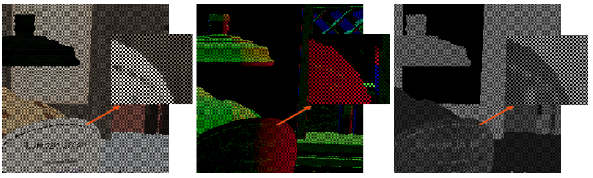

在第`1`阶段，**棋盘式缓冲区**被渲染。在第`2`阶段，**G-Buffer解析着色器**必须是`2x MSAA` aware，并且必须输出到每个像素持有两个`shade`的渲染目标。在我们的技术中，我们创建了一个**非MSAA渲染目标**，**其高度与棋盘目标相同，但宽度为两倍**。这使得我们可以对每个样本位置进行着色，并将其存储在一个独特的`texel`上。我们把这种纹理称为`Shade Resolve Target (SRT)`，并在下图中展示了一个例子。

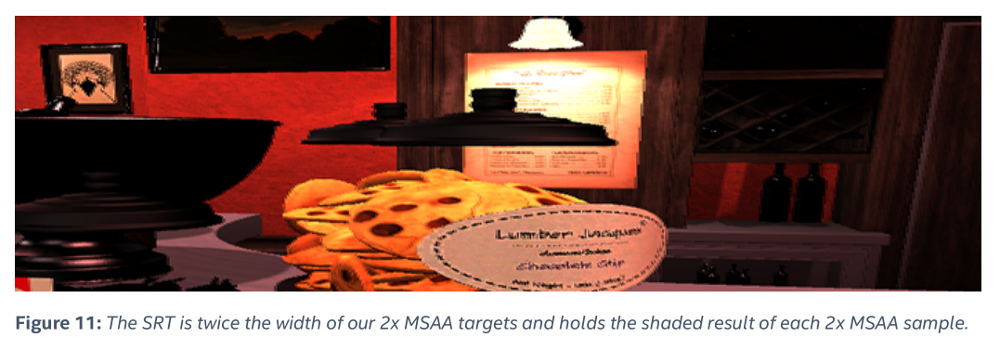

第`3`阶段也必须修改，因为传统上，**前向着色步骤**可以直接混合到**已解决的G-Buffer目标**。然而，有`2`个问题使我们无法这样做：

1. 我们的`SRT`是所需宽度的`2`倍

2. 我们想利用`CBR`对透明度进行着色，而`SRT`不是一个`MSAA`目标。我们通过将**前向对象**渲染到一个单独的`2x MSAA` 缓冲区来解决这个问题，我们称之为==棋盘式前向缓冲区==（`CFB`），如图下所示。

   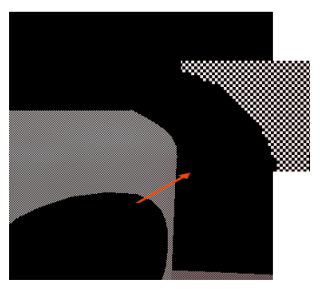

我们需要一个**最后的棋盘式重建步骤**，从第`N-1`帧和第`N`帧读取`SRT`和`CFB`缓冲区，并使用它们的`shade`来重建一个**全分辨率的渲染目标**（如下图所示）。

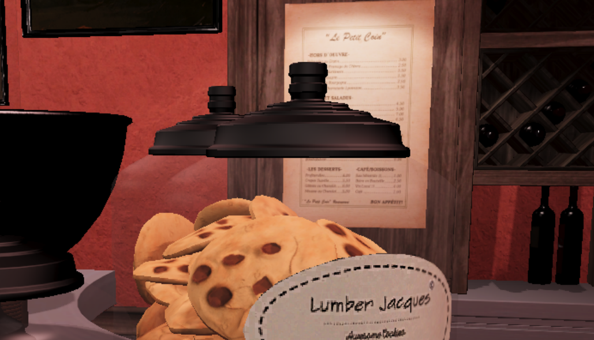

## 5. 运动中的着色

在实践中，重建**全分辨率的渲染目标**是比较困难的。游戏不是静态的，每一帧都可能充满了运动。我们的**棋盘重建步骤**必须考虑到**元素的像素位置变化**。同样地，所需的阴影信息可能会因为在前一帧中被遮挡而丢失。在棋盘重建过程中**增加使用运动矢量**是解决这个问题的第一步。**运动向量**被用来跟踪**帧之间的运动**，并在重建步骤中调整第`N-1`帧的像素查找。在示例代码中，**运动向量来自深度缓冲区**，只对静态物体有效。在真实世界的情况下，应该提供**动态物体的运动向量**。我们在下图中展示了一个映射到`G`通道的**每像素运动向量的图像**。

然而，在为**动态物体**提供运动矢量时，有一个复杂的问题需要注意。`N-1`帧中的每个像素**所需的运动矢量**在当前的`N`帧中并没有被渲染出来。我们提出了**几个选项**来获取这个**运动矢量**；读者可以选择一个最适合他们情况的解决方案：

- 缺少的运动矢量可以根据它**周围第N帧的当前运动矢量**进行推断。这在大多数情况下是可以接受的，但对于**缓慢移动的阿尔法测试对象**（如轻微摇摆的植被）可能会造成伪影。
- 运动矢量`Pass`，将视口设置为第`N-1`帧的抖动并渲染当前的运动矢量。这个解决方案将用最新的数据更新`N-1`帧的**运动向量缓冲区**。

### 失去渲染信息

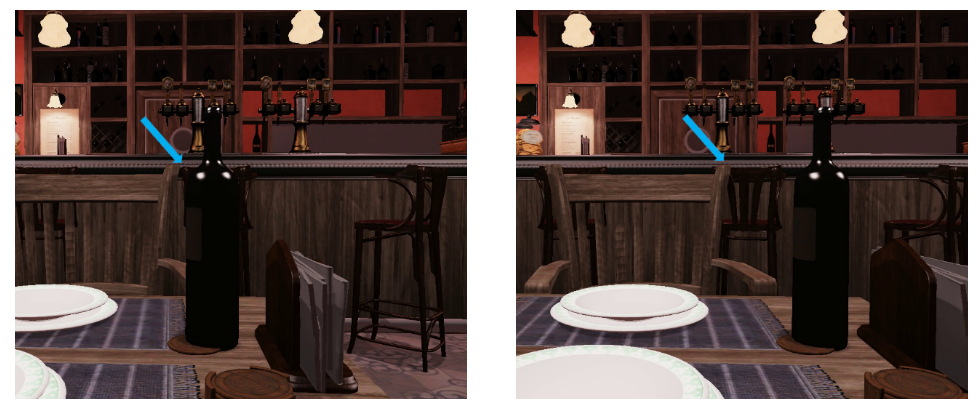

当**运动矢量**将重建着色器指向**前一帧中不存在的着色信息**时，就会出现一个更复杂的问题。考虑一下上图中的例子。

我们为**检测和解决缺失的渲染信息**提供了两种独立而直接的解决方案：

- 第一种方法是比较`N-1`和`N`帧之间的**线性深度值**，如下面的代码样本所示。如果**深度值的差异**通过了一个最小的阈值，那么就假定渲染信息被遮挡了，我们把它称为**检查渲染遮挡步骤**`Check Shading Occlusion step` 。
- 第二种解决方案采取了一种更基本的方法，对任何移动超过四分之一分辨率`texel`的渲染信息都假定为遮挡；我们将其称为**假定渲染遮挡步骤**（`ASO`）。虽然后一种方法不如前一种方法准确，但在实践中它需要更少的样本。对于没有移动的阴影，视觉结果是相同的，而对于移动超过四分之一分辨率` texel`的渲染，视觉结果的分歧最小。

## 6. 棋盘式重构着色器的伪代码

对于每个像素：

1. 这个像素是用第N帧（即最近的一帧）渲染的吗？ 
   1. 如果是，从第`N`帧取样并退出。
   2. 否则，我们需要第`N-1`帧的像素，所以继续进行算法。
2. 检查运动向量
   1. 如果没有运动，从第`N-1`帧取样并退出。
   2. 否则我们需要确定第`N-1`帧中渲染的子像素位置。
3. 应用运动矢量来确定帧`N-1`中的子像素位置。
   1. 如果摄像机的移动方式使第`N`帧的子像素位置与第`N-1`帧重叠（即取消了**抖动效应**），那么渲染信息就无法使用。使用第`N`帧的像素在`cardinal direction`上进行混合，然后退出。
   2. 否则，继续算法。
4. 如果想进行`CSO`：
   1. 在第`N-1`帧中对深度进行采样（使用运动向量作为偏移）
   2. 在第`N`帧中对周围的深度进行平均化。
   3. 比较两个深度。
   4. 如果深度差超过最小阈值，则假设所需的渲染被遮挡住了。
5. 如果渲染被遮挡或用户选择了`ASO`，则使用第N帧的像素在`cardinal direction`进行混合。
6. 否则，从第N-1帧的子像素取样（使用运动向量作为偏移）并退出。

