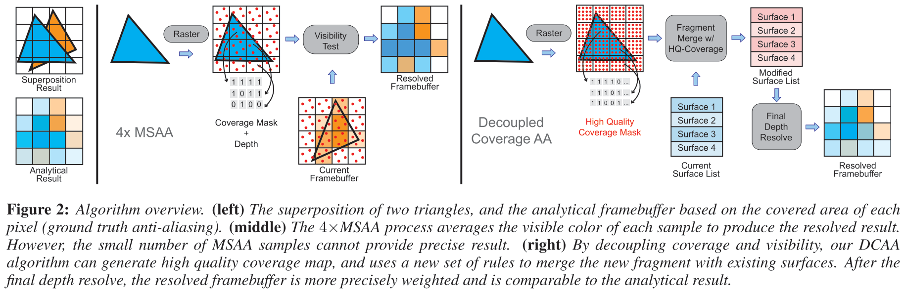
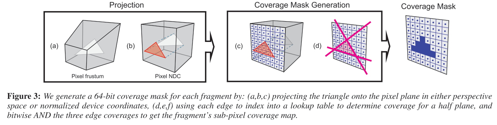
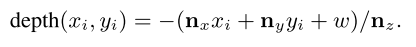
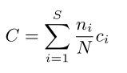

# Decoupled Coverage Anti-Aliasing

## 1. 介绍

**基于MSAA的几何抗锯齿方法**有两个普遍问题。首先，它们需要**大量的可见度样本**来获得高质量的抗锯齿结果，以处理具有精细细节的复杂几何图形。由于每个可见度样本通常被存储为**24位深度值**，高质量的`MSAA`可能会消耗巨量内存（例如，$1920 × 1080$分辨率需要`1` GB）。

其次，`MSAA`方法需要**更多的内存**用于**延迟着色渲染系统**。对于`MSAA`来说，`G_Buffer`将随着样本数量的增加而线性增长，因为**每个样本可能来自不同的对象**。

在本文中，我们提出了一种新的算法，它同时解决了`MSAA`的这两个问题，能够对**具有精细几何细节的复杂场景进**行高质量的**实时抗锯齿**。关键见解是可以利用**现有的关于`G-buffer`压缩的工作**，将样本聚集到几个合并的表面，进一步**将覆盖率与可见度（深度）计算解耦**，从而大大减少必要的`G-buffer`的大小，使其更加实用。这需要引入新的规则来**合并和丢弃片段**，以处理覆盖样本所捕获的**小的几何细节**，但能够使用高分辨率、64个` sample/pixel`的覆盖掩码，这使我们能够准确地计算**每个颜色表面的权重**，以实现高质量的几何抗锯齿。

## 2. 算法

如图2所示，算法使用**投射后的几何信息**来获得**三角形边缘的明确表示**，并使用它们来生成**基于三角形边缘方程的`fragment coverage maps`**。使用`coverage map`和其他信息来**聚合表面**，并根据将在后面讨论的**一组新规则**来合并或丢弃碎片。最后，做一个深度解析`depth resolve`，计算**每个表面的贡献**。具体来说，对于每个片段，算法采取以下三个步骤：

1. **生成`coverage map`**：使用一个光栅器渲染场景，并使用着色器为每个片段生成高质量的`coverage map`。

2. **第一次合并尝试（`First Merge Attempt `）**：将相似的片段合并到**存储在G-缓冲区中的集合表面**。
3. **第二次合并尝试**：如果一个片段不能与**现有的表面**合并，而且表面列表已满，必须放弃**视觉贡献最小的表面**。然而，在这种情况发生之前，会尝试用**宽松的规则**进行第二次合并，以尝试保留信息。

在处理完所有的`fragment`后，进行**最后的深度解析**，以确定每个面的贡献。

### Coverage Map Generation

算法的一个关键方面是：==将覆盖率与可见度解耦==，这就减少了每个样本的存储量，从而使**覆盖率**（` coverage rates`）更高。与`MSAA`中用来表示覆盖率的==24位深度==不同，我们使用**每个样本一个位的位掩码**来识别哪些覆盖样本属于特定的表面，并**为每个表面关联一个深度值**。

由于目前的图形硬件每个像素最多产生`8`个覆盖样本，我们使用**光栅化**和定制的片段着色器来对每个三角形进行**更密集的覆盖采样**。对于每个`fragment`，将其**三角形边缘**投射到像素上，并使用**查找表（LUT）**来确定**位掩码中哪些样本**被覆盖。其==基本思想==是独立地投射**每个三角形边缘**，在`LUT`中查找==半平面覆盖==（` half-plane coverag`），并对`3`个三角形边缘的贡献进行`AND`操作，以获得最终的`coverage map`。

具体来说，对于每个**`LUT`条目**，都有一个**相应的有向线**。在建立`LUT`时，测试像素中的**每个覆盖样本位置**，看它是否位于**线的左边**，这被视为覆盖；然后我们在`LUT`中保存**覆盖位掩码**。为了将`LUT`用于`coverage map`，为`3`个投影的三角形边缘找到**相应的LUT条目**，然后对`3`个**覆盖位掩码**做`AND`，以获得最终的`coverage map`，这在片段着色器中完成。图`3`给出了这个过程的概要：

使用`LUT`的一个优点是能够**调整采样位置和采样数量**。在作者的实现中，我们使用**每个像素`64`个覆盖样本**，这可以很容易地增加，尽管对于**一个更大的覆盖掩码**来说需要**额外的存储成本**。

### Merging Heuristics and First Merge Attempt

与之前的一些方法一样，我们的算法利用了**无法区分一个像素内许多不同的表面**这一事实，通过**合并类似的片段**来减少**需要存储的着色器输入的数量**。然而，将存储量压缩到目标——`four per-pixel surfaces`，需要**一套合并启发式方法**。由于想要合并那些**距离较近且方向相似的曲面**，我们使用了两种常见启发式方法：

+ **对齐法线**（`Aligned normal`）：两个合并对象的法线应该彼此接近。我们发现，$\theta_t=\pi/16$的角度差是很有效的。
+ **重叠深度**（`Overlapping depth`）。两个合并的候选者在深度上应该是相似的。我们使用**深度导数** $\frac{dD}{dx}$和$\frac{dD}{dy}$ 来近似**片段的边界框** 。这些边界盒必须**在深度上重叠**，以便合并片段。

当一个新的`fragment`光栅化时，作者应用**对齐法线**和**重叠深度**指标来确定哪个现有的表面提供了**最佳的合并候选者**（即最接近的法线和最大的深度重叠），将片段和其最接近的表面合并。然后，用二进制`OR`操作来**合并覆盖率**。

如果没有现有的表面能提供令人满意的匹配，传入的`fragment`就会成为一个新的表面，并被插入到**像素的表面列表**中。

### Discard and Second Merge Attempt

如果无法成功地将`fragment`与现有的曲面合并，并且`surface`列表已满，就无法创建一个新的`surface`。在丢弃一个面之前，作者转而用**宽松的合并规则**执行二次合并步骤。我们的想法是，与其**丢弃信息**，不如尝试**合并一些不相干的表面**，从而得到近似的表面渲染，但有**准确的覆盖**。

对于二次合并尝试，我们选择**可见覆盖率最小的表面**，即对像素颜色贡献最小的表面——可以是当前的`fragment`或像素列表中的任何表面。由于表面不包含`resolved coverage`，我们通过将表面**从前到后排序**来粗略地解决深度问题，并使用**位操作**来掩盖**被较近表面覆盖的样本**。覆盖率最小的表面就成为**候选合并对象**（也可能被丢弃）。

我们用一个单一的指标，即第3.2节中的**重叠深度启发法**，与像素中的其他表面进行比较。如果深度与任何其他表面重叠，我们就把它们合并在一起（如前），否则就放弃覆盖率最小的表面（见图5）。

### Final Depth Resolve

在处理完所有的片段后，应用一个**深度解析**来确定**每个表面的覆盖率**。使用表面的深度和法线，我们可以近似地确定**每个覆盖样本的深度**，并屏蔽掉**被其他表面遮挡的部分**。具体来说，对于一个屏幕空间的覆盖样本$(x_i,y_i)$和一个`NDC` $f(p):\vec{n}\cdot \vec{p}+w=0$的表面平面来说：

最终的像素颜色`C`是**表面颜色的加权平均值**：

其中，`S`是集合表面的数量（在我们的实现中 $S=4$），$n_i$是第`i`个表面在**深度解析**后仍然可见的子**像素覆盖样本的数量**，$c_i$是该表面的渲染颜色，`N`是覆盖掩码中样本的总数量。

## 3. 实现和优化

Todo.