# High-Quality Screen-Space Ambient Occlusion using Temporal Coherence

***Computer Graphics Forum 2010***

## 1. 介绍

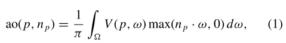

> 如果被遮挡住了，则$V=1$。

`SSAO`的性能主要取决于**每帧的样本数**，因此通常使用**相对较少的样本数**来达到**理想的性能**，并使用**空间深度感知滤波器**来模糊**产生的噪声**。然而，对于**具有精细细节的复杂几何图形**来说，少量的样本可能是不够的，尤其是在使用大采样率的情况下。最终的图像看起来要么是嘈杂的，要么是模糊的，而这取决于滤波器内核的大小。一般来说，为了提供**稳定的结果**，需要仔细调整**滤波器的参数**，否则可能会出现伪影。

在本文中，我们提出了一种算法，它可以实现==高质量的`AO`==，既不模糊，也不容易产生**噪声伪影**，每帧的采样量最少。我们通过利用**连续图像帧之间的时间连贯性**，重新利用**前一帧的可用AO信息**。通过**重投影的方式**来识别描述相同世界位置的像素。**解决方案的当前状态**被缓存在一个所谓的`AO Buffer`中。每一帧都会计算一些新的`AO`样本，然后将这些样本与**前一帧的累积样本**混合。然后，**AO解决方案**与直接漫射照明产生的图像在一个单独的步骤中结合起来。

## 2. 相关工作

todo

## 3. 本文算法

### SSAO生成

`SSAO`方法旨在近似**屏幕空间中的原始AO积分**。我们假设渲染方法可以写成取决于一系列样本$s_i$的贡献`C`的平均值：

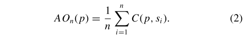

一个典型的**SSAO贡献函数**的例子是：

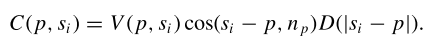

其中，`D`是依据$s_i$到$p$的距离的衰减函数（例如：$exp()$）。使用低差异序列产生随机位置。

### 重投影

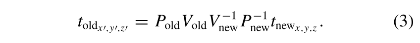

对于动态场景，这个简单的公式不起作用，因为重投影取决于移动物体的变换。Nehab等人因此建议在**顶点着色器**中通过==2==次应用**完整的顶点变换**来进行重投影，一次使用当前的变换参数，一次使用前一帧的参数。
$$
PVMM^{-1}V^{-1}P^{-1}
$$

### Temporal refinement

算法的主要思想是：通过使用重投影将**AO的计算**分散到若干帧。只要有可能，我们就从前一帧中提取**对应一个像素的解决方案**，然后用当前帧中**计算的新样本的贡献**来完善它。在第`t+1`帧中，我们从`k`个新样本中计算出一个新的贡献$C_{t+1}$：

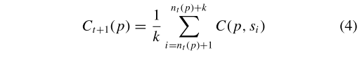

并和前一帧的计算结果进行结合：

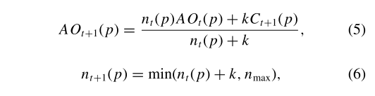

理论上，这种方法可以使用**任意多的样本**。然而，在实践中，这并不可取：因为==重投影不是精确的==，需要双线性滤波来重建，每一个重投影步骤都会引入一个误差，并随着时间的推移而累积。这个误差是明显的，因为模糊度越来越大。此外，**新计算的样本的影响接近于零**，而以前计算的样本从未被替换。因此，我们将$n_t$钳制在一个用户定义的阈值$n_{max}$上，这使得**旧的贡献的影响随着时间的推移而减弱**。因此，$conv(p) = min(n_t (p),n_{max})/n_{max}$是**收敛状态的一个指标**。请注意，对于$n_{max} →∞$，方程`6`将收敛到正确的解决方案。

### Detecting and dealing with invalid pixels

当重投影一个`fragment`时，我们需要检查**缓存的AO值**是否有效。如果不是，$n_t$被重置为`0`，并计算一个**新的AO解决方案**。为了检测这种无效的像素，我们检查是否发生了以下两种情况之一：1、当前`fragment`的排除；2、`fragment`的**采样邻域的变化**。在下文中，我们将讨论这两个条件。

#### 检测排除:star:

比较深度：

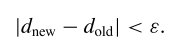

然而，我们发现，无论是**屏幕空间深度值**还是**`eye-linear`深度值**都没有给出**可靠的结果**。屏幕空间深度值只在**近平面周围的小区域**内准确，而**`eye-linear`**深度在远平面附近的区域过于敏感，在近平面附近则不够敏感。==解决方案==是：存储**`eye-linear`**深度，但要考虑**相对深度差异**，而不是绝对深度差异，方法是检查：

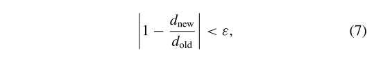

即使是**深度范围很广的大场景**，也能获得良好的效果。

#### 检测领域的变化

在纯粹的静态场景中，或在纯粹的抗锯齿中，==测试不相容性是有效的充分条件==。然而，对于在动态场景中**访问相邻像素的渲染内核**，如`SSAO`，我们必须考虑到当前像素的渲染可能会受到**附近移动物体的影响**。

**要检查的邻域的大小**相当于**用于SSAO的采样核的大小**。检查一个像素的完整邻域将是非常昂贵的，因此我们使用采样。实际上，事实证明我们已经有了一组样本，即**用于生成AO的样本**。这意味着我们有效地将我们的**AO采样内核**用于两个目的：==计算当前的贡献$C_t(p)$，并测试其有效性==。如果样本和像素的相对位置变化不超过`ε`，则认为样本$s_i$有效：

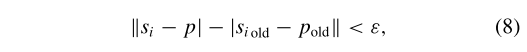

理论上，我们也可以检查**表面法线和样本点的矢量之间的角度**是否在每一帧之间有明显的变化。然而，这需要存储更多的信息（前一帧像素的表面法线），在我们所有的测试中，我们发现这足以测试条件。

### Dealing with undersampled regions

算法确保了充分收敛的像素的**高质量AO**。然而，在**最近被废止的屏幕区域**，欠采样可能会导致**时间上的闪烁**。被排除的区域往往是连贯的，并导致在几帧内出现**分散注意力的相关噪声**。我们通过一个新的、收敛感知的空间滤波器来解决这个问题。

#### Adaptive convergence-aware spatial filter

`SSAO`方法通常在渲染计算后应用**空间滤波`pass`**，以防止采样率不足造成的**噪音伪影**。我们也应用空间滤波，但只是在时间一致性不够的情况下。通常使用**联合双边滤波器**的变种，通过考虑**深度差异**来避免对边缘的过滤。尽管这种滤波器在形式上是不可分离的，但在实时环境中，它通常在`X`和`Y`方向上分别应用，以使计算可行。我们也遵循这种方法。

与以前的方法相比，我们有额外的信息给过滤器，可以大大减少噪音：我们`AO`值的收敛性$conv(p)$。==最近被排除的像素可以从附近的收敛像素收集更多的信息，而不是从其他不可靠的像素==。此外，我们将**滤波核**直接应用于世界空间距离，如Laine等人，它自动将**深度差异**考虑在内，并能在高深度差异的情况下检测出**不连续现象**。

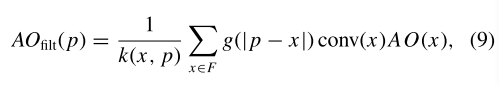

其中：$k(x,p)$是归一化值，$g$是空间滤波器（例如：高斯滤波器）。当一个像素变得更加收敛时，我们使用**收缩系数`s`**，来 shrink the screen-space filter support smoothly。

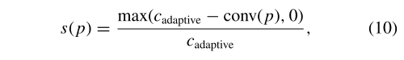

这样，当收敛达到$c_{adaptive}$时，我们就完全取消了**空间滤波**。我们发现$c_{adaptive}$的设置在感知上是不关键的，例如`0.2`会导致不可察觉的过渡。

### Optimizations

#### Smooth invalidation

对于适度快速移动的物体，`AO`在感知上对超过一帧有效。如果只有邻域发生了变化，对当前像素的完全无效是对有用信息的浪费，而且可能会出现噪声和闪烁的假象。因此，我们宁愿将$n_t$钳制在一个低值，而不是通过将$n_t$重置为`0`来完全放弃当前的解决方案。我们发现，在许多情况下，$n_{max}%$值在`32`和`64`的范围内，是完全无效和完全不无效之间的一个**很好的权衡**。使用这种小的优化，`AO`会随着时间的推移显得**更加平滑**。

#### Adaptive sampling

尽管空间滤波可以减少噪声，但在**未采样区域**提供更多的输入样本甚至更好。或者换句话说，一旦`AO`达到足够的收敛，我们就可以直接重复使用这个方案，而不必像以前那样使用那么多的样本。我们根据**收敛情况**调整每帧新`AO`样本的数量`k`。

为了引入最小数量的分支，我们选择了一个**简单的两阶段方案**，如果$conv(p)<c_{spatial}$，则采用$k_1$样本，否则采用$k_2$样本。

#### Frame buffer borders

`SSAO`中固有的一个问题是：对超出帧缓冲区边界的样本的处理。由于没有最好的方法，退而求其次，通过使用`clamp`到边缘来重新使用出现在边界上的值。为了避免由于**深度信息的缺失**而在屏幕边缘产生的伪影，我们可以选择计算一个比我们最终在屏幕上显示的稍大的图像——根据`SSAO`内核和近平面的大小，在屏幕的每一侧延伸大约$5-10\%$就足够了。

## 4. Results and Implementation

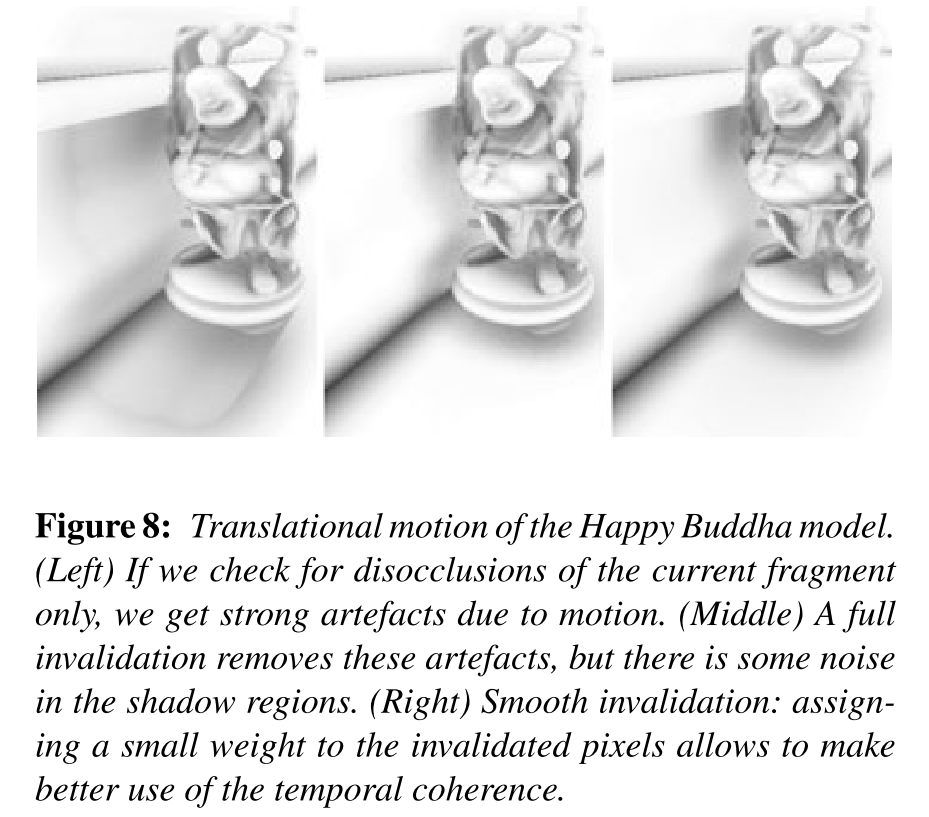

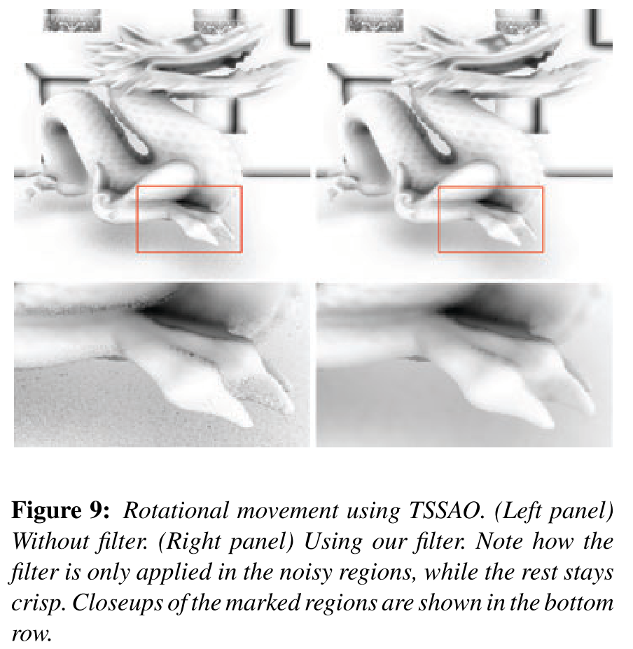

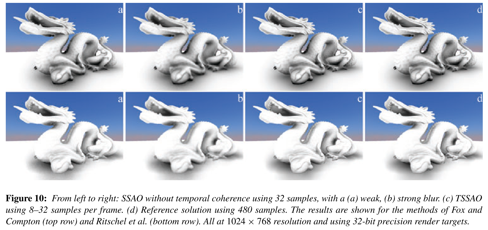

