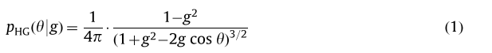

# Interactive cloud rendering using temporally coherent photon mapping

## 1. 介绍

这项工作中提出的方法主要在以下几个方面对相关主题做出了贡献：

+ 我们提出了一个利用**光子束**（`photon beams`）在参与介质内传播光能的一般方案。能量被储存在一个有规律的**网格状光子图（`photon map`）**中，它与**云密度场**脱钩。这允许通过在每一帧中只重新拍摄**构成场景照明的一小部分光子**来持续更新光子图。
+ 为了避免明确存储单个光子的必要性，我们引入了**角度照明信息的专门表示**。这种表示方法积累了存储的光子相对于参考方向（通常是场景中最强光源的方向）的**平均余弦**。
+ 此外，我们提出了一个有效的基于物理的升采样方案，通过使用我们在模拟中**可用的额外知识**来提高光子图的分辨率。**上采样是一种快速的并行操作**，可以极大地降低光子图的分辨率，以及获得无噪声解决方案所需的追踪光子数量。

## 2. 相关工作

Todo.

## 3. 方法前瞻

### 3.1 Model

描述光在参与环境中**传播的物理模型**，在数学上由**辐射传输方程**（`RTE`）描述：

`RTE`描述了空间中某一点`x`的辐射度`L`在$w$方向的微分变化。$\sigma_t$和$\sigma_s$是模拟介质的**消光和散射截面**。由于不考虑云层中的发射，这里`RTE`公式不包含发射项。

**经典的体积光子映射**通过在介质中进行==随机的蒙特卡洛行走==来解决RTE问题。然而，这需要有能力确定模拟光子与介质相互作用的下一个位置。为了以**无偏的方式**获得这个位置，我们利用==Woodcock跟踪技术==。关于它的简要描述，请参考附录`A`。我们采用的相位函数模型是Henyey和Greenstein的标准表述：

其中：$g \in(-1,1)$定义了各向异性。它是任何给定`p`产生的**散射方向的平均加权余弦**：

对环境的一些假设：

+ 照明。云几乎总是被一个**强大但缓慢移动的光源**所照亮，它有一个主导方向（太阳或月亮），以及其他缓慢变化的环境光源（天空、城市化地区的路等等）。像飞机快速飞过云层这样的情况是非常罕见的，我们认为可以忽略它们。在数学上，这个假设可以用**云被低频光源照亮的方式**来表达，而且在时间和空间领域都是如此。
+  质量分布。云确实是动态的媒体，因为它们的形状由于空气对流而改变。然而，这个过程不仅不是很迅速，而且对于人类观察者来说，甚至很少能注意到它。

我们允许任何类型和数量的光源，只要有一个具有**主导的辐射功率和方向**。即使是局部光源也是可以接受的，只要它们移动缓慢。同样地，我们允许任意的云层形状，可以用**三维离散密度场**来表示。这个密度场的来源也可以是任意的，它可以作为一系列的体积动画帧存储在内存中，也可以由动态云对流模拟产生。不需要对这些数据进行预先计算。最后，我们不对观察者的方向或运动施加任何限制。

### 3.2 前瞻

我们的方法的输入是**模拟云的标量密度场**，存储在一个常规网格 $D(i,j,k):N^3\rightarrow R^{+}$ 中（见图4）。假设一个缓慢变化的环境，我们将**光照度**缓存到另一个规则网格 $I(i,j,k):N^3\rightarrow R^{4}$ 。`I`中的每个单元都存储了RGB通量以及一个各向异性系数来模拟`light distribution`。网格`I`是逐步更新的，所以每个单元都存储了当前值和几个过时的值的混合。

**缓存数据结构**是一个由`m`个（m=100）部分缓存$H_0(i,j,k)\cdots H_{m-1}(i,j,k)$组成的**循环缓冲区**。它们的组合方式为：

缓存`I`的空间分辨率比密度场`D`的空间分辨率低得多，以保持较低的内存量和方差。为了提高质量，在用==射线行进法==从`I`和`D`重建最终图像之前，我们将`I`上采样到第二个**高分辨率的缓存**`J`，它的分辨率与`D`相同。==云的全局能量状态==由 $n_t$ 光子表示，它被分为` m` 代，每代包含$n_g=\frac{n_t}{m}$ 光子。在每一帧f中，该算法执行以下内容：

1. 在`D`中被射出并追踪的$n_g$光子的通量被存储到一个**新的部分缓存**$H_{new}$中。
2. 循环缓冲器中的部分缓存$H_{old}=H_{f \mod{m}}$成为**旧的部分缓存**，我们用**新的部分缓存**$H_{new}$来代替它，即：$I^{(f)}=I^{(f-1)}-H_{old}+H_{new}$。
3. 低分辨率的缓存`I`被上采样到另一个缓存`J`，使用密度场`D`作为**引导信号**（`guidance signal`）。
4. 对`D`和`J`进行**射线行进**产生最终图像。

## 4. Our Approach

在这一节中，将更详细地描述==时间上相干的体积光子映射==。我们将针对**一般的细粒度**并行机器（我们的实现使用`CUDA`）进行描述。这样的机器执行许多并行线程，可以读写缓冲区，从称为 "纹理 "的特殊缓冲区读取，提供高效的一维、二维和三维线性过滤，并可以读写快速的 "本地 "存储器。

在每一帧的开始，云的密度场`D`被更新并存储到纹理中，例如，使用云的动态模拟，或通过从内存中实时**流化数据集**。

### 4.1 Illumination

照明是通过追踪密度场`D`中的光子来计算的，并将其存储到一个**新的部分缓存**$H_{new}$中。`H`的空间分辨率通常比`D`低得多：它的单元数不应该超过`2400`（对于一个立方体网格来说，它的分辨率限制在$13^3$），以适应当前GPU上 $48 kb$ 的**共享本地存储器**。

#### Photon tracing

在每一步中，从太阳和天空中射出 $n_g$ 光子 (注意，在每一帧中可以追踪不同数量的光子）。首先，它们由于大气散射而被衰减。对于**光子的传播**，我们采用了Jarosz等人提出的==光子行进==（`photon marching`）技术：对于每一个光子，都有一个平行线程被启动，并在一个`while-loop`中运行，散射和存储光子，直到光子离开体积。我们不是以恒定或自适应大小的`step`来存放光子，而是执行随机大小的`step`。因为我们采用**Woodcock跟踪**，来获得**通过介质的自由光子路径**。这个过程的图示见图5。

当然，这种方法的缺点是可能会造成**更高的方差**。然而，由于我们将**光子贡献**聚集到网格单元（比**介质中的平均自由路径**大得多），这种影响可能会非常小。

此外，最初的光子行进技术是追踪到介质边界。这种方法确实适合于**光学稀薄的介质**，如Jarosz等人在演示中使用的雾和某些种类的烟。然而，在光学厚的环境中，比如云，这种方法将**大量的计算工作**投入到模拟和存储光子上，而这些光子——由于介质透射率低——只携带很少的能量。为了克服这个问题，我们只需在一个光束的透射率低于一个小的阈值时停止追踪。

此外，我们使用==相似性理论==来加快追踪过程。我们设置了一个固定的阈值$t=0.05$，如果被追踪光子的**累积散射各向异性**低于`t`，我们就切换到`reduced scattering cross section` $\sigma_s^/=\sigma_s\sqrt{(1-g)}$和**各向同性的相函数**。在我们的例子中，很容易确定这一点，因为散射`i`次光的角度分布对应于**相位函数的`i`次自卷积**，对于Henyey-Greenstein函数来说，这又对应于仅仅使用$g_i$而不是`g`作为其**各向异性参数**。因此，对于一个给定的光子，经过$i=log(t)/log(|g|)$反弹，我们切换到$\sigma_s^/$和各向同性的散射。

`t`的选择不是任意的；根据**相似性理论的推导** ，如果辐射各向异性是线性的，也就是说，如果它可以用最大度数为`1`的球面谐波函数来表示，那么相似性关系就有效。因此，我们至少可以把目标放在某个误差阈值内的差异。传统上用于计算机图形学的2%的误差大致对应于$g=0.1$；然而，我们需要达到更低的误差范围，因为误差随着每次散射反弹而累积。使用$t=0.05$可以确保**大约五倍的误差幅度**，我们认为这是足够的。

#### Photon storing

经典的（体积）光子映射和体积辐照度缓存都有两个缺点，阻碍了它们在**交互式云渲染**中的应用：维护和查询复杂的空间数据结构，以及由于**用于缓存的球面谐波函数**对高度各向异性散射的**有限支持**。我们的方法通过使用**简单的规则网格**和**不同的基函数**克服了这两个限制。

==常规光子网格==。经典的体积光子映射将**光子**存储到**分层的数据结构**中，如`kD`树，可以自适应地解决**光子分布中的细微空间细节**。然而，对于云来说，精细的空间细节通常不是那么突出。另一方面，在复杂的结构中插入光子，并进行**自适应密度估计**，不太适合我们所瞄准的**大规模并行机器**。因此，我们建议用自适应性来换取简单性，恢复到一个普通的规则网格，在这个网格中累积光照，类似于辐照量。

==Henyey-Greenstein基==。缓存体积内照度信息的方法使用**球面谐波**来逼近辐射度函数。这适用于各向同性和中度各向异性的介质，但不适用于**强前向散射介质**，如云层，那里需要**非常多的SH系数**。云层中的强前向散射在视觉上对它们的外观很重要，主要造成众所周知的==银线现象==（图3）。

为了克服这个限制，我们建议用**Henyey-Greenstein函数**来表示缓存。证据表明，**在场景中大部分能量来自单一方向的情况下，那么大部分散射光也会直观地在一个非常相似的方向传播，**这对于云和其他具有高散射各向异性的介质来说尤其如此。因此，当把一个光子存储到缓存单元时，除了它的辐射通量外，我们**也要积累它相对于主要光向的余弦值**。这只需要在每个单元中存储四个值（一个RGB通量和一个余弦值），而投影只包括对每个光子进行一次点乘计算。此外，我们计算到达每个单元的光子数量，并在所有光子被`shot`后，**用累积的余弦值除以贡献的光子数量**，以进行适当的标准化。这样得到的值就是**给定缓存单元的各向异性系数**。然后，我们可以直接使用Henyey-Greenstein函数来表示**每个单元的角照度分布**。

### 4.2 更新

在使用前面解释过的光子追踪计算出**云的照度**后，部分缓存$H_{new}$被添加到全局解决方案I中，过时的缓存$H_{old}$被删除。这是在所有缓存单元上使用**简单的并行加减法**完成的。

### 4.3 上采样

在这一点上，缓存`I`已经可以用于渲染了。然而，它的空间分辨率通常要比`D`的空间分辨率低得多。为了将它装入共享的本地内存，减少光照方案的差异，以及整体的内存占用，需要这样做。然而，这有两个问题。首先，`I`的低分辨率会导致**光能的大幅模糊**，并造成**插值伪影**。其次，由于各向异性系数`g`和所产生的`lobe`之间的关系是相当非线性的，在缓存获取过程中对其进行线性内插，有时会产生**不正确的散射辐射的角度分布**。

为了避免这些限制，我们建议将`I`向上采样到`J`缓存，其空间分辨率与`D`相同（图8）。一种可能的方法是应用**联合双边升采样**。联合双边上采样的想法是使用**一个由两部分组成的双边滤波器**：一个传统的域滤波器，例如高斯，和**一个在引导信号之上运行的范围滤波器**，它为过滤过程提供了一个**额外的调节机制**。在我们的案例中，使用`D`作为引导信号是非常自然的。这种方法产生了经验上的良好结果。

联合双边上采样的主要问题是：它采用了高斯滤波器，如上所述。这就需要指定它们的参数——标准差，由于它们与云的物理特性没有直接关系，所以也不能用自然的方式来推导它们。为了克服这个问题，利用获得的额外知识是很有用的。基于这些知识，可以设计一个更合适的、物理上可信的上采样滤波器。

在追踪过程的最后，`I`包含了两个不同的量，需要进行升采样：**辐射能量密度**和由HG各向异性系数代表的**角度分布**。

***辐射能量***：从RTE中我们可以看到，辐射能量`L`与**介质散射截面**成正比，而介质散射截面又与**密度场**`D`成线性关系。我们对其升采样的建议是使用**联合双边滤波器**$f_L$，如下所示。**域滤波器**需要考虑到，由于介质透射率的原因，`L`在空间是指数衰减的。**范围滤波器**使用`D`作为**引导信号**，必须考虑到散射`L`对介质密度的线性依赖。在数学上，这可以写成如下：

其中，$d_D$和$d_R$分别是空间域和范围域的距离，`t`是介质中的光学厚度，`r`是有效过滤半径。由于我们只使用局部邻域进行过滤，使用指数分布会在上采样的解决方案`J`中引入不连续性。因此我们使用**截断的指数分布**$f_{texp}$。

***辐射各向异性***：如前所述，对各向异性的上采样必须考虑到它的值和它所代表的分布之间的非线性关系。然而，如果没有关于介质的额外信息，就没有直接的方法来补偿这种非线性。当光线进入介质时，其各向异性随着**散射阶数的增加**而减少。因此，==某一点的各向异性将与该点的平均散射阶数密切相关==。这个量，我们称之为==穿透深度==$\gamma$，在追踪过程中很容易得到；我们追踪一个**被追踪的光子的散射次数**，并将这个值与**光子的能量**和**平均余弦**一起存储。$\gamma$已经接近线性，因此在上采样过程中可以从低分辨率网格中线性插值。因此，$g^/$的上采样滤波器可以定义为：

其中`d`是上采样点和我们推算各向异性值的点之间的渗透深度$\gamma$的差异，`g`是介质散射各向异性。这个过滤器背后的逻辑与本节中的相似性启发式完全相同。

***最后上采样***。然后，上采样程序本身通过**上采样点的局部邻域**进行迭代，推断出邻域点对其辐射能量和各向异性的贡献：

### 4.4 Ray-marching

为了实现云的可视化，我们使用了标准的射线行进法，在**2%的透射率阈值**时提前退出。对于每一个像素，我们启动一个线程，对`D`和`J`进行行进，按照前后顺序积累`J`的辐射度和`D`的透射率`T`，相应地进行合成，当`T`小于2%时终止。

为了使**内存消耗**保持在**可管理的水平**，我们对`D`只使用适度的分辨率。然后，我们通过**程序性的扰动**来增加细节的数量，通过存储在一个小型三维纹理中的、三个八度的简单矢量噪声来获取`D`和`J`。对于大多数云来说，没有必要在全屏分辨率下对它们进行射线测绘。因为**所应用的噪声的频率**仍然低于**屏幕的采样频率**。因此，在所有情况下，我们都以**一半的屏幕分辨率**渲染云，在两个维度上都是如此。

不需要重新进行步进的一些情况：具体见书。

//todo

## 5. 结果和讨论

