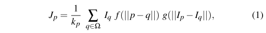
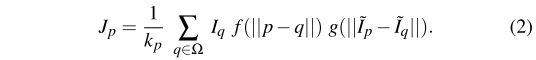
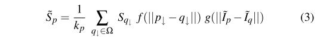
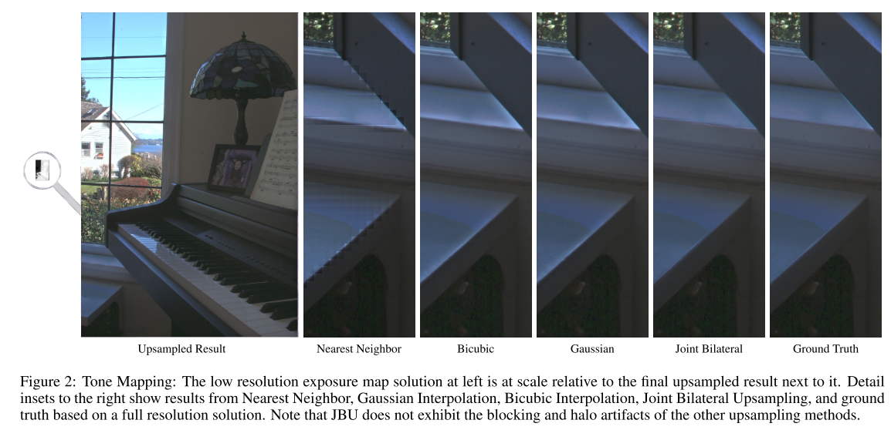
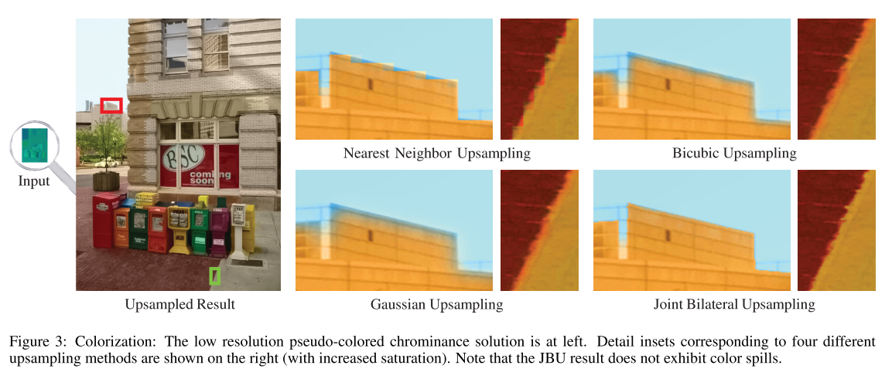
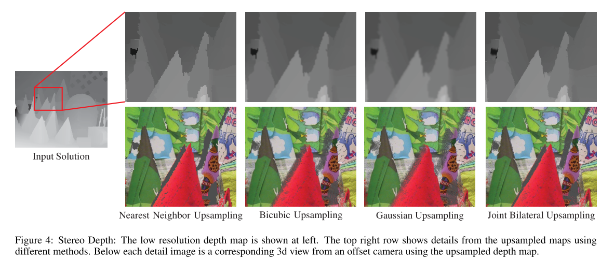

# Joint Bilateral Upsampling

***ACM Transactions on Graphics 2007***

## 1. 介绍

泛善可陈。具体见书。

## 2. Bilateral Filters

==双边滤波器==是一种**保留边缘的滤波器**，最初由Tomasi和Manduchi提出。它与更广泛的非线性滤波器有关，如**各向异性扩散**和**鲁棒性估计**。==双边滤波器==同时使用一个**空间（或域）滤波器核**和一个对数据值本身进行评估的**范围滤波器核**（`range filter kernel `）。更正式地说，对于某个位置`p`，过滤后的结果是：

其中，`f`是空间滤波器核（例如：高斯滤波器），`g`是`range filter kernel `，$k_p$是归一化项——$f\cdot g$权重之和。由于**双边滤波器** $f\cdot g$ 的值随着**范围距离和/或空间距离**的增加而变小，因此边缘被保留下来。

最近，我们看到了==联合双边滤波器==的引入，其中**范围滤波器**被应用于第二个**引导图**像，`I˜`——例如，当试图结合一个图像的高频和另一个图像的低频时。因此。

## 3. Joint Bilateral Upsampling

与一般的图像升采样不同，在作者感兴趣的问题中，我们可以通过**原始高分辨率输入图像的形式**获得额外的信息。给定一个高分辨率的图像，`I˜`，和一个低分辨率的解决方案，`S`，我们提出了一个简单的方法，应用**联合双边滤波器**对解决方案进行**上采样**。

这个想法是对**低分辨率解决方案**`S`应用一个空间滤波器（通常是**截断的高斯**），同时对**全分辨率图像**`I˜`联合应用一个**类似的范围滤波器**。让`p`和`q`表示`I˜`中**像素的（整数）坐标**，`p↓`和``q↓``表示相应的 （可能是小数）的坐标。然后得到``S˜``：

这与公式`2`几乎相同，不同的是，我们是在构建一个高分辨率的解决方案，并且同时在**两个不同的分辨率**下操作。

## 4. 应用

### Tone Mapping

应用**联合双边升采样滤波器**的方法如下：让`I`是**低分辨率的HDR图像**，而`T(I)`是由一些色调映射运算器产生的色调映射图像。然后，相应的低分辨率解决方案被定义为**像素商数`pixelwise quotient`**  $S = T(I)/I$。换句话说，该解决方案是一个==曝光图== `exposure map`，它说明了在每个像素上要应用的**曝光校正量**。这样的曝光图通常是平滑的，但沿着图像边缘可能有**不连续的地方**。因此，它们是我们**升采样技术**的理想候选者。请注意，曝光图可能有一个单通道（如果只有亮度被调整），或多个通道（支持任意的色调操作）。图2显示了使用本文技术上采样的曝光图与一些标准上采样方法的比较。双边联合升采样产生的结果在视觉上和数字上都更接近于真实。

### Colorization

在Levin等人的着色和重新着色方法中，出现了一个与上述色调映射方法类似的线性系统。

为了对低分辨率的着色结果进行升采样，我们首先将其转换为`YIQ`色彩空间（或任何其他将亮度和色度分开的色彩空间），然后将我们的升采样技术应用于两个色度通道中的每一个。图3显示了这一结果。如同色调映射的例子，我们可以看到`JBU`避免了色度溢出图像边缘的问题

