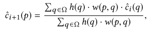

# Spatiotemporal Variance-Guided Filtering Real-Time Reconstruction for Path-Traced Global Illumination

## 1. 介绍

本文扩展了Dammertz的**分层的、基于小波的重建滤波器**，以便从每像素一个样本（`spp`）的图像流中输出时间上稳定的全局照明，包括漫反射和Glossy反射，以及软阴影。在非常低的采样率下进行重建会带来许多挑战。**糟糕的采样带来的高变异**掩盖了高频信号，而且，在只有一个样本的情况下，区分噪声源是很困难的。鉴于实时性能目标，本文的过滤器利用**过去帧的样本**，以帮助隔离精细的细节和**解耦噪声源**。具体贡献包括：

- 一种高效的、时间上稳定的算法，用于从每像素的单一路径输入中实时重建，该算法使用**由估计方差指导的时间、空间过滤器的组合**来构建。

- 在时间上，使用**过去帧的信息**计算每像素方差估计值。
- 在先前工作的基础上建立了一个**空间通道**，通过**多次小波迭代**过滤输入颜色。我们的空间`pass`从使用**方差的时间估计**开始，但在每次迭代中更新它以提高其**可靠性**。
- 新的、与场景无关的**几何学边缘停止函数**（`edge-stopping functions`）。

## 2. 重建管道

下面对**重建管道**做一个高层次的概述（见上图），包括栅格化和路径追踪输入，如何通过分离组件来隔离噪声源，重建过滤器，以及后处理步骤。第4节更详细地介绍了**核心重建算法**。

==路径追踪==。作为重建滤波器的输入，作者使用**标准的路径追踪**来生成`1 spp`的颜色样本。**本文的路径追踪**包括优化，以更好地利用**可用的GPU资源**，包括使用**光栅器**来有效地生成**主射线**。这提供了一个无噪音的G-Buffer，其中包含**用于引导重建过滤器的额外表面属性**（见第4节）。

一个**低差异的Halton序列**被用来对**光源和散射方向**进行采样。由于**时间滤波器的指数移动平均值**在几帧之后就会失去**来自早期样本的贡献**，所以**循环使用一小部分Halton样本**（例如`16`个）。对于**非漫反射表面**，在路径的第一个散射事件之后，作者应用**路径空间正则化**。正则化本质上是在二次散射事件中**增加表面粗糙度**，允许**路径追踪器**通过**连接到光源**找到间接反弹的贡献。这增加了光传输的稳健性，使路径的贡献更加均匀。本文追踪一条射线来寻找**间接可见的表面**，加上**两条阴影射线**来连接主要和次要光源。

**本文的路径追踪器**分别输出**直接和间接光照**。这使得过滤器能够独立地考虑到两个部分的**局部平滑性**，并允许更好地**重建采样不良的阴影边缘**。分离似乎是双倍的成本，但由于许多步骤都使用光栅化的G-缓冲区，所以大量的工作可以分享。

==重构==。首先从样本颜色中**解调**（`demodulate`）直接可见表面的反照率（包括**纹理**和**空间变化的BRDFs**）。过滤无纹理的光照成分，并在重建后**重新应用纹理**。除了防止过滤器过**度模糊纹理细节**，这也增加了邻近样本可能的**空间重用**。在多层材料的情况下，添加每层的反照度，并以其**采样概率**加权计算

重建工作主要有**三个步骤**：

- 在时间上累积**1 spp路径追踪输入**以提高有效采样率，
- 使用这些时间上增强的颜色样本来估计**局部的亮度方差**，
- 并使用这些方差估计值来驱动一个**分层的小波滤波器**。

下图提供了一个概述，第4节更详细地介绍了这些步骤。在重建之后，用**表面反照率**对滤波器的输出进行（重新）调制。

==后期处理==。在重建之后，进行与当今许多实时渲染器类似的**后期处理**。我们的过滤结果要经过一个**色调映射运算器**来处理`HDR`。最后，我们进行时间抗锯齿处理，以增加**时间稳定性**，并沿着重建过滤器所保留的**几何边缘**过滤锯齿。

## 3. 时空过滤器

==重建滤波器==将一个**1 spp的路径跟踪颜色缓冲区**作为输入，同时还有一个栅格化的G缓冲区和来自**前一帧重建的历史缓冲区**。输出一个重建的图像和历史缓冲区。

`G-Buffer`包含深度、物体和世界空间法线、网格ID和屏幕空间运动矢量，这些运动矢量是由光栅化过程中产生的，主要用于**可见性**。**历史缓冲区**包括时间上积分的颜色和`color moment`数据，以及前一帧的深度、法线和网格ID。

### Temporal filtering

随着**时间抗锯齿**（`TAA`）现在被广泛用于视频游戏中的**摊销超采样**，将其应用于**实时路径追踪**似乎很自然。不幸的是，**基于颜色的时间滤波**在应用于**非常嘈杂的输入**时，会引入**伪影**。我们通过采用**基于几何的时间滤波**，将这些伪影降到最低，并增加**有效样本数**。

 与TAA一样，需要一个与第`i`帧的每个颜色样本$C_i$相关的**二维运动矢量**。这描述了前一帧的几何运动，并允许我们将$C_i$回投到其在**前一帧的屏幕空间位置**。对于每个$C_i$，我们从**颜色历史缓冲区**中反推找到样本$C_{i-1}$，并比较两个样本的**深度、物体空间法线和网格ID**，以确定它们**是否一致**（即在同一表面）。**一致性样本**通过**指数移动平均**被累积为一个新的积分颜色$C_i^/$：

其中$\alpha$控制`temporal fade`，用**时间上的稳定性**换取**滞后性**。作者发现$\alpha=0.2$效果最好。**运动矢量**目前可以处理**相机和刚性物体的运动**。

为了提高**运动下的图像质量**，作者通过使用一个$2×2$的**双线性滤波器**对$C_{i-1}$进行重采样。每个`tap`单独测试**重投的深度、法线和网格ID**。如果一个`tap`包含不一致的**几何特征**，则样本被丢弃，其权重被均匀地重新分配到一致的`tap`。如果没有`tap`保持一致，尝试一个**更大的3×3过滤器**来帮助找到**薄的几何体**，如树叶。如果仍然找不到**一致的几何形状**，那么这个样本就代表了一个断裂，所以丢弃时间历史，使用$C_i^/=C_i$。

### Variance estimation

为了在局部调整`a-trous`**小波滤波器**以适应信号，作者使用时间累积作为**检测噪声的有效代理**，来估计**颜色亮度的每像素方差**。关键的想法是，重建应该避免在**很少或没有噪声的区域**改变样本，而在**稀疏采样的噪声区域**过滤更多。通过分析随时间变化的不同样本，过滤器可以检测到**特定样本的可靠性**。

我们使用**颜色亮度**的第一和第二`raw moments`，$\mu_{1_{i}}$和$\mu_{2_{i}}$，来估计**每个像素的亮度方差**。为了收集足够多的样本进行**有意义的计算**，在时间上累积这些`moments`，重新使用**几何一致性测试**。然后，从积分后的`moments`，$\mu_{1_{i}}^/$和$\mu_{2_{i}}^/$，计算**时间方差**。

相机运动、动画和视口边界都会导致**破坏事件**（`disocclusion`），从而影响方差估计的质量。

### Edge-avoiding a-trous wavelet transform

**a-trous小波变换**在多次迭代中分层过滤，每次迭代的`footprint`都在增加，但非零元素的数量不变（见图4）。丢弃**细节系数**可以平滑输入，而**边缘停止功能**通过限制**边界处的过滤范围**来保留**尖锐的细节**。

光栅化的`G-Buffer`不包含随机噪声，允许我们定义**边缘停止函数**。我们的实现遵循Dammertz等人的工作，该工作使用一个**5×5的跨边滤波器**，在像素$p,q$之间使用**权重函数**$w(p,q)$，实现了**边缘感知的a-trous小波分解**的每个步骤：

**权重函数**$w(p,q)$通常结合了**基于几何和颜色的边缘阻断函数**。==新型权重函数==则使用深度、世界空间法线以及过滤器输入的亮度：（`2`）

在应用**小波滤波器**之前，根据**亮度方差的局部估计**，调整**亮度边缘停止功能**。通过假设方差样本是不相关的，进行如下过滤：

## Edge-stopping functions

鉴于实时性要求，作者选择了**方程2中的三个边缘停止函数**，以最大限度地提高**时间稳定性和稳健性**，可能是为了换取**空间偏差的增加**。每个函数拒绝样本的能力都由参数$\sigma_z$、$\sigma_n$和$\sigma_l$单独控制。

==深度==。现实场景中往往包含**几何尺度的巨大变化**，特别是在开放的景观中。这使得**全局性的边缘停止功能**难以控制。因此，作者假设**表面深度**有一个**局部线性模型**，并测量与它的剪辑空间平面的**偏差**`deviation`。我们使用**剪辑空间深度的屏幕空间偏导数**来估计**局部深度模型**。这就给出了一个**权重函数**，定义如下：

其中，$∇z$是剪辑空间的深度梯度，`ε`是一个小值以避免被零除。

==法线==。在世界空间法线上采用了一个余弦项作为**边缘停止函数**：

==亮度==。**亮度边缘停止功能**的一个关键方面是它能够**自动适应所有尺度**，根据其**局部标准差**重归一化亮度。但是，在低样本数下操作会对**方差和标准差的估计**中引入不稳定性；这会引入伪影。为了避免这些问题，作者使用**3×3的高斯核**对方差图像进行**预过滤**，这大大改善了重建质量。**亮度边缘停止函数**就变成了：

其中，$g_{3\times3}$是高斯核，$l_i(p)$是亮度。由于**亮度方差**在随后的**滤波迭代**中趋于减少，$w_l$的影响随着每次迭代而增加，以防止**过度模糊**。

## 结果

