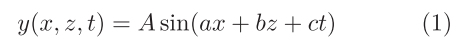

# Temporal and spatial anti-aliasing for rendering reflections on water waves

***Computational Visual Media   2021***

## 1. 介绍

**海洋模拟和渲染**在计算机图形领域已经研究了40年。该研究可以模拟各种天气条件下的海洋，并在三维空间中**与实体物体实时互动**。然而，在实时海洋渲染中仍然存在许多问题，其中一个问题是：渲染水面反射时的**锯齿和闪烁**。在传统的渲染算法中，每一帧都是以**离散的时间步长**独立渲染的，这就造成了**严重的时间锯齿**。本文重点讨论这个问题，许多方法已经被提出。它们可以提高渲染方法的**保真度和效率**。然而，它们的重点是空间抗锯齿，大多数都没有解决**时间上的锯齿问题**，特别是在渲染**有波浪的水面上的光源反射**时观察到的问题。在本文中，假设水波被表示为**正弦波的总和**，而**光源是一个球体**，提出了一种可以同时消除空间和时间锯齿的方法。

基本思想是：计算光源与**相邻帧的两个反射矢量所形成的平面**的交点。这提供了光源在水面上可见的短暂时间。作者将这一想法与**传统的空间抗锯齿方法**相结合。

## 2. 方法

### 2.1 前瞻

如前所述，作者假设**水波**被表示为：**不同频率和方向的正弦波之和**。对于每个像素，本文的方法首先将水波分解为**低频和高频**两个空间频段，分别是**时域抗锯齿**和**空间-时间抗锯齿**。**高空间频率分量**由于**采样不足**而导致**空间锯齿**，也可能由于其**运动**而导致**时域锯齿**。作者针对这两个频段分别给出了两种方法，即**时间-锯齿`wave`渲染**和**空间-时间-锯齿`wave`渲染**，并在它们之间做了**平滑过渡**。两种方法的基本思路对每个正弦波都是一样的，但在第二种方法中，**球形光源被模糊化**，以考虑`aliasing waves`到对`BRDF`的影响。

### 2.2 Spatial-aliasing detection

作者使用==`clamp`抗锯齿方法==将水波分解为**时间锯齿`wave`**和**空间-时间-锯齿`wave`**。根据采样理论中的==奈奎斯特定理==，为了避免锯齿，空间采样频率必须高于**水波最高频率的两倍**。在这里，意味着**像素的分辨率**应该是投射到屏幕上的水波波长的两倍。因此，当**水波**被投射到屏幕上时，**水波必须在一个波长内覆盖至少两个像素**。如果一个波不符合这个标准，那么它就会引起锯齿。

对于每个像素，我们计算出每一个正弦波**在屏幕上的投影波长**。然后，每个正弦波根据**奈奎斯特频率**，被划分为**时域锯齿**（下文简单称为`non-aliasing`）或**空间-时间锯齿**（下文称为`aliasing`）。只包含非锯齿波的像素和包含锯齿波的像素将被**两种不同的渲染方法**处理，产生的结果略有不同。

两种类型的波浪之间的**突然过渡**会在有锯齿波和无锯齿波的像素之间的边界上产生**外观突然变化的弧线**。为了防止这种情况，作者使用`soft classification`来平滑地混合两种方法的结果（后续详细介绍）。

### 2.3 Temporal-aliasing wave rendering

对于一个**只包含非锯齿波的像素**，我们在水面上取样一个**与像素中心相对应的点**，并计算当前帧和前一帧之间的**反射光的贡献**。我们假设**球形光源**离采样点很远，因此它与每个采样点的**实体角度相同**，并由一个**面向采样点的圆盘**表示。这个圆盘是光球在**垂直于从采样点到光球中心的线的光平面**上的投影。通过使用前一帧和当前帧的**法向量**，计算出**两个反射向量**。然后，我们计算出光盘和由这两个反射向量形成的平面之间的交点，如下图所示。这**两个反射向量之间的光盘贡献**可以按以下方式计算：

- 首先，我们计算两个反射向量与平面之间的两个交点$p_c$和$p_p$。
- 接下来，我们计算$p_c$$p_p$和光盘之间的**重叠线段**。
- 然后计算$p_c$$p_p$所对应的`arc`（全弧）和重叠线段所对应的`arc`（光弧）。==光源在连续帧之间的分数贡献==是以**光弧的角度与整个弧的角度之比**得到的。

### 2.4 Spatio-temporal-aliasing wave rendering

对于一个包含锯齿波的像素，每个像素的一个采样点是不够的。我们必须考虑到**表面法线的分布**，计算出像素区域内**反射光的平均强度**。一个直接的解决方案是**为每个像素生成多条射线**，这大大增加了计算时间。相反，作者借用==LEAN映射技术==的思想来进行有效的计算，它用**高斯分布**来逼近分布。然而，这种近似方法会去除表面的细节，**模糊反射结果**，这使得**时间性的反射变化**不那么明显。因此，作者的方法假设**锯齿波在时间上是不变的**，只有==非锯齿波对像素的反射结果贡献了时间上的变化==。

对于一个包含两种类型的波的像素，我们需要解决**来自锯齿波的空间锯齿**和**来自非锯齿波的时间锯齿**。为了消除空间锯齿，作者的方法将**锯齿波**近似为其**表面法线的一个分布函数**。这个分布本身并不随时间变化，但根据假设，它被**非锯齿波的法线**所转化。下图显示了==空间-时间-锯齿`wave`渲染==。

首先计算**锯齿波的法线分布函数** （`NDF`）。`NDF`被定义为`x-z`平面上的**法向量分布**。让我们考虑下面这个**单一正弦波的NDF**：

其中`A`是振幅，`t`是时间。`wave`向量 $(a,b)$ 决定了**波的波长和方向**，`c`与`wave`向量一起决定了**速度**。作者用**NDF平面**上的一个点 $n$ 的==二维椭圆高斯函数==来近似`NDF`：

其中$n_c$是对应于**无锯齿波的法向量（即低频分量）的点**，是NDF平面上**高斯的中心**。`Σ`是椭圆高斯的**协方差矩阵**，可以用**均匀法**（`uniform method`）和**每像素法**来表示。

`uniform method`假设每个锯齿波在每个像素内**有其整个波周期**。因此其`Σ`可以表示为：

其中，$\sigma_x=Aa/\sqrt{2}$、$\sigma_z=Ab/\sqrt{2}$。

==每像素方法==在像素内找到**正弦波的起点和终点**。其中`Σ`可以更准确地定义，但计算量会增加。**协方差矩阵**`Σ`可以用以下方式代替表示：

其中，$p_1$和$p_2$分别是像素内的**波的起点和终点**。然而，像素内每个波的$p_1$和$p_2$随位置变化。为了简化问题，作者只考虑**像素中心的位置**。方程`5`和`6`可以用**分析法**解决，但为了节省空间，作者在这里省略了细节。附录A给出了方程的解，并更详细地解释了如何找到$p_1$和$p_2$。

将上面计算的`NDF`转换到**反射空间**，得到**反射分布函数**（`RDF`），它表示**反射方向的分布**。`RDF`定义在垂直于光源中心的单位方向矢量的光平面上，并位于该单位矢量的端点，如下图所示。

让我们考虑一个函数$\Phi$，它将`NDF`平面上的点`n`映射到光平面上的`r`点，即$r=\Phi(n)$。通过对图`7`的几何分析，可以得出$\Phi(n)$，如下所示：

其中`v`是视线方向，`L`是光线方向。$\Phi$是一个**复杂的非线性函数**，所以作者采用一阶近似。让$n_c$是`NDF`的中心，$r_c=r(n_c)$是`RDF`的中心，$g_n=n-n_c$。那么，近似值为：

其中，$J_c$是在$g_n=0$时计算的$\phi(g_n)$的**雅各布矩阵**。$\phi(g_n)$是一个将**NDF平面上的点** $g_n$ 映射到光平面上的点$g_r=r-r_c$的函数。那么，$\Phi^{-1}$可以被近似为：

有了这个**线性近似**，`RDF`也可以用**另一个椭圆高斯函数**表示，其**协方差矩阵**为 $\sum_r$。也就是说，`RDF`可以表示为：

 

我们现在可以用`RDF`和`light disk`的卷积来计算**反射光的强度**。为了消除时间上的锯齿，需要计算各帧之间时间间隔的**平均强度**。因此，强度`I`由以下公式给出：

其中，$L_l$是**光源的辐射度**，`T`是各帧之间的时间间隔。`D`代表光盘内的圆形区域。请注意，包括`RDF`的时间参数$t^*$，以明确表示其时间变化。

优化行为更多见论文。

### 2.5 Circular Gaussian approximation

对于**圆形高斯**，需要预先计算公式`17`。因为这个卷积是**圆形对称的**，所以可以用**三个参数**来预计算这个积分：包含该段的线与卷积中心的最近距离，该段在该线上的起始位置，以及结束位置。同时考虑到`RDF`的方差$\sigma^2$，这得到了四个参数。

幸运的是，可以将这些参数减少到`3`个。**直线段积分**可以分为四种情况：开始和结束在外面但切过卷积的段，开始在外面但结束在卷积内的段，开始在里面和结束在外面的段，开始和结束在卷积内的段。**第一种情况**有一个参数，即**段与卷积中心的最近距离**；第二种情况有两个参数，分别是段与卷积中心的最近距离和段的终点位置。

第三种情况有前面提到的三个参数。然而，可以通过以下方法来计算第三种情况下的积分：首先找到一个从无限距离开始的线段上的积分，并在经过积分线段的起始位置时去到终点位置。然后，我们再减去同一条线上的另一个积分，这个积分从无限远的距离开始，一直到该段的起始位置。换句话说，**第三种情况的积分可以被计算为两个第二种情况的积分之差**。因此，我们只需要预先计算第一和第二种情况，第一种情况是第二种情况的特例。第二种情况需要两个参数，即最近的距离和线段的终点位置。因此，当也包括**方差**时，我们可以将**线段积分**存储在一个**三维纹理**中。

让我们考虑在光平面上的局部坐标`UV`，原点在光盘的中心（见图8）。由于圆形对称，可以假设线积分的线段平行于`U`轴，与`V`轴相交于`V=v`，在图中显示为一条粗黑线段。圆形高斯`RDF`的中心沿着积分线移动。我们的方法对各种变体进行了**预计算**，如下表所示：

其中，$F(u,v,\sigma_r)$对应于公式`17`的内积分，即光盘与**中心在(u, v)的圆形高斯**的卷积。`R`是一个大值，选择它使得$F(R,0,\sigma_r)$足够小。有了这个表，由公式`17`表示的强度可以通过以下方式得到

### 2.6 Elliptical Gaussian approximation

我们需要将**椭圆高斯RDF**近似为**圆形高斯**，以便将**预计算的表格**保持在**3维**，从而能够使用GPU上的硬件支持。然而，当一个`RDF`沿着它的一个轴线有一个非常细长的分布时，这种近似就失去了准确性，**当观察方向接近地平线时就会发生这种情况**。因此，作者用一种类似于==Feline mapping==的方法对**椭圆高斯RDF**进行了更近似的处理，该方法使用**多个圆形高斯核**来近似**一个椭圆高斯核**。作者改进了文献中的方法，通过非线性优化**圆形高斯核的权重、中心位置和方差**，使它们的组合尽可能地与**椭圆高斯RDF核**匹配。下图说明了这个想法。这种拟合的细节在**附录C**中给出，并产生了圆形高斯参数的曲线拟合。

当渲染场景时，在获得了`RDF`之后，通过将`RDF`按**主轴方差的比例**插入每个参数的曲线拟合方程中，作为主轴方差的函数，找到**最佳的圆形高斯核参数**。接下来，将**最优参数**缩回到原始尺度。然后，找到**每个圆形高斯核的线段**，通过**从RDF中心到每个圆形高斯核中心的向量**将该线段与原始线段相抵消。图10显示了一个有三个圆形高斯核的情况下的线段偏移的例子。最后，用**圆形近似方法**找到每个圆形高斯核的调整后的线段结果，并根据**未缩放的最佳权重参数**进行组合。

然而，这种方法有一个局限性：**一个形状更细长的椭圆高斯核**将需要**更多的圆形高斯核**，这就增加了计算时间。为了有稳定的性能，使用**固定数量的圆形高斯核**（在实现中是`9`个）。

### 2.7 Aliasing wave transition

本文方法对**非锯齿波**和**锯齿波**的处理方式不同。**非锯齿波**用于确定**表面的时间变化**，而锯齿波则由**高斯RDF近似**处理。然而，这种近似，在**空间-时间-锯齿`wave`渲染**中，会导致结果出现**视觉伪影**。当使用**奈奎斯特极限**对每个像素内的每个波的类型**进行分类**时，会导致两种类型的波的渲染结果不同。这种转换太突然了。如图11(b)所示，这两个像素之间的差异将是明显的。为了防止这种情况，作者不使用**奈奎斯特极限**，使用**软分类**来平稳地从非锯齿波到锯齿波。作者创建了一个过渡区域，其**分化值** $\alpha$ 介于`0`和`1`之间。过渡区域在频率空间中，在达到**奈奎斯特极限**之前停止。该区域内的任何波都被认为包含了**非锯齿波和锯齿波**，权重分别为 $\alpha$ 和  $1-\alpha$。如果过渡区域在频率空间中的宽度为 $\delta$，且奈奎斯特极限为$f_n$，则过渡区域从$f_n-\delta$开始，在$f_n$结束。在该区域内频率为`f`的波有一个过渡值$\alpha$，由以下公式给出：

## 3. 实现

Todo

## 4. 结果

