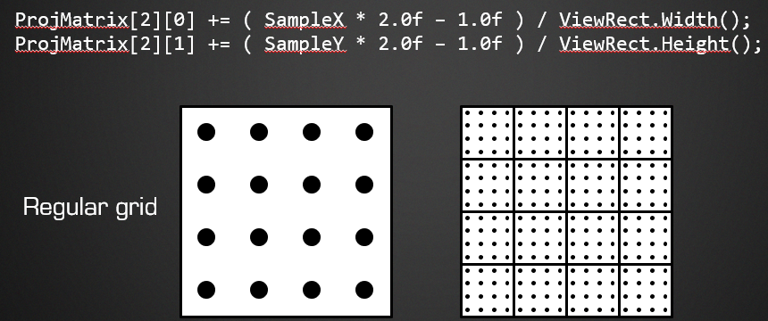
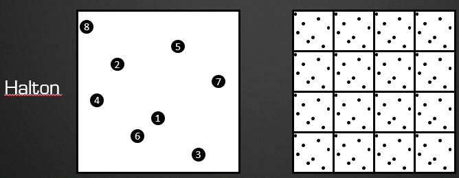
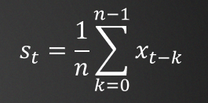
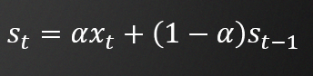

# 静态场景

## 1. 抖动

首先，讲的是抖动，之前其实我也不太明确采样抖动在哪里完成，一个想法是：在像素着色器里面，给UV坐标一个偏移量。但这里给出了一个不一样的方法，在**投影矩阵**中进行偏移：

以$4 \times 4$为例子，`SampleX`和`Y`根据需要在$[0.2,0.4,0.8,1.0]$中取值，达到抖动的效果。

当然，以上是`uniform`方式，对于**随机模式**，我们应该采用==低差异序列==。具体方法上，和以上差不多，不过`SampleX/Y`应该是低差异序列的结果。

## 2. 颜色平均

首先是比较常见的`2`个累加方法：

- 平均`simple moving average`

  

- 指数（最常见）`exponential moving average `

  

如果`α`变小，`exponential moving average `将接近`simple moving average`，这就是我们想要的。一个简单的思考方式是：混合系数越小，连续样本之间的权重差异就越小。

## 3. 什么时候平均

| tone mapping之前                   | tone mapping之后               |
| ---------------------------------- | ------------------------------ |
| 物理上正确的位置                   | 所有后处理过滤器闪烁           |
| **明亮值**占主导地位               | Aliased input → aliased output |
| 在样本数量有限的情况下，锯齿很严重 |                                |

一个直接的方法：Hybrid of before and after。

// todo

## 4. 重建过滤核

`BOX`效果太差。

由于我们的样本数很低，**带有负叶的内核**效果并不好，所以我们使用`Blackman-Harris`滤波器。每个像素都有相同的抖动，所以滤波器的权重是在`CPU`上计算的。

# 动态场景

## 1. 速度

·
