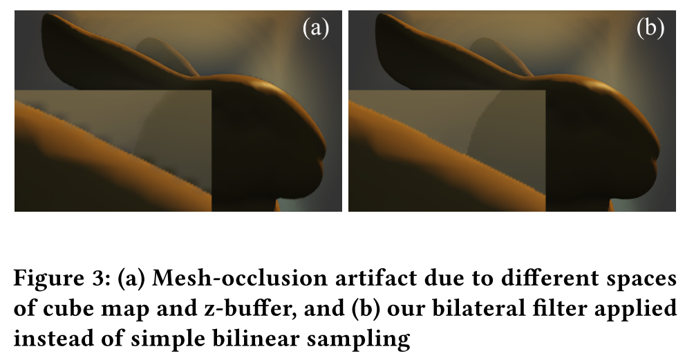

# Viewport-Resolution Independent Anti-Aliased Ray Marching on Interior Faces in Cube-Map Space

## 1. 介绍

`Ray marching`是体积数据可视化的一个典型方法，它可以表达**云、烟雾流体和其他厚重的半透明物体**的渲染效果。与简单的网格-表面着色相比，由于对三维体积纹理的每个`pixel`的**多次采样访问**，`Ray marching`的体积渲染的计算量更大。

在传统的屏幕空间`Ray marching`中，**采样数量对渲染性能和质量有着敏感的影响**。对于高分辨率的视口来说，**过于稀疏的采样会导致明显的锯齿伪影**。因此，开发者不得不强制将采样次数的下限与视口的分辨率相耦合，而这将导致性能的严重下降。对开发者来说，**性能和质量的权衡是很麻烦的**，迫切需要一种==**视口分辨率解耦的光线行进方法**==。

通过**直接的屏幕空间方案**来控制`Ray marching`的性能是不容易的，作者想到了间接地在一个**固定分辨率的`imposter`**上进行`Ray marching`。然而，使用**2D广告牌**作为`imposter`有点不可靠，因为**投影体积的边界矩形**是变化的。此外，**在屏幕空间中简单地放大一个广告牌可能会引起`texel aliasing`**。然后，作者想到了在`cube-map faces`上进行`Ray marching`的想法，这是一种==特殊形式的纹理空间着色==。这些年，==纹理空间着色==（`texture-space shading`）被普遍用于**虚拟现实的时空一致性（spatial-temporal coherence）**，它可以解耦视口分辨率对性能的影响，但它会引入**重复的工作负载**来处理**不可见纹理**。因此，==可见性剔除==往往是纹理空间着色的**必要伴随过程**。

本文的主要技术贡献是提出了`indirect cube-map ray marching`方案，以及与之相关的**可见性剔除**、网格自适应细节级别（`LOD`）优化和**使用硬件射线追踪的`multi-volumes rendering`**。

## 2. 技术

基本思想是在`cube-map imposter`的内部面为每个像素部署`Ray marching`，然后通过**立方体映射**（通过方向向量的纹理采样）绘制**立方体内部面**，在视口上放大**行进的结果**。作者提出了一个`3`个`pass`的渲染管道。

- **`Light map generation pass`**。 从`3D light map`的每个体素，向光源投射一条光线，进行光线行进，求得**透射率**。
- **`Cube ray marching pass`**。 作为核心`pass`，对`cube-map faces`上的每个像素，从观察者的位置投下一条光线，并在**局部体积空间**（$[-1,1]$）中用**逆世界变换**进行`Ray marching`。
- **`Cube resampling pass`**。 作者在视口上画出一个**立方体的内部面**，并通过**简单的立方体映射**对`Ray marched`的`texels`进行**重采样**。

### Interior versus Exterior Faces

当提到`cube-map space ray marching`时，对表面（外部面）着色是一个直接的想法。在这个方案中，最多只有`3`个可见面。然而，当观察者靠近**立方体的角落**时，会产生明显的`texel-aliasing artifact`（图2 `a`），这是**由于透视投影在近观察者区域的采样不足**。而使用**内部面**，则可以消除该伪影（图2`b`）。因为远处面的`texel`着色率可以超过屏幕上的像素采样率，同时有最大的`5`个可见面来容纳更多的`texel`数据。

对于**内部面方案**，不可见的面可以提前剔除。作者生成一个`8`位的可见面`mask`，每个可见位可以通过以下条件方程快速计算：

其中，`E`是转化为`local cube map space`的观察者位置，其索引（函数参数）分别指组件：$x=0、y=1、z=2$。

### Mesh Occlusions

当渲染一个**混合网格和体积物体的场景**时，不透明网格的绘制过程将产生一个**深度缓冲区**（`z-buffer`），用于**遮挡剔除**，称为`z-test`。在`Ray marching`过程中，获得由**深度投影**（`depth-unprojection`）得出的**网格-遮挡位置**，以`clamp`最大射线长度$T_{max}$，用于剔除遮挡的`ray steps`。如果使用直接的**屏幕空间`Ray marching`**，`z-buffer`和视口是在同一个空间，其像素是**一对一的耦合**。而使用`cube-map space ray marching`，光线投射的空间与`z-buffer`完全不同，具有不匹配的渲染和采样率，从而导致网格遮挡的伪影，如图3`a`所示。

为了消除这个假象（图3`b`），作者在**重采样过程**中对`cube map`的样本做了一个$2×2$的**微小双边滤波器**。作者收集$2×2$的原始样本，然后通过以下公式过滤每个样本。

其中$s_{raw}$和$w_{bilinear}$分别表示原始样本`i`和它的**双线性权重**。$w_z$是**双边滤波器的边缘停止功能**，其中$z_{buffer}$和$z_{cube}$是分别来自`z-buffer`和`cube map`的**线性深度值**，$k_z$是一个**调整系数**（在实验中默认为`0.5`）。因此，需要引入另一个`cube depth map`，并在`cube-map space ray marching`的过程中把`z-buffer`的数据混合（用**最近邻过滤器采样器**来转移）到其中。

### Adaptive Level of Details

当体积远离观察者时，作者可以将`Ray marching`的分辨率降低到一个**更粗的水平**，以进一步提高性能。作者总是可以根据**体积的位置**计算出立方体地图分辨率和**`Ray marching`采样数**的理想值。然而，开发人员通常希望限制`cube map`的分辨率（`MIP Level 0`的大小）和采样次数的上限，以控制**性能质量**。因此，作者设计了一个程序来计算优化的`cube map` `MIP Level`，以满足上述要求：

1. 首先将**立方体的`8`个角的顶点**投射到**视口空间**，并将它们储存起来，以便以后进行**顶点索引**。

2. 通过对**投影顶点的索引**将**顶点对**耦合成边，并以像素为单位计算**边的长度**。

3. 选择立方体的**最大边缘长度**，并将其作为理想的`cube map`分辨率$S_{ideal}$，同时得出理想的采样量$N_{ideal}$：

   

   其中，`P`表示**投影的顶点位置**，其边缘的开始和结束索引用$e_{begin}$和$e_{end}$表示；$k_u$和$k_c$分别是用户指定的额外的**屏幕向上缩放**和**采样计数缩放系数**。

4. 作者用**用户指定的最大采样数**$N_{max}$来`clamp`理想的采样数$N_{ideal}$，得到**实际的采样数**`N`，并反过来得出**立方体地图**的分辨率`S`。

   

5. `cube map` `MIP Level`（LOD）最终可以通过$\xi=\max{([log_2S/S_0])}$来计算，其中，$S_0$是`MIP Level 0`的大小。

### Ray-traced Multi-volumes Rendering

对于**实时的多体积渲染**，作者利用间接计算来**归档**（`archive`）**体积粒度的可见性剔除**，并利用**硬件光线追踪**来保证**与顺序无关的透明度**。

首先，作者通过调度**计算着色器**来增加一个**抢占式的体积剔除通道**。对于每个体积，`8`个线程被调来处理体的**视口-可见性剔除**、**顶点投影**、每个线程`2`条边的边长计算、立方图`LOD`计算、体分类和立方面可见性掩码生成。在`LOD`确定后，增加了一个**新的体积分类步骤**。它首先计算**`cube map`的总可见像素**和**直接投影体积的像素数**，然后比较它们以确定**间接`cube map`**和直接屏幕空间射线步进之间的优化方案。这个`pass`的最终输出可以被编码为一个`16`字节的描述符，包括体积实例ID、体积源ID、光线采样数、LOD、渲染方案和立方体表面可见度掩码。

随后，完成了对所有的`Cube ray marching pass`的传递。用立方体地图方案标记的可见体。最后，作者为所有可见体绘制立方体内部面，作为不透明对象。对于最近一层的每个可见体，如果它有立方体地图空间中的光线行进结果，作者就直接获取该结果，否则作者就部署屏幕空间的光线行进。然后，对于每一个栅格化的像素，作者启动内联射线查询，追踪下一层中透明物体遮挡但可见的体积像素，并以类似于最近一层的方式对它们进行着色。作者使用内联射线查询对其余各层重复射线追踪过程，并完成所有可见体的着色。

随后，对所有用`cube map`方案标记的**可见体块**完成`Cube ray marching pass`。最后，为所有可见的体块绘制**立方体的内部面**（作为**不透明的对象**）。对于最近层中的每个可见体，如果它在`cube map`空间中有射线移动直接获取结果，否则屏幕空间射线移动。然后，对于每个光栅化的像素，作者启动**内联射线查询**来跟踪下一层中**透明物体被遮挡但可见的体积像素**，并按照与最近的层相似的方式对它们进行着色。

