# Eye-dominance-guided Foveated Rendering

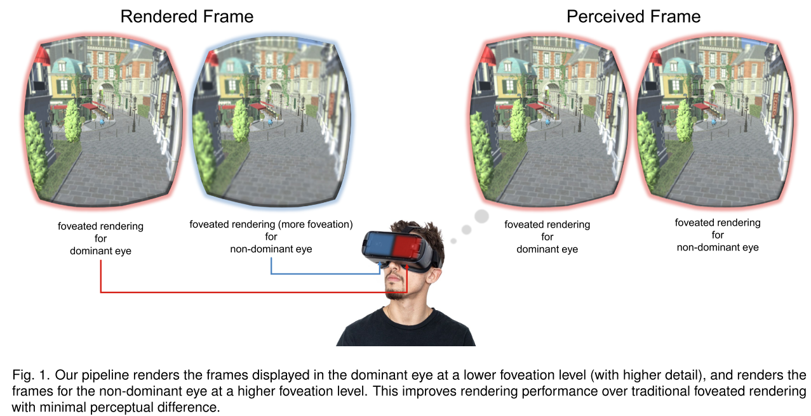

## 1. INTRODUCTION

人类的==视觉系统==往往更喜欢一只眼睛的视觉刺激，而不是另一只眼睛[29]。这种现象被称为==眼优势==。==优势眼==在视敏度、对比敏感度、颜色辨别、视觉管理和运动功能方面优于==非优势眼==。

由此，本文提出了==优势眼--中心渲染技术==

## 2. OUR APPROACH

### Foveation Model

作者使用==核中心渲染==，该模型通过**两个**简单的参数来参数化`foveation`：==帧缓冲参数==$\sigma$控制要渲染的**帧缓冲**（frame buffer）的宽度，从而控制`foveation`的`level`；==核函数参数==$\alpha$控制像素的分布。

==KFR模型==包括两个`pass`，在第一个`pass`中，渲染器将==G-buffer==中的渲染材质（世界位置、纹理坐标、法线贴图、反照率贴图等）从**笛卡尔坐标**转换为**核对数极坐标**（`kernel log-polar coordinates`）。由于变换过程中的**非均匀尺度效应**，保留了`foveal region`的细节，减少了`peripheral region`的细节。

给定一个分辨率为$W\times H$的屏幕，对于每个像素坐标$(x,y)$和中心坐标$F(x^o,y^o)$，定义$(x^/,y^/)$为：{**1**}

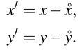

==KFR模型==将点$(x^/,y^/)$变化到**核对数极坐标空间**下的$(u,v)$，通过如下公式：{**2**}

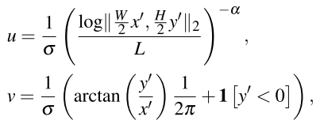

其中==L==是$F(x^o,y^o)$到屏幕最远角落的**最大距离**的对数：{**3**} {**4**}

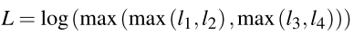

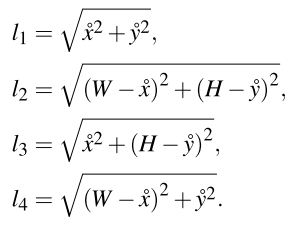

在第二个`pass`中， **渲染器**将渲染场景从**内核对数极坐标**转换为**笛卡尔坐标**，并渲染到全分辨率屏幕：{**5**}

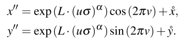

建议**内核函数参数**为$\alpha=4$。因此，可以通过改变$\sigma$参数来控制`foveation`的`level`

### Eye-dominance-guided Foveated Rendering

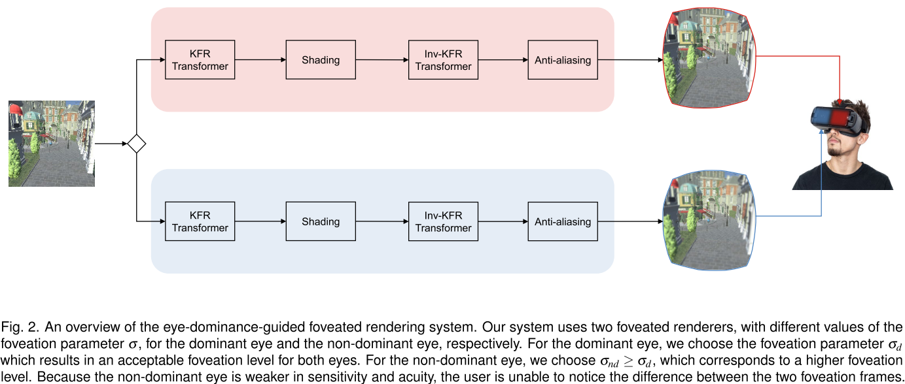

以往对**优势眼**的研究表明，**非优势眼**在灵敏度和敏锐度上弱于**优势眼**。在这里，作者建议：**非优势眼**能够接受更高水平的foveation。

==EFR系统==的流程可见上图:arrow_up:。对**优势眼**使用参数$\sigma_d$，对**非优势眼**使用$\sigma_{nd}$。==KFR算法==中，参数$\sigma$控制要**渲染帧缓冲区**的宽度，**渲染时间**与**渲染缓冲区**的面积成比例。换句话说，呈现时间与$\sigma^2$成反比。假设原始帧对每只眼睛的渲染时间为T，则：

- 当$\sigma_d=\sigma_{nd}$时，KFR的==期望渲染时间==为：{**6**}

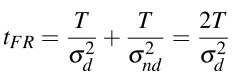

- 当$\sigma_d \neq\sigma_{nd}$时：{**7**} {**8**}

    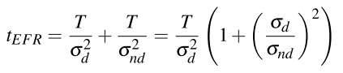

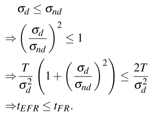

因此，当$\sigma_d<\sigma_{nd}$时，优势眼与非优势眼的**中心渲染差异**不可感知，可降低==头戴显示器==的渲染时间。下式给出了**EFR**所实现的理论加速：

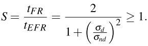

## 3. USER STUDIES

作者进行了两项**用户研究**：一项是**初步研究**，另一项是**主要研究**，以确定与==非中心渲染==相比，**眼睛主导的中心渲染**可以产生感知上无法区分的结果。

### Apparatus

研究设备由一台带有NVIDIA GTX 1080的Alienware笔记本电脑和一个FOVE头戴显示器组成。FOVE耳机集成了120赫兹==红外眼球追踪系统==和2560*1440分辨率屏幕（每只眼睛$1280\times1440$）。作者使用**XBOX控制器**在参与者和系统之间进行交互。用户研究在一个安静的房间里进行。如图3所示，计算机生成的环境包括2个壁炉房场景和8个来自Amazon Lumberyard Bistro的场景。这些场景是用Unity游戏引擎渲染的。为了确保参与者熟悉用户学习系统，作者要求参与者，在正式测试前完成测试的所有任务，并完全熟悉交互。

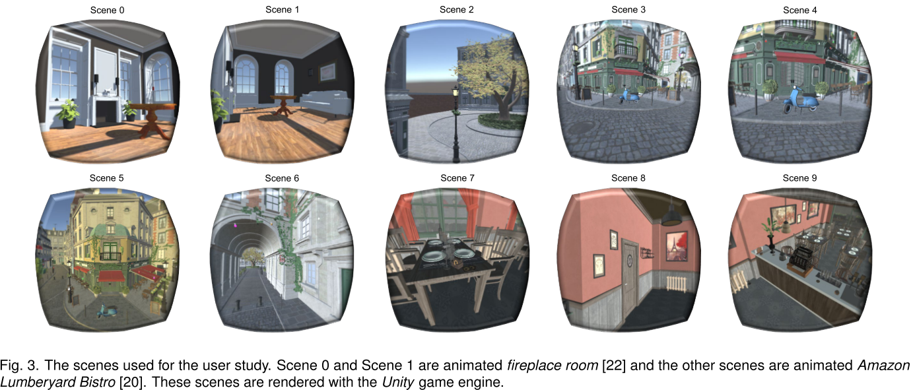

### Pre-experiment: Dominant Eye Identification

首先，参与者将手臂伸到身前，双手并拢成**45度角**，在拇指和食指之间形成**三角形开口**。然后，两眼睁着，把三角形的开口对准离他20英尺远的目标物体。然后，==TP==闭上左眼，睁开右眼。最后，TP闭上右眼，左眼睁开。如果目标物体保持居中且右眼睁着，并且不再被他们的手所控制而左眼睁着，那么右眼就是他们的主视眼。如果目标物体保持居中，并且左眼睁开，并且不再被右手框住，那么左眼就是他们的主视眼。

Miles测试对每个参与者执行两次，作者记录TP的主眼并相应地配置渲染器。

### Pilot Study

在初步研究中，作者进行了**滑块测试**和**随机测试**。每个测试包含==两个步骤==：

- 参与者估计均匀的Foveation参数$\sigma_{UF}$，对优势眼和非优势眼都是可接受的。把这个条件表示为$\sigma_d=\sigma_{nd}=\sigma_{UF}$;
- 参与者通过增加**非主导眼渲染**的中心水平（减少整体细节）来估计**非主导眼**的中心参数$\sigma_{NF}$，该参数会导致与==均匀中心==相同的**整体视觉感知**。我们将这个条件表示为：$\sigma_d=\sigma_{UF}$，$\sigma_{nd}=\sigma_{NF}$。

#### Participants

招募了17名参与者（5名女性），年龄至少18岁，视力正常或矫正至正常。大多数参与者都有过一些虚拟现实的经验。在用户研究之前，没有参与者参与这个项目

#### Slider Test

==滑块测试==允许参与者自己修改**中心区域**。作者用五个不同的场景进行测试，每个场景一个试验。作者提出==两步研究方案==如下：

- :one:估算$\sigma_{UF}$：在每个试验中，作者首先向**参与者**提供==全分辨率渲染==作为参考。在此基础上，对被试的双眼呈现相同的**视场**，并允许**被试者**自行调整**视场大小**：从最高的视场大小（$\sigma_d=3.0$）开始逐步降低视场大小（步长为0.2）。参与者可以在==中心渲染结果==和参考图像之间来回切换，直到到达最小的$\sigma_{UF}$，而在视觉上等同于参考图像。
- :two:估算$\sigma_{NF}$：在每个试验中，作者为**被试者**提供了以$\sigma_d=\sigma_{UF}$为优势眼的**聚焦渲染图**，并允许**被试者**调整非优势眼的聚焦水平。从$\sigma_{nd}=\sigma_{UF}$开始，参与者可以逐步增加foveation水平（步长为0.2），直到达到最高的foveation水平的$\sigma_{NF}$，该水平在知觉上与==均匀的foveation参数σUF==等价。

#### Random Test

随机测试允许**参与者**以随机序列的不同参数，来评分==中心渲染==的质量。用五个不同的场景进行测试，每个场景一个试验。下面将详细介绍这两个步骤：

- :one:估算$\sigma_{UF}$：在每次实验中，给参与者两个帧：(1)全分辨率渲染，(2)$\sigma_d=\sigma_{nd}=x$的中心渲染，其中x是从==σ参数数组中==选取的，$\sigma$值在`1.2 ~ 3.0`之间，步长为`0.2`。这两个帧是随机排列的。我们要求参与者在不限制的时间内，对他们观察到的两帧之间的差值进行评分，以做出决定。==SUF得分==包含五个信心水平：5代表知觉相同，4代表最小知觉差异，3代表可接受知觉差异，2代表可注意知觉差异，1代表显著知觉差异。

    采用==两两比较==的方法，参与者以**随机顺序**完成`1.2≤x≤3.0`的试验。我们选择最大的x，即：{**10**}

    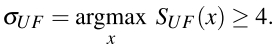

- :two:估算$\sigma_{NF}$：在每个试验中，给参与者两个帧：(1)中心渲染，$\sigma_d=\sigma_{nd}=x$；(2)中心渲染，$\sigma_d=\sigma_{UF}$，$\sigma_{nd}=x$，x同上。SNF分为5个置信度等级：5代表知觉相同，4代表最小知觉不平衡，3代表可接受的知觉不平衡，2代表明显的知觉不平衡，1代表显著的知觉不平衡。

    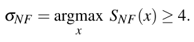

#### Results and Limitations of the Pilot Study

从初步研究中，作者发现：对于大多数用户来说，==主视眼==显著支配着**视觉感知**，因此，由主视眼引导的聚焦渲染有可能实现显著的加速。还观察到，$\sigma_{UF}$和$\sigma_{NF}$与场景的选择在统计意义上并不相关。

### Main Study

在主研究中，进行了滑块测试和随机测试。这两个测试都有==三个步骤==：

- 估计均匀Foveation参数$\sigma_{UF}$；
- 估计非优势眼中心参数$\sigma_{NF}$;
- 参与者定性地评估σd =σUF， σnd =σNF的==EFR框架==是否在感知上与RR或传统的==KFR==相同。

#### Participants

招募了11名参与者(4名女性)，年龄至少18岁，视力正常或矫正至正常。大多数参与者都有过一些虚拟现实的经验。在用户研究之前，没有参与者参与这个项目。

#### Slider Test

- :one:估算$\sigma_{UF}$：在三个场景中进行测试，每个场景进行三次试验。所以总共有9个测试。在场景m的第n次试验中，我们首先向参与者呈现全分辨率渲染，作为参考。在此基础上，我们对被试的双眼呈现相同的视场，并允许被试自行调整视场大小：从最高的视场大小(σd = 3.0)开始逐步降低视场大小(步长为0.2)。参与者可以在聚焦的渲染结果和参考图像之间来回切换，直到他们能够识别最低的聚焦水平$\sigma_{UF}(m,n)$。计算了场景m的平均均匀foveation参数以及整体平均参数：

    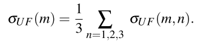

    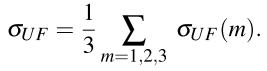

- :two:估算$\sigma_{NF}$：同上

- :three:Quality evaluation：对10个场景进行==A/B测试==，每个场景进行2次比较(EFR vs. KFR, EFR vs. RR)，每个比较场景进行1次试验。一共有20次试验。对于场景m，我们向参与者提供了两个框架:(1)当σd =σUF时的EFR， σnd =σNF，以及(2)当σd =σnd =σUF时的RR或KFR。这两帧是随机排列的。然后我们让参与者给他们在无限制的时间内观察到的两帧之间的差值打分。分数S(m)包含5个置信水平:5代表感知相同，4代表最小感知差异，3代表可接受感知差异，2代表显著感知差异，1代表显著感知差异

#### Random Test

同上。

### Validity Test

作者从==HMD==中收集了眼球追踪数据，并将其作为高水平验证，以确保参与者聚焦在期望的==中央位置==。但是，我们注意到在这个过程中存在明显的跟踪错误：有时==眼动仪==无法捕捉到注视的运动，有时当用户注视屏幕中心时，眼动仪跟踪的注视位置发生了变化。还需要确保用户关注的是用户研究，而不是随机选择答案。因此，仅仅依靠眼球追踪结果来判断参与者的焦点可能并不理想。作者也使用参与者的表现与**真相数据**，来确定准确性和参与者焦点。接下来讨论这个问题

作者在随机检验中随机插入30%的验证性试验，以确保前期研究和主研究数据的有效性。对于均匀foveation参数估计，向参与者提供了两种比较帧的相同全分辨率渲染结果作为验证试验；对于非主导眼foveation参数的估计，作者在两个比较帧中以相同的呈现结果（σd = σ和σUF = σ）的参与者作为验证试验。如果参与者宣称这些验证试验的相似度得分很低(3或更低)，我们会要求参与者暂停并休息至少30秒，然后继续用户研究。同时，会把这个选择记录为一个错误。如果在随机测试中出现错误5，我们将终止用户研究并丢弃该参与者的数据。基于此方案，我们从试点研究中剔除1名参与者，并将剩下的16名参与者标记为有效数据。主研究的11名参与者全部通过验证试验。

## 4. RESULTS AND ANALYSIS

在不同的实验设置下，EFR参数是稳定的。

对于使用者来说，主视眼和非主视眼的视敏度差异是显著不同的。

对于大多数用户来说，为了在常规渲染和聚焦渲染之间实现感知上的相同和最小感知差异，可以选择$\sigma_{UF}$= 2.0和$\sigma_{NF}$ = 3.0作为所需的参数

score = 1到score = 5的频次见表1。我们注意到，在滑块检验中，P(得分≥4)均≥85%，而在随机检验中，P(得分≥4)均≥95%。结果表明了==眼优势导向绘制方法的泛化性==。从用户研究中得到的测量参数可以得到不同场景下可接受的感知质量

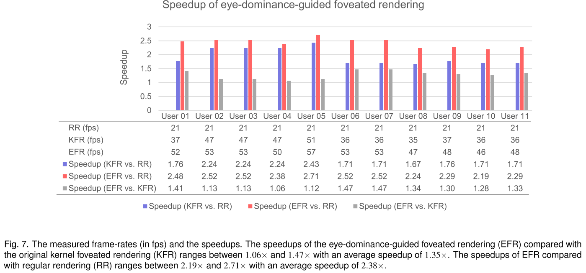

## 5. Future Directions

### Temporal Artifacts

==中心渲染==的最大挑战之一是：处理由于移动物体的时间混叠[18]、相位对齐混叠[38]和基于显著性地图的混叠[36]而产生的伪像。由于眼睛主导导向的中心渲染依赖于两只眼睛不同的中心水平，这样的挑战可能会更大。

### Personalized VR Rendering

==眼优势研究==[4]表明70%的人口是右眼优势，29%是左眼优势。因此，大多数用户都能从眼睛主导的中心渲染中获益。在个性化VR渲染方面，现有技术研究了如何利用基于耳朵形状[44]的==头部相关传输函数==来个性化虚拟环境中的空间音频。进一步的研究可能会调查如何增强用户的视觉体验，on the eye prescription。

### Further Leveraging Human Perception

视觉方向研究的一个重要论点是，存在一个判断**视觉方向**的中心或原点，称为==中央眼==。Elbaum等人的[9]证明了`cyclopean eye`的==跟踪精度==比主眼和非主眼的跟踪精度更高。Xia和Peli[42]提出了一种基于`cyclopean eye`的虚拟现实内容感知空间模型。人类视觉系统如何将两只眼睛的输入整合到一个`cyclopean eye`视觉中，以及虚拟现实，尤其是中心渲染，如何利用它来提高视觉质量和效率是非常有趣的。

