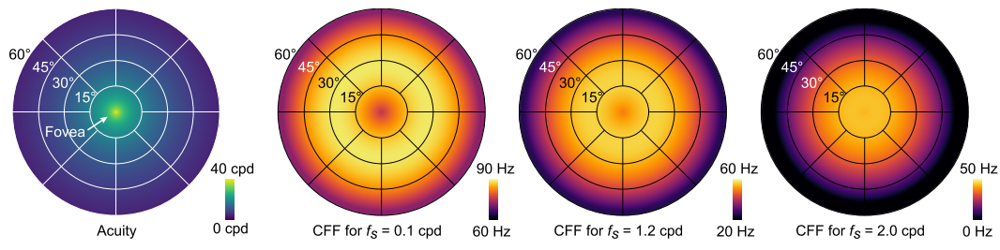

# A Perceptual Model for Eccentricity-dependent Spatio-temporal Flicker Fusion and its Applications to Foveated Graphics

## 1. 介绍

在VR/AR系统中，**焦点渲染**通过与视线相关的渲染、阴影、压缩或显示来实现。虽然所有这些方法都建立在**空间分辨率在整个视网膜上不同**上，但事实也表明，==时间分辨率也是如此==。事实上，它可能是**反焦点的**`anti-foveated`，因为它在视野的外围比在焦点处更高。这表明，进一步的**带宽节省**，可以通过利用这种**感知的限制**，用新的**视线相应的硬件或软件解决方案**来实现。然而，据我们所知，目前还没有关于人类视觉的、偏心依赖性的、时空方面的感知模型。

工作的主要目标是：通过实验测量用户数据，并通过**计算拟合模型**，充分描述`HSV`的、偏心依赖性的时间方面。具体来说，我们设计了一个**定制的高速VR显示器**，并进行用户研究，测量数据，以空间调节的方式建立==临界闪烁融合（CFF）模型==。在本文中，我们在操作上将`CFF`定义为空间-时间闪烁融合阈值的**衡量标准**。因此，与目前的焦点视觉模型不同，我们的模型预测：在一定的偏心率、空间频率和亮度下，**哪些时间信息是不可感知**。使用我们的模型，预测潜在的**带宽节省系数**比未处理的视觉信息高`3500`倍，比现有的焦点模型高`7`倍。

> 局限性概述。这项工作的主要目标是开发一个感知模型，并证明其对焦点渲染的潜在好处。然而，作者并没有提出新的焦点渲染算法，或具体的、直接使用的压缩方案。

## 2. 相关工作

//todo

## 3. ESTIMATING FLICKER FUSION THRESHOLDS

> 估计闪烁融合的阈值

为了建立一个**依赖偏心率的闪烁融合模型**，我们需要一个能够以**高帧率和宽FOV**显示刺激的显示器。

### 显示原型

我们的原型显示器是以**近眼显示器的形式**设计的，以支持**宽的FOV**。如下图所示，我们去掉了`View-Master Deluxe VR Viewer`的背板，安装了一个**半透明的光学扩散器**（Edmund Optics #47-679）来代替显示面板，作为一个**投影屏幕**。这个`View-Master`被固定在`SR Research`的头枕上，使用户能够舒适的、长时间的观看刺激物。为了支持足够高的帧率，我们选择了一个数字光投影仪（DLP）装置，将图像背投到**朝向观看者的扩散器**上。

一个中性密度（ND16）过滤器被放置在这个光路中，以将**亮度**降低到**对眼睛安全的水平**，经测量，其峰值为$380cd/m^2$。`DLP`的分辨率为$1280 × 720$，1位视频的最大帧率为`1.5` kHz，`8`位单色视频为`360 Hz`，24位RGB视频为`120 Hz`。我们将投影仪放置在与传统View-Master显示器的尺寸相匹配的位置。考虑到**镜头的放大率**，这个显示器提供了`0.1'`（角分）的**像素间距**和水平$80^◦$、垂直$87^◦$的**单眼视场**。

为了显示用户研究的刺激物，我们使用德州仪器公司提供的**图形用户界面**，将`DLP`编程为**360HZ的8位灰度模式**，这被认为足以满足对`CFF`的测量。`DLP`无法支持内置的红色、绿色和蓝色发光二极管（LEDs）**同时开启**，因此我们选择使用一个`LED`，以尽量减少**时间上复用颜色**产生伪影的可能性。此外，由于`HVS`对**中段波长**最为敏感，我们选择了峰值波长为**520纳米**、半最大值全宽为**100纳米的绿色LED**，以便最保守地测量**CFF阈值**。我们使用Python的PsychoPy工具箱和一个**自定义着色器**，将帧编码为所需的**24位RGB格式**，通过`HDMI`发送到`DLP`上，从而将帧流传到显示器上。

***刺激物***

我们希望**获得的闪烁融合模型**可以通过空间频率、旋转角度、偏心率（即与焦点的距离）、与焦点的方向和其他参数进行**参数化**。一个天真的方法是在所有这些维度上取样，但由于每个数据点需要记录多个受试者以确定**各自的CFF**，这似乎不可行。因此，类似于以前的一些研究，我们做了以下假设，以使**数据采集**变得可行：

- 左眼和右眼表现出相同的敏感度，**单眼和双眼的观察条件是相等的**。因此，我们通过遮挡显示器的左侧，将**刺激物**单眼显示给右眼。
- 敏感性是**围绕焦点旋转对称的**，即与鼻部、颞部、上部和下部方向无关，因此只是焦点的绝对距离的函数。只需从焦点开始沿**时间方向**测量刺激即可。
- 敏感性是**与方向无关的**。

这些假设使我们能够将**样本空间**减少到只有**两个维度**：偏心率 $e$ 和空间频率 $f_s$。后来我们还分析了**视网膜照度** $l$ 作为一个**额外的因素**。

另一个需要考虑的事实是，**一个依赖偏心率的模型**随着空间频率的变化而变化，必须遵守**不确定性原则**。也就是说，低空间频率不能很好地定位在**偏心率**上。例如，最低的空间频率为`0` cpd的刺激在**整个视网膜上是恒定的**，而非常高的空间频率在偏心中可以很好地定位。这种行为被小波适当地模拟了。因此，我们选择的刺激是一组**二维Gabor小波**。这些小波由以下形式定义：

其中，`x`表示显示器上的空间位置，`x0`是小波的中心，$\sigma$是高斯的标准差，$f_s$和$\theta$是**正弦光栅函数的空间频率**，单位是`cpd`，角度方向单位是**度**。 

我们在附录中提供了像素和偏心率之间转换的细节。然而，值得注意的是，我们使用了这种形式的**缩放和移位版本**，即$0.5 + 0.5*g(x, x_0, \theta, \sigma, f_s )$，这样，图案在`0`和`1`之间调制，平均灰度为`0.5`。由此产生的刺激表现出**三个清晰可见的峰值**，并平滑地融合到单一形式的灰场中，该灰场覆盖了显示器的整个视场，并在其边缘以**黑暗的背景**急剧结束。

对**Gabor小波的选择**是由许多以前的**视觉科学工作**所激发的，包括CSF的标准测量程序，以及图像处理，其中==Gabor函数==因其与`HSV`的**神经激活**相似，而被经常使用。例如，已经证明**二维Gabor函数**是哺乳动物大脑视觉皮层中的、简单细胞的**传递函数的合适模型**，从而模仿了**人类视觉感知的早期层次**。作为对参数空间尽可能**密集的采样**，同时保持我们的用户研究在一个合理的长度，我们趋向于使用**18个独特的测试刺激**，如上表所列。取样的偏心范围从$0^o$到近$60^o$，随着偏心的增加，焦点**向鼻部方向移动**，这样，**目标刺激**受镜头变形的影响尽可能小。由于**镜头失真**在最后$10^o$处变得太严重，我们选择不利用$80^o$的**水平FOV**。我们选择测试`6`种不同的空间频率，由于缺乏具有足够高的空间和时间分辨率的商业显示器，最高的频率被限制在`2`cpd。然而，应该注意的是，**人类视觉的敏锐度要高得多**；根据锥体密度的峰值为`60`cpd，根据经验数据为`40-50`cpd。限制Gabor小波范围的高斯窗口根据**空间频率**进行缩放，即：$\sigma=0.7/f_s$，这样每个刺激都表现出相同的周期数，定义了`6`个小波阶。最后，根据小波阶的半径来选择偏心率值，以便对**可用的偏心率范围**进行均匀采样，如下图所示。

**小波在时间上的调制**是通过**正弦波**改变对比度：从$[-1, 1]$开始，并加入到`0.5`的**背景灰度水平**。这样一来，在高时间频率下，**Gabor小波**就会出现在背景中**淡化**。控制刺激被调制在**180赫兹**，这远远高于所有条件下观察到的`CFF`。

### 用户研究

***参与者***

9名成年人参加了实验（年龄范围18-53岁，4名女性）。由于**心理物理实验**要求很高，只招募了几个受试者，这在类似的低水平心理物理学中很常见。本实验和随后的实验中的所有受试者都有**正常或矫正后的正常视力**，没有视力缺陷的历史，也没有色盲，但没有测试周边的特定异常。

***过程***

实验开始时，每个受试者都被告知：将他们的下巴放在头枕上，使显示器右侧中心的几个同心圆**失真最小**。然后QUEST设计的二选一强迫选择（2AFC）自适应阶梯，以随机顺序估计**每个Gabor小波的阈值**。每个`Gabor patch`的方向是在每个阶梯的开始时， 从$0^o$、$45^o$、$90^o$和$135^o$中随机选择的。在每个步骤上，受试者都会看到一个小的（$1^o$）**白色十字**，持续`1`秒，以指示他们**应该固定的位置**，然后按随机顺序，显示测试和控制刺激，每个刺激持续`1`秒。屏幕瞬间空白到**比灰色背景稍暗的灰色水平**，以表示**刺激的切换**。然后要求受试者用键盘指出两个随机排列的图案（`1`或`2`）中哪一个表现得更闪烁。通过按键也可以**重放任何试验**，并鼓励受试者在他们方便的时候休息。每个用户对`18`个刺激物进行一次测试，大约需要`90`分钟来完成。

***结果***

下图显示了各受试者的**平均CFF阈值**以及**标准误差**（竖条）和相应刺激的范围（横条）。测量的CFF值在**90 Hz**以上有一个最大值。这个相对较大的幅度可以用**Ferry-Porter定律**和显示器的**高适应亮度**来解释。以前在相应的条件下也观察到过类似的大值。

正如预期的那样，CFF在最低的$f_s$值时达到最大。这一趋势遵循**Granit-Harper定律**，预测CFF随着刺激面积的增加而线性增加。

对于较高的$f_S$刺激，我们观察到`CFF`从焦点向$10^o$和$30^o$偏心之间的峰值增加。Hartmann等人也观察到类似的趋势，包括随着$f_s$的增加和**刺激大小的减少**，峰值位置向焦点处明显移动。

## 4. AN ECCENTRICITY-DEPENDENT PERCEPTUAL MODEL FOR SPATIO-TEMPORAL FLICKER FUSION

> 一个依赖偏心率的时空融合感知模型

**测量的CFFs**在显示原型所提供的、分辨率范围内的**离散采样点**建立了一个时空闪烁融合阈值的**遮罩**`envelope`。然而，**实际应用**需要对空间频率和偏心的这些阈值进行**连续预测**。为此，我们开发了一个与偏心有关的、连续的**时空闪烁融合模型**，并与数据相匹配。此外，我们还结合现有的视力数据，将这一模型推断为包括高于我们显示所支持的空间频率，并通过调整**Ferry-Porter定律**来说明**可变亮度适应水平**。

### Model Fitting

我们测量的每个数据点都是由其空间频率偏差$f_s$，以及**所有受试者的平均CFF值**参数化。此外，它还与定位的不确定性有关，由其**刺激的半径** $u$ 决定。在我们的设计中，$u$是$f_s$的函数，对于$13.5%$的**峰值对比度截止**`peak contrast cut-off`，我们定义$u=2\sigma$， 其中$\sigma=0.7/f_s$，是`Gabor patch`的标准偏差。将模型表述为：

其中，$p=[p_0,...,p_9]\in R^{10}$ 是模型参数，$\xi(f_s)$限制了小$f_s$的偏心效应，$\tau(f_s)$相对于**常数函数截点**而言，偏移了对数$f_s$。我们在三个特定领域的观察基础上，找到一个**连续的CFF模型** $\Psi(e,f_s):R^2\rightarrow R$，适合测量结果。

首先，我们的测量结果和以前的工作都表明，==CFF的峰值位于周边区域==，通常在偏心$20^o$和$50^o$之间。对于焦点和远处的周边区域，**CFF再次下降**，形成一个**凸形**，我们将其建模为一个**二次函数**。

其次，由于**具有非常低的$f_s$的刺激**不是空间局部的，**它们的CFF**并不随`e`变化。 因此，我们强制要求对`e`的依赖性**收敛为一个常数函数**，在$f_s$低于$f_{s_0}=0.0055cpd$的情况下。

最后，按照通常的做法，对**空间频率对视觉效果的影响**进行建模，如对比度或差异敏感度[，我们对**对数模型**$f_s$进行了拟合。

在**参数优化**之前，我们需要考虑**偏心率不确定性**的影响。在我们的研究中，受试者检测到闪烁，无论其在**刺激范围内的位置**如何，$m=[e±u]$度。因此，$\Psi$在`m`范围内达到最大，并且被**测量的闪烁频率**（$f_t\in R$）所限定 $f_t\in R$。同时，对于$\Psi$在`m`范围内的变化没有任何说法，因此，在没有**进一步证据**的情况下，一个保守的模型必须假设$\Psi$在`m`范围内不低于$f_t$。这两个考虑因素限定了一个常数$\Psi$。在实践中，根据以前的工作，可以合理地假设$\Psi$在视网膜上遵循一个**平滑的趋势**，并且在`m`内几乎所有的偏心处，其值都低于$f_t$。

**保守模型**严格遵循**测量的限制**，并倾向于**高估可见闪烁频率的范围**，从而防止丢弃**潜在的可见信号**。另外，**宽松模型**遵循平滑性假设，**将测量值作为上限**。为了拟合参数，我们使用了`PyTorch`中的**Adam求解器**，由**Levenberg-Marquardt算法**初始化，我们在所有的范围内最小化了**均方预测误差**`m`。额外的约束被实现为**软线性惩罚**。为了利用**具有不可测量的CFF值的数据点**，我们在这些点上额外强制$\Psi(e,f_s)=0$。这意味着在任何时间频率下，**它们的闪烁都是不可感知的**。拟合的$\Psi$预期的效果很好。偏心率曲线在低$f_s$时变平，在大$f_s$时其峰值移到较低的`e` 。**保守的拟合一般会产生较大的CFF预测**，尽管由于其他限制因素，它并不严格遵守刺激的范围。

### 高空间频率的扩展

由于技术限制，测得的最高$f_s$是`2`cpd。同时，根据**锥体密度的峰值**和基于经验数据的`40-50 cpd`，人类视觉的清晰度上限为`60 cpd`。为了尽量减少这种差距，并将我们的模型推广到其他显示设计中，使用**现有的空间敏锐度模型**推断出**更高空间频率的CFF**。为此，我们利用**Geisler和Perry的视力模型**。它预测的偏心率`e`的视力极限`A`为：

$A(e)$预测了**空间感知的极限**。在这个绝对极限上，闪烁是检测不到的，因此，`CFF`是不确定的。我们用**零CFF值**来表示这种情况，与我们研究中的**不可察觉的刺激**相同，并强迫模型满足$\Psi(e,A(e))=0$。

### Adaptation luminance

> 亮度适应

实验是在**显示器峰值亮度的一半**时进行的 $L=380cd/m^2$。与普通VR系统 $50-200cd/m^2$的亮度设置相比，这是相对明亮的。因此，我们对**CFF的估计**是保守的，因为**Ferry-Porter定律**预测：`CFF`会随着**视网膜照度的对数水平**而线性增加。虽然线性关系是已知的，但**实际的斜率和截距**随着**视网膜偏心率**的变化而变化。然后我们应用**Stan-ley和Davies的公式**来计算这些条件下的==瞳孔直径==为

其中$a=80×87=6960 deg^2$是显示器的适应面积。这使我们能够为实验推导出**相应的视网膜照度水平**，使用$l(L)=\pi d(L)^2/4\cdot L$，并获得我们原始模型$\Psi(e,f_s)$的线性转换：

其中$L_0 = 1488 Td$是**参考视网膜照度**，$\xi(f_s)$编码低$f_s$ 的**定位不确定性**，$q = [5.71 \cdot 10^{-6}, -1.78 \cdot10^{-4}, 0.204]$是通过**完整模型**拟合得到的参数。下图显示，这个**由偏心驱动的Ferry-Porter亮度比例模型**不仅对**视网膜上的斜率变化**进行了建模，而且对$f_s$范围内的**敏感性差异**进行了很好的建模。

## 5. 实验验证

**依赖偏心的时空模型**是独特的，因为它允许我们预测：在一定的偏心和空间频率下，**哪些时间信息可能是不可感知的**。这种模型的一个可能的应用是在**开发新的感知视频质量评估指标**（`VQMs`），用于指导不同的视频编解码器、编码器、编码设置或传输变体的开发，这种指标旨在**预测用户体验的主观视频质量**。众所周知，许多现有的指标，如**峰值信噪比**（`PSNR`）和**结构相似性指数指标**（`SSIM`），不能很好地捕捉人类视觉中许多**与偏心有关的时间信息**，在本节中，我们讨论了进行的一项用户研究，表明我们的模型可以帮助**更好地区分可感知的和不可感知的**。

该研究使用**定制的高速VR显示器**进行，有`18`名参与者，其中`13`名没有参加之前的用户研究。用户看到的是由**Gabor小波**扰动的**单一图像帧组成的视频**，当调制的频率高于`CFF`时，它们与背景图像就无法区分了。我们测试了22个独特的视频，要求用户对视频的质量从`1`（"坏"）到`5`（"好"）进行排名。然后，计算每个刺激物的**差异平均意见得分**（`DMOS`），以及3个`VQM`，即`PSNR`、`SSIM`和当今用于传统内容的最有影响力的指标之一：由Netflix开发的**视频多方法评估融合（VMAF）指标**。