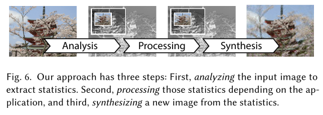

# Beyond Blur Real-time Ventral Metamers for Foveated Rendering

## 1. 介绍

通常情况下，`foveated`渲染在其**周边地区**显示模糊图像，由较少的样本计算。不幸的是，这样的模糊会被认为是**不自然的**，并且与**HVS实际感知的情况**不匹配：==外围不仅仅是模糊的==。

在这项工作中，我们试图改进**模糊的保真度**，同时**保留其效率**。如果一个刺激物与另一个刺激物在物理上是不同的，但**在感知上是相同的**，那么这个刺激物就是另一个刺激物的**元体**`metamer`。一个众所周知的元体例子是，**不同的颜色光谱可以映射到相同的颜色感知**。但什么是实现另一个图像的**外围区域元体**的好方法呢？

视觉科学文献表明，如果一个图像在其周边的**某些图像统计数字**是相同的，那么它就是另一个图像的**周边元体**。这里的统计是指 "==软计数=="，即**一个特征，如一个边缘，在视野的空间`pooling`区域出现的频率**。许多不同的统计量、特征和`pooling regions`被提出来，导致文献中出现了**不同的周边元化模型**。这些模型旨在**理解生理过程**，因此往往计算缓慢，**难以实现或难以控制**。我们的目标是建立一个简单的实时渲染模型。关键的困难是**如何选择符合人类感知的统计数据**。

我们提出了一种适合于实时分析和合成模型的统计学形式：平滑可引导矩`smooth steerable moments`。这些被应用于三个步骤中：

- 首先，该方法能以**恒定的每像素时间**（$O(1)$）分析输入图像。这是在所有像素上平行进行的。这一步的灵感来自于**方差阴影贴图**`VSM`。
- 其次，根据不同的应用，对**得到的统计数据**进行处理、压缩和传输。
- 最后，在$O(1)$时间内，通过一个受**经典纹理**启发的过程，可以生成符合统计学的、随机实现的元体`metamer`。

## 2. 本文方法

### 前瞻

我们从一个输入图像$I_{Ind}$ 和一个随机值$\xi$ 寻找一个映射 $I_{Out}=M(I_{Ind},\xi)$。$I_{Out}$是$I_{Ind}$的一个元体`metamer`。该映射是无规律的，也就是说，当我们输入**所有的随机数**时，所有的元组都会生成。在不丧失一般性的情况下，我们假设对图像中心进行了`foveation`

算法分为以下三个步骤：

### 分析

我们的方法将RGB图像$I_{Ind}$ 作为输入，并输出其**统计数据**。这些都是在一个**特定的色彩空间**中找到的，使用特征金字塔和**局部矩**`local moments`汇集，这三个方面将在接下来的段落中讨论。

***Color space***

在第一步中，输入图像被转换为`YCbCr`。

***Pyramid***

金字塔。`ventral stream`，即`HVS`的下一个步骤，对所有尺度的特征都很敏感（属性1），而且**特征与空间的变化有关**（属性2）。**图像金字塔是捕捉这两个特性的理想选择**。

