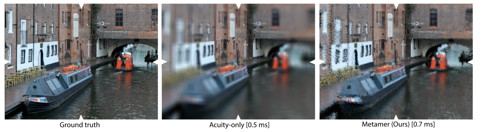
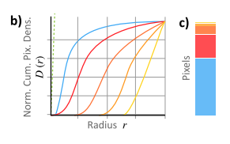

# Beyond Blur Real-time Ventral Metamers for Foveated Rendering

## 1. 介绍

通常情况下，`foveated`渲染在其**周边地区**显示模糊图像，由较少的样本计算。不幸的是，这样的模糊会被认为是**不自然的**，并且与**HVS实际感知的情况**不匹配：==外围不仅仅是模糊的==。

在这项工作中，作者试图改进**模糊的保真度**，同时**保留其效率**。如果一个刺激物与另一个刺激物在物理上是不同的，但**在感知上是相同的**，那么这个刺激物就是另一个刺激物的**元体**`metamer`。一个众所周知的元体例子是，**不同的颜色光谱可以映射到相同的颜色感知**。但什么是实现另一个图像的**外围区域元体**的好方法呢？

视觉科学文献表明，如果一个图像在其周边的**某些图像统计数字**是相同的，那么它就是另一个图像的**周边元体**。这里的统计是指 "==软计数=="，即**一个特征，如一个边缘，在视野的空间`pooling`区域出现的频率**。许多不同的统计量、特征和`pooling regions`被提出来，导致文献中出现了**不同的周边元化模型**。这些模型旨在**理解生理过程**，因此往往计算缓慢，**难以实现或难以控制**。作者的目标是建立一个简单的实时渲染模型。关键的困难是**如何选择符合人类感知的统计数据**。

作者提出了一种适合于实时分析和合成模型的统计学形式：平滑可引导矩`smooth steerable moments`。这些被应用于三个步骤中：

- 首先，该方法能以**恒定的每像素时间**（$O(1)$）分析输入图像。这是在所有像素上平行进行的。这一步的灵感来自于**方差阴影贴图**`VSM`。
- 其次，根据不同的应用，对**得到的统计数据**进行处理、压缩和传输。
- 最后，在$O(1)$时间内，通过一个受**经典纹理**启发的过程，可以生成符合统计学的、随机实现的元体`metamer`。

## 2. 本文方法

### 前瞻

作者从一个输入图像$I_{Ind}$ 和一个随机值$\xi$ 寻找一个映射 $I_{Out}=M(I_{Ind},\xi)$。$I_{Out}$是$I_{Ind}$的一个元体`metamer`。该映射是无规律的，也就是说，当作者输入**所有的随机数**时，所有的元组都会生成。在不丧失一般性的情况下，作者假设对图像中心进行了`foveation`

算法分为以下三个步骤：

### 分析

作者的方法将RGB图像$I_{Ind}$ 作为输入，并输出其**统计数据**。这些都是在一个**特定的色彩空间**中找到的，使用特征金字塔和**局部矩**`local moments`汇集，这三个方面将在接下来的段落中讨论。

***Color space***

在第一步中，输入图像被转换为`YCbCr`。

***Pyramid***

[金字塔](https://blog.csdn.net/zhu_hongji/article/details/81536820)。`ventral stream`，即`HVS`的下一个步骤，对所有尺度的特征都很敏感（属性1），而且**特征与空间的变化有关**（属性2）。**图像金字塔是捕捉这两个特性的理想选择**。

因此，输入被转换为一个**可转向的金字塔**。可转向金字塔对每一层都应用**一对方向敏感的滤波器**（水平和垂直），然后是一个`sub-sampling`步骤。可转向性保证了**中间方向的响应**是两个主要方向的响应的**线性组合**。对于实时应用来说，必须限制在**极其紧凑的滤波器**（小内核）。作者发现，**5×5的滤波器**在实践中对**元组的合成**是足够的。作者通过优化具有**与原始方法中的真实滤波器**最相似的响应的滤波器来找到**最佳滤波器**。这种优化是使用**ADAM求解器**在$2×5×5$的滤波器空间上进行**梯度下降**，以**L2图像差**作为损失。这种滤波器内核的优化**只进行一次**，以后可以用于任何图像。对于任意大小的图像，该转换需要**恒定的时间和恒定的内存**。

***Pooling***

先前的操作都是**线性操作**。在周边地区，**非线性函数**将信息**汇集**`pool`到所谓的`pooling regions`。HVS并不感知单个特征，而是将**它们的统计数据**在空间上汇总到`pooling regions`。为了简单起见，在这里只看这些**统计量的矩**，特别是**平均值和方差**。作者进一步假设**集合区域**`pooling regions`的形状是由**高斯参数化的**，所以`per-pixel map` $R(x)$保持着**近似集合区域**周围位置`x`的**高斯标准偏差**。这张贴图**在外围的数值很高**，因为那里有**大面积的汇集**，而在中心的数值很小。

在这些条件下，可以有效地计算出统计数据。也是如此。作者在这里从**阴影图过滤**中得到了启发。同样的操作适用于**输入金字塔的所有层次**，产生每层的**矩图** `moment map`。作者将描述每个层次的**两个步骤**。

首先，构建**每个层次的立方MIP图** $mip(L)$。第一个矩图 $M_0$，即**均值图**，可以用 $select(mip(L), \sigma)$直接从这个**MIP图**中读取，其中 $select(L,\sigma)$只是用**三立方插值**从对应于**带宽 $\sigma$ 的MIP层**复制像素值。

其次，**方差图**$M_1$ 或其他高阶矩可以有效地计算。作者不计算MIP地图$mip(L)$，而是计算每个层次的**平方的MIP图** $mip(L^2)$。回顾$V[x]=E[x^2]-E[x]^2$，作者现在可以用空间变化的来`pooling blur`模糊**正方形图贴**，以产生$select(mip(L^2), r)$，并从**平方均值**中减去**均值的平方**，得出方差 。

结果是一个金字塔，在每个像素和所有级别上都有由**第一和第二矩**描述的每个`pooling region`的**特征统计**。

### 过程

处理过程将**统计数据**映射为**新的统计数据**。这一步骤在不同的应用中特别重要。具体来说，输入的统计数据$S_{In}$可以被改变为**输出的统计数据**$S_{Out}$，而不影响周围的感知。这为压缩、将信息烤焙成纹理或使用CNN推断数值提供了机会。为了说明问题，作者在这里不改变统计数据。

### 合成

**合成步骤**将输出的统计数据转换为图像。由于有**无限多的图像**具有**相同的统计量**（至少对于**有限阶矩**而言），这是一个以随机值$\xi$为条件的生成过程，在作者的例子中是一个**具有随机值的金字塔**。这种**随机模式**随着时间的推移保持不变，提供**时间上的一致性**。

首先，对 $\xi$ 进行重塑，使其分别具有**各个层次的平均值和方差**。这对高斯来说很容易，通过**移位和缩放** $\xi\cdot M_1+M_0$。在本文的例子中，**平均数和方差**在整个图像空间中是变化的：在一张典型的照片中，天空可能是均匀的，但颜色方差会比它下面的森林部分低。

最后，金字塔的所有层次都被折叠成一个图像。作者从**最粗的所需层次**开始，向上取样，增加层次`i`，并应用**分析过滤器**，直到到达最后的图像。

## 4. 实现

作者已经实现了两个版本，一个在Python中，一个在Unity/C#/OpenGL中。这两个版本都展示了第`3`节中描述的完整管道。Python的实现将由**渲染器生成的图像**（照片、视频、交互式3D内容）和**预先计算的噪声图**作为输入。第一个`pass`是计算**输入图像的统计数据**。然后，应用程序对统计数据进行操作。第二个`pass`将统计数据再次**折叠成一幅图像**。第`6`节中的研究的**刺激物**`Stimuli`和第`5.1`节中的压缩结果是用这个实现产生的。

Unity的实现（Unity 2018.4.26f1）是实时的，遵循同样的方法。场景是由**场景摄像机**正常渲染的。**元数据的计算**是作为一个**后处理过程**进行的：计算统计数据的第一个`pass`是作为**全屏图像上的着色器序列**运行的，没有对统计数据进行操作，然后第二个`pass`作为全屏图像上的第二个渲染程序运行。5.2节中的纹理结果就是在这个框架的基础上发展起来的。

Unity的实现被扩展到支持`Varjo XR1 NED`。对于这种立体显示，每只眼睛都能看到一个**宽视野的背景显示**和一个**静态的高分辨率的焦点显示**。该显示器还包含一个**立体眼球追踪器**。因此，每一帧有四个图像被渲染。在演示中，作者只对**上下文显示的图像**应用`metamers`。

## 5. 应用

### 应用1：压缩

该应用的目标是传输图像，如普通照片和视频帧，包括从服务器到客户端的远程渲染内容。**元数据分析和压缩**发生在服务器上。服务器不是发送更新的图像，而是发送**更新的统计数据**。然后，客户端可以自由地实现任何元器以适应统计数字。由于**统计数字比图像小得多**，所以在减少带宽的同时，仍然可以在外围产生**可信的细节**。为了减少统计数据的大小，作者采用了三个步骤来进行编码。这些步骤的倒数**在解码时以相反的顺序**使用。接下来。

***Warping***

`pooling region`的大小在整个图像中是不同的。如果一个`pooling region`，例如，在外围可能是$10×10$像素的大小，作者寻求的**不是存储所有的100个像素**，而只是**它的统计数字**，一个小得多的数值集。为了达到这个目的，作者对图像进行`wrap`，这样一来，在普通图像中恒定的**局部像素密度**就变成了与`pooling`成正比。在实践中，处于外围的区域的密度低于`1`，因此会缩小。

当单独应用于图像时，`wrap`是压缩**焦点图像**的一种常见方法。通常情况下，**视力函数**被用于扭曲，**外围的多个输入像素**被映射到**一个输出像素**，因此被平均化，并最终模糊化；在作者的案例中，作者希望也能保留这些**被平均化区域的统计数据**。因此，作者寻找一种方法，既能压缩焦点图像，又能压缩周边的统计数据。

为此，作者不仅要**压缩图像**，还要**压缩整个金字塔**以保留统计数据。这有两个目标：充分性和紧凑性。首先，作者希望它是充分的，也就是说，作者需要的**统计数据**必须被保留到**元器需要的水平**。其次，它还必须是紧凑的，也就是说，作者希望这些统计数据只具有所需的分辨率，而不是更多。因此，问题变成了如何`wrap`整个金字塔以满足这两个要求？

作者将在**极域**工作，横轴是半径，纵轴是角度，如图`10-a`所示。在这样的设置中，**像素密度**沿角度不变，只随半径变化。

因此，作者研究了将半径`r`映射到像素密度的函数$d(r)$。这些函数对于图像，和它的金字塔层是不同的。对于图像本身来说，它是经典的**敏锐度/集合函数**，从中心开始下降，例如$d_o(r)=r^{-2}$。这个函数在上图中被视为一条**蓝色曲线**。

密度函数需要是什么样子，给定图像的这条曲线才是充分和紧凑的？这里有三件事一起发挥作用。首先，如果**统计图层的像素密度**低于图像，那么密度可以为`0`。为这是在传输过程中没有改变。这已经消除了对金字塔的广大部分的存储，并允许作者将**带宽**引导到**周边地区**。第二，如果**原始图像**在某个半径`r`上失去了尺度为$2^l$的细节，统计图必须代表它们，所以在`r`的像素密度$d_l$，必须大于`0`。最后，需要统计的分辨率也会下降，因为统计被汇集在越来越大的区域，就像图像一样。因此，虽然必须在**统计数字最重要的地方**增加并达到峰值，但随着`pooling regions`的增长，它们也会**迅速下降**。

***Sampling***

为了将`wrap`应用于**原始图像以及金字塔的每一层**，作者的步骤如下。首先，作者计算$d(r)$的**累积密度函数**（CDF）$D(r)$。这在上图中可以看到。这个函数`D`持有到半径`r`的累积密度。让$D^{-1}(y)$为其倒数，它作为累积函数存在是**单调增加的**。作者对图像或金字塔的层次进行**有规律的取样**，$D^{-1}(y)$。

$D^{-1}(y)$是多对一的，也就是说，图像或金字塔层的许多输入像素映射到一个输出像素。金字塔级别映射到一个输出像素。简单地挑选最接近反映射位置的单个像素，既会出现别锯齿，也不会产生作者需要的统计数据。相反，作者分两步来处理这个问题。首先，如果输入是$N\times M$像素，作者进行采样，输出分辨率大小为$(R\cdot N)\times M$，其中$R$是**对压缩性的某种约束**，作者使用$R = 32$ 。

***结果***

结果见于图11。输入的图像是$1024×1024$像素，未压缩的文件大小大约为`3`MB。对JPEG实例的质量设置进行了调整，以使文件大小尽可能地接近作者的方法。作者看到，在每幅图像`41` kB的速率下（即大约1:75的比例），原始的JPEG受到了影响，而原始的foveated JPEG表现得更好，但模糊了周边。

### 应用2：Denoising

对**蒙特卡洛(MC)路径追踪图像**进行去噪，使其无噪音。我从**有噪声的路径追踪图像**映射到一个`moments map`，然后将其变成一个`metamer`。对于神经网络来说，找到图像的统计信息比找到图像本身更容易

***Training Data***

作者首先用**有限数量的样本和无噪声的参照物**对有噪声的路径追踪图像进行采样。样本的数量从外围的1增加到中心的32。作者将分析应用于参考图像，以产生相应的矩图。这些矩图是**网络的预期输出**。

***Results***

