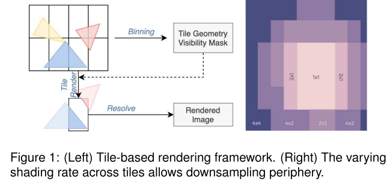
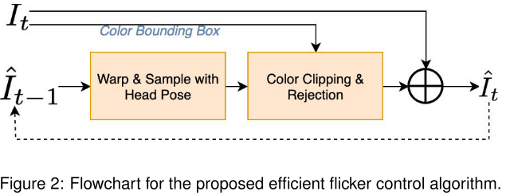
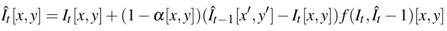
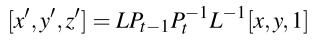
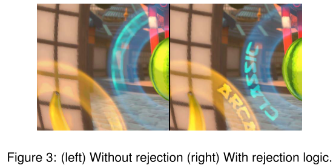
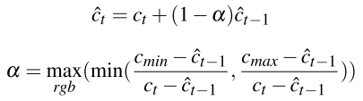
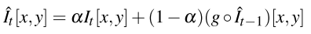
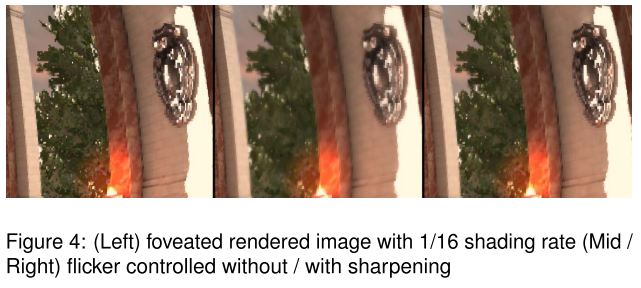

# Efficient Peripheral Flicker Reduction for Foveated Rendering in Mobile VR Systems

本文提出了一种有效的算法，可以有效地减少**移动VR平台**上，基于**中心渲染**所产生的闪烁伪像。

## 1. INTRODUCTION

在移动VR平台上，使用最为广泛的中心渲染的技术之一是`Tile-Based`的中心渲染。

## 2. RELATED WORK

没什么值得注意的。

## 3. PROPOSED METHOD

本文提出的**闪烁控制算法**，利用先前**重构帧**中相应像素中的信息，来稳定当前帧：

`f`表示==拒绝逻辑==，测试$It[x,y]$和$It-1[x,y]$是否实际上来自同一物体的对应点。计算上一帧的对应位置$[x^/,y^/]$要求精确的==运动向量==，但这需要额外的存储和计算资源，所以作者使用==头部姿态信息==来计算前一帧中的采样位置：

`L`是由透镜参数导出的**变换矩阵**，并将**视角的切线**转换为**投影纹理坐标**。P代表旋转矩阵。为了简单和通用性，作者使用头部姿态的旋转部分，这样就可以在不知道每个点的精确深度的情况下，计算出相应的像素位置。此外，不需要屏幕空间的抖动，因为我们从人体运动中观察到了头部姿态的抖动，而当前VR头盔中的**传感器噪声**足以抗锯齿。

当前帧和前一帧之间的==混合因子(α)==是空间变化的，以提供区域之间的平滑过渡。混合因子的值取决于中心渲染着色率、偏心度、`tile`大小等。

### Rejection Logic

为了避免颜色出血`color bleeding`和**重影**，需要检测移动物体上的像素，并拒绝混合。作者将采样**前一重构帧的像素颜色**与与其四个直接邻居的**最小最大颜色包围盒**进行比较。如果颜色落在外面，该颜色沿着连接这两种颜色的线，色调映射到区域边界：

### Avoiding Blur

与以前的帧混合时，如果没有特殊处理，这种方法可以引入模糊和对比度损失。模糊的主要来源是前一帧的插值/重采样，这被算法固有的递归放大。在不考虑拒绝逻辑的情况下：

g是重采样/`Warp`函数。在纹理取样时，`g`用**双线性插值**来处理。为了降低模糊度，通过将采样位置向像素中心移动来降低g中的低通滤波效果。

