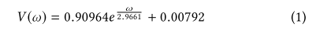
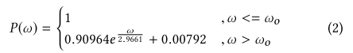
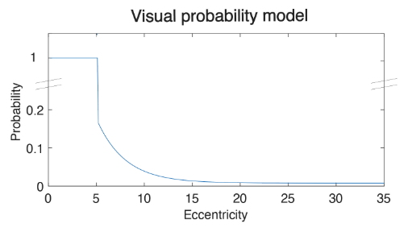
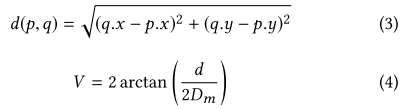
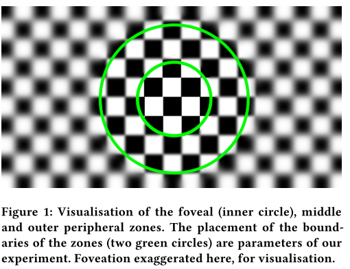

# Emulating Foveated Path Tracing

## 1. 介绍

在本文中，作者开发了一个模拟**注视点路径追踪器**的感知沙盒，首次确定了使**注视点路径追踪**不被察觉的==偏心角阈值==。在注视点路径追踪器中，目的是**减少发射的射线总数**，原则上可以通过三种方式实现：

- 减少每像素采样总数（SPP）
- 减少二次射线反弹的总数
- 减少输出缓冲器的总像素数。

由于目前的硬件限制禁止**实时路径追踪**，作者使用不同的参数对图像缓冲区进行预渲染，并在眼球追踪器的指导下，将**模糊渲染**作为一个**后处理过程**。然后，作者进行了三个实验来计算**偏心阈值**。第一个实验比较了以不同偏心渲染的序列对。第二个实验研究了与**非注视点参照物**相比，来确定**无法区分的最低注视点偏心度**。最后一个实验测量了每个用户认为的不可察觉的偏心率。

## 2. EMULATING FOVEATED PATH TRACING

### 2.1 前瞻

在一个理想的**注视点路径追踪系统**中，根据与固定点的距离，射线大大减少——注意由于**减少射线反弹**而产生的`popping`伪影。在本文的工作中，受到Patney的启发，作者通过模拟一个**注视点路径追踪器**，开发了一个感知沙盒。在**注视点路径追踪器**中，目的是**减少发射的射线总数**，原则上，这可以通过之前提到的三种方式实现。、

**减少SPP的总数量**不是本研究的主题，因为**现代去噪器**在`1 SPP`的情况下表现非常好，因此，实时路径追踪的主要限制因素仍然是**高分辨率缓冲区所需的大量射线（即使在1SPP的情况下）**，以及在**几何体交叉点**实例化的**次级射线**——用来追踪射线反弹。

==减少射线反弹==可以显著提高性能。减少反弹会导致**质量明显下降**，特别是对于**反射和折射**等现象（图`3`）。作者发现**减少次级射线的反弹次数**对于注视点路径追踪来说是**不可行的**，因为当==透明物体==通过**不同偏心的区域**时，这种射线消除会产生`popping`伪影。

在这项研究中，作者开发了一个==基于HVS敏锐度的PT射线生成模型==。然后应用**Lanczos重采样**在不同区域之间进行**平滑插值**。由于目前的硬件限制禁止**实时的路径追踪**，作者在**不同的分辨率**下对三个缓冲区进行**预渲染**，并在眼球追踪的基础上模拟注视点渲染（作为一个后处理）。然后，作者进行了三个实验来估计==偏心率阈值==。

### 2.2 模型

==焦点区==在判断视觉细节时具有**最高的敏锐度**。在外围和远离焦点的地方，**HVS的敏锐度**迅速下降。作者设计了一个**基于偏心率（ω）的概率模型**。作者的模型是基于Mandelbaum等人的工作，该工作测量了人眼不同偏心率值的视力。作者为**Mandelbaum的数据**拟合了一个与测量数据集密切相关的**指数函数**，准确率超过`95%`：

基于方程1，构建一个概率方法：

其中$w_o$是设定的偏心值，代表人眼`fovea`的大小（度）——在下图中直观地看到了这个**视觉概率函数**。

这个模型可以用来决定是否在某个像素上生成一条新的射线。为了计算所有像素的`ω`，作者计算被固定的像素（`p`）和所有其他像素（`q`）之间的**欧氏距离**（公式`3`）。计算出欧氏距离后，就可以确定**视觉角度**（公式`4`），从而找到`ω`：

其中$D_m$是与显示器的距离。

与[Guenter等人，2012]和[Patney等人，2016]类似，作者将视力划分为**三个不同的区域**（图`1`）。内侧（`fovea`）、中间（周边）和外侧（外周），**分辨率逐渐降低**。多于三个区域会更接近**人类的视觉系统**，但会增加渲染开销。在内部`fovea`区域，以**全分辨率**进行路径追踪。在中间区域，每4个像素追踪一条光线。在外部区域，每16个像素就追踪一条光线。为了将像素划分为不同的区域，使用**概率模型**（公式`2`）。为了生成三个区域的帧缓冲区，首先预先渲染全帧高分辨率的路径追踪图像（内部），然后使用近邻插值将其下采样为四分之一（中间）和十六分之一的分辨率（外部），以去除额外的像素。然后，作者使用**Lanczos重新采样**，将中间和外部的图像提升到**全帧缓冲区**，使它们之间的混合更加容易。

在运行时，以眼球追踪器检测到的像素为中心，根据**概率模型**（公式`2`），动态混合三个缓冲区的像素。线性插值一个短的重叠边界，以避免**区域之间的尖锐过渡**。

## 3. USER STUDIES

进行了三个 实验：`pair`测试、`ramp`测试和`slider`测试。每个受试者都参加了所有三个测试。在所有的实验中，因变量是与中间区域接壤的`fovea`区域的大小。**中间区域与外部区域的边界**是根据**概率模型**来设定的。作者使用**眼球追踪**来根据**注视情况**动态地重新构建`FPT`的模拟图像。

### Experiment 1: Pair

在配对测试中，参与者面对一对相同相机轨迹的动态移动序列，中间有一个短暂的（0.5s）黑色间隔。在随机的情况下，这对组合中的一个成员是**非注视点的路径跟踪渲染**，另一部分使用**注视点路径跟踪渲染**，**注视点的偏心程度**从$5^o$到$30^o$，用`5`个离散的步骤进行采样。所有级别的`pair`随机呈现三次。向参与者展示后，他们被要求报告是第一个还是第二个效果图更好，或者质量相同。

### Experiment 2: Ramp

在`ramp`测试中，每个被试者都会看到**一组相同的相机轨迹的动态序列**。一个增加的`ramp`从一个非注视点的序列开始，然后`fovea`和周边区域从$30^o$的偏心下降到$5^o$。一个递减的`ramp`从$5^o$开始，然后眼窝和周边区域从$5^o$的偏心上升到$30^o$◦。然后，参与者被问及在每个序列步骤中质量是否增加、减少或保持不变。每个`ramp`都是用6个离散的步骤进行采样。每个序列长`7`秒，目的是找到被认为**与参照物无法区分的最低偏心率**。

### Experiment 3: Slider

`slider`测试允许参与者改变`fovea`和周边的偏心水平。他们首先会看到一个无`fovea`的动画作为参考。从低水平的偏心开始（`fovea`=$5^o$，周边=$57.5^o$），他们可以增加偏心，来对比参考，或者减少，最终报告一个相当于参考的偏心水平。

