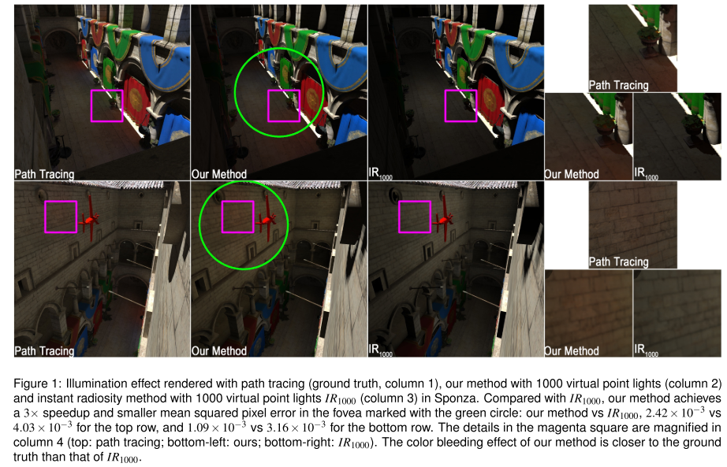
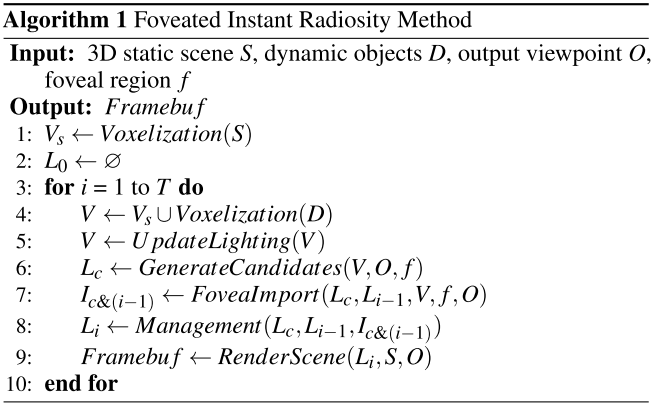
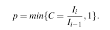
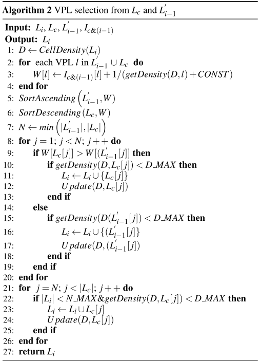
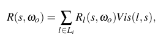
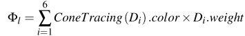

# Foveated Instant Radiosity

传统的光栅化方法很容易加入中心渲染（焦点渲染），而GI（例如：`Instant Radiosity`）则比较困难。而且IR不考虑**时间相干性**，因此对动态场景缺乏时间稳定性。本文提出了一种结合IR的中心渲染方法，为每个==VPL==定义了一个==中心重要度==，并使用它来智能分布VPLs，以保证**焦点区域**的渲染精度。同时，作者提出了一种新的VPL复用方案，该方案只在帧上更新一小部分VPL，既保证了节奏一致性，又提高了时间效率。本文的方法支持**动态场景**，并在**交互帧率**下获得高质量的中央区域

## 1. INTRODUCTION

沉浸感和交互性是VR最重要的特征。`Oculus Go`和`Quest HMDs`采用固定的中心渲染技术。

为了结合中心渲染和IR（立即辐射度），作者采用了多分辨率照明的思想，即输出图像不同区域的==VPLs数量==是不同的——更多的VPLs投射到中央区域，更少的VPLs投射到边缘区域。为了实现这一目标，需要解决两个问题：一是如何基于中心区域为每帧图像生成VPLs；二是当中心区域、视点或场景发生变化时，如何保持相邻帧的稳定性。

本文提出了一种**聚焦瞬时辐射法**来解决这两个问题。对于第一个问题，作者在焦点区域直接可见的表面上生成==候选VPL==，然后计算每个VPL的==焦点重要性==，以衡量其对**中心焦点区域**的照明贡献。之后，选取焦点重要性值较高的**VPLs**对虚拟场景投光。针对第二个问题，引入了一种==VPL管理方法==，对前一帧中的必要VPLs进行评估，并为当前帧选择**可重用的VPLs**。

## 2. RELATED WORK

在IR中，将VPLs分布到关键区域的策略是重要的。另外一个研究方向是VPLs对输出图像的贡献。

## 3. FOVEATED INSTANT RADIOSITY

主要是五个步骤：

- 场景体素化。对整个静态场景进行体素化（`line 1`），每个体素的平均位置、法线和颜色存入$V_s$中，物体ID初始化为0，直接光置为黑色。对于每一帧，首先体素化==动态对象==，并将它们与$V_s$合并到$V$（`line 4`）。然后据体素化更新V中每个体素的直接照明颜色（`line 5`）。
- ==VPL候选==生成。通过**路径追踪**生成VPL候选 $L_c$。对于每一帧，光线从视点发射到中心区域，并在体素化的场景中反弹一次，在**每条路径的末端**放置一个==VPL候选对象==（`line 6`）。
- VPL foveated importance computation。计算候选集$L_c$中所有VPL和前一帧$frame_{i-1}$的==必要VPL集==$L_{i-1}$的**中心重要性**$I_{c\&(i-1)}$ （`line 7`）。
- VPL管理。根据重要性，以及$L_c、L_{i-1}$，得到当前帧的必要VPLs集$L_i$
- 渲染。使用$L_i$渲染GI。

### VPL Candidates Generation

中心区域的位置被用来指导生成`ray`。和普通的辐射度方法不一样，这里的IR为了考虑中心区域，使用相反的路径，从视点而不是光源发出射线；击中采样点后，往随机方向反射，然后在与体素的交点处放置VPL。

> 以往的中心渲染方法都是通过逐渐降低采样率，在中央凹区域和边缘区域之间生成一个过渡区域，以平滑绘制结果，避免出现明显的质量突变。但是，由于本文方法考虑了间接照明，所以中央区域接收所有VPLs的照明，而之外的区域接收较少的VPLs的照明，所以渲染结果自然会平滑。

### VPL Foveated Importance Computation

计算过程分两步：

- 体素的`Foveated`权重估计
- VPL中心重要度估算

图二中，红色区域是步骤一，作者为体素化场景中每个可见的体素估计中心权重——和其**在图像平面上的投影**离**焦点区域中心**的距离成反比。在本文的实现中，作者预先生成了一张`权重map`。

然后，蓝色区域是步骤二。为了从每个VPL中确定可见体素，均匀地生成6条不同方向的射线。然后将这些射线与体素相交，得到第一个相交体素的**焦点权重**，并通过体素权重的**加权累加**，计算VPL的焦点重要性。根据[4]中的方法，以光线与VPL法线夹角的余弦作为权值。

### VPL Management

主要是关于怎么选择最佳的VPL子集来渲染中心区域。主要依据如下三个规则：

- `Rule 1`：贡献较大的VPLs应被添加到==必要VPL列表==中。
- `Rule 2`：为了保持时间一致性，必须重用前一帧的必要VPLs
- `Rule 3`：VPLs的分布应尽可能均匀，以保证每帧的照明效果稳定。

在选择前一帧的`必要VPLs`之前，需要进行更新，因为场景几何可能会改变：首先确定它是否在一个**动态对象**上，然后根据其**变换矩阵**更新VPL的位置。根据当前帧的**体素法线**来更新VPL法线，并将其与前一帧的VPL法线进行比较。如果VPL的法线方向发生显著变化，则该VPL将从$L_{i-1}$中删除；然后重新计算中心重要度和直接照明颜色。之后，VPL的==重要性变化率C==是通过比较当前中心重要性$I_i$和之前的重要性$I_{i-1}$得到的。VPL==被选中的概率p==由公式1计算：

之后，去除$L_c$中重要度较低的VPL，然后在$L_c$和选剩下的$L_{i-1}^/$中，选择第二批VPL到$L_c$中，具体过程见`算法2`。

算法分为两部分。第一部分是`line 1-20`，通过比较中心重要度和密度，进行选择：

- 在三维空间中，生成一个均匀的网格来控制当前帧的==必要VPLs密度==。VPL密度是VPL的一个属性，它度量了该VPL周围其他VPLs的数量。在本文的实现中，对于给定的VPL，首先确定它位于哪个`Cell`，然后使用`cell`密度估计VPL密度（`line 1`）。
- 对于$L_c$和$L_{i-1}$中的每个VPL，使用其重要度和VPL密度，来计算其参数w（`line 2-4`）。`getDensity(D, l)`是从D得到l所在单元格的密度。`CONST`是一个常量，避免被0除；
- 将$L_{i-1}$按W升序排列，将$L_c$按W降序排列（`line 5-6`）。然后，作者比较$L_c$和$L_{i-1}$中具有**相同索引的VPL**的W。选择W值较大的，如果所选VPL的密度小于预定义的阈值`D_MAX`，则将其添加到$L_i$中（`line 7-20`）。最后，用$Update(D，l)$更新相应的**单元格密度**。

第二部分是`line 21-26`，如果$L_i$的名额没满，则继续进行添加。

### Rendering

为了计算输出图像上每个像素内的渲染点，在世界坐标s的**间接光照**，==瞬时辐射度==近似于**必要VPLs**在ωo方向上的**反射辐射度**R(s，ωo)

其中，$R_l(s,w_o)=\rho\frac{\frac{\Phi_l}{\pi}cos(\theta_l)cos(\theta_s)}{d_l^2(s)}$。$d_l(s)$是VPL ==l==和体素 ==s==之间的距离，`Vis`是可见性函数，$\rho$是漫反射率，$\Phi_l$是`l`的辐射度强度。

基于VPLs的方法的一个局限性是：当VPLs和像素样本距离很近时就会出现奇点。所以作者设定了一个阈值，低于这个阈值的距离都会置为这个阈值。

为了计算VPL l在s处的直接照度，需要评估从**渲染点**到`VPL l`的辐射强度和可见度。为此，生成一个`voxel mipmap`作为场景体素化的分层结构，它记录了`voxel`的平均直接照度和中心重要度。然后，利用==voxel锥体跟踪==加速相交计算，得到`l`的辐射强度。对每一个l，均匀地向**l的半球**发射6个锥体，并与voxel mipmap交汇。用公式3确定l的辐射强度：

其中，$D_i$是六个方向中的第`i`个方向，$D_i.weight$是$D_i$和VPL法线的余弦值。利用==抛物面阴影映射法==估计VPL的可见性。如果更新$L_i$中被**重用的VPLs**的所有`shadow map`，仍然是很耗时的。因此，在每一帧中只更新重复使用的、前5%重要度的VPLs的`shadow map`。此外，作者采用了**延迟渲染**和**交错采样方法**来降低计算成本，加快渲染速度。

在VR中，同样重要的VPLs被用来渲染一对立体图像。

## 4. RESULTS AND DISCUSSION

对于实际光源的直接照明，阴影贴图的分辨率是$2048\times2048$。对于VPLs，阴影贴图的分辨率是$128\times 128$。输出图像的分辨率为$1024\times 1024$。根据[人类视觉灵敏度最小角度分辨率线性模型和HTC Vive的参数，如焦距、每英寸圆点等，中心区域的半径应不小于==120像素==。作者使用了更保守的，更大的中心半径，以防止用户注意到周边区域的质量退化。在实现中，中央半径被设置为输出图像宽度的1/4。

### Quality

路径跟踪（第1列）、我们的方法（第2列）和$IR_{1000}$（第3列）的呈现结果如图3所示。绿色圆圈表示中央区域。作者还在中心区域内裁剪和放大细节，以便在第4列中进行比较。与瞬时辐射结果相比，本文结果更接近真实图像。

其它的实验结果见论文。

## 5. CONCLUSION, LIMITATIONS AND FUTURE WORK

时间稳定性需要进一步优化。不能处理高光，可以进行扩展。