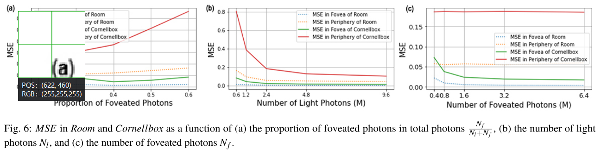
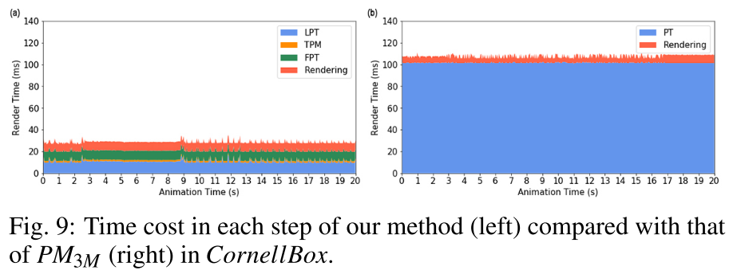
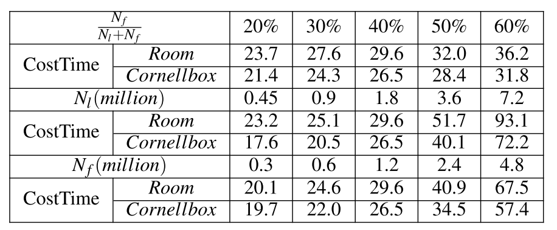
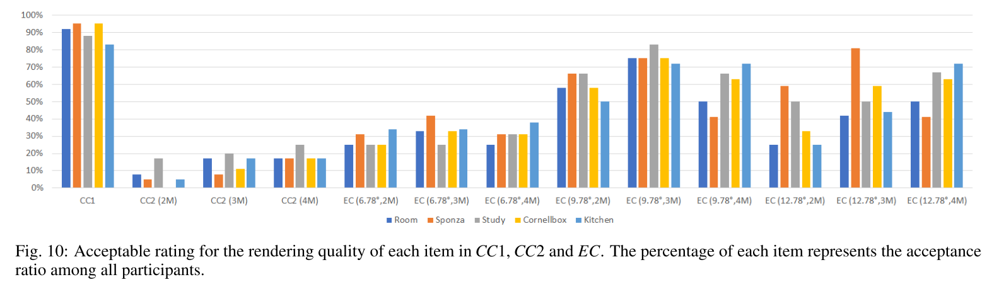

# Foveated Photon Mapping

***IEEE Transactions on Visualization and Computer Graphics***

## 1. 介绍

==光子映射方法==（`Photon mapping`）是一种有效的方法，可以为不同材质的场景渲染`GI`。为了进一步提高渲染效率，作者将光子映射适应于`foveated rendering`的框架，这带来了两个问题。第一个问题是如何在`foveal`区域产生**高密度的光子**，来渲染高质量的图像。第二个问题是如何用**高密度的光子**提高**耗时的光子追踪过程**的性能。

在本文中，作者提出`foveated photon mapping`来解决上述两个问题。为了解决第一个问题，引入了`foveated photon tracing`方法，根据**传统的光子追踪方法**，在`foveal`区域生成高密度的光子。我们在渲染中使用**传统光子追踪法**和**注视点光子追踪法**产生的光子，用一个新的**辐射度计算函数**计算三维场景的辐射度。为了解决第二个问题，作者提出了==时域光子管理方法==，以选择和更新前一帧的**有效注视点光子**。此外，本文的方法支持具有多种材料的动态场景，如漫反射、镜面、`glossy`和透明材料。

作者比较了**1亿光子的光子映射**（`Ground Truth`，GT）、**300万光子的本文方法**（`Ours`）和**300万光子的光子映射**（`PM3M`）所渲染的单眼图像，如图`1`所示。本文方法在`foveal`区域显示出比`PM3M`更好的**GI效果**。

## 2. FOVEATED PHOTON MAPPING

`Foveated photon mapping`是基于注视点渲染中**多重照明分辨率的思想**，它通过在`foveal`区域实现比周边区域**更高的光子密度**来计算`foveal`区域的**高质量GI**。为了在`foveal`区域追踪更多的光子，在追踪**来自光源的光子**的==常规光子追踪==步骤之后，作者引入了==foveated光子追踪方法==来追踪`foveal`区域的光子。为了处理动态场景，作者采用`Tawara`的想法，将光子分为两类：<**静态场景中具有正流量的光子**> 和 <**动态物体中具有正或负流量的光子**>。因此，将这些光子存储在`4`个**光子图**中：$M_{ls}$存储静态场景的光子；$M_{ld}$存储动态物体的光子，$M_{fs}$存储静态场景的**foveated光子**，$M_{fd}$存储动态物体的**foveated光子**。

每个光子都有`4`个属性：`dir`代表光子是从哪个方向追踪过来的；`flux`是光子的能量；`pos`代表光子的位置；`isAcc`是一个双值标志，将用于**能量归一化**。**foveated光子**有两个额外的属性：`next f`是沿着追踪路径的下一个**凹陷光子**的`ID`；`nearl`是最近的光子的ID（这个光子的通量需要是正值，否则，该值被设置为`-1`）。为了获得更好的性能，并保持`foveal`区域相邻帧的**时间一致性GI效果**，前一帧的**foveated光子**被更新并重新用于当前帧。在渲染当前帧时，**注视点区域的辐射度**是用光子和**foveated光子**的新辐射度计算函数来估计的，而周边区域的辐射度只用光子来估计。

给定一个具有静态部分`S`和动态物体`D`的三维场景，光源`L` ，当前帧的视角$V$，上一帧的视角$V^/$，注视点区域$r_f$，`focus`区域$r_t$（包括**注视点和过渡区域**），输出分辨率$(w,h)$，每个像素的**最大foveated光子路径**`N`。帧缓冲区通过使用==算法1==进行渲染。

**算法1**的动机是：通过在`foveal`区域获得比周边区域**更高的光子密度**来计算**高质量的GI**。在算法1的初始化中，首先追踪来自光源的**静态场景的光子**，并生成光子图$M_{ls}$（第`1`行）。由于场景不会改变，**$M_{ls}$只计算一次**。$M_{ld, fs, fd}$被初始化为`NULL`（第`2`行）。每个像素的**光子路径计数器**`fbm`是一个对应于帧缓冲区的**二维数组**，它记录了每个像素**需要追踪的`foveated`光子路径的总数**。在`initMask`中，作者在`fbm`的`focus`区域设置`N`（第`3`行）。每个像素的**静态foveated光子路径记录器**`fbp`是一个对应于帧缓冲区的**二维数组列表**，用来存储从这个像素开始的**每条静态foveated光子路径的第一个静态foveated光子的`ID`**（第4行）。**静态foveated光子路径**意味着该路径中**foveated光子的最近光子**都是$M_{ls}$中的光子。

在每一帧中，首先追踪**动态物体的光子**（第`6`行）。然后，如果当前帧不是第一帧，我们需要更新**静态foveated光子图**$M_{fs}$，每像素光子路径计数器`fbm`，最后一帧的每像素静态foveated光子路径记录器`fbp`（第`7-8`行）。之后，我们进行**foveated光子追踪**，在$M_{fs, fd}$中生成新的**foveated光子**，并更新`fbp`（第`9`行）。在第`10`行计算**能量归一化参数**`η`，用于`focus`区域的辐射度计算。最后，用来自四个光子图$M_{ls,ld, fs, fd}$的光子对场景进行渲染（第`11`行）。

------

对于静态场景，光子是用**传统的光子映射方法**（$PT_{s}$，第`1`行）。光子从光源发射到场景中，然后在场景的表面上反弹数次，并停留在**`diffused`表面**上。对于动态物体，作者使用**基于辐照度缓存的方法**来追踪**动态物体的光子**（$PT_{d}$，第`6`行）。首先，用来自光源的`cube map`渲染**包含动态物体的场景**。如果`cube map`中的像素属于动态物体，那么**从光源到这个像素的三维位置的方向**将被记录下来。作者随机地对这些方向进行采样，并沿着**采样的方向**追踪光子。光子在场景中会反弹几次。当一个光子击中**动态物体的表面**时，它在相交点产生**两条射线**，继续追踪光子。第一条射线被视为正射线，它被**反射或透射**出**正能量**，或根据表面的材料在场景中**被吸收**。正光线在光线与场景表面的**所有交叉点**上都留下了**正能量的光子**。第二条射线被视为==负射线==，它穿透动态物体并携带**负能量**。负射线只在**射线与静态场景表面的交汇处**留下带有**负能量的光子**——因为我们需要从**静态辐照度缓冲区**中减去**由于动态物体的遮挡而产生的能量**。最后，正能量的光子和负能量的光子都储存在$M_{ld}$中。

### 2.1 Foveated Photon Tracing

在**foveated光子追踪**中，**foveated光子**从视角被追踪，使其穿过`focus`区域并击中场景的表面。**需要追踪的光子路径的数量**是根据`fbm`。反弹方向和**foveated光子的通量**是根据场景中**击中点的材料**和它们**最近的光子**来确定的。

图`2`描述了**foveated光子追踪**的过程。场景包含一个透明球体、一个镜面立方体和漫反射墙。这个立方体是动态的。与普通的光子追踪相同，**foveated光子**只放在**漫反射表面**上。红线显示了从光源到在漫反射墙上产生光子（**红点**）的追踪路径，该方法**基于辐照度缓存**。当光线击中**动态立方体的顶部**时，它产生了两条光线：**实线和虚线**。实线显示了产生具有**正能量的光子**$p_l^4$，而虚线表示**产生负能量光子的光线追踪路径**$p_l^{/1}$。 **绿线**表示从观点`V`出发的追踪路径。视点`V`，通过图像平面上的**foveated像素**`px`，通过**foveated光子追踪方法**产生**foveated光子**（**绿点**）。当**foveated光子**碰到镜面立方体或透明球体的表面时，它们会根据反射或折射定律沿着方向反弹。而如果**foveated光子**撞上了**漫反射墙**，就会找到**最近的光子**。如果这个**光子带有正能量**，那么**foveated光子**的反弹方向就被设定为这个**最近的光子的入射方向的反方向**，否则，**foveated光子就被丢弃**。在图2中，**foveated光子**$p_f^1$的反弹方向被反转到**其最近的光子**$p_l^3$的入射方向，而$p_f^2$的反弹方向被设定为最近的光子$p^4_l$的入射方向。

在确定**foveated光子的反弹方向**后，找到每个**追踪路径末端的foveated光子的最近的光子**，这个光子的通量值用于计算**路径上所有foveated光子的通量**。在图`2`中，$p^4_f$的通量设置与$p_l^2$的通量相同，$p_f^3$的通量设置与$p_l^1$的通量相同。$p^4_f$的通量被传输到$p_f^1$，$p_f^3$的通量被传输到$p_f^2$。对于每个**foveated光子**，沿着追踪路径的下一个**foveated光子**被记录在`next f`中，而**最近的具有正能量的光子的ID**被记录在`nearl`中。每个foveated光子路径的最大反弹深度值不会超过**预定的最大深度**，否则这个**foveated光子路径**中的**foveated光子**会被删除。在图`2`的情况下，最大反弹深度为`4`，$p_f^3$的反弹深度为`5`，所以$p_f^3$被移除。

在图`2`中，==蓝线==直观地显示了**通过像素px中心的追踪光线**，蓝色的断点椭圆显示了**px的聚集区域**。除了光子$p_l^3$之外，在渲染过程中还产生了两个**foveated光子** $p_f^1$和$p_f^2$来照亮`px`。在**foveated光子追踪**之后，作者对`4`个光子图$M_{ls,ld, fs, fd}$进行迭代，用公式`1`计算==能量归一化参数==`η`：

### 2.2 Temporal Photon Management

由于追踪当前帧的所有**foveated光子**是非常昂贵的，重新使用**前一帧的foveated光子**可以提高性能并保持时间上的一致性。作者进行光子管理，以选择和更新**前一帧的光子**，并根据视角的变化、`foveal`区域的变化和动态物体的运动，**删除无效的光子**。

首先，保留前一帧的`fbm`、`fbp`（第`1-2`行），并为当前帧初始化（第`3-4`行）。对于`focus`区域的每个像素`px`，我们把它反投影到三维空间，从当前视角`V`得到一个三维点`v`（第`6`行），然后从上一个视角$V^/$ (第`7`行)，得到它之前的投影$px^/$。如果`v`在静态场景的表面上，并且该表面是**漫反射的**，我们将根据前一帧的`fbp`和`fbm`的值来设置当前帧对应像素的`fbp`和`fbm`中的值（第`8-10`行）。否则，我们会从$M_{fs}$中删除沿静态光子路径的光子以及$fbp^/ [px^/]$中的路径（第`11-12`行）。

### 2.3 Rendering

为了在`foveal`区域实现**高质量的GI**，四个光子图$M_{ls,ld, fs, fd}$中的光子被用来收集`focus`区域的辐射度，而只有两个光子图$M_{ls,ld}$用来渲染外围区域。对于不同区域的一个给定的三维点x，其辐射度`I(x)`可以用公式`2`来计算：

如果`x`在`foveal`区域，辐射度将由**加权辐射度估计函数** $g(x,M_{ls,ld, fs, fd},η)$来计算：

其中`η`为**能量归一化参数**，$\gamma$为**收集光子的半径**，$M_d$指两张动态光子图$M_{ld,fd}$，$M_s$指两张静态光子图$M_{ls.fs}$，$f_r$为**BRDF函数**，$\phi(p)$为光子图中光子`p`的通量，$w_o$为从`x`到`V`的方向，$w_p$为光子`p`的入射方向。作者使用**基于辐照度缓存的方法**，将静态光子图中的光子贡献的辐射度与动态光子图中的光子贡献的辐射度用**权重系数**`k`进行混合：

其中`p.r`、`p.g`和`p.b`分别表示$\phi$的通量中的红色、绿色和蓝色成分。如果`x`位于外围区域，那么辐射度将只用$M_{ls,ld}$中的光子来计算：

过渡区域的`x`的辐射度可以通过使用**权重系数**`b`，对`foveal`区域的辐射度和周边区域的辐射度进行**线性内插**来计算：

其中，`radius`是计算给定区域的像素半径的函数。在VR中，同样的有效光子被用来渲染一对立体图像。几乎所有在左眼中可见的物体都会在右眼视图中显示出来。我们对完整的左眼视图进行着色，然后通过使用重投影从完整的左眼视图中取样来渲染右眼视图。右眼视图只需要在没有找到有效样本的情况下对新的像素进行着色，而不是重新计算一切。

## 3. RESULTS AND DISCUSSION

主要是介绍实验场景（复杂度：三角形面片数）。还有就是实验的硬件条件（CPU、显卡等）和头戴设备的数据。

### 3.1 实现

`foveal`区域的像素半径是公式`7`来计算的：

其中，`foveal`区域的角度半径 $e_f$ 被设定为$9.78^o$；`PPI`是HMD的像素密度，以每英寸像素衡量，HTC Vive为`615` `ppi`；`b`是HMD的瞳孔到镜头的距离，HTC Vive为`18`mm。

然后是**具体加速算法**的介绍，这里略。

### 3.2 Quality

:one:将本文方法、原始光子映射方法（VPLs的数量一致） $PM_{3M}$、`Ground Truth`进行了比较。其中，`Ground Truth`是用**1亿个光子的光子映射方法**得到的。本文方法和原始光子映射方法都使用**300万个光子**。之后是本文方法光子的分配细节，这里略过。

本方法的结果比 $PM_{3M}$ 的结果更接近于`Ground Truth`的结果。在 $PM_{3M}$ 渲染的裁剪区域中显示了一些伪影。之后介绍了此方法导致的一些问题。（似乎可以在同等条件下，除了性能，也可以就画面表现，来间接展现论文方法的进步）

:two:作者用**两个指标**来**量化质量**：==平均平方误差== $MSE$ （和`Ground Truth`的所有像素进行比较） 和==平均时间误差== $MSE^/$，它被定义为$(n-1)$个连续**帧对**之间所有像素的**平均平方误差**，公式如下。作者分别测量`foveal regions`和`peripheral regions`的 $MSE$ 和 $MSE^/$ 。（感觉这个可以直接使用）

之后主要是根据**下表的数据**，来分析对比本文方法和$PM_{3M}$ ，进而来验证本文方法在正确性上的优越性。

**图4**直观地显示了实验场景的 $MSE$ 和 $MSE^/$，$MSE^/$是通过稍微移动视角来计算的。**较白的像素代表较大的误差**。通过误差可视化显示，进一步显示本文方法的优越性。

:three:本文方法有几个参数会影响图像质量。下图显示了本文方法在`Room`和`Cornellbox`中针对不同数量的`foveated photons`和`light photons`，产生的不同的渲染结果。第`1-2`行的图像显示的是**总光子数固定时的渲染结果**，`foveated photons`在总光子中的比例从左到右逐渐增加：20%、30%、40%、50%、60%。在`Room`中，虽然比例在变化，但注视点区域的图像没有明显的视觉差异，而周围区域的图像由于光子数量的减少，噪声也随之增加。在`Conellbox`中，当`foveated photons`的比例从$20\%$增加到$40\%$时，注视点区域的噪声会减少，但从$40\%$到$60\%$，注视点区域的噪声又会增加。这是因为当光子的数量达到一定数量时，增加注视点区域的光子密度可以减少噪声。然而，由于`foveated photons`的通量是根据`light photons`来估计的，如果`light photons`太稀少，即使增加注视点区域的`light photons`的密度，也不能减少噪声。光子越少，噪声就越大。这两个场景**注视点区域**和**围周区域**的`MSE`如图6(a)所示。

之后是在固定`foveated photons`的数量的情况下，增加`light photons`的数量，来看看表现，得到图6b；倒过来得到图6c。

### 3.3 性能

:one:表2显示了本文方法的**帧渲染时间**，以及与**光子映射方法**相比的**速度提升**。第`2`行和第`3`行显示了本文方法在没有（$Ours_{wo}$）和有时间性光子管理（$Ours$）的情况下的**时间成本**。本文方法加上**时间性光子管理**，得到了$1.9-2.6$ 倍的速度提升，这是由于`foveated photons`的**高重用率**（第`4`行）。与$PM_{3M}$相比（第`5`行），本文方法实现了 $3.5-4.5$ 倍的速度提升。之后的行同上。

:two:图9显示了使用本文方法（左）和 $PM_{3M}$（右）渲染`Cornellbox`的每一步的时间成本。本文方法有`4`个步骤。1）光子追踪（LPT）；2）注视点光子追踪（FPT）；3）时间光子管理（TPM）；4）渲染，而 $PM_{3M}$ 有两个步骤。1）光子追踪（PT）；2）渲染。我们的FPT和TPM只花费了大约10ms。有了FPT和TPM，LPT时间可以减少到PM3M LPT的10%。两种方法的渲染时间几乎相同。因此，本文方法比 $PM_{3M}$ 快4倍。

:three:表3显示了`Room`和`Cornellbox`在不同数量的不同光子的情况下的表现。当`foveated photons`的比例增加时，时间成本就会增加（第`1-3`行）。这是因为随着`foveated photons`比例的增加，`foveated photons`的数量也在增加。为了确定`foveated photons`的流量和反弹方向，我们需要为每个`foveated photons`找到最近的光子。这个搜索过程是很耗时的。因此，即使减少了光子的数量，整个计算过程的性能仍然下降。

## 4. USER STUDY

作者设计了一个**within-subject研究**，以评估本文方法和`PM`之间的**感观GI质量**。

***Conditions***。作者使用本文方法作为**实验条件**（`experimental condition`、`EC`）。它由五个场景{房间，Sponza，书房，Cornellbox，厨房}，三个注视点半径 $e_f$ {6.78◦，9.78◦，12.78◦}，和三个总光子数 $\#Photon$ {2M，3M，4M}的全因子组合组成。`EC`中的每一项都是一个简短的动画序列，表示为 $EC(e_f,\#Photon)$。第一个`control condition`（`CC1`）使用 $PM$ 来渲染五个场景的短动画序列，并保持`MSE`等于$EC(6.78^o,4M)$。第二个`control condition`（`CC2`）使用与`EC`相同的光子数量{2M, 3M, 4M}。`CC2`中的每项都是一个简短的动画序列，表示为 $CC2(\#Photon)$。

***Participants***。在这项用户研究中，作者招募了`32`名参与者，其中`20`名男性和`12`名女性，年龄在`20`到`28`岁之间。每个参与者按随机顺序完成**85次试验**，`EC`中的项目被展示一次，`CC1`和`CC2`中的项目被展示两次。

***Task***。在这个任务中，每个参与者都会以**随机的顺序**看到`EC`、`CC1`和`CC2`的短动画序列。每个短的动画序列长`8`秒，中间有一个短的黑色间隔（`0.5`s）。在任务过程中，参与者被要求在呈现每个动画序列后，回答这个序列的质量是否可接受。

***Result and Discussion***。

