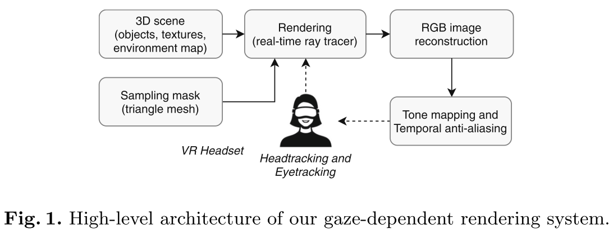
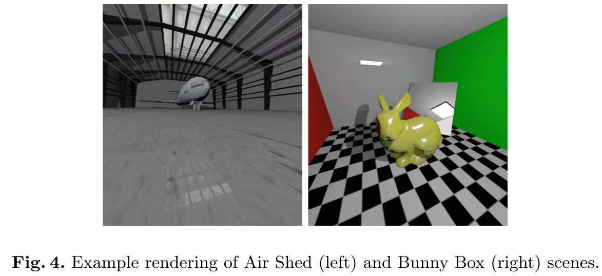
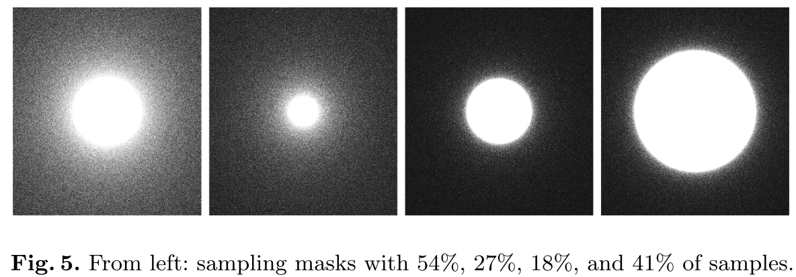
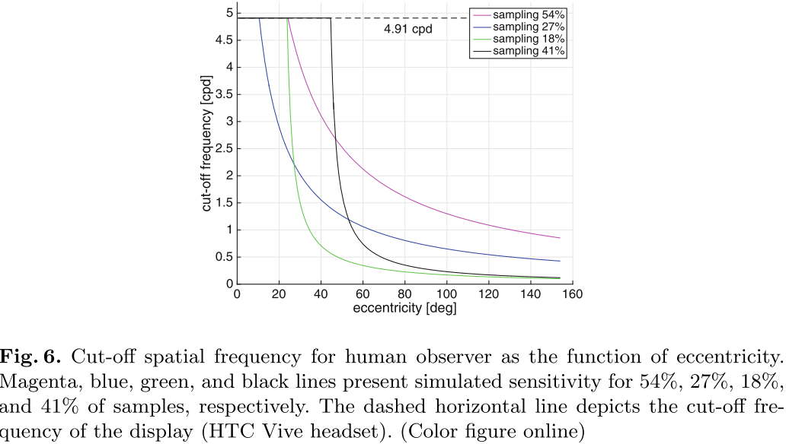
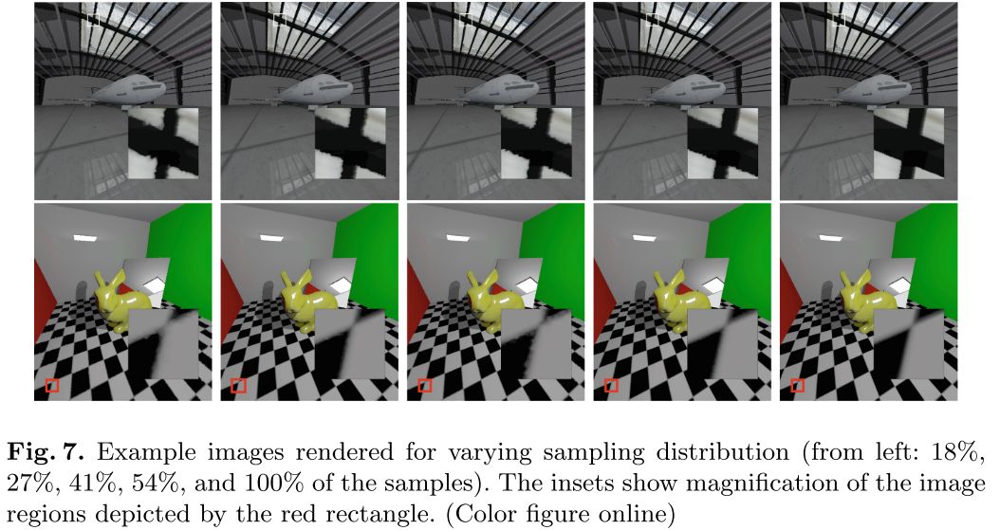
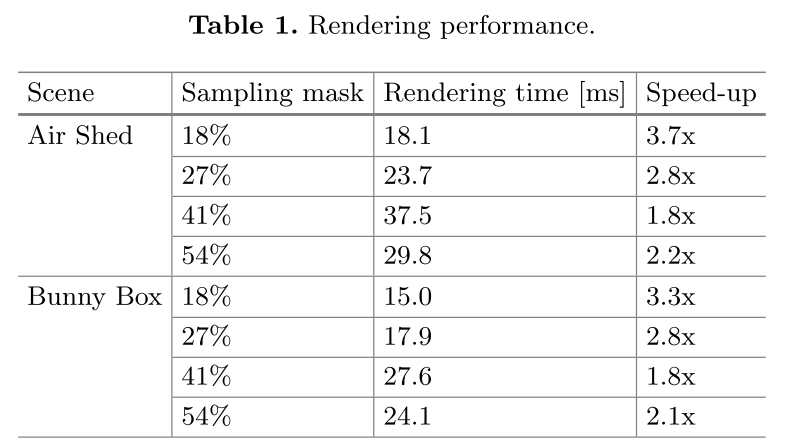

# Foveated Ray Tracing for VR Headsets

结合==光追==和==中心渲染==，在驻点附近的中心区域，进行正常光锥，而在偏远区域减少采样数或直接跳过，后期光栅化，由GPU进行自动插值来进行填补。同时使用==TAA==来减少闪烁。

有研究表明，遵循**凝视对比敏感度函数**的取样能够产生质量最好的图像。

## 1. Introduction

HMDs使用==球面扭曲的图像==来补偿镜片的**光学畸变**。其它的都是些老生常谈，这里就不赘述了。

## 2. Previous Work

Watson等人[24]研究了屏幕空间（而非物体空间）的偏心率可能出现的**空间**和**色度复杂度**的退化（有机会看看）。他们使用不同的高细节嵌入尺寸，来在低分辨率的显示域中生成高分辨率嵌入。在不同的周边分辨率下，测试了干扰物对目标物体的感知。使用头戴式显示器进行的实验表明，在图像质量没有明显下降的情况下，复杂度可以降低近一半。

Levoy和Whitaker提出了一种用于体积数据的射线追踪器，其中通过图像平面的射线分布和沿着每条射线的样本分布都是==局部视网膜视力==的函数。因此，渲染图像的分辨率会随着用户注视方向的变化而发生变化。

Stengel则是在着色器上进行了考虑，基于注视点的不同区域，使用不同的材质。

在Patney等人的[16]中，引入了外围区域的后处理对比度增强，以减少==隧道视觉感==，进一步减少样本数量。他们注意到，在检测到与`Ground Truth`的差异之前，人们可以容忍两倍大的模糊半径。（看过了）

一个注视点依赖的射线追踪器：在这种射线示踪器中，主射线的**空间采样**是基于与凝视相关的**对比灵敏度函数**的形状。

## 3. Foveated Rendering

### 非均匀采样

==采样掩码==以三角形网格的形式提供，采样点位于三角形的顶点上。由于要补偿眼球移动，掩码比观察者的视场更大。

人眼在不同视角下的**分辨率**是使用==Gabor模式==来测量的，并给出了不同**偏心距**的人眼。观察者被要求猜测刺激的方向（水平的或垂直的），而对比度阈值（正弦光栅的明暗条之间的对比度）在实验的连续步骤中被降低。**对比敏感度的阈值**是指不能区分**刺激的方向**。作者按照Chwesiuk和Mantiuk提出的方法重复了这个实验，结果阈值表示为==截止空间频率==（如图2）。这个**截止频率**定义了在给定的**偏心距**下，人类观察者可见的==最大样本数==。作者利用这个表示，来创建样本空间分布变化的==采样掩码==

### 实现细节

作者通过GPU实现了一个常规光追器（使用非均匀采样），为了加快渲染速度，光线只Bounce一次。为了解决最为明显的时域锯齿，作者还实现了基于当前帧和前一帧深度信息的`TAA`。

### 图像重建

下一步需要将空间上的**非均匀样本**转换为**笛卡尔坐标**，并在屏幕上显示出来。目标是使用一种==重建技术==，它对原始信号引入尽可能低的失真，并且不显著地影响整体性能。

采样的**不均匀映射**可以用标准正向渲染，进行三角化和渲染。三角化是一个耗时的过程，很难实时执行。因此，作者在预处理过程中生成三角形网格，然后在实际渲染过程中应用该网格进行**图像重建**。

使用==Delaunay三角剖分技术==将**采样掩模**转换为三角形网格。`Map`中的每个采样都成为网格中的一个顶点（图3中）。这个网格是在实时射线追踪器初始化期间，从文件中读取的。跟踪光线通过网格的顶点，并存储相应像素的颜色。在实际的三角形网格渲染过程中，三角形内部的颜色使用重心插值在屏幕空间中插值

## 4. Experimental Evaluation

实验的目的很明确：找到VR观看下，人眼可接受的最大采样数的缩减。

图5对应下图的函数曲线：

### 过程和参与者

作者要求观赏者戴上**VR头盔**，自由环视现场。实验开始时，展示参考图像。20秒后，参考图像被替换为使用**随机选择的掩模**生成的图像。每隔大约5秒就会随机更换面具，直到整个过程持续180秒。观察者的任务是当她/他注意到蒙版的变化引起的图像质量的变化时，立即按下鼠标。

### 性能结果

### 结果

1代表`100%`可以看出变化，0表示`50%`可以看出变化，-1表示`0%`可以看出变化。

