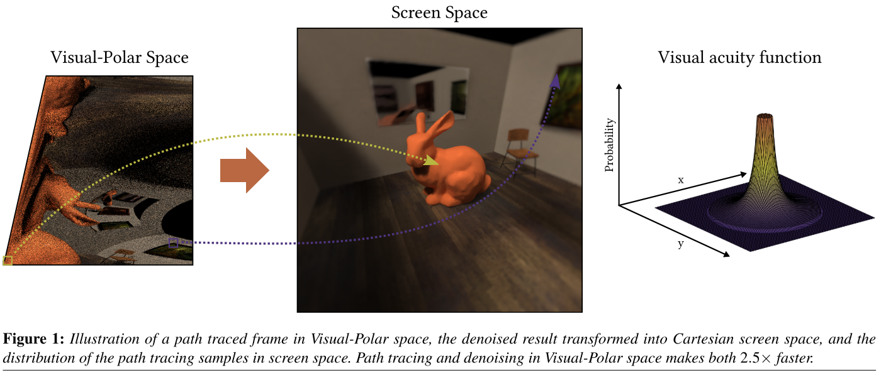

# Foveated Real-Time Path Tracing in Visual-Polar Space

## 1. Introduction

在VR渲染中，对分辨率和刷新率的高要求，以及复杂的材质和效果（如景深和运动模糊），都分散了路径追踪的性能占比。

在本文，作者依据**焦点渲染**方法，优化了VR下的路径追踪。此系统利用了**HSV系统**，设计了一个新的坐标系统，称为`Visual-Polar Space`，根据**视敏度函数分布**采样。，最后产生了视觉上不错的、完全去噪的结果。渲染成本是==0.4spp==（平均每个像素0.4个采样，使用了**SIMD/SIMT硬件**的所有通道）。

> 2019年，可实现的实时路径跟踪**渲染预算**仍然低于每像素1个样本(spp) 

## 2. Related Work

对于路径追踪，实时滤波的一种选择是：一种基于小波的滤波器，称为==时空方差引导滤波==（SVGF）。还有最近的BMFR技术。

人眼每一个==偏心度==可以解决的周期数（number of cycles），在所谓的视力功能中被描述为：（==visual acuity function==）

其中，e是偏心角，结果表示：==每度图像可以从完全白色变为完全黑色的次数==。关于对比度函数（CSF）。

根据视力功能函数，如果我们有一个渲染系统能够显示**每度60个周期**，`95%`的渲染细节将是过度的（`excessive`）。在现代的HMD设备上，这个数字大约是`75%`，取决于分辨率和`FOV`。然而，简单地根据视力功能减少采样会导致**视觉周边部分**空间和时间伪影。==外围部分尤其对时间伪影敏感==，因此，没有时间滤波的、过于简单的**边缘质量降低方法**很容易被用户检测到。

> 文献综述[WSR*17]对以前的热点渲染研究进行了全面的总结。WEIER, MARTIN, STENGEL, MICHAEL, ROTH, THORSTEN, et al. “Perception-driven Accelerated Rendering”. Computer Graphics Forum. Vol. 36. 2. 2017 2

新的==Nvidia图灵架构==支持屏幕空间的可变着色率。然而，着色率需要为一个正方形的**像素块**决定，完全自由的着色定位是不允许的。然而，由于可编程GPU的**处理元素**安排的工作项目是不同的，即使使用**射线追踪**，也很难进行灵活的采样，以便充分利用硬件的计算能力

极坐标空间的一个缺点是不连续，但比较容易解决。

## 3. Visual-Polar Space

### Path Tracing Setup

在图像平面`Image Plane`上，每个像素发出一个**主射线**，到达最近的相交点后，跟踪一条**次级间接射线**；然后再对这两条射线的击中点，我们追踪一个阴影射线，指向一个随机光源（towards a random point in a random light）。

在实验中，找到最近的击中点花费了执行时间的`20%`，利用本文所采用的路径跟踪设置，光线的==相干性==相当高。

> **非相干射线的射线遍历**明显慢于**相干射线的射线遍历**。另外，使用相干光线的着色器在hit表面的执行速度更快，因为在一个典型的场景中，附近的区域有相同的材质。

### Rendering

在设计光追的采样分布函数之前，需要两个准备：

- 主射线（以及**第一阴影射线**）是相干的。这意味着==单波阵面==（single wavefront）中的射线具有几乎相同的原点，并沿几乎相同的方向移动，因此，尽可能经常地访问相同的**边界体积层次（BVH）节点**。
- 可以在**设计空间**执行去噪。（比在屏幕空间要少的**像素处理**）

满足这两种要求的一个有趣的方法是：在极坐标空间中进行光线跟踪，凝视点在**半径坐标**的0点处，**角度坐标**围绕凝视点旋转。在极空间的均匀网格上进行光追，其采样分布为$\frac{1}{e}$，其中e为偏心角。但问题是这种分布并不能精确地模拟人眼的**视力功能**。有至少**两种方法**来提升这种分布：

- 调整角度坐标φ上的采样数量
- 改变半径坐标$\rho$的比例

在角度坐标上**调整采样的数量**需要在φ轴上**改变分辨率**。例如，通过沿$\phi=2\pi \rho$线，对极空间进行剪切，可以得到一个恒定的样本分布，而通过更复杂的**剪切模式**，我们可以将采样与视力分布进行匹配。然而，外围区域的单个==采样覆盖==被拉伸，这产生了重要的`artifacts`。

另一种选择，缩放==半径坐标ρ==来遵循视力分布，需要期望分布及其累积分布函数的**逆分布**。视力函数的累积分布函数的逆函数过于复杂，无法实时实现。然而，一个拟合的多项式可以足够有效近似它。**缩放半径坐标的缺点**是，如果极坐标空间在φ-轴上具有恒定的分辨率，那么样本的第一列将被映射到**整个中央区域**，并存在主要的拉伸伪影。

总结：在中心区域使用第一种，而在外围区域使用第二种。

为了使样本在中心区域具有**恒定分布**，作者在$\rho$轴上使用==线性映射==，并从$\phi$轴上剪下一个**三角形区域**。图4a中，中心区域用==绿色==标记。绿色三角形上方的**白色剪切区域**减少了原始空间大小的`12%`。

在外围部分，使用==ρ轴缩放==来实现**视力下降**。视敏度的**累积分布函数**为：

其中，d是离注视点的距离。当从`Visual-Polar Space`映射到**屏幕空间**时，使用上诉公式对半径坐标进行缩放。在实际的实现中，作者避免对数和除法，使用最小二乘拟合多项式作为这个函数的近似值。从**视觉极空间**映射到**屏幕空间**时所使用的累积分布函数的拟合逆是：

通过寻找凝视点到屏幕角落的**最大距离**，无论用户看屏幕的哪个位置，都能保持渲染路径的数量不变。该距离用于缩放轴，使最大的$\rho$等于它。当用户观察**视觉边缘**时，这种缩放会动态地改变中心区域的大小，使其变得更大，这弥补了这些区域通常较差的**眼球跟踪精度**。

当计算主射线的原点和方向时，从视觉极空间映射到屏幕空间，然后计算原点和方向，这是传统屏幕空间路径追踪的典型做法。

### Denoising

使用先进的实时降噪器，如`SVGF`和`BMFR`，只需进行一些小修改。

- **视觉极空间**中的所有采样都需要绕着==φ轴==。在ρ轴上，使用`clamp-to-edge`的边缘处理。
- 找到前一帧的位置，映射到极空间，使用**双线性采样**访问数据。此时需要考虑在两个访问列上，**φ轴的高度**可能不同。
- 利用**SVGF**进行**双边采样**和**A-Trous采样**，从而考虑φ-轴上可能较小的分辨率。使用BMFR，不基于较小的分辨率缩放块，而是重塑==视觉极空间==，以便在一个块列区域内**φ-轴的高度**总是相同的。与BMFR块同步剪切产生一个**阶梯状剪切边界**，如图4b所示。

### Mapping to Screen Space

在ρ轴上，映射总是一对一的或放大的（`magnification`）。相反，在φ-轴上，一个**屏幕空间像素**可以映射到许多**视觉极空间像素**（`minification`）。作者使用自定义的mipmap生成和采样代码，它只在φ-轴上生成mipmap。

> 该代码可以高度优化，因为mipmap只需要在中央区域进行，采样位置可以预先计算

### Blur

映射到屏幕空间后，应用适度的高斯模糊：模糊到足以消除大部分**空间混叠问题**，但又不至于造成`洞穴效应`。在中央区域使用零模糊，之后线性增加模糊量。

> 在我们的实验中，我们决定使用线性衰减的视敏度函数与参数，因为能更直观的控制参数

## 4. Experiments

### Sampling Experiment

此测试的目的是比较所**提出方法的不同参数集**与全屏幕空间分辨率，从而找到在**后一个路径追踪实验**中使用的**良好参数**。由于现有硬件无法在合理的帧率下对$1280\times 1440$的全屏幕空间分辨率进行路径跟踪和去噪，因此通过对预先渲染的融合全向图像进行采样。

在用户研究中，向参与者展示了同一场景的两组渲染图，任务是比较它们的质量。如果体验到不同的质量，选择其中一个渲染更好的。每一对渲染图中都有一张是全分辨率渲染图。另一个是随机选取的参数集。顺序是随机选择的。

抽样实验**问卷的答案**分布如图7所示。这些方法的名称说明了减少了多少路径跟踪和去噪工作。例如，通过将分辨率的宽度和高度同时降低37%，可以达到61%。答案表明，可以将渲染的像素减少大约60-70%，之后用户就会开始看到太多的伪影。基于这些结果，在下面描述的第二次测试中，使用61%的减少。

### Real-Time Path Tracing Experiment

第二个实验的目的是比较**路径跟踪场景**中不同的样本分布，其分辨率与之前的用户研究相同。比较的样本分布是：1)均匀的屏幕空间，2)线性衰减，3)对数极，和4)建议的视觉极分布（可视化如下图）。

**视觉极空间**节省了==16-38毫秒==的路径跟踪和去噪，而只增加了大约1.6毫秒的映射开销

## Limitations and Future Work

在未来的工作中，设计一种专门用于视觉极坐标空间渲染的==TAA方法==将是很有趣的，这种方法在映射到屏幕空间后应用，因此可以在对比度增强器之后运行。

据作者所知，此系统是第一个能够在当代VR头盔分辨率下，实时进行路径跟踪和去噪中心渲染的系统。