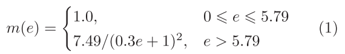
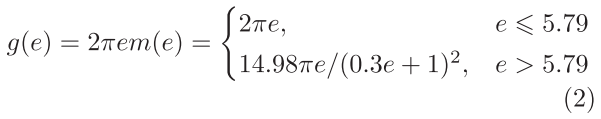
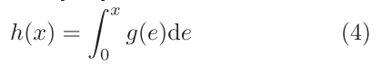
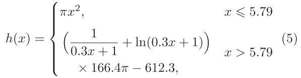
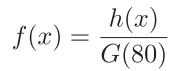
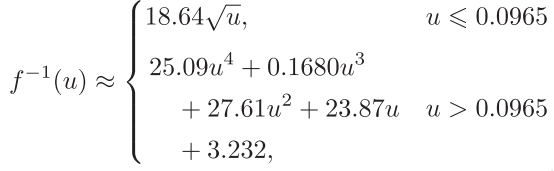
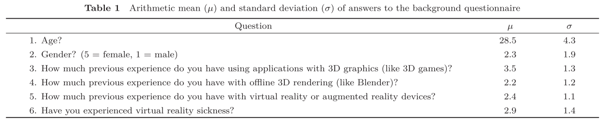
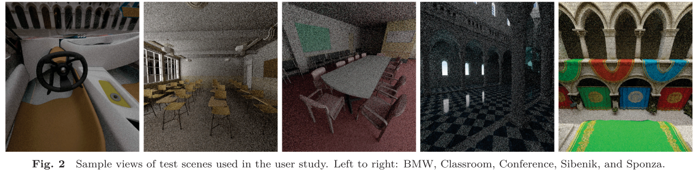
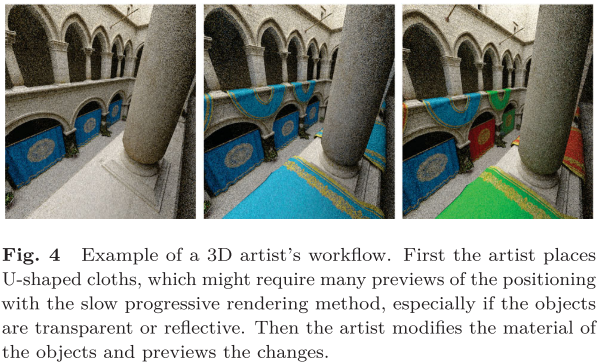

# Instantaneous foveated preview for progressive Monte Carlo rendering

## 1. Introduction

在==蒙特卡洛渲染==中，将渲染图像的误差减半需要将**渲染样本**的数量增加`四`倍：**额外渲染时间**所获得的收益迅速减少。

如果艺术家在预览过程中发现场景有问题，他们必须中止渲染，进行必要的更改，然后重新开始渲染。从头开始重新渲染是必要的：例如，改变照明条件可能会影响图像的每个像素。在许多情况下，艺术家可以用更快的渲染方法创建一个近似的场景，但它通常缺乏逼真的效果，如**反射**和**间接照明**，这需要**缓慢的离线方法**来渲染。如果艺术家能更快地预览渲染效果，就能直接提高**内容创作过程**的速度。

在本文中，作者提出了一种通过应用==中心渲染==来加快**渐进渲染图像**的预览速度的方法。由于视网膜离轴的**杆状细胞**和**锥状细胞**密度下降，**视觉敏锐度**会随着偏心度的增加而降低，因此质量会降低。据估计，`90%`以上的实时**路径追踪样本**可以通过采用中心渲染来省略。

## 2. Proposed method

根据**视觉敏锐度模型**对世界进行采样，需要生成随机的图像空间位置，概率密度由`式（1）`给出。

我们通过使用==极坐标==来简化生成：一个均匀分布的**角坐标**`φ`，和一个**径向坐标**`r`，也就是距离视觉中心的距离。`φ`可以通过快速生成**均匀分布随机数**的算法之一来生成。为了实现`r`的正确分布，必须根据**圆周2πR**修改式(1)的概率密度：

均匀分布可以用**反演方法**转化为任何其他分布：{**3**}
$$
r=f^{-1}(u)
$$
其中，`u`为`[0，1]`中的均匀分布随机数，`f`为期望的**累积分布函数**，`r`为累积分布`f`的随机数。反演法要求我们从式(2)定义的概率密度中求出**累积分布函数**，通过在区间$[0,x]$上对$g(e)$进行积分。

作者选择了**偏心角**为$80^o$的**函数上限**，因为在这一点上，模型开始达到`0`。此外，这样的角度足以覆盖所有典型的**HMD FOV**。最后，需要使**积分**符合**累积分布函数**从`0`到`1`运行的要求：{**6**}

其中，$G(e)=\int g(e)de$。==公式(3)==要求对==式(6)==中的`f`进行**反演**。然而，它不能用标准的数学函数来表示，需要用==Lambert W-函数==。作者通过用**最小二乘回归法**确定的**拟合四阶多项式**，对该函数进行近似简化：{**7**}

·

式(7)中的最大近似误差为`1.8%`，差值的积分小于`0.04%`，这两个误差非常小，特别是与前人工作中的较粗近似相比。误差小意味着模型在**外围视觉区域**产生的**不需要的样本**较少，而在**中心区域**产生的样本较多，导致收敛速度较快。

## 3. User study

为了衡量提出的**即时预览方法**的主观表现，作者进行了用户研究。首先，研究人员用==李克特五分制问卷==调查了参与者在3D图形方面的背景。所提出的问题列在表1中。该研究使用了5个不同的场景和3种不同的预览方法，顺序是随机的。测试场景包括浴室、教室、会议、Sibenik和Sponza。每个场景的示例视图见图2。选择的场景代表不同的$360^o$渲染场景。

### 预览方法

研究比较了三种不同的预览方法：

+ **全向预览**（`Omnidirectional preview`，OD）：将样本均匀分布到**等矩形图像**中每个可能的点上。该方法代表了没有预览优化的常规基线绘制。
+ **视口预览**（`VP`）：样本均匀分布在HMD当前可查看的区域。这个想法是为了模拟一些渲染引擎中使用的矩形区域采样。
+ **中心预览** （`FV`）：本文提出的方法，它是根据被眼球跟踪的用户注视点为中心的**视觉敏锐度模型**来分配样本。、

### Single scene procedure

每个3D场景的操作过程可以从`图3`中看到。作者要求**参与者**扮演一个**3D艺术家的角色**，并在3D世界中选择一个对象。他们被告知，这个对象代表他们刚刚调整过的对象。调整可以是改变对象的方向或改变其**材料参数**。两者的例子可以在图4中看到。

选择对象后，开始渲染，并且参与者记录渲染时间。**第一个时间**：在参与者认为他们可以确定物体的平移或旋转是否成功时记录。**第二个测量时间**：参与者能够确定材料调整是否成功时记录。这个想法是，在这些点上，艺术家可以取消渲染，回到编辑模式，并进行所需的更改。在每个场景中，对每种预览方法重复上述程序。**预览方法的顺序是随机的**。

要求参与者在360度图像中观察周围，并对图像其他区域的==干扰性伪影==的程度进行评价。具体是用**李克特五分制**来记录的，1表示没有伪影，5表示有很多伪影存在，以至于场景根本无法辨别。