# Kernel Foveated Rendering

在经典的对数极坐标映射中，我们通过嵌入多项式核函数来参数化中心绘制。我们的gpu驱动技术使用了封闭的、参数化的中央凹，模拟了人眼视网膜中光感受器的分布。作者提供了一个简单的双通道内核中心渲染（==KFR==）管道，可以很好地映射到**现代gpu**上。

在第一个`pass`中，我们计算==核对数极坐标变换==并渲染到一个降低分辨率的缓冲区。在第二个`pass`中，进行**反对数极变换**和**抗锯齿**，以将**降低分辨率的渲染**映射到全分辨率屏幕。

## 1. INTRODUCTION

没什么值得注意的。

## 2. RELATEDWORK

没什么值得注意的。

## 3. 本文方法

总的来说，我们的算法应用**核对数极坐标变换**，在降低分辨率的对数极坐标缓冲区（==LP-buffer==）进行光栅化，在**LP-buffer**中进行着色，然后使用**核对数极坐标反向变换**在全分辨率显示上渲染。如图2所示

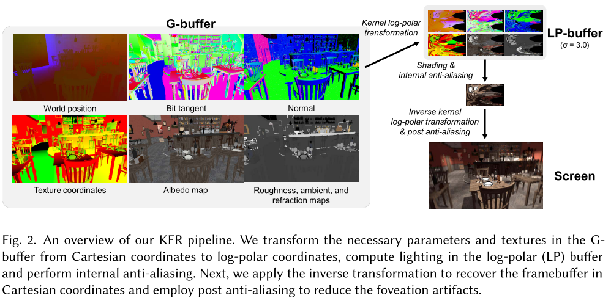

在经典的**对数极坐标变换**中，给定一个`W×H`像素的显示屏幕，以及一个`w×h`像素的**LP缓冲区**，根据公式1将笛卡尔坐标中的屏幕空间像素`(x,y)`变换为对数极性坐标中的`(u,v)`： {**1**}

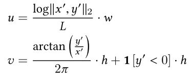

其中，`(x′,y′)`表示`(x,y)`相对于屏幕中心为原点，`L`为中心到屏幕角的**对数距离**，`1[-]`为**指标函数 **  {**2,3**}

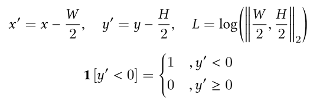

在**逆对数极坐标变换**中，对数极性坐标`(u,v)`的像素被变换回笛卡尔坐标`(x′′,y′′)`。让 {**4**}

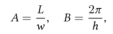

则逆变换可表示为**式5**：

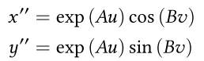

为了了解分辨率在**对数极空间**的变化，考虑$r=||x,y||_2=exp(Au)$。$dr$表示`r`在`u`下的变化量，{**6**}

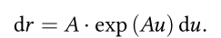

`D`被定义为**LP缓冲区**中映射到**屏幕上单个像素**的像素数。{**7**}

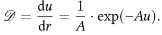

公式7显示了像素密度从**中心区域**向周边递减的**焦点效应**。在这个公式中，不容易系统地改变==密度落差函数==，评价中心渲染的感知质量。

作者提出了一种==内核对数极坐标映射算法==，让我们更灵活地模仿HSV光椎体密度的落差。

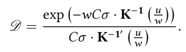

其中，恒定参数$C=\sqrt{1+(\frac{H}{W})^2}$表示屏幕对角线和屏幕宽度的比例。$\sigma=\frac{W}{w}$表示**全分辨率屏幕宽度**和**缩小分辨率LP缓冲区宽度**的比率。$\sigma^2=\frac{W^2}{w^2}$表示**全分辨率屏幕中的像素数**与缩小分辨率**LP缓冲区中的像素数**之比。更大的$\sigma^2$对应着更多的浓缩（`condensed`）**LP缓冲区**，这意味着在渲染过程中更少的计算。更浓缩的LP缓冲区也意味着更多的中心感和**更大的周边模糊**。

核函数`K(x)`可以是任意K(0) = 0, K(1) = 1的**单调递增函数**，如幂函数的和

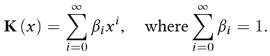

这种内核函数可以用来调整**LP缓冲区的像素密度分布**。我们在本文中使用$K(x)=\sum_{i=0}^\infin \beta_ix^i$，因为这种函数的计算在modern GPU上是很快的。也有其他核函数：$K(x)=sin(x\cdot \frac{\pi}{2})$和$K(x)=\frac{e^x-1}{e-1}$。例如，对于$C=\sqrt{2}$和$K(x)=x^\alpha$，图5说明了在改变$\sigma^2$和$\alpha$的情况下，D和r之间的关系。

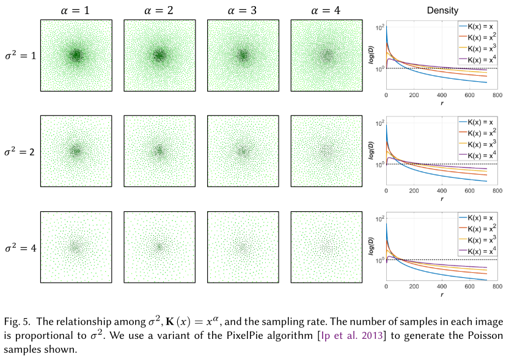

核函数可以调整像素密度，使**LP缓冲区中外围区域**的比例增加，如图3（c）、（d）和（e）所示。这样就可以在保持相同帧率的情况下提高**外围图像质量**。

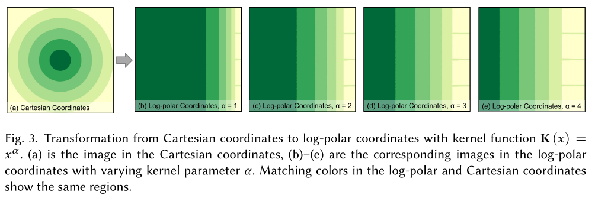

### Pass I: Forward Log-Polar Transformation

延迟着色管道的==G-缓冲区==包含对象和世界空间坐标、世界空间法线、纹理坐标、深度和材质相关信息。在==Pass I==中，我们将G-buffer中的内容从笛卡尔坐标转换为对数极坐标，计算每个像素的直接和间接光照，并渲染到降低分辨率的**对数极坐标（LP）缓冲区**。

==核对数极值变换==。对于屏幕空间中坐标为`（x,y）`的每个像素，笛卡尔坐标中的焦点`F（˚x,˚y）`，我们将公式1改为公式10。{**10**,**11**}

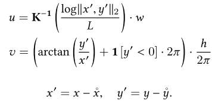

$K^{-1}(\cdot)$是核函数的逆函数，`L`是最大距离的对数（参考中心点）：{**12**，**13**}

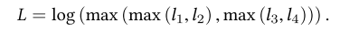

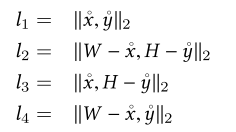

==照明==。在传统的延迟着色的光照计算中，网格位置、法线、深度、材质信息和法线贴图都是从G-buffer中提取的。在我们的方法中，我们从转换后的核对数极纹理坐标`(u,v)`中采样，而不是从带有纹理坐标(x,y)的G-buffer中获取信息。

==内部抗锯齿==。由于LP缓冲区的分辨率较低，逆向变换后可能会在外围区域出现伪影。然而，可以直接在对数极性空间中进行去噪。为了减少外围区域的伪影，我们对LP缓冲区中纹理的右侧部分（对应外围区域）使用一个3×3内核的高斯滤波器。

### Pass II: Inverse Log-Polar Transformation

==Pass II== 执行**反核对数极点变换**到笛卡尔坐标，应用**抗锯齿**，并渲染到屏幕。我们可以使用**算法2**从像素坐标(u,v)和焦点坐标`(˚x,˚y)`恢复笛卡尔坐标`(x′,y′)`。

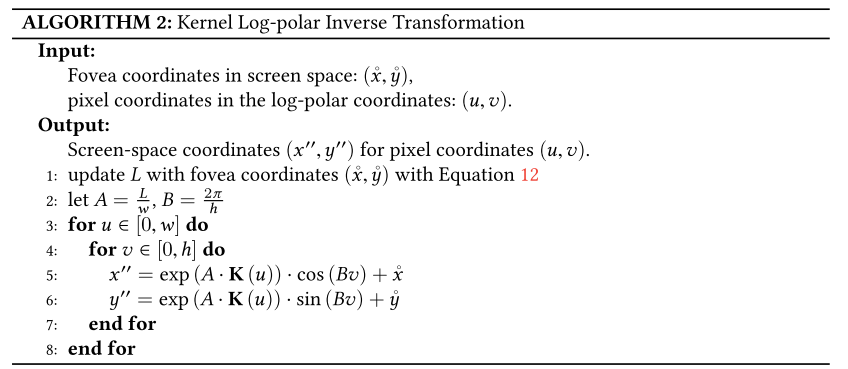

==后处理抗锯齿==。在中心渲染中，一个关键的考虑因素是减轻由于外围、高偏心区域的混叠造成的时间伪影。我们使用时间抗混叠(==TAA==) 和Halton采样对经过反向核对数极坐标变换后的屏幕空间像素进行恢复。在抗锯齿后，我们也使用不同核尺寸`η`的高斯滤波来处理不同的L（如公式12中定义的）。核大小η如公式14所示，它取决于像素坐标与的归一化距离

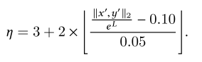

