# Mitigating Cybersickness in Virtual Reality Systems through Foveated Depth-of-Field Blur

在**立体三维刺激**中加入**空间模糊**已被证明可以减少**晕机现象**`Cybersickness`。在本文中，作者受`HSV`的启发，开发了一种在VR系统中加入空间模糊的技术。该技术利用了`foveated imaging`和**景深**的概念。所开发的技术可以作为**后处理步骤**应用于任何**配备眼球追踪器的VR系统**，以提供一个无伪影的场景。

通过进行一项**关于晕机评估的用户研究**来验证所提议的系统的有用性。作者使用了定制的**过山车VR环境**和`HTC Vive Pro Eye`头盔与用户互动。**模拟器病症问卷**被用来测量诱发的病症，同时记录`gaze`和心率数据进行**定量分析**。实验分析强调了**景深效应**在减少虚拟环境中的晕车现象方面的合适性，即减少了约`66%`不适分数。

## 1. 介绍

用户长时间使用VR会感觉到不适，可以被称为==模拟器病==（`SS`），或**眼疲劳**，或**视觉疲劳**。

已经进行了一些**用户研究**，试图确定影响**模拟器病水平**的不同因素：

- 虚拟世界中**外部环境的遮挡**（即环境没有被显示出来）会使用户更容易受到SS的影响。
- 不自然的感官映射和模拟错误，如**跟踪错误和延迟**，也会导致更高的病症和更低的沉浸感
- 有过电子游戏经验的用户不太容易出现晕机现象
- 神经质等人格特质也与SS有很强的相关性，但主要与恶心有关
- 对VR刺激的生理反应，如瞳孔放大、眨眼、眨眼和心率，已被发现与晕有明显的相关性
- 当**VR用户**出现晕机现象时，他们的**眨眼频率会增加**
- 用户对**存在于20°偏心率内的伪影**很敏感。

有几种方法可以检测和测量**晕机现象**：

- **基于用户自我报告的问卷调查**是最早的评估方法，这些问卷有几种类型，如**模拟器病症问卷**（`SSQ`）和**虚拟现实病症问卷**（`VRSQ`）。`SSQ`是VR社区中最流行和最多引用的。
- 通过**生理逻辑信号**，如心率、呼吸率和皮肤电导率来评估网络病有了一些进展。
  - Fernandes提议根据**用户的运动**动态地改变视场。然而，这种方法限制了虚拟世界中的存在感。
  - 用户研究表明，通过加入**空间或失焦模糊**来减少`SS`。
  - Budhiraja试图解决VR中由`vection`引起的病症。`vection`是指在没有任何物理运动的情况下对**自我运动的感知**，通常由用户视线中的**次级运动物体**引起。他们加入了旋转模糊，即当周边物体发生旋转运动时，对整个场景施加一个高斯模糊。
  - 最近的一项研究表明，在VR系统中引入**空间模糊效果**也可以帮助**深度感知**。

在本文中，作者开发了一个系统，它从`HSV`和**镜头的光学特性**中获得灵感。所提议的系统结合`foveated rendering`和**DoF模糊**，在中心区域提供一个**无伪影的场景**。目前应用于VR的**空间模糊技术**经常出现**伪影或不能提供足够的帧率**。作者还介绍了一项**关于晕机的用户研究**，以评估技术是否能显著降低**虚拟环境中诱发的晕机**水平。在用户研究中，通过**SSQ调查问卷和心率测量**来评估晕机情况。

## 2. The Proposed Foveated Depth-of-Field Effects

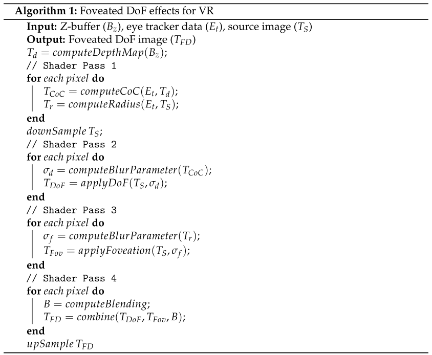

所提出的**空间模糊技术**包含了**DoF模糊**和**foveation效果**。考虑了不同类型的平滑过滤器，如高斯滤波、`Bokeh`和**圆盘效应**。由于该系统从`HSV`中获得了灵感，所以首选**Bokeh滤波器**，因为它能更好地模仿人类眼睛中**存在的光圈**，并能导致**更真实的输出**。算法`1`中描述了`foveated DoF effects`的伪代码。**流程见下图**。

- 在第一个`pass`中，使用**原始深度值**计算**混淆直径圈**`CoC`，并存储在一个**单通道纹理对象**中。在离**固定平面**较远的物体上，**混淆直径圈**显示为灰色，在用户和固定平面之间的物体显示为**紫色**。同时，通过计算**每个像素与固定像素的距离**，将图像分为**三个圆形部分**。红色像素代表眼窝区域的像素，而绿色和蓝色像素分别代表**近端和中端周边区域**。
- 使用**源图像**和**混淆圈纹理**，`DOF`在第二个`Pass`中被计算出来。
- 同样地，使用`foveation mask`和源图像，`foveation effects`在第三个`pass`中计算。
- 在最后一个`pass`中，这些效果**合并**。**平滑过滤器**是以**源图像的一半分辨率**应用的，所得到的帧进行==上采样==。

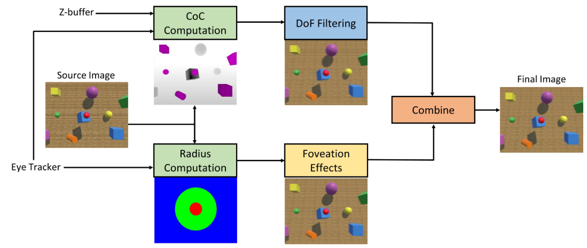

### Depth-of-Field Blur

当人类在视觉上感知周围环境时，**视网膜图像**包含模糊的变化。这种变化是由于物体被放置在**不同的深度平面**，是深度感知的一个重要线索。为了在**VR系统**中合成这种模糊效果，我们使用一个**深度纹理对象**来创建虚拟场景的深度图。每个像素的深度值被计算出来并存储在一个**Z-缓冲区**中。这个深度信息被用来定义**平滑过滤器的参数**。眼球追踪器被用来识别**固定平面**，模糊量根据**像素深度的差异**（即场景物体相对于固定平面的深度差异）变化。**适应平面上的物体**保持它们在源图像中的状态，而在其他每个区域应用**平滑过滤器**。我们使用**混淆圈概念**来模拟与每个像素相关的模糊量。

当镜头聚焦在距离$D_f$的物体上时，一个直径为`C`的圆被距离$D_p$的物体成像在**视网膜**上。这个圆被称为**混淆圆**：

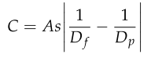

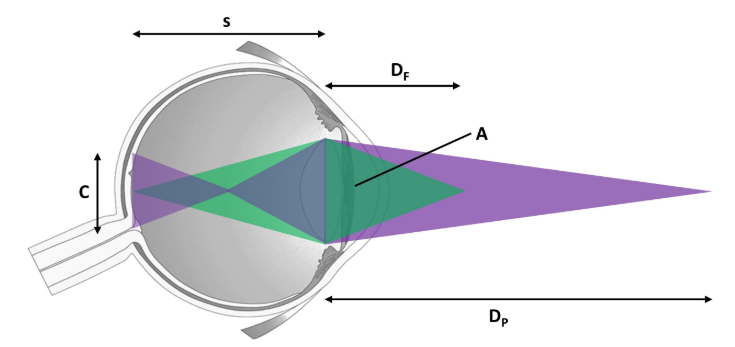

我们使用**混淆圈**来改变**模糊度**。`C`越大，模糊量就越大。这意味着**模糊参数**$σ_d$与**混淆圈的大小**有直接关系：

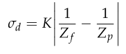

参数`K`是$As$​的拟合。参数`K`与**场景和用户**有关，必须进行相应的调整。

### Multi-Region Foveation

焦点区域和周围区域。周围区域又可细分为三类，即**近、中、远周边区域**。**远处的周边区域只对一只眼睛可见，对立体视觉没有贡献**。我们把整个图像场景分为三个部分，分别对应于焦点区域、近端和中端周边区域。

作者使用**圆形的分割**，而不是矩形的分割，因为它更好地代表了**市售HMD中的镜片形状**。中心区域定义为焦点区域，无需进一步处理就可输出，而**平滑滤波器**则应用于其他区域。与每个像素相关的**模糊参数**$σ_f$​​​是由该特定像素**在分割场景中的位置**决定的。在本文的实现中，中周边区域的$σ_{fm}$是近周边区域$\sigma_{fn}$的**两倍**

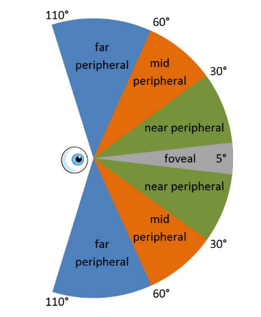

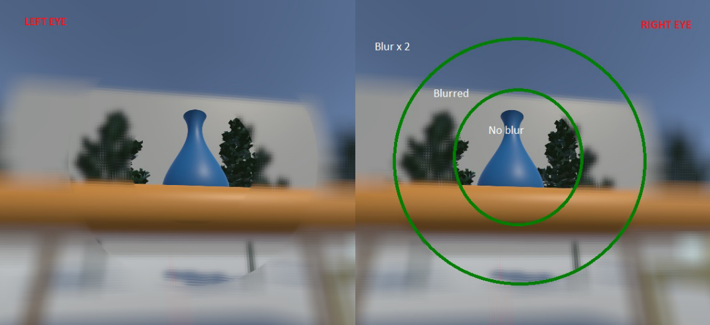

### Artifact Removal and Image Merging

产生的图像中存在一些伪像——模糊度$σ$​​参数的突然变化。为了消除/减少它们，我们使用Perry和Geisler提出的技术，利用**分辨率图的传递函数**混合**多分辨率图像**。应用在VR系统中的过渡区域。在本系统中使用过渡区域与固定点之间的**径向距离**而不是传递函数。我们引入==过渡区域==$R_t$​，并将周围区域定义为内$R_i$​或外$R_o$​​。同样地，它们**相对于固定点的相应半径**被定义为$r_j,j=1,2,3,rj<rj-1$​。我们计算**混合函数**$B(x，y)$​​​：{**3**} {**4**}

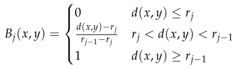

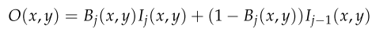

为了合并**DoF模糊**和`foveation`的输出，我们为两者计算像素级的$σ$。然而，只使用较小的$σ$进行平滑过滤。

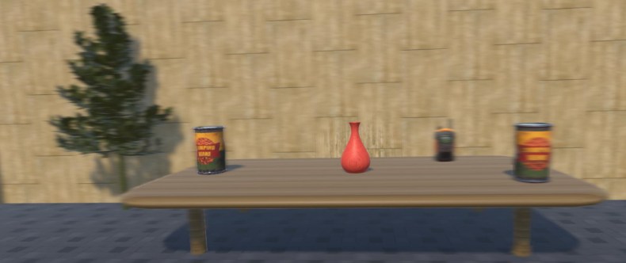

### User Study on Cybersickness

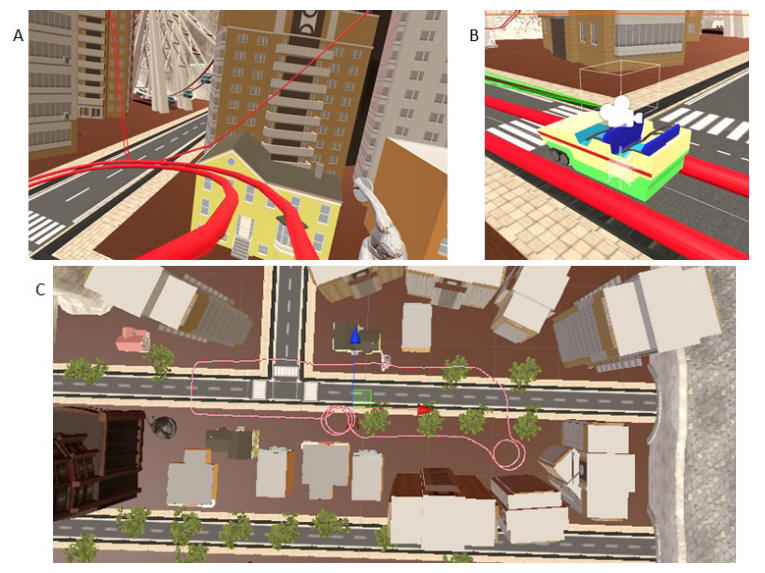

为了分析所开发的`foveated DoF`是否能帮助减少**使用VR设备时的SS**，进行了一项**网络病症研究**。这项研究的目的是测量**诱发的病症水平**，并收集**用户数据**以进一步分析。

***Participants***

收集了18名志愿者（9名男性和9名女性）的数据，他们的年龄从18岁到46岁。(平均29.3 ± 7.6)。参与者都是志愿者，没有得到任何奖励。除四人外，所有用户都是VR的新手。

***Setup***

所开发的系统是在英特尔酷睿i7-9700K处理器上使用Unity来实现的，该处理器配备了NVIDIA®（英伟达™）软件。9700K处理器，配备了NVIDIA GeForce GTX 1080显卡。一台集成了Tobii眼球追踪系统的HTC Vive Pro Eye设备被用来与用户进行互动。该HMD每只眼睛的分辨率为1440 × 1600像素，视场角为110°。Scosche Rhythm臂带监视器被用来测量用户的心率。

***Design***

 设计了一个**VR过山车环境**来诱发**晕动症**。轨道由放置在**不同点的跷跷板和螺旋运动**组成（见下图）。各种物体和建筑物被紧密地放置在过山车轨道周围，以拥有一个**集群环境**。聚集的环境确保了**用户的焦点快速变化**。

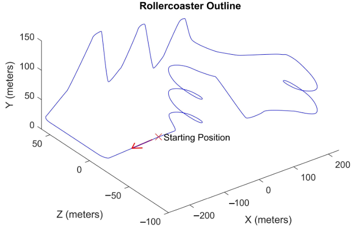

***Analysis***

为了测量`SS`，用户必须填写**模拟器病症问卷**（`SSQ`）。`SSQ`由`16`个问题组成，以**4分李克特量表**来回答。`SSQ`的分数反映了恶心、眼球运动障碍、迷失方向和诱发疾病的**总体严重程度**。问卷由每个用户在每次治疗之前（前）和之后（后）填写。为了测量每种类型之间的用户体验，我们使用了`Igroup Presence`问卷（`IPQ`）。IPQ由`14`个问题组成，以**7分的李克特量表**来回答。

### Experimental Results

***Cybersickness and Presence Evaluation***

图11和12显示了**SSQ问卷调查的结果**。可以看出`foveated DOF`模糊比没有模糊的设置有更好的表现。为了比较不同条件下的结果，进行了**Wilcoxon秩和检验**（见图11）。在每一种类型的系统中，**用户的前状态和后状态**之间的交叉验证显示出明显的差异，也就是说，实验环境造成了**SSQ分数的明显增加**（见表1）。实验前和实验后得分之间的差异（见图12）表明增加量在NB时段是最高的，范围在49-54之间。在空间模糊的条件下（GC和FD），**迷失方向感的分数**变化最大，这与前庭障碍有关。在NB和GC条件下，诱发的迷失方向感的量是相似的。虽然个别分值的范围不同，但结果表明，三种条件产生的症状模式略有不同，即NB：D≈O≈N；GC：D>O>N；FD：D>O≈N。

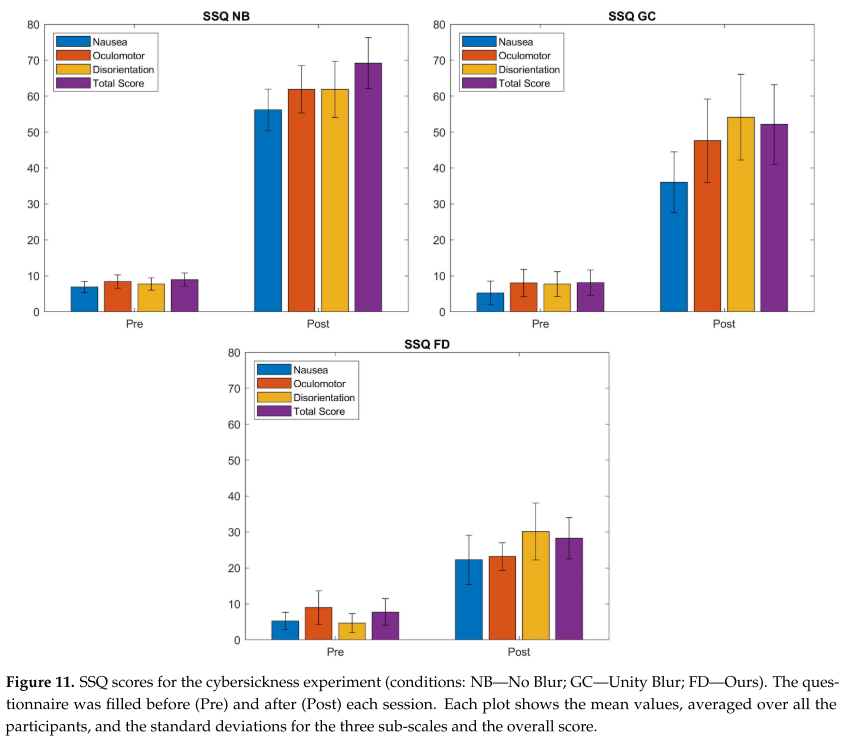

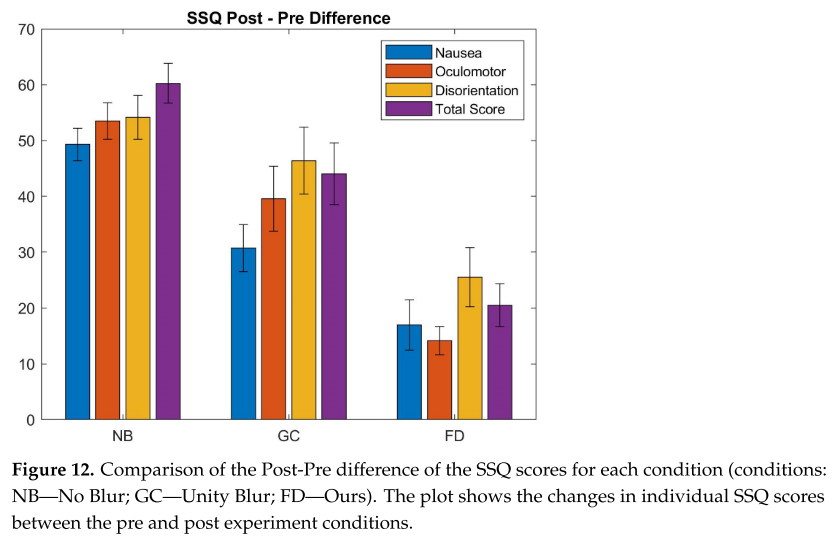

***Heart Rate Observations***

另一个观察不适的参数是**心率的波动**。然而，目前 Nalivaiko等人将手指温度、反应时间和心率等测量值与晕车相关联，但目前还没有心理生理学参数可以令人满意地测量和预测晕车。图14显示了所有用户的平均心率波动，以及过山车周期中的标准偏差。可以看出，DOF模糊导致了稳定的心率，与静止的心率相比只有一分钟的增加。相反，在没有模糊的情况下，心率的波动更加突然。
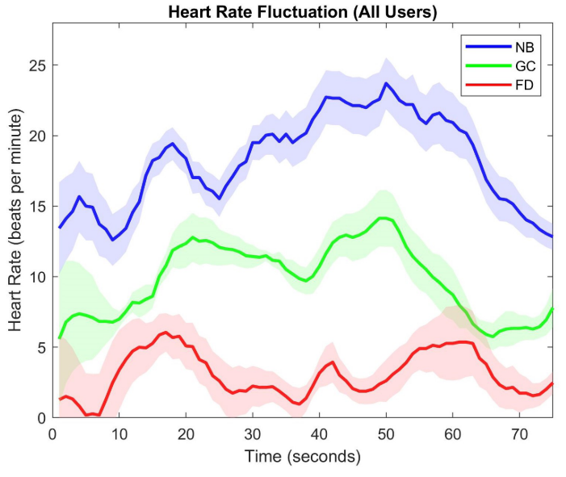

