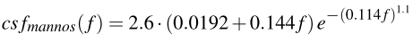
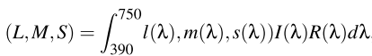

# Perception-driven Accelerated Rendering

​                                          *Computer Graphics Forum 2017*

------

[toc]

## 1. Introduction

基于感知的渲染主要利用的是HSV的性质。作者提供了==HVS==相关特性的概述，并描述了不同的渲染技术如何通过**结构方法**挖掘特定的**感知机制**。本文对目前的主要研究领域进行了全面的综述，并根据其机理对不同的技术进行了分类，提出了有待解决的问题和未来的研究方向。

## 2. Scope and Structure

在本文中，主要研究==三个问题==。首先，必须清楚了解HSV的局限性和属性；其次，必须选择一个或几个特定的==适当属性/限制==，并建立类似的模型。第三，作为一种加速渲染技术，在实现这一想法时，需要理解所有的生理和技术步骤。因此，它描述和演示了如何利用**HSV的局限性**来加速渲染。基于这三个步骤的过程，作者提出以下研究问题，这些问题构成了本报告的结构：

- HSV的局限性是什么?
- 这些限制是如何建模的?
- 最新方法中，如何使用限制来加速渲染？

## 3. The Human Visual System and its Limitations

从上到下，光线进入我们的眼睛，构成两个数据流，使我们能够处理视场上的立体成像，==视场==包括具有不同**刺激敏感度**的区域。**视觉系统**将**刺激**传递给**视网膜**`retina`（“传感器`sensor`”），视网膜与视觉通路相连。这种连接将信号从眼睛传输到**视觉皮层**（`visual cortex`），大脑的不同部分参与处理和解释信号，直到环境的最终心理表征产生：用户所感知的图像。在这个过程中，==记忆和注意力==都起着关键作用。下面，我们通过图1的每个组成部分，讨论关于HVS的==生理和感知特性==的发现，并描述其==局限性==：

### Optics

HVS具有几种独特的光学特性，这些特性是由眼睛的位置和形状所决定的。

- 在双目视觉`binocular vision`和双眼朝前看的情况下，人类的==水平FOV==几乎为`190°`。 如果考虑眼球旋转，则水平FOV扩展到`290°`。
- 虽然人眼会在FOV的整个范围内接受**视觉刺激**，但刺激在视野的不同部分**被处理的方式**，受**视网膜空间变化特性**的影响很大。**中央视觉**与**远近周边视觉**相比，存在着显著的差异。
- 瞳孔之间的距离，即==IPD==，产生了两种来自不同视角的视觉刺激，在大脑中通过一个称为==立体视觉==的过程组合，使人能够感知深度，也被称为`stereo vision`。深度感知还可以通过视差、遮挡、颜色饱和度和物体大小等视觉线索来实现。
- 从采样理论可以知道，如果信号中包含的频率高于观察者的==奈奎斯特频率==，就会发生`aliasing`。在人类的视觉中，当空间频率高于大约` 60 cpd`时，就会出现这种`under-sampling`效应。眼睛的==角膜==和**晶状体中的光学元件**起到了**低通滤波器**的作用，其截止频率为`60cpd`左右。这样一来，无法正确采样和重建的信号就会通过**光学预滤波**被有效地去除。
- ==瞳孔==是另外一个重要因素。作为一个光圈，瞳孔的直径可调节为`2至8毫米`。这种调节主要影响图像的清晰度，因为瞳孔只能控制大约一个幅度的光强差（1对数单位）。眼睛对**亮度感觉差异**的适应（明暗适应）主要发生在**视网膜**上。

### Sensor

通过眼睛进入的光线被投射到眼睛的光敏层，即==视网膜==上。这层视网膜由两种类型的**光感受器**组成：$6\cdot10^6$个圆锥体`cone`和大约`20`倍的杆状体`rod`。==Rods==只由一种**感光色素**组成，在较低的光照条件下，通过提供**单色性反馈**来实现亮度感觉（视网膜视觉）。锥体按不同的波长分为三种类型，即L锥体（长波长）、M锥体（中波长）和S锥体（短波长）。它们负责详细的==颜色感觉==（光感视觉`photopic vision`）

视网膜的中央区域，视网膜的`fovea`(大约$5.2^o$)，完全由**锥**`cone`组成。随着**偏心距**（到光轴的距离）的增加，锥密度显著下降（`parafovea`：$5.2^0-9^o$，`perifovea`：$9^o-17^o$）。这些构成==中心视觉==，而更远的区域被称为==周边视觉==。杆状物`Rod`的最高密度是在`fovea`周围约$15^o-20^o$，然后密度几乎呈线性下降。它们也有不同的空间采样分布，并遵循**泊松-圆盘分布模式**（`Poisson-Disc Distribution pattern`）。

`cone`的密度与视力有关，即 "**视力的敏锐度**"。眼睛的视力在`fovea`之外会显著下降（在偏心率为$6^o$时，视力已经降低了`75%`）。**视觉敏锐度**可以用==最小分辨率角==（`MAR`）来表示。

> Normal vision corresponds to 1 MAR, a measure describing that a feature size of 0.5 minutes of arc is still visible。

还有其他因素会影响视力：视敏度还取决于**刺激的对比**。 视力限制通常是在明晰的亮度条件下，使用高对比度的图像或文字来测量的。而且，敏锐度的降低取决于**整体照明**。 图3中显示了在暗光下，**可感知的空间细节**的减少。正弦光栅图案的最高可感知空间频率从可见光水平的`〜60 cpd`降低到暗视视觉（`scotopic vision`）的`2 cpd`。

此外，==对比度感知==也会受到影响。 眼睛对**对比度的敏感度**，可以通过针对时域的**对比度敏感度函数**（==CSF==）来描述。 CSF定义为**最小可见对比度的倒数**，表示为时间和空间频率的函数。通常在不同对比度水平下，使用**正弦光栅图案**进行测量。 曲线下的区域通常称为==可见性窗口==。 可分辨的**敏锐度极限**（`60 cpd`）对应于最低的**对比敏感度值**。非常高的频率（`> 60 cpd`）和非常低的频率（`<0.1 cpd`） 根本看不到。 虽然上限可以通过**视锥距**和**光学滤镜**（`optical filterin`）来解释，但下限不能直接从眼睛的生理学中得出。==对比敏感度==取决于对相应光栅模式作出反应的**神经细胞的数量**。**从中心到外围，所有频率的灵敏度都会显著下降，高频的下降速度最快**

杆状体`Rod`和锥状体`Cone`的不同分布，也会影响视野不同部位对颜色的敏感性。`fovea`受到`红/绿`的色觉刺激，而这些刺激在外围的显著性明显降低。相比之下，==我们只有约9%的锥体负责对蓝色的感知==，而它们更多的分布在`fovea`外。这就导致**外围对蓝色的敏感性相对更高**。因此，**对比敏感度**也取决于刺激的色度。`蓝/黄`和消色差（`achromatic`）刺激导致**对比度阈值**下降不明显。从中心到外围区域，对`红绿颜色`变化的敏感度比对亮度或蓝黄颜色的敏感度，下降快的多。

**视网膜光感受器**有能力适应光强度的明显变化。**适应强光的过程非常迅速，而适应弱光条件则需要相当长的时间**。**适应影响着HVS的性能**，如颜色感知、时空对比敏感度和可感知细节的数量。它使人类能够在7个数量级的亮度强度上稳健地感知视觉信息。然而，我们并不能在所有的强度水平上，都能看到同样的东西。==适应的代价是在较低的光照度下降低敏锐度==。在白天，对比敏感度较低，但视力和色觉却很出色。与在立体视觉中可以观察到的偏心率下降类似，深度知觉在周边地区也会显著降低。

### Motor

我们的眼睛一直在运动。**六块外部肌肉**（==眼外肌==）可以精确而快速地改变眼睛的**水平和垂直方向**。眼球运动的主要目的是：将感兴趣的物体（==OOI==）的**投影**移动到两个眼球上，从而使聚焦的物体能以**高细节**被感知。这种机制允许探索和扫描环境，将注意力从一个物体转移到另一个物体。此外，**眼外肌**使**眼球的晶状体**能够调整，并将OOI设置为焦点。

最重要的**运动类型**是：囊状运动（`saccades`）、前庭-眼球反射、平滑追赶眼球运动（==SPEM==）和耦合vergence-accommodation运动。

> Kowler从心理物理学的角度对人类眼球运动的特性和影响进行了很好的调查。

在**移动**等活动发生的头部运动中，**HVS**利用==前庭系统==的加速度信息、头部旋转量信息和视网膜速度信息（==视流==）来保持眼睛的方向与OOI一致。这种==前庭-眼反射==发生得很快，延迟为`7-15毫秒`，对于快速的头部运动来说，这种反射是非常强大的。

人类不断地扫描环境。在这种情况下，最重要的机制是==saccades==和==fixations==。`Saccades`表示从一个OOI快速跳到另一个OOI时的运动。在一次==saccades==过程中，**峰值角速度**可以达到$900^o/s$。同时，**视觉灵敏度**（视力）急剧下降，这就是所谓的==saccadic suppression==。因此，在囊状（`saccadic`）眼球运动时，**无法获得准确的视觉信息**。与此相反，`fixations`描述了当我们的目光停留在一个**OOI**上时，**视觉信息**被感知的==状态和持续时间==——持续时间通常在`100毫秒到1.5秒`之间。

假设一次==定影==`fixation`的**持续时间**，与视野中某一区域的**相对重要性**和**视觉复杂性**相对应。如果需要处理更多的信息，定影的时间通常会更长。当观看一个典型的自然场景时，**HVS**每秒会触发大约`2到3`次`saccadics`，平均定影时间约为`250毫秒`。定影之间的**平均间距**约为$7^o$视角。==在较大的偏心度（$>30^o$）下保持定影是不舒服的，通常会导致头部向目标旋转==，然后在较低的、更舒适的偏心度下进行定影。

当有意识地盯着一个物体时，眼睛仍然会进行微小但重要的运动，称为**震颤运动**`tremor motion`。这种无意识的运动会刷新**视网膜图像**。==测试表明，如果抑制震颤运动，感知到的图像会逐渐消失==。

当一个**移动的物体**吸引我们的目光时，不自觉引发的**跟踪反射**称为==平滑追逐眼动==（**SPEM**）。这种运动使观察者能够跟踪**缓慢移动的目标**，使目标固定在`fovea`上。有趣的是，$2.5^o/s$的**小眼球运动**对视力几乎没有任何影响。研究人员发现，**SPEM**的峰值速度约为$100^o/s$。==成功率取决于目标的速度==，当**角速度**大于$30^o/s$时，成功率会显著下降。

==立体视觉==`Stereopsis`被聚散和调节**高度纠缠**（**Stereopsis is highly entangled by vergence and accommodation**）。为了固定一个物体，两眼需要同时向**相反的方向**转动（==vergence==）。为了聚焦在物体上，眼睛会调整**晶状体**，并将**瞳孔**作为一个**光圈**。**压缩和放松晶状体**的能力称为调节 ==accommodation==。当眼球前部的**睫状肌**收紧时，**晶状体的曲率**和相应的聚焦力就会增加。`accommodation`描述了调整相机镜头的自然方式，使场景中的一个物体被设置为**焦点**。重要的是，这个过程是在无意识的情况下发生的，在光照水平下，不费吹灰之力，在不到一秒钟的时间内就能完成。

通常情况下，**立体显示器**通过为每只眼睛提供单独的图像，提供**双眼差异线索**来影响`vergence`。然而，当图像显示在屏幕上时，眼睛会集中在屏幕的距离上。这就导致了一种冲突，一般称为`vergence-accommodation conflict`。`Accommodation`和`vergence motions`与双眼视觉的`fixation`过程相配合，使两眼的目光都瞄准了远处的同一个点。

### Processor

**视网膜刺激**处理之后，大脑的==视觉皮层==进行**神经信息处理**。对应于**杆状体**和**锥状体**密度的下降，超过`30%`的**初级视觉皮层**负责视野中央$5^o$，而外围则少很多（while the periphery is under-represented ） 。对图像的认知处理以及**中央视觉和外围视觉的知觉差异**一直是感知研究的目标。Thorpe等研究表明，**外围视觉提供了丰富的信息源**，对**对比特征、物体和动物**的感知和识别至关重要。Gilchrist等人指出，**外围色彩变化的影响高于方位变化的影响**。

此外，`HVS`广泛利用**周边视觉的上下文信息**，促进自然场景中的**对象搜索** 。因此，可能发生了**视觉刺激的预处理**。有证据表明，**基本的视觉特征**（如物体的大小、颜色和方向）在通过将物体移动到中心视觉，而将实际注意力放在物体上之前，就已经被**预处理**了。

除了**立体视觉**的过程外，解释**视觉输入中的==深度线索==**以提高**立体视觉**和**空间定位感**的能力，与**视觉皮层**高度纠缠。深度线索可以是**静态的**（如遮挡、纹理、阴影和透视）或**动态的**（如运动视差）。线索也可以从记忆中获得，例如：熟悉物体的相对大小。此外，**深度线索**取决于物体与眼睛的距离，主导线索可能占主导地位，也可能影响3D场景的解释。

一种只能用**周边视觉**观察到的现象被称为==拥挤==`crowding`。如果物体周围有分散注意力的刺激物，那么物体就会变得更难识别。**拥挤**是通过使用**定义明确的刺激物**，如字母或正弦波模式，来研究的。

最后，视觉受到==跨模态效应==的影响。特别是VR系统经常提供**非视觉线索**，如音频、振动甚至气味。这些影响已经在**心理学实验**中研究过各种线索之间的**相互作用** 。当感觉通道被替代或组合时，会发生一些影响：**感觉通道**不再被视为**独立的通道**，而是可能通过整合大脑中**多模态关联区域内的感觉信号**而相互影响。

### Memory and Attention

**视觉信息的处理**高度依赖于存储在记忆中的**知识和模式**。这些知识是如何存储的，目前仍在讨论中。根据Smith和Kosslyn的观点，**表征**是一种**物理状态**，它代表着一个对象、事件或概念，必须是有意构建的，并携带信息。**表征**可以用不同的形式**编码信息**，包括类似于图像或特征记录的信息，也包括amodal符号，以及神经网络中的统计模式。**这些表征是相互关联的。不同的格式一起工作，以表示和模拟对象** 。此外，尽管有运动和不同的遮挡，大脑还是会随着时间的推移保留视网膜图像的某些特性。如前所述，也有证据表明，基本的视觉特征，如颜色、大小和方向，在引导中心凝视到它们之前，已经被解析和预处理了。

虽然人们对**注意力**还没有完全了解，但研究表明，==注意力有三个组成部分==：对感觉事件进行**定位**，检测信号进行**集中处理**，保持警惕或警觉状态（maintaining a vigilant or alert state ）。**注意力**对于**处理视觉刺激**和**搜索行为**非常重要。它包括选择进一步处理的信息和抑制其他信息接受进一步处理。在信息加工任务中，**注意**可以以不同的方式发生：**选择性注意**是指选择处理哪些事件或刺激；**集中注意**是指努力维持对这些要素的处理，同时避免分散其他事件或刺激的注意力；**分化注意**是指在给定的时间点上处理一个以上的事件或刺激的能力。

**注意力的集中**也会在**认知层面**影响知觉。对于某些任务来说，一个关键的**知觉效应**是==认知隧道==（或视觉隧道）和==非注意盲视==。观察者倾向于将注意力集中在特定区域或物体的信息上。然而，对特定对象的**强烈认知关注**会导致：对高度关注区域外围的部分信息的**排除/损失**。

## 4. Perceptual Models

==感知模型==在计算机图形学中通常用于通过**数学描述**来逼近**HVS的功能和特性**。这些模型被用来引导**感知渲染算法**和判断图像的感知质量。在下文中，将介绍一些从HVS（RQ2）中推导出来的、与计算机图形学应用相关的模型。这些模型可以是低层次的，只描述HVS的某些方面，也可以是高层次的，描述整个系统。

### Low-level Models

#### Spatial Sensitivity (Acuity) 

在感知驱动的渲染中，一个重要的方面是：==如何对眼睛的敏锐度（视力）进行建模==。**敏锐度模型**通常用于根据用户的注视来调整图像的分辨率和渲染质量。

> Strasburger等人提供了一个历史总结和调查，描述了周边视觉的视力如何下降。

在偏心度$>2^o$时，**视力**与物理锥体间距可能预期的不同。Wey-mouth等人的研究表明，在最初的`20-30度`内，视力随偏心度大致呈**线性下降**。对于较高的偏心度，**视力表现下降更快** 。根据Weymouth和Strasburger等人的研究，当用==MAR==而不是敏锐度（其倒数）来衡量时，**线性模型**既符合解剖学数据，也符合许多**低级视觉任务**的性能结果。然而，==MAR函数的斜率是依赖于用户的==，不能精确预测。**敏锐度**也受到眼睛在非常明亮和黑暗区域的适应性以及眼睛运动和认知因素的影响。因此，**任何线性模型仍然是一个近似值**。

一个经常使用的线性模型：==皮质放大系数==（**CMF**），M代表了从**视觉角度**到**皮层直径**的映射，单位为毫米。对应于`fovea`，放大系数M最大，而**周边区域的放大系数**则随着偏心度的降低而降低。

对**线性CMF**的结果，==M-scaling假说==声称，通过对**刺激物**应用空间缩放，可以抵消偏心性的**性能下降**。例如，为了补偿在外围阅读字母时的**敏锐度损失**，这些字母只需要按照**线性CMF**放大，就能再次获得同样的可读性。这种方法已经被Cowey和Rolls成功证明，并促使研究者将`fovea`和**周边**统一起来。==M-缩放概念==被广泛地用于**模拟**凝视感知渲染系统中的**偏心率变化**

> 该概念的有力支持者声称，"通过按放大系数缩放图片的大小，可以使图片在任何偏心度下都同样可见"。然而，其他研究者也指出了 M 缩放概念的困难。首先，线性CMF模型只近似于HVS的复杂性，因为周边视觉不是中心视觉的缩小版。其次，有几项研究存在CMF概念不太令人信服或明显失败的情况，如立体视力、远周边的两点分离或scotopic视觉的对比敏感度。此外，由于不同视觉任务的测量结果存在差异，以及个体间的差异，M-scaling是否也适用于近视区还是一个未知数。

#### Brightness and Contrast Sensitivity

`HVS`对**空间对比的敏感性**由对比敏感函数（==CSF==）表示。它可以由空间参数和眼睛的适应性来描述（图4）。然而，对于一个完整的模型，CSF还取决于偏心、时间效应和视网膜速度，使其成为一个更高阶的函数。因此，文献中存在各种不同自由度的**CSF模型**。Mannos和Sakrison提出了一个实用的消色差`achromatic`和色度敏感性模型：

其中==f==是视觉刺激的**空间频率**，单位为`cpd`。

> 一个更详细的数学模型在实践中使用的是由Barten开发：它考虑到了`fovea`和周边视觉的空间对比敏感度，以及对时域的扩展。另一种描述**CSF**的方法是由Gervais等人提出的。Daly等人使用特定照明水平的预计算CSF数据，并支持空间频率和视网膜速度。Mantiuk等提供了适应亮度扩展范围内的可见度测量所拟合的消色差和色差CSF模型。后者广泛用于图像质量评估和色调映射运算器（TMO）。Johnson和Fairchild以及Lukac提供了更多关于CSF的细节。

#### Color Sensitivity

**锥体类型**的敏感度、分布和密度的不同，对人的**色彩感受**有很大影响，即对波长==λ==在`390～750纳米`之间的可见光的感受。计算机图形学中最常用的色彩模型是**加法RGB模型**。这种模型将与**视网膜上的杆状物**有关的红、绿、蓝三原色进行加法组合。然而，==这种模型并不是由感知激发的==。颜色空间取决于底层设备。这个问题已经被国际生态委员会（CIE）后来的标准化所针对。CIE-RGB使用特殊的参考色为r、g和b。通过确定CIE-XYZ，一个独立于设备的非负色空间，分配这些参考色成为可能。
**可见光刺激S**取决于波长相关的**照明I(λ)**和**物体反射率R(λ)** 。当观察到一个刺激时，(L)arge、(M)edium和(S)mall-cones通过整合所有波长上的能量做出反应：

其中**l(λ),m(λ)和s(λ)**描述了**L锥体、M锥体和S锥体**的**光谱敏感度**。==CIE-XYZ==是第一次尝试包含HVS的视网膜响应，目标是：覆盖所有**正坐标**的可感知颜色。**CIE-XYZ**在实践中经常被使用，但颜色空间在感知上是不规则的，就像RGB、HSV或许多标准颜色空间一样，而且没有考虑L、M和S锥体的不同敏感度。在这些空间中，例如，**知觉上同样不同的绿色的距离比红色或蓝色的距离要小**。感知色彩空间（CIE-LAB、CIE-LUV、CIEDE2000）几乎是线性的，可以从CIE-XYZ值转换而来。在这些色彩空间中，任何两种颜色之间的知觉差异都与欧氏距离直接相关。由于锥体的响应不能直接测量，**LMS色彩空间被设计成直接与LMS-锥体类型的光谱响应相关**。

基于经验测量，已经提出了几种从**CIE-XYZ**到==LMS空间==的线性转换，如**Hunt模型**、LLAB、CIECAM97s和CIECAM2000。Hering在1892年发展了颜色对立的思想。他发现某些颜色不能混合，例如，没有红绿色。这一点后来得到了经验验证，并被证明在一些图像处理任务中是有益的。有趣的是，**CIE-LAB**和**CIE-LUV**都在其颜色通道中提供了颜色对立性。颜色**高度影响**HVS感知对比度的能力。Mitchell介绍了一种早期的方法来解释眼睛对计算机图形学中使用的每个波长和颜色的不同对比的敏感性。对比度是使用单独的、感性激发的RGB颜色的阈值来检测的。计算机图形学中的其他方法，如Bolin等人 ，使用转换将CIE-XYZ色彩空间转换为LMS空间。**LMS值被用来检测具有强烈可感知对比的区域**。

> Fairchild , Gonzales等人 , 和Lukac等人对感性色彩模型进行了详细介绍。

#### Adaptation Models

这种随着**光照强度**的增加而降低**HVS灵敏度**的过程称为==光适应==。相反，==暗适应==描述的是视觉从明亮到黑暗的变化。适应允许在超过24个`f-stops`的高动态范围（**HDR**）内感知环境，其中到达传感器（视网膜）的亮度在两个`f-stops`之间增加一倍。这种适应性意味着：**HVS**可以感知超过最小可感知照度==224倍==的照度的视觉刺激。然而，**实际的可感知动态范围**取决于场景的峰值亮度，这在普通的低动态范围（**LDR**）显示器上非常有限。Ferwerda等人提出的==TMO==在全局范围内，模拟眼睛随时间的适应，并相应地调节**视觉敏锐度**和**颜色感知**。该模型是通过**心理物理学**测量来调整的。

Durand和Dorsey模拟了随时间变化的**适应性**。他们的 **TMO**包括**时间依赖性色度**、**全局适应性**、暗光条件下的**色移**、光源的**耀斑渲染**，以及`mesopic`和`scotopic`条件下的灵敏度损失模拟。

Pattanaik等[PTYG00]采用**指数平滑滤波**进行==全局时空适应模拟==，而模拟锥体`cone`和杆体`rod`响应则采用不同的模型。与Ferwerda等[FPSG96]一样，Pattanaik等也利用心理物理学的方法进行校准。

Ledda等[LSC04]提出了一个简单的**眼睛适应的生理模型**，该模型用一个时间可调的**sigmoid曲线**来近似于**局部光感受器**的反应。根据杆状体和锥状体的特性计算出时间相关的参数，从而模拟了光敏、视敏和中敏的视觉条件。后续帧之间的亮度差决定了适应率。

Krawczyk等人[KMS05]利用**指数衰减函数**建立了时间适应模型。此外，通过考虑**瞳孔大小**来计算**局部对比度**和**光差**，从而得到自然外观的场景。

Benoit等[BAHLC09]提出了==视网膜模型TMO==，包括一个局部的、受生物启发的**视网膜模型**。

Mantiuk等人[MM13]提出了一种实时凝视依赖性音调映射操作器(**GDTMO**)，将眼睛跟踪纳入渲染管道。该运算器模拟基于固定位置的眼球适应。眼睛的时间适应由凝视点区域的亮度控制。最近，Jacobs等人提出了一个复杂的**GDTMO**[EJGAC∗15]。该算子模拟了凝视依赖性的全局适应随时间的变化，以及各种次要感知效应，如漂白、**中景色调偏移**、**去饱和**和**极暗照度条件下的时间噪声**。

Jacobs等人的TMO[EJGAC∗15]模拟了**高斯模糊**与自适应内核大小的**敏锐度损失**。另一个亮度适应模型由Vangorp等人[VMGM15]提出。他们的局部适应模型是基于高动态范围显示器上的心理物理测量，并预测适应信号如何在视网膜中整合。

**视网膜**上的不同区域由于之前的**视觉刺激**（同时和连续的对比）需要不同的时间来适应新的光照环境。当同时或快速连续观看时，**具有相同颜色的不同物体**在观看时，例如在不同颜色的背景前观看，**似乎有不同的颜色**。**视网膜光感受器**需要一定的时间来刷新，从而导致==漂白过程==`bleaching processes `。因此，图像会在**视觉系统**中局部 "印记 "一段时间，从而产生==可感知的余像==。Ritschel和Eisemann[RE12]提供了一个相应的实时应用模型。它已经被改进为：模拟**余像**消失时的**颜色转换**[MSR∗13]。类似余像的效果也可以用来增加光的感知亮度[ZC01]。同样，**感知亮度**和**感知颜色**也可以通过**闪烁**来改变，这种效果称为==表观亮度==。最近，它已经被用来提高图像的**感知色彩饱和度**。

#### Visual Masking

另一种影响**灵敏度**的现象是==视觉遮蔽==，当对一种刺激（**目标**）的感知受到另一种刺激（称为**遮蔽**）的影响时，就会发生这种现象。

在Legge和Foley[LF80]、Breitmeyer和Ogmen[BO00]以及Enns和Lollo[EDL00]的工作中，可以找到关于**视觉遮蔽**的**生理学研究结果**的良好概述和调查。**视觉遮蔽**的影响发生在**空间和时间上**（后向遮蔽）。有几种方法试图对视觉遮蔽进行建模。==空间视觉遮蔽==通常被建模为**目标图案**叠加的背景。在Beghdadi等人[BLBI13]的工作中可以找到关于视觉遮蔽信息的图像处理调查。

视觉遮蔽作为**对比度的函数**的**非线性**是由一个**换能器函数**捕获的。这个函数模拟了HVS对输入对比度的**假想响应**。通过计算**原始信号**和**失真信号**之间的差异，通过换能器以`JND`单位表示，失真的可见性（超过1 JND的差异）以及其幅度可以立即得出。一个更简单的方法是：直接通过在**CSF**中得出的相应的阈值来缩放**输入对比度**，该阈值与**掩蔽信号对比度**成比例地升高。在这种情况下，由换能器函数捕获的非线性被忽略。**视觉遮蔽**被广泛用于**图像压缩**[Wat93，HK97，ZDL02]。基于小波的方法如JPEG 2000采用了自遮蔽和像素邻域内空间遮蔽的模型。这些模型的概述由[ZDL02]给出。

由于**视觉遮蔽**不仅发生在空间上，而且发生在时间上，类似的**遮蔽模型**在**视频压缩**中被广泛使用[AKF13]。视觉遮蔽在图像和视频质量度量中也经常被建模。例如Daly的可见差异预测器(VDP)[Dal93]采用了更简单的阈值提升方法，而Sarnoff视觉识别度量(VDM)[Lub95]则是基于换能器的。这两种方法将在第 4.2.1 节中详细讨论，并从第 6.1 节和第 6.2 节的方法中使用。在计算机图形学应用中，采用**换能器**在**图像对比度**[FSPG97]和**差异性**[DRE∗11]领域也很常见。

#### Temporal Resolution

除了**空间对比敏感度模型**外，**时间变化**也可能对图案的可见性有很大影响。"==临界闪烁频率==（**CFF**，也称闪烁融合频率）描述了一个**刺激物**可以闪烁的最快速度，只是被感知为闪烁，而不是稳定的"。

**CFF**取决于不同的特征。在光照条件下，**CFF**随**黑暗背景**上闪烁光的**亮度对数**线性增加（Ferry-Porter定律）。Granit-Harper定律指出，CFF随刺激区域的大小线性增加。Rovamo和Raninen[RR88]已经证明，对于恒定的刺激大小和亮度，**CFF**随着**偏心度**的增加而增加，最高可达55◦。**在远周边，CFF再次降低**。因此，**中外周边视觉**的**时间分辨率**比`fovea`视觉和远外周视觉更好。如果将CFF与受刺激的视网膜神经节细胞的数量作图，所得到的函数在所有偏心处都是线性的。这直接关系到我们为了感知动画而不是单个图像的序列而需要呈现的每秒帧数。**高帧数可以避免闪烁，减少运动引起的模糊**。因此，**时空上采样经常被用来人为地提高帧率**。

