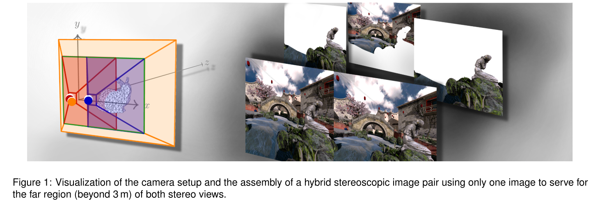
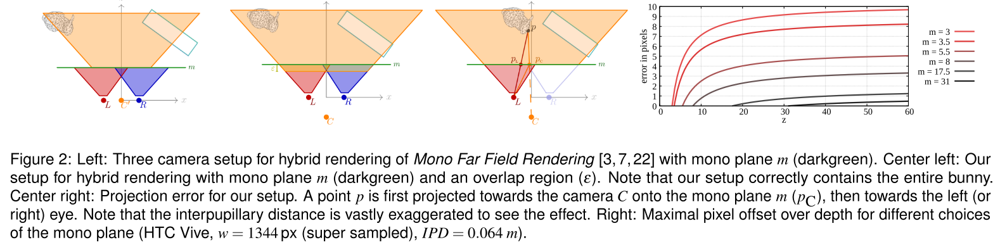
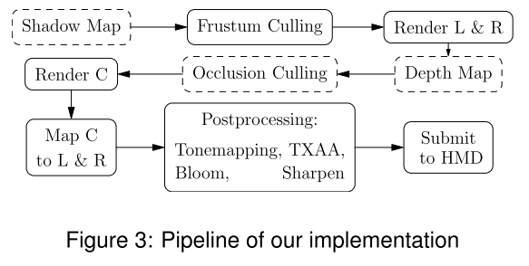
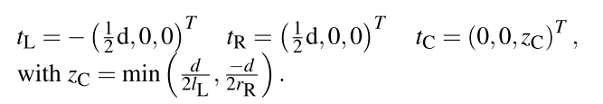
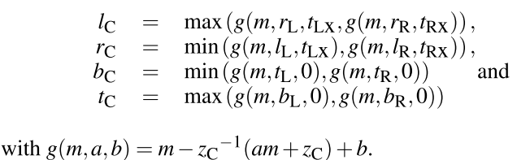
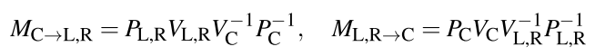
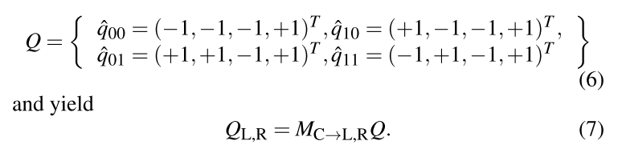

# Hybrid Mono-Stereo Rendering in Virtual Reality

双眼差异`binocular disparity`，是深度知觉和周围物体**空间排列**的重要线索。而研究表明，只在近距离，这种效果才最明显，而随着距离增加，这种效果减弱。在本文中，作者利用这种关于人类感知的知识，只在一个选定的距离以内，渲染==全立体图像==，而之后则是**单镜图像**。通过这样做，得到了三种不同的图像，这些图像被合成为一个新的**混合立体图像对**，它合理近似于**传统渲染的立体图像对**。

## 1. INTRODUCTION

立体图像对的**相似性**导致了一些**加速方法**，以减少从轻微不同的角度，两次渲染几乎相同的物体所带来的**计算成本**。

> 有研究表明，HSV只提供10米之内的重要深度线索

一个简单的加速方法是，对于远处的物体，渲染一次；而在近处的物体，则是渲染两次。存在的问题是：要区分近处和远处的物体，并实现一致的渲染，而不产生**过渡伪影**是比较困难的。

本文的想法很简单，就是预设值一个深度为`m`的`mono plane`，以区分**立体渲染**和**传统渲染**。而作者的主要成就在于：

+ 我们提供了这一想法的实际实现的**技术细节**，包括**非对称校准视图**`frusta`的使用，以及剔除和**抗锯齿**的细节，这超越了现有的实现。
+ 获得了一项有近50人参与的**用户研究结果**，以评估该方法的视觉影响，以及`mono plane`的选择对感知的影响。

## 2. RELATED WORK

具体见论文

## 3. HYBRID MONO-STEREO RENDERING

在下文中，我们假设一个典型的HMD立体设置，有两个平行的图像平面，偏移的IPD（**瞳孔间距离**）约为6.4 cm。对于**混合渲染器**，我们必须为`mono plane`之外的场景定义第三个`frustum`，以及如何**合并图像**，使之没有可见的过渡。

由于研究发现`cyclopean eye`是观察者指向物体的投影线的感知原点 (而不是主视眼)，因此我们认为两眼同等重要，因此任何引入的误差都应该对称分布。从立体到单像的**过渡部分**应该是连续的，不引起明显的边缘。在可能的情况下，任何物体都不能丢失或增加到视野中。

在以前的工作中，图2（左）所示的设置已被使用。假设`Frusta` 是完全对称的，没有偏斜，因此对于每个摄像机都采用相同的投影矩阵。在z作者的设置中, 决定将第三台相机 C 定位为如图 2 所示 (左中)，以更好地满足上述特性. 我们选择单平面的L 和 R 的结合体作为起点来构建壳 C。它至少与每个立体frustum共享一个光圈角，因此，意味着一定的**相似性的透视**。理想情况下，摄像机C的位置将是**联合体体积**的所有扩展平面的交点，但由于硬件参数的不对称性，没有交点保证。因此，作者用左右壳平面与z轴的后交点来近似相机的位置。

基于**三重视锥**，图像的形成很简单：使用视锥C渲染远区域，其中单平面z = m作为**像平面**。 然后将所得的**单视场图像**用作渲染左眼和右眼（视锥面L和R）的背景，这是在最简单的情况下的==单视场图像==的**移位复制操作**。 注意，实际的实现需要进一步的考虑，例如避免由于子像素平移而在过渡处出现伪像，或获得适当的深度值以进行后处理。

在本文的设置中，投影点一般会向内移动。由于结构的原因，单平面处的误差为零，并且随着距离的增加而增大，这与**立体深度感知**随着距离的增加而迅速减小的事实非常吻合。`m平面`选择越近，误差越大。图2（右）显示了本文设置在不同的m选择下的**最大投影误差**，请注意，即使是非常接近的m，误差也在几个像素的范围内。例如，在实际设置中，单声道平面在8米处，最大误差为4个像素。

## 4. IMPLEMENTATION DETAILS

### View and Projection Matrices

摄像机设置如图2所示，由左、右、中三个摄像机组成。每个摄像机都有一个独立的**视图矩阵**$V_{L,R,C}$和**投影矩阵**$P_{L,R,C}$。左、右、底、顶的投影值，以及视口尺寸$w_{L,R}$和$h_{L.R}$都是硬件给定的，并从SDK中获取。图2中坐标系的原点对应于用户的头部位置，z轴对应于其视图方向。$V_{L,R,C}$与V的区别在于∆VL,R,C，是平移t的矩阵表示：

其中d代表**瞳孔间距离**；$t_C$是左右`frustum plane`与z轴的后交点。作者要求第三个视锥面包含立体视锥面与单面平面的所有交点，以提供连续过渡的先决条件。 这是通过使用连接摄像机位置和外部相交点的线的斜率来强制执行的。 因此，计算：

### Mono-to-Stereo Mapping

此时，已知所有需要的值，可以推导出映射矩阵：

来将任意点从一个**剪辑空间**投影到另一个**剪辑空间**。我们利用$M_{C\rightarrow L,R}$将**C的剪辑空间**的近平面投影到左、右剪辑空间，将z=-1设为屏幕空间对齐四边形的深度。

