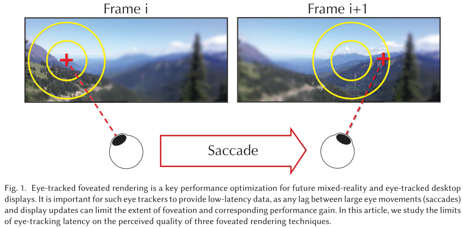
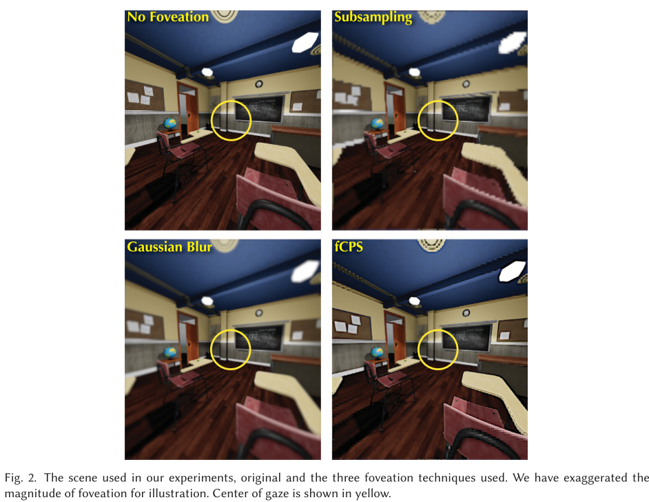
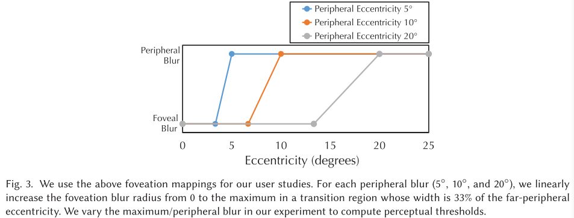
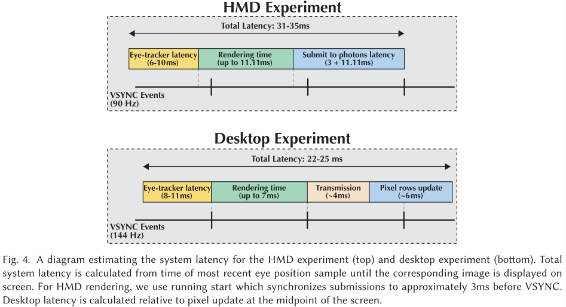
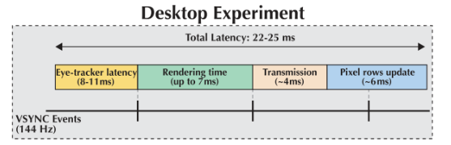
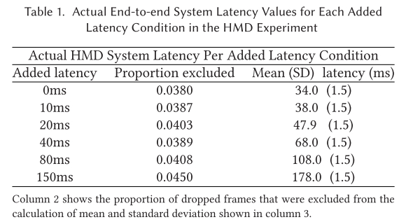
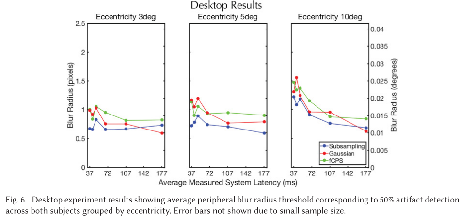

## Latency Requirements for Foveated Rendering in Virtual Reality

*ACM Transactions on Applied Perception 2017*

中心渲染是一种基于**周边视觉敏锐度**下降的性能优化。通常需要精确和低延迟的==眼球跟踪==，以确保正确性。由于`saccadic omission`（眼跳遗漏），这些要求可以放松，不用过于严格。

本文探讨了延迟对**中心渲染**的影响，使用了三种可以产生`聚焦图像`的技术，针对三个不同半径中心区域，来评估视觉`artifacts`的可检测性。

## 1. Introduction

作者写这篇文章时，最好的VR显示器可以为每个眼睛分配$1080\times 1200$像素、从视网膜上的**可视角度**来看，这相当于每个像素**5**个弧分`arc-minute`，而人类的视觉系统可以分辨出每个像素**0.5**个弧分。目前播放器的`FOV `在水平上限制为$100^o$，是人类视觉系统中==双目水平视场==的一半。

许多VR应用要求立体深度信息、双倍渲染成本，以及对**闪烁灵敏度**的感知研究表明，**远边缘的最小帧率**要求至少为85Hz。

就算采取真实感渲染算法，许多高质量像素会被浪费，这是由于==HSV==（人类视觉系统）在边缘处是**低保真度**`low fidelity`。HSV存在一个灵敏度高的$1.5^o$的区域，称为`Fovea`，而在这个区域之外，视网膜各成分的分布变化剧烈，导致视力下降、对颜色的低敏感度、有限的**立体深度辨别能力**、以及对**闪烁**敏感增加。

在$20^o$的偏心率下，**HVS**不能再解析窄于==7.5弧分/像素==的光栅`gratings`。而对于VR这样的宽FOV显示器，$96\%$的像素位于$20^o$的边界之外。所以说，**中心算法**对于满足VR日益增长的计算需求是至关重要的。

==中心渲染==允许**外围图像**以一种减少计算和感知上不突兀的方式降级。这需要视线跟踪 `gaze tracking`，因此中心系统对**延迟**非常敏感。有几个因素可以影响此系统对延迟的要求：

+ 随视线变化的**全分辨率中心图像**的大小
+ 图像的退化程度
+ 图像降级的方法。

图1:arrow_down:说明了**增加的延迟**可能增加`foveation artifacts`的可见性。

在这篇文章中，作者结合了不同程度的眼球跟踪延迟、凹大小`fovea size`、凹形技术，来测量用户可以容忍的`the amount of foveation`

作者的研究首次表明，在VR中，可接受的**foveation水平**在 50-70 ms的**总系统延迟**中没有显著下降。

## 2. RELATED WORK

最近的工作重点是：使用现代头戴式显示器(**HMDs**)和翻新的**眼动跟踪器**进行实际的**焦点渲染**。一些研究着重探索**感知引导**的中心区域 [**30, 32, 42**]。

### 2.1 Latency

在决定**系统延迟**及**知觉影响**方面有许多因素，本文聚焦于VR中眼睛跟踪的延迟

> 有几种测量眼动跟踪系统延迟的技术,包括使用光电二极管描述监控刷新,使用一个示波器,使用发光二极管(LED)来模拟一个扫视眼动跟踪,结合这些技术测量端到端系统延迟。使用这些技术来**估计**和**求和**每个组件的延迟是一种标准做法，也是我们在研究中采用的方法。

### 2.2 Saccadic Omission

作者对**可接受延迟**的预期建立在眼跳遗漏（也称为`saccadic suppression`和`saccadic blindness`）的大量研究上。

当观察者快速将视线从一个位置转移到另一个位置时，就会发生==眼跳运动==。这些动作遵循典型的==弹道运动==。在**眼跳**之前、期间和之后的短时间内，眼跳遗漏阻止了某些**视觉输入**的处理。除了眼跳前后图像的==视觉掩蔽效应==外，大细胞神经通路（the magnocellular neural pathway）中的特定信号在眼跳前后和期间被**抑制**，眼跳后图像的**神经信号**被**增强**。

尽管确切的时间过程取决于许多因素，包括==背景亮度和扫视振幅==，**省略**通常在扫视开始前约50 ms开始，**灵敏度**在扫视开始后约100 ms恢复到正常，

## 3. EXPERIMENTS

作者设计了两个实验，第一个实验是使用==HMD==进行的，第二个实验是使用带有头部跟踪的**桌面显示器**。作者的**主要目标**是决定当前HMD系统的延迟和`foveation`的**指导方针**。之所以有两个实验，是由于HMD正在快速发展，所以在延迟更低、分辨率更高的桌面显示器进行一个小的平行实验

### 3.1 Foveation Technique

作者采用了三个`visual foveation`方法来评估延迟的影响：

+ Subsampling：随着==视网膜偏心率==的增加，图像分辨率降低，使用纹理单元进行**双线性上采样**（bilinearly upsampled）
+ Gaussian Blur：高斯图像空间模糊，**模糊半径**随**视网膜偏心率**的增加而增大
+ fCPS：采用 **foveated**粗像素（coarse-pixel）渲染（进行预过滤），foveated TAA，和（后处理）对比度增强

本文的实验都是使用的下图2:arrow_down:的房间。可以看到，分采样技术会有明显的锯齿，效果不好，是下限标准；高斯模糊表现最佳，作为上限标准，但是不提供性能优化，而且降低了对比度；==fCPS技术==引起的视觉伪影是时间上稳定的锯齿状边缘、鬼影`ghosting`和对比度失真。

图3:arrow_down:显示了本文的三种==视场密度映射== `foveation density mappings`，其中根据**视网膜偏心**将视野划分为三个区域：

+ Far Periphery：超过固定偏心率（$5^o,10^o,20^o$其中之一）的均匀低密度区域。
+ Fovea：从凝视中心到`Far Periphery`的$2/3$的均匀高密度区域（相应的$3.33^o,6.67^o,13.33^o$）
+ Transition Region：剩余区域。

对于任何偏心率，映射都会返回一个范围内的模糊半径。高斯模糊方法直接使用；分采样方法，其因子是半径的两倍；也就是说，半径为1的话，方法1使用$2\times2$的缩减规格，方法3 fCPS使用$2\times2$的`coarse shading`。

### 3.2 HMD Experimental Design

作者使用的是HTC Vive HMD，配有工厂校准的SMI眼动仪。设置的系统延迟如图4:arrow_down:所示。==SMI眼动仪==的最小延迟约为6 ms，采样率为250 Hz，与系统的其余部分是异步的。为了消除任何**可变渲染时间**的影响，我们选择在所有技术中同步眼动器的采样时间。HMD有90 HZ的帧率，所以作者设计的**刺激**`stimulus`是，渲染时间小于11.11 ms，因此可以同步到VSYNC。

作者使用==openvr==的“running start”来同步帧提交，到**VSYNC**之前的大约3 ms。同步传输和显示像素约为11.11毫秒。因此，除了极少数情况，每个提交的帧在提交后大约14.11毫秒内显示。因此，端到端系统延迟（从**眼睛图像捕捉**到**显示下一帧**的时间计算)通常在31到35 ms之间。

> ==VSYNC==是最初用于GPU、视频游戏和监视器的==同步技术==。VSYNC最初是由GPU制造商开发的一种处理**屏幕撕裂**的方法。屏幕撕裂发生在一个图像的两个不同的“屏幕”互相碰撞的时候，因为游戏FPS(每秒帧数)传递的信息是**显示器的刷新率**跟不上的。结果是出现了一些有瑕疵的图像，其中的对象出现了碎片，或者屏幕的一部分看起来错位了——令人讨厌的东西。这种情况最常发生在具有60帧或更高帧速的高级游戏中，并伴随着并不真正超过60 Hz的刷新率的显示器，尽管如果你在玩一款要求特别高的游戏或通过超频等，使事情变得更加复杂，刷新率可能会更高。
>
> VSYNC对游戏的FPS设置了严格的上限，让所有人都能在同一页面上浏览。它说，“嘿，这看起来像一个60 Hz的显示器，很难跟上，所以你不会超过60 fps，好吗?现在同步您的刷新率和图像数据。“结果是一个更流畅的游戏体验，不再与屏幕撕裂斗争——至少，这是我们的目标。
>
> 这有什么区别吗?VSYNC只帮助屏幕撕裂，而且只有在必要时通过限制FPS才能真正做到这一点。如果你的显示器跟不上某款游戏的FPS，那么VSYNC将会产生很大的影响。然而，VSYNC不能提高您的分辨率、颜色、亮度级别或任何HDR之类的功能。它是一种预防性技术，专注于预防特定的问题，而不是进行改进。

共有9名受试者参与==HMD实验==，每个受试者共3小时。每个受试者在实验开始时，进行标准的**SMI眼动标定**，受试者的**标定误差**都在**典型范围**内。参与者从图2:arrow_up:所示的标准视角观看教室场景。总共有55个随机交错的foveation conditions，包括15个无foveation对照试验和技术的组合(分采样、高斯模糊、fCPS)、fovea偏心(5、10、20)和增加跟踪延迟(0、10、20、40、80，150 ms)。

在不同的实验条件下，采用一上一下的自适应楼梯程序（`one-up/one-down adaptive staircase procedure`），来确定50%的**检测阈值**。每个试验的刺激持续时间为4秒，参与者被指示使用头部和眼睛运动，来观察任何异常的质量伪影，包括闪烁、模糊、隧道视觉`tunnel vision`或运动伪影

在每个刺激呈现结束时，如果观察到任何伪影，受试者会回答“是”；如果场景看起来正常，受试者会回答“否”。为了消除**展示本身**造成的**视觉伪影**，在实验开始时，受试者被提供**2分钟的时间**观察无==foveation==的场景，并在10分钟内在其他场景进行练习。

### 3.3 Desktop Experimental Design

我们的桌面显示是一台刷新频率为144 Hz的宏基XB270HU。我们使用Tobii TX300眼头追踪器，最小延迟为8 ms，采样率为300 Hz。头部跟踪允许我们测试更复杂的主体运动，以一种更类似于HMD的方式。

实验设计与HMD实验相同；但是，为了适应桌面硬件，修改了几个参数。为了在**最小眼动仪延迟**较长的情况下提供更好的同步，增加的延迟值分别为8、15、22、40、80、150 ms。foveation的偏心也减少到3、5和10，以适应监视器的大小。

## 4. RESULTS

### 4.1 Actual Latency

作者计算了**刺激呈现的实际延迟**，相对于每一帧的**眼睛图像捕捉时间**，并根据**预期增加的延迟**分组帧。HMD实验的延迟统计如表1:arrow_down:所示。在帧数下降的情况下，延迟的分布是正常的，有一个非常大的延迟的重尾巴。因此，我们在计算实际延迟时排除**Dropped frames**，但报告每种情况下排除帧的百分比。**Dropped frames**被定义为：延迟大于相对于中位数的缩放中位数绝对偏差的三倍

> Dropped frames were defined to be latencies greater than three times the scaled median absolute deviation relative to the median

### 4.2 HMD Experiment

对于每种条件下的每个受试者（结合技术、偏心和增加延迟），我们获得了与50%伪影**检测阈值**相对应的模糊半径。阈值是通过拟合==高斯心理测量函数==计算的，使用MATLAB，实现了==最大似然方法==。图5(a)显示了按技术分组的，每个条件的受试者平均值，图5(b)显示了按偏心率分组的相同数据。误差条表示平均值的95%**置信区间**。

使用拟合的阈值，进行三向方差分析来比较技术、偏心和增加延迟对**模糊半径阈值**的影响。对于每项技术，偏心率没有明显的交互影响，三种技术的偏心率在$5^o$和$20^o$之间都有显著差异。而对于偏心率，在$5^o$偏心，任何两个技术之间没有显著差异；$10^o$偏心下，分采样和fCPS间具有显著差异；$20^o$偏心下，分采样和高斯模糊、fCPS 间都有显著差异。而fCPS 和高斯模糊间始终差异不大。

对于所有其他条件下，延迟的主要影响，在0、10、20和40毫秒的附加延迟条件下，没有发现显著差异。而在80和150 ms的情况下，存在显著差异。

### 4.3 Desktop Experiment

结果和4.2节没有本质差异。

## 5. DISCUSSION AND FUTURE WORK

所有的技术都受到大量增加的延迟(80和150 ms)的负面影响。0、10、20和40 ms之间没有显著差异。这表明存在一定数量的可接受的延迟，低于这个延迟，伪影检测仅受周边感知的限制。根据我们测量的**系统延迟值**，这相当于眼睛到图像的延迟在50到70 ms之间。这一发现引人注目，因为实验对象的任务是寻找视觉产物，因此他们倾向于更多地移动头部和眼睛，并更多地关注周围环境。要求较低的任务可能具有更不严格的延迟要求。

在这篇文章中，我们已经探讨了增加**眼球追踪延迟**对三个**聚焦渲染系统**的影响。从我们的结果中，我们推断中心渲染可以容忍大约50 - 70 ms的==眼-像延迟==，超过这个时间很容易被感知，因此失去效果。我们还推断，对中心渲染的感知改善，例如，时间稳定性，也提高了其延迟容忍度

未来，我们希望进一步探索中心渲染**容忍延迟**背后的原因。例如，我们希望了解`saccadic blindness`在检测伪影能力中的具体作用。此外，除了延迟之外，我们还希望探索中心渲染对眼球跟踪精度的容忍度，以及对**眨眼**和错误计算的鲁棒性。

