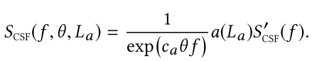

# Luminance-Contrast-Aware Foveated Rendering

目前大多数==注点渲染==，都是将灵敏度作为偏心率的函数来建模，而忽视了VR内容本身的影响。在本文的工作中，作者提出了一种新的、基于亮度-对比度-感知 的注点渲染，此技术表明，如果对图像的局部**亮度**、**对比度**进行分析，可以显著提高**注点渲染**的计算成本。

最后，作者首先研究了**作为亮度函数的不同偏心率**下的分辨率要求，之后利用这些信息，来推导出一种低成本的注点渲染预测期`Predictor`。它的主要特点是能够：只使用当前帧的低分辨率版本，来预测参数，而且这个参数对于**高分辨率渲染**也是成立的。

## 1. INTRODUCTION

VR领域中，提高渲染质量的巨大希望在于利用人类的感知。1、人类主题感知到的质量在整个视野中并不一致，而是向周边递减。2、HVS对**图像扭曲**的敏感性也取决于底层内容——被称为视觉遮蔽`visual masking`的效果。3、中心区域的可见性取决于潜在的亮度对比度，即对比度降低时，高对比度区域更有可能让人不适:arrow_down:。

本文的方法参考了上诉知识，提出了基于对比度感知的注点渲染策略，让分辨率不仅受离心率影响，还有潜在的亮度信息（考虑局部的`visual masking`）。

为此，作者提出了一种新的、低成本的预测器，它以当前帧作为**输入**，并提供所需空间分辨率的**空间变化图**。该预测器基于现有的==视觉遮挡模型==，但它是在一个新的**心理物理实验**中获得的数据集上，进行注点渲染的训练。本文证明，即使输入的是低分辨率的帧，这种预测也是准确的。这个特性至关重要，因为它允许我们基于新帧的粗略近似，来预测注点渲染的所需参数。为了将预测应用于注点渲染，我们首先渲染一个低分辨率版本的帧，并应用预测器。接下来，根据预测的质量来渲染该帧。本文证明了这一策略可以在不降低视觉质量的情况下，节省大量的计算量。

## 2. RELATED WORK

### Perceptual Background

==Contrast perception==：**对比度检测**取决于对比度模式的**空间频率**，它由对比度敏感度函数（==CSF==）来描述 。

+ 感觉到的对比度是**对比度幅度**的非线性函数，可检测到的**对比度变化的增量**随着**对比度幅度**的增加而增加。这种效应通常被称为**自对比度掩蔽**`self-contrast masking`，它是用压缩的**对比度传感器**函数来建模的。
+ ==对比度检测阈值==也随着空间频率相近的**相邻对比度**的增加而增加。

### Foveated Rendering

==Traditional techniques==：详见论文。

## 3. OVERVIEW AND MOTIVATION

本文的模型依赖如下两个关键成果：

+ 暂时稳定的**低分辨率渲染**在感知上等同于**高斯模糊**的高分辨率渲染。促使本文的技术使用**高斯低通滤波器**来模拟分辨率的降低，因此，我们的模型使用高斯滤波器的==标准偏差==(σs)来表示**最大可接受的分辨率降低**。
+ 如何决定**最佳渲染分辨率**，最好是基于内容的全部信息，即不同空间频率的完整对比信息。但是，这首先需要全分辨率渲染，就不符合中心渲染的核心诉求。因此，作者训练了一个高分辨率输入的预测器，然后重新训练，使其能够支持==低分辨率输入==。

## 4. COMPUTATIONAL MODEL

### Perceptual Contrast Measure

Luminance contrast（亮度对比）。这个过程首先是将每个像素P的强度转化为一个具体的亮度值$L(p)$，之后计算`band-limited`的对比度，为此，作者首先进行==拉普拉斯金字塔分解==`Laplacian pyramid decomposition`，它提供了`band-limited`的亮度差∆L(f,p)。最后进行解压缩，来计算**亮度对比度金字塔**`luminance contrast pyramid`：

其中，f是CPD单元格中的空间频率；ϵ是一个很小的数，以防止在**低亮度的区域**出现数学上的==奇异性==。分母中的平均亮度$L_a(f,p)$是由**高斯金字塔**中分辨率向下两级的相应点提供的，该点使用线性插值进行四倍的上采样。

> [拉普拉斯金字塔](https://zhuanlan.zhihu.com/p/94014493)
>
> 拉普拉斯金字塔可以认为是残差金字塔，用来存储下采样后图片与原始图片的差异。我们知道，如果高斯金字塔中任意一张图Gi（比如G0为最初的高分辨率图像）先进行下采样得到图Down(Gi)，再进行上采样得到图Up(Down(Gi))，得到的Up(Down(Gi))与Gi是存在差异的，**因为下采样过程丢失的信息不能通过上采样来完全恢复**，也就是说下采样是不可逆的。
>
> 为了能够从下采样图像Down(Gi)中还原原始图像Gi，我们需要记**录再次上采样得到Up(Down(Gi))与原始图片Gi之间的差异**，这就是拉普拉斯金字塔的核心思想。拉普拉斯金字塔就是**记录高斯金字塔每一级下采样后再上采样与下采样前的差异**，目的是为了能够完整的恢复出每一层级的下采样前图像。下面的公式就是前面的差异记录过程：
> $$
> L_i=G_i-Up(Down(G_i))
> $$

Contrast sensitivity and retinal eccentricity。为了获得**感知对比度**的信息，使用依赖偏心率的**对比度灵敏度函数**（==CSF==）对金字塔中的值进行**标准化**。

其中，$\theta(p)$是像素p的视网膜偏心率，用视觉度数表示。$S_{CSF}$函数如下（基于标准CSF $S^/$）:

其中，$c_a$是基本的**偏心率参数**，用于模拟外围视野的**HVS敏锐度损失率**；$a(L_a)=(1+0.7/L_a)^{-0.2}$代表==适应亮度==$L_a$对峰值灵敏度的影响。

> HVS模型最重要的问题之一是对比敏感度与[空间频率](https://www.sciencedirect.com/topics/engineering/spatial-frequency)之间的关系。对比敏感度告诉我们，对各种视觉刺激的频率有多敏感。如果视觉刺激的频率太高，我们将无法识别。想象一下由垂直黑白条纹组成的图像。如果条纹很细（即每毫米几千条），我们将看不到单独的条纹。我们将看到的只是一张灰色图像。如果条带变得越来越宽，则存在阈值宽度，从中可以区分条带。CSF模型可以被为一个带通滤波器，合适频率内的像素才会通过。
>
> 
>
> HVS对较低的[空间频率](https://www.sciencedirect.com/topics/engineering/spatial-frequency)更敏感，而对较高的空间频率更不敏感。Mannos和Sakrison [22]提出了用于[灰度图像](https://www.sciencedirect.com/topics/engineering/grayscale-image)的CSF模型，将其作为非线性变换：
>
> 
>
> 
>
> [CSF_1](https://www.sciencedirect.com/topics/engineering/contrast-sensitivity-function)

我们在以4、8、16和32 cpds（cycles-per-visual- degree，每视觉度周期？）为中心的四个频带上定义CSF，其值由s4，s8，s16和s32表示。 在对数敏感度和对数频率域中，使用三次Hermite样条插值获得了中频的敏感度。 我们发现，与使用标准CSF函数相比，该解决方案可为我们的模型提供更准确的预测。 我们将此行为归因于拉普拉斯金字塔1的宽带特征，与通过单个亮度频率刺激得出的标准CSF相比，通过**自定义定义**可更好地处理宽带刺激。

> [视敏度](https://en.wikipedia.org/wiki/Visual_acuity)或分辨力是 "区分细微细节的能力"，是锥体细胞的属性。 它通常以每度的周期（==CPD==）来衡量，它衡量的是一种角度分辨率，或者说眼睛在视觉角度上能区分一个物体和另一个物体的程度。以CPD为单位的分辨率可以通过不同数量的白色/黑色条纹周期的条形图来衡量。例如，如果每个图案的宽度为1.75厘米，并放置在距离眼睛1米的地方，它将减去1度的角度，因此图案上的白色/黑色条形对的数量将是该图案每度的周期的测量。那么，眼睛所能解析的条纹数，就是眼睛的视力的衡量标准。
>
> 对于视力极好的人眼来说，最大的理论分辨率是50 CPD[42]（1米处，0.35毫米的线对）。大鼠的分辨力只有1～2CPD.[43]马的眼睛大部分视野的敏锐度比人眼高，但比不上人眼中央中心区的高敏锐度。
>
> [参考](https://blog.csdn.net/lsxpu/article/details/41776111)

Visual masking。在测量==感知亮度对比度==的最后一步，作者加入了**视觉遮挡**的影响。为此采用Zeng等[**2000**]关于**归一化对比度**$C_n$的换能器模型`transducer model`，将**感知亮度对比度**的最终值表示为：

**分子**建立了==自掩蔽效应==的模型，而分母建立了来自同一频段的5×5邻域$N_(p)$的空间掩蔽效应的模型，α，β∈[0，1]是我们模型的参数，它控制了掩蔽建模。

### Estimation of Resolution Reduction

正如之前虽说，本文是使用高斯模糊进行分辨率降低的模拟，所以我们的问题转为对其标准差的最大值求解：{**5**}

其中，$C_t(p,f)$是初始`Patch` $\prod$的对比度；$C^/$是初始`Patch`和高斯函数$G_{\sigma_s}$卷积的对比度。对这个公式进行优化是不兼容于注点渲染的（比较耗时），所以作者对其进行了简化，得到$\sigma_s$的封闭解。

首先考虑对一个像素p和**单一空间频率**f的σs进行估计，如果用$G_\sigma$对补丁$\prod$进行卷积，**拉普拉斯频率分解**中的数值将根据**滤波器的频率响应**进行衰减，所以频率f下、高斯滤波器的频率响应`frequency response`为：{**6**}

同时，我们应该知道，高斯滤波器的响应也是一个高斯函数：{**7**}

其中，$\sigma_f$是频域的标准差，定义为$\sigma_f=(2\pi \sigma_s)^{-1}$，结合上述两个公式，可求得：{**8**}

其中，唯一的未知数是$C_n^/(f,p)$，为了得到这个值，我们需要使用公式5的对比度`loss`约束。{**9**}

很明显，由于第一分量分母中的**视觉空间遮挡项**，C′n(f,p)不能直接从这个方程中计算出来。因此，我们再做一个假设。我们假设用$G_{\sigma_s}$卷积的**路径的空间掩蔽**可以由原始补丁中的空间掩蔽来近似。另外假设在滤波过程中，对比度的符号不发生变化，上式可以简化为以下公式：{**10**} {**11**}

在回代计算之前，首先计算整个Patch的$\sigma_f$，这对第五节的**校准程序**至关重要。为此，首先结合`Pixel Patch`的$\sigma_f$估计，取所有**频率级别**的最大值。接下来，我们使用平滑的**最大函数**将整个`Patch`中得到的值结合起来。

最后：

## 5. CALIBRATION

本文的模型有很多自由参数。在本节中，介绍了一个校准程序和感知实验，用于收集必要的用户数据。训练我们的模型需要一组`Patch Pair`，其中包括高分辨率Patch及其质量下降无法检测到的低分辨率版本。 收集此类数据的一种方法是针对各个`Patch`和离心率，测量最大分辨率和无法检测到的分辨率降低，但是需要很长时间才能收集数据。 相反，作者建议以更有效的方式收集数据。 将一个`Patch`平铺到覆盖整个屏幕的图像中，并估算出最佳的，不明显的偏心。 这使我们能够获得关于整个偏心率的必要信息

作者使用两个参数来定义注点渲染。第一个是视觉内容以**最高分辨率**呈现的**中心区域**的半径r。第二个参数是分辨率向周边降低的速度k。因此，通过使用**高斯滤波器的标准偏差**来建模的**分辨率降低**可以表示为：

实验设置。系统由一台Tobii TX300 眼球跟踪器组成，一个下巴支架——用于在实验过程中保持观察点的相对稳定，还有两台显示器。第一台是一台27英寸的华硕PG278Q显示器，分辨率为2560×1440，跨度为48.3°×28.3°的视野，观看距离为66.5cm。第二台显示器是32英寸戴尔UP3216Q，分辨率为3840×2160，从71厘米的观看距离看，视野范围为52.3°×30.9°。显示器的峰值亮度分别为214.6cd/m^2^和199.2cd/m^2^，而第一台和第二台显示器在中心产生的峰值分辨率分别为24.9 cpd和34.1 cpd。

The stimuli（刺激）。数据集由36个从**自然和合成图像**中选取的具有不同特征的`Patch`组成（见图5）。我们从一大组自然图像中随机挑选了前18个Patch。为了提高数据集的多样性，其余18个补丁是从5640个图像的大集合中通过最大化补丁之间的异质性来挑选的（附录A）。对于最终的刺激，我们通过平铺`Pacth`填充显示帧。

The procedure。比较常见

> 使用的是2AFC程序，其中备选方案为是同一刺激的中心式和非中心式版本。参与者被要求选择不包含中心的图像。为了让参与者熟悉实验界面和控制，我们在实验开始时加入了一个训练阶段，其中凹凸的概念使用一个夸张的例子来解释。刺激准备的假设，凝视位置位于显示器的中心。当凝视位置偏离中心时，刺激物被隐藏。不同的选择是由随机分配的字母（A和B）在屏幕的中心表示。观察者能够在两个备选方案之间自由切换，并且他们在中间显示了一个统一的灰色屏幕。共有8名视力正常或矫正至正常的参与者参加了我们的实验，他们在6个环节中共进行了324次比较，共36个贴片。每个比较被每个参与者重复10次，参与者完成一个会话所需的平均时间为40分钟。

结果。为每一个`Patch`，计算一个最佳的$\sigma_s$，作为偏心率的函数。为此，我们首先为每个`Patch i` 计算由三联体$(r,k,\theta)$给出的、检测中心区域的概率：

其中N是每个参与者的比较次数。 如果$P(det|r,k,\theta)<0.75$，我们将$(r,k,\theta)$的这种组合标记为不可检测。 然后，对于每个偏心率，取所有标记为未检测到的$(r,k,\theta)$的$\sigma_s$最大值。 这定义了每个`Patch`和每个观察者的最佳$\sigma_s(\theta)$。 最后一步，我们对参与者的$\sigma_s(\theta)$值取平均值，以获得`Patch i`的ground truth $\sigma_s^{(i)}(\theta)$。 结果如图7所示。晶须标记的范围表示可接受的模糊程度，取决于特定偏心率的基础面片。

Optimization。最后，为了找到模型的参数，我们采用混合优化方法。在第一阶段，我们使用Adaptive Simulated Annealing(**ASA**)来优化预测参数。在第二阶段，运行基于梯度的最小化，来微调ASA的结果。这种混合优化方案有助于避免局部最优。在优化过程中，将加权平均绝对误差（==MAE==）最小化。

其中S={α，β，ca，s4，s8，s16，s32，ω}为模型参数集，$\sigma_s^{(i)}(\theta)$是实验中`Patch i`的基础真值，而$\^\sigma_s^{(i)}(\theta)$是我们对偏心率θ的预测结果，w~1~和w~2~为加权函数，定义为：

第一个函数w~1~更强调在HVS具有较高灵敏度的视网膜旁区域测量的误差。另一方面，第二个函数w~2~以更大的权重惩罚空间带宽的低估，因为由于潜在的视觉伪影，低估比高估更不可取

## 6. IMPLEMENTATION