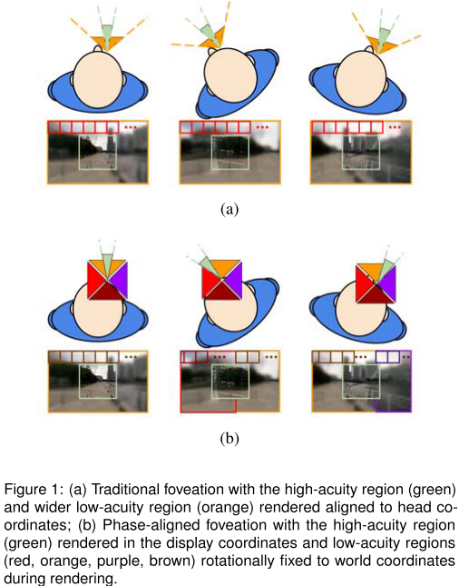

# Phase-Aligned Foveated Rendering for Virtual Reality Headsets

作者针对大视场（FOV）或高像素密度的HMD，提出了一种新的VR的==foveated rendering==方法。在光栅化和上采样过程中，我们的foveation method通过将**渲染像素网格**与**虚拟场景内容**对齐，来消除**外围区域的运动**引起的闪烁。该方法无需复杂的插值或抗锯齿算法，就能显著降低**周边运动伪影**的可检测性。

## 1. INTRODUCTION

随着==HMD==变得越来越先进和具有沉浸感，**The amount of foveation**必须变得更加激进。任何现有的**锯齿**或**闪烁伪影**对用户来说变得更加明显，需要额外的**后处理**。

在本文中，作者提出了==foveated rendering==，以减少外围区域的**锯齿的可检测性**。在渲染后，作者没有应用**复杂的滤波**，而是依靠适当的角度，对齐==渲染frustums==，以减少**帧到帧的闪烁伪影**。虽然每一帧内的静态锯齿仍然存在，但时间锯齿却大大减少。作者发现，时间闪烁是造成**伪影可见**的主要原因。==相位对齐==可以和任何**上采样**技术一起进行。更简单的上采样方法，如**最近邻**，变得可行，因为其实质性的锯齿伪影，在运动下不会造成**动态闪烁**，在外围不易察觉。**相位对齐**允许计算上更简单的插值技术，以保持**局部对比度**。

## 2. ·

在传统的==foveation==下，**低敏锐度**和**高敏锐度**区域都是用头部跟踪信息更新的。低敏锐度区域被光栅化，并在最新的**显示坐标帧**中进行**上采样**，如图1 a所示。任何由于上采样而产生的**锯齿伪影**都会被对准**显示坐标**。由于显示器相对于虚拟世界的内容会移动，因此锯齿也会移动，从而导致可感知的帧与帧之间的**闪动**。

在相位对齐的==foveated rendering==中，我们强制要求**低精度区域**进行==旋转世界对齐==，然后将其重新投影，并**重新采样**到最终的显示表面。低精度像素和本机分辨率像素之间的**相位偏移**是动态的，确保每个**低精度像素**与**虚拟世界**对齐，而不是与显示器对齐。

图1 b显示了相位对齐方法。**高敏锐度区域**与头部的旋转运动相匹配，但低敏锐度区域是旋转固定在**世界坐标**上的。现在需要多个低敏度区域。当一个低敏锐度区域从显示框中移出时，另一个低敏锐度区域会填充该区域。

## 3. IMPLEMENTATION AND RESULTS

在一个3D系统中，总共分配了6个**低精度区域**，来覆盖一个立方体的所有面，但每一帧只需要一个子集。如图2所示，在渲染之前，我们计算哪些区域在显示器的当前方向是可见的。通常每一帧中，只会使用两到三个低精度区域（取决于头显的输出视场），每个区域只会渲染被显示屏幕覆盖的部分，其余部分通过深度剔除。

传统的VR渲染，每3.4ms为每个眼睛渲染一帧、传统的注点渲染花费1.9ms。本文的方法则要求2.0ms，虽然耗时增加，但在视觉表现上得到了很大的提升。

## 4. LIMITATIONS AND CONCLUSION

==相位对齐==仅限于为旋转运动提供闪烁消除。如果用户平移，世界对齐的立方体会在他们的眼睛位置上重新定位。在这种情况下，闪烁会被重新控制，但不会完全消除。由场景中的动画引起的闪烁仍然不受影响，因此我们建议应用额外的平滑技术，如时间反锯齿（TAA）来补偿这些影响。