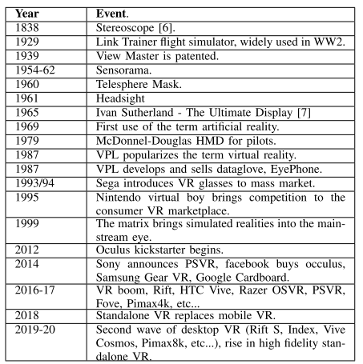
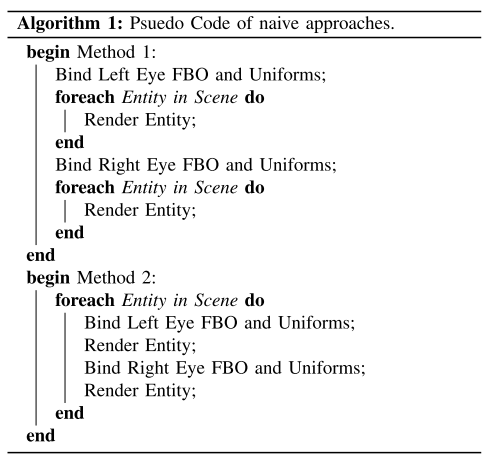
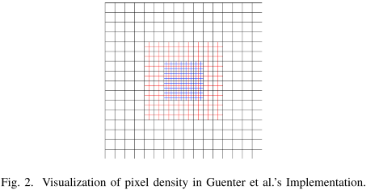

# Rendering Optimizations for Virtual Reality Using Eye-Tracking

最近，==基于感知的渲染技术==得到了广泛的应用，可以使用最新的GPU上的**可变着色率**或**多速率着色**技术进一步加速渲染。

> 基于感知的渲染，即把GPU计算资源分配到对用户感知影响较大的区域，如使用眼球追踪硬件时，高对比度区域或在foveal region内

该领域的进展留下了许多开放的研究问题，包括**稀疏像素渲染**，驱动用户注意力，以及**结合可变渲染率图像**的技术和方法。

本篇综述的重点是利用**眼动追踪**对虚拟现实进行渲染优化，因为眼动追踪正在成为**消费级头戴式显示器**的一项功能。

## 1. INTRODUCTION

对于消费级VR而言，目前存在的挑战是：在不增加资源消耗的情况下，提升渲染变现和视觉外观。当使用==头戴式显示器(HMD==)时，这个问题变得更加明显，因为在这种情况下，必须保持较高的帧率和响应时间，以最大限度地减少延迟，这可能会导致运动病或 "网络病"，因为看到的和感觉到的不匹配

早期的VR，需要渲染为左右眼各渲染一遍场景。

## 2. HISTORY OF VR AND EYE-TRACKING HARDWARE

### History of Virtual Reality

2017年，首款集成==眼球追踪==的HMD Fove 0问世，尽管在平台支持和视野方面有一定的局限性，导致商业上只取得了小的成功。2018年，独立VR开始取代移动VR，安卓VR成为移动VR开发的通用平台。2019年，集成==眼球追踪==的VR头显兴起，Vive Pro eye和Vive Cosmos的到来采用了**Tobii眼球追踪器**。2019年还出现了首款8K VR头显（Pimax 8k），不过由于带宽和处理上的限制，意味着信号要从2460x1440的信号中上调。

### History of Eye Tracking and Gaze Tracking Understanding

Eye Tracking和Gaze Tracking是以收集什么信息来区分的。在讨论VR等技术中的眼球追踪时，我们通常会以==Gaze Tracking==来代替。Eye Tracking是简单地追踪主体眼睛相对于头部的运动，而Gaze Tracking 则是另外追踪主体的头部，以确定主体在现实世界或虚拟世界中的位置。

## 3. TRADITIONAL APPROACHES TO VR RENDERING

VR中最简单的渲染方法是简单地重复**每只眼睛**的**绘制调用**，分别从**每只眼睛的视角**变换和栅格化几何体。除了将GPU的工作量增加一倍之外，这还会在场景遍历或状态切换方面引入额外的开销。

许多比较传统的**VR优化方法**都专注于减少**状态变化**的数量，或者将从多个视口可见的`fragment`的渲染结果结合起来。

### Multi-View Rendering

一个较早的渲染方法是：复制GPU端每个视图下的几何体。通过几何着色器实现，然后将多个视图组合进一张输出纹理中。这允许以最小的**状态切换**进行单次**场景遍历**，但仍会受到重复的`Fragment shader call`的影响。

OpenGL对此技术进行了集成，但没有进行实现，而是开发接口，交由开发者实现，NVidia对这一扩展进行了进一步的扩展，推出了Single Pass Stereo，它是在Pascal架构中推出的，为立体渲染提供了硬件支持，其中两个视图是共面的，并且共享一个共同的x轴。这一点在图灵架构中又得到了改进，引入了多视图渲染（MVR），增加了对两个以上视图以及非共面视图的支持[19]。这在VR之外的领域也得到了应用，比如层叠阴影图[20]，在这些领域，对几何体的多视角渲染有类似的要求。

## 4. PERCEPTION-BASED RENDERING

### Foveated Rendering & Multi-Rate Shading

一个早期的foveation渲染，是根据渲染点离视点中心的距离，进行网格简化（有种H-LOD的意味）

2012的一项技术开创了==Gaze Aware Foveation==的概念，即捕捉用户的目光数据，并用于驱动==foveated renderer==，将更多的资源分配到焦点周围的区域。模型被渲染进三张纹理中（分辨率依次降低，视口大小依次变大:arrow_down:），这个方法的问题是需要渲染多次。

==Gaze Aware Foveation==的一个**主要限制因素**是该技术对延迟的要求（不能让用户察觉到）。Albert等人（2017年）的研究表明，眼球到光子的延迟（即从捕捉眼球运动到正确的光子击中视网膜之间的时间）必须低于==100ms==，才能不被察觉到。

人类的==眼球运动==往往也是极快的，==囊状运动==（兴趣点之间的快速跳跃）每秒超过300°，这就要求模拟对眼球运动做出快速反应。这就需要现代计算能力以及高性能的眼球跟踪器，而这些都是最近才进入消费市场的。

由于对比度、失真和人眼的可变性等问题，the foveal and inter-foveal regions 的偏心也往往大于理论上的要求。以及，周边对比度信息的丢失会造成==tunnel vision==效应，会使一些用户迷失方向，并使终端用户明显感觉到==foveation==的存在。2016年Patney等人推出的后处理通 [**29**]，引入了==variance sampling==作为后处理抗锯齿效果，对比度的丢失问题得到了解决。这种方法考虑了对比度、==saccades==眼影和时间稳定性等因素，在场景渲染后应用，可以纠正一些由**可变渲染率**引起的问题。

对此技术的另外一种优化是：考虑==场景的对比度==（2019）。主要思路是：确定一个区域的rendering rate后，根据对比度信息，减少`Fovea`和`inter-fovea`的采样数。这种技术需要在以**全分辨率**渲染之前，以较低的分辨率渲染场景，（这里转接词为什么是but？）但为整合**其他优化**提供了可能，例如运动感知可变速率渲染（motion aware variable rate shading）：物体或摄像机运动时，将降低**相对于眼睛运动的**物体的渲染质量。

> 近期，截至2019年底至2020年初，有些研究在**直接在显示驱动硬件上**显示**foveation渲染**提供额外的支持方面做了一些工作，从Park等人[33]的工作中可以看出，他们的实现允许将**垂直分辨率降低**的中心图像从GPU发送到显示驱动，在那里，额外的硬件将把**压缩数据**解码成**全分辨率图像**进行显示。这种**显示技术的进步**使得GPU和显示驱动之间的带宽降低，有可能使响应时间或显示分辨率提高

### AI Powered Foveation

也有一些研究聚焦于`foveated content`的==压缩和传递==。最有名的是Facebook在2019年提出的`DeepFovea`，使用**深度神经网络**(==DNN==)来获取**从视频流中生成**的稀疏像素集，并使用**稀疏数据**来创建一个时间上稳定的图像。**稀疏像素集**的密度在整个图像中是不同的，其中`fovea`的像素密度最高。研究人员称，这导致了大约==14倍==的压缩率。

需要注意的是，这个模型是用**自然图像**进行训练的，需要进一步训练或修改，以支持非自然场景，如游戏中的场景。他们的方法也是从一个**全分辨率视频**开始，并从该图像生成一个**稀疏的像素集**。需要进一步的研究来确定**DNN**驱动的==foveation==是否可以应用于实时渲染技术。表四-B列出了多种基于感知的方法的比较。

| 技术                         | 描述                                                         |
| ---------------------------- | ------------------------------------------------------------ |
| Tessellation Based Foveation | 在网格的顶点上进行，而不是在像素上。可以减少**复杂网格**的光栅化时间，但会产生明显的**感知伪影**。 |
| Guenter et al                | 利用用户的==gaze==来分配渲染资源。需要多个渲染pass/layers；大量的状态切换；外围（periphery）对比度的损失导致**隧道效应**。 |
| Patney et al                 | 对G技术的优化，通过保持外围的对比度                          |
| Tursun et al                 | 对P技术的优化，通过根据对比度改变采样数                      |
| DeepFovea                    | 使用**神经网络**将**稀疏的像素集**解码成==foveated图像==，从而降低==foveated content==的带宽。 |

## 5. OPEN AREAS OF RESEARCH

VR渲染领域的一些其他研究（不是全部）

### AI Assisted Sparse Pixel Rendering

在VR优化中，另一个可能产生有趣结果的研究领域是==稀疏像素渲染==，以传统的方式渲染一个**稀疏的像素集**，图像的剩余部分用**神经网络**生成

在GPU硬件中有效地表示**稀疏像素集**也将是一个开放性的问题，因为目前的GPU对图像有一个刚性的、定义良好的布局，这让他们可以使用**SIMD管道**优化他们的工作流程。**稀疏像素图像**将需要一些方法，以一种可以被**SIMD处理器**处理的方式，来有效地表示图像中给定的Texel位置。另一种方法可能使用**全分辨率图像**，但使用**射线投射**来生成稀疏图像，而不是传统的光栅化方法。

### Eye-Dominance-Guided Foveated Rendering

最近Meng等人[**36**]所做的研究表明，通过增加或保持用户==主导眼==的视觉质量，同时降低==非主导眼==的质量，可以利用**眼球优势**`ocular dominance`，来进一步提高==foveated rendering==的性能。在这个模型中，每只眼睛都有指定的==foveation参数==，非优势眼比优势眼接受更多的==foveation==（较低的精度）。当为用户正确选择==foveatio参数==时，结果是一个**感知上相同**的图像，但对非优势眼来说需要更少的渲染时间，因此在其实施过程中，性能提升高达47%。

### Driving User Attention

使用感知渲染的研究结果，通过一种不影响沉浸感的方法，来驱动用户的注意力。这里列举的大多数方法都是依据用户的gaze信息，来分配渲染资源。而不是反过来，引导用户的关注点。

可能使用对比度、失真和==foveation== 的方式，将**用户的注意力**吸引到一个给定的兴趣点上。一种**解决方法**是人为地在==inter-foveal region==引入锯齿或对比度，以引起囊状反应`saccade response`，并移动人为的突出区域（the artificially salient region），直到它与兴趣点对齐。

这可以为用户在**视频游戏**和**培训模拟**的**高复杂度虚拟环境**中提供指导，并可能对==沉浸感==产生积极影响。

### Combining Shading Rate Images

使用上述技术，对==shading rates==有多种建议。例如，你可以有一个来自//  **contrast aware foveation**、motion，以及一个用于**镜头失真**的固定渲染率贴图//的渲染率。关于如何结合这些图像，以及结合这些图像对**性能**和**用户感知**的影响的研究很少。通过评估来自多个流的渲染率的多个建议，可能会进一步减少`fragment`的数量；并且检查这些流之间的关系，可能会更深入地了解这些**基于感知的技术**如何互动（正向或负向）。