# Temporal Resolution Multiplexing Exploiting the limitations of spatio-temporal vision for more efficient VR render

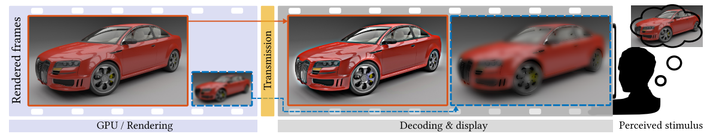

发送到VR头显的视频数据需要很高的带宽，只能在专用链路上实现。在本文中，作者解释了如何使用一种概念上简单的技术，来降低渲染要求和**传输带宽**，并与现有的渲染管道很好集成。

📘 每一个**偶数帧**都以较低的分辨率渲染，每一个**奇数帧**都保持高分辨率，但为了补偿之前高空间频率的损失而进行了修改。当以高帧率看到这些帧时，它们会被融合并被认为是**高分辨率和高帧率的动画**。

尽管其概念简单，但该技术的正确执行需要一些==特殊的步骤==：

+ 必须对**显示器光度时间响应**（display photometric temporal response）进行建模
+ 必须避免闪烁和运动伪影
+ **生成的信号**不能超过显示器的**动态范围**。

🏁 本文的实验，在高帧率LCD显示器和基于OLED的VR头盔上进行，探索了所提出的技术的==参数空间==，并证明其感知质量与**全分辨率渲染**基本一致。

## 1. INTRODUCTION

现代VR系统需要以**高帧率**（90 Hz）和**最小延迟**来渲染双目立体视图，以便生成的视图与**头部运动**完美同步。由于当前一代VR显示器提供的**角度分辨率**较低，约为每视觉度10个像素，因此每一帧都需要用**强抗锯齿**来渲染。

> 而从GPU将数据传输到显示器上，对传输带宽提出了极高的要求

本文提出了一种技术——时间分辨率复用(TRM)，可以将高帧率显示器的带宽和渲染成本降低37-49%，而计算开销很小，对图像质量影响也很小。

## 2. RELATED WORK

### Temporal coherence in rendering

重投影技术：如果只对**每个第K帧**进行渲染，中间帧通过变换前一帧生成，可以大大降低渲染成本。

+ 反向重投技术`Reverse reprojection techniques`为当前帧中的每个像素，找到前一帧中的像素。这就需要找到一个**重投算子**，将像素的**屏幕坐标**从当前帧映射到前一帧，然后测试当前点在前一帧中是否可见。可以通过比较当前帧和前一帧的深度来测试可见性。
+ **前向重投技术**将前一帧中的每个像素，映射到当前帧中的新位置。但此技术没有得到图形硬件的支持，所以需要通过将前一帧`Warped`到当前帧，来得到其快速实现。

> 关于==时间相干技术==的综合：D. Scherzer, L. Yang, O. Mattausch, D. Nehab, P. V. Sander, M. Wimmer, and E. Eisemann. Temporal coherence methods in real-time rendering. Computer Graphics Forum, 31(8):2378–2408, 2012

重投影技术被认为是VR渲染中最后的选择，只用于避免**跳过或重复帧**。当渲染预算无法满足时，降低**帧分辨率**比重投影更可取。重投技术的另一个限制是，当从GPU传输像素到VR显示器时，没有减少带宽。

### High-frame-rate display technologies

显示屏上显示的运动所产生的伪影主要可以分为：

+ 非平滑运动
+ 虚假多边（ghosting）
+ 运动区域的空间模糊
+ 闪烁。

帧率降低、亮度增加、运动速度提高、对比度增加和空间频率降低时，这类伪影的可见度会增加。

**响应时间**仅占LCD屏幕上可见的少量模糊。 大部分模糊归因于在帧期间内，保持静止的图像上的==眼动==。 当眼睛跟随**移动的对象**时，凝视`Gaze`在**整个帧期间内不变的像素**上平滑移动。 这会在整合到视网膜上的图像中引入模糊，这种效果称为保持型模糊。 可以通过闪烁背光（flashing the backlight）或插入黑帧（BFI）来缩短像素的开启时间，从而降低**保持型**模糊。 但是，两种解决方案都会降低显示器的峰值亮度，并可能导致可见的闪烁

### Coding and transmission

## 3. PERCEPTION OF HIGH-FRAME-RATE VIDEO

为了证明我们的方法，首先讨论此算法所依赖的**视觉现象**和**模型**。大多数人工光源，包括显示器，都会以很高的频率闪烁——高到我们不再看到闪烁，而是一种稳定的光。**带有LED光源的显示器**通过以非常高的频率打开和关闭**照明源**，来控制其亮度，这种做法被称为==脉宽调制==。这种显示器的**感知亮度**将与具有相同**时间平均亮度**的稳定光的亮度相匹配——这种现象被称为塔尔博特-普拉托定律。

这个闪烁频率被称为**临界融合频率**`CFF`，依赖诸多因素：刺激的对数亮度（正比）、刺激的大小（正比）、在`parafovea`更加明显（离`fovea`5到30度的区域）。

在我们的技术下，由于**时间调制的对比度**要低得多，闪烁的可见度最好用时间灵敏度或==时空对比度灵敏度函数==（stCSF）来预测。这种**灵敏度模型被**定义为空间频率、时间频率和背景亮度的函数，其中各维度并不独立。移动物体的**可见度**由空间-速度对比敏感度函数(spatio-velocity contrast sensitivity function，svCSF)更好地预测。stCSF和svCSF的轮廓图如下所示。左边的stCSF图显示，对于高时间和空间频率，同等灵敏度的等高线几乎形成了直线，这表明灵敏度可以由一个平面近似。

> 下图右的时间频率，被视网膜速度（retinal velocity）代替了（度数每秒）

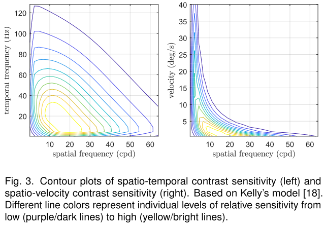

:star:需要结合眼动来考虑**时间视觉**。 当注视时，眼睛会在注视点附近漂移（0.8-0.15度/秒）。观察运动物体时，我们的眼睛试图以高达100度/秒的速度对其进行跟踪，从而稳定了视网膜上**物体的图像**。这种称为平滑追踪眼动（SPEM）的跟踪[28]并不完美，==眼睛往往会滞后于物体==，移动速度会慢5~20％。 

+ 对于高达7.5度/秒的速度，未观察到灵敏度下降，对于高达35度/秒的速度，感知清晰度适度下降。
+ 当以高于6度/秒的速度移动时，模糊图像显得更清晰，而对于高于35度/秒的速度，模糊图像的感知清晰度接近于锐利移动图像的清晰度。这种效果，被称为==运动锐化==，可以帮助我们看到锐利的物体（因为视网膜图像会模糊，由于眼睛的SPEM跟踪不完善）。运动锐化也被归结为一个众所周知的现象，即==视频比单个帧显得更清晰==。
+ Takeuchi和De Valois证明了这种效应对应于中、高空间频率的亮度对比度的增加。他们还证明，只要低通滤波器的截止频率足够大，交错的模糊帧和原始帧可以看起来接近原始帧。本文的方法得益于运动锐化，但由于对于低速度的锐化太弱，所以不能完全依赖它。

## 4. TEMPORAL RESOLUTION MULTIPLEXING

> 算法利用了眼睛对高空间和时间频率信号的低敏感性。

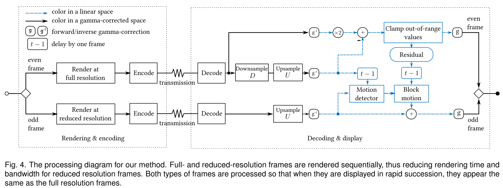

这个算法分为两个阶段：`Rendering&encodinng`和`Decoding display`，这样设计可以来减少传输量（带宽）。

> 可选的编码和解码步骤可能涉及色度子采样、熵编码或完整的高效视频编解码器，如h265或JPEG XS。所有这些带宽的节省都将在我们的方法基础上减少37-49%。

### Frame integration

由于一般来说VR要求90 HZ，所以帧延迟是１１.１ｍｓ，对于算法中的一对则是22.2 ms，符合之前说过的塔尔博特-普拉托定律。上采样的奇数帧定义为$\alpha_t$：

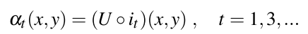

其中，U是上采样算子，$i_t$是地分辨率帧，$o$表示函数组成。全频偶数帧的初始候选者，补偿奇数帧的较低分辨率，将用β表示：

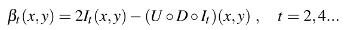

当一个图像是静态的（It=It+1），根据塔尔博特-普拉托定律，感知的图像是：

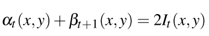

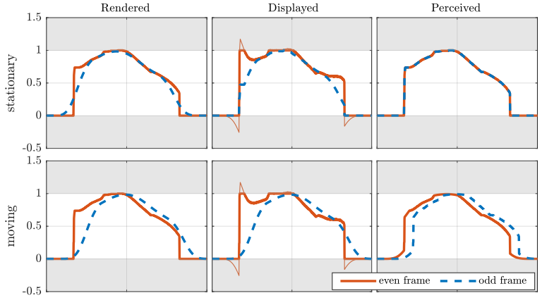

### Overshoots and undershoots

分解成**低分辨率帧**α和**高分辨率帧**β并不总是简单的，因为高分辨率帧β可能包含超过显示器动态范围的值。举个例子，考虑上图所示的信号，并假设我们的显示器可以重现0和1之间的值。"橙色 "所示的补偿高分辨率帧β包含高于1和低于0的值，我们将其称为==过冲和欠冲==。如果将 "橙色 "信号`clamp`在有效范围内，那么感知到的综合图像将丢失一些高频信息，并将有效地模糊。在本节中，将解释如何将这一问题降低到锐度损失难以察觉的程度。

对于**固定像素**，==过冲和下冲==不会造成严重问题。 通过偶数帧βt（等式2）与实际显示的帧之间的差可以存储在**剩余缓冲器**ρt中。 然后将存储在剩余缓冲区中的值添加到下一个低分辨率帧：$\alpha_{t+1}^`=\alpha_{t+1}+\rho_t$。 此时添加**残差值**可恢复丢失的高频，并再现原始图像。 但是，对于包含运动的像素，相同的方法将引入令人反感的==重影==。所以需要一个掩码：

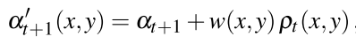

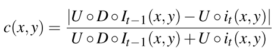

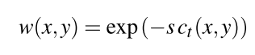

其中，s是控制参数。

### Display models

4.1节中讨论的视觉系统的**帧积分特性**适用于**光的物理量**，但不适用于存储在**帧缓冲区**中的**伽玛压缩像素值**。在估计的显示响应中的微小误差会导致高分辨率帧的过度或补偿不足。因此，准确地对显示进行分析是非常重要的。

#### OLED (HTC Vive, Oculus Rift)

OLED显示器可以在**消费类VR头盔**中找到，包括==HTC Vive==和==Oculus Rift==。这些可以使用标准的**参数化显示模型**来准确描述，如增益-伽马-偏移（gain-gamma-offset）。然而，在本文的应用中，`gain`并不影响结果，对于近眼的OLED显示器来说，`offset`接近于0。因此，忽略增益和偏移，将**显示响应**建模为简单的`gamma`：$I=v^r$（$r=2.2$），为了避免**色阶偏移**，作者用Specbos 1211**光谱辐射仪**测量了HTC Vive和Oculus Rift CV1的全屏颜色刺激（红、绿、蓝）的**显示响应**：HTC Vive的最佳拟合参数为$\gamma_r$=2.2912、$\gamma_g$=2.2520和$\gamma_b$=2.1940，Oculus的最佳拟合参数为$\gamma_r$=2.1526、$\gamma_g$=2.0910和$\gamma_b$=2.0590。

#### HFR LCD (ASUS P279Q)

为了准确地建立**LCD响应模型**，扩展了显示模型，以考虑前一帧的像素值。前向显示模型，如图8顶部所示，包含一个额外的**LCD组合块**，给定当前和前一帧的像素值，预测等效**伽马压缩像素值**。这样的关系是由一个对称的**双变量二次函数形式**很好地逼近的：

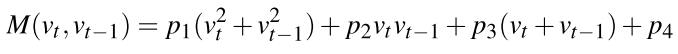

## 5. EXPERIMENT 1: RESOLUTION REDUCTION VS. FRAME RATE

为了分析显示和渲染参数，如**刷新率**和**还原因子**，如何影响==TRM渲染==的运动质量，作者进行了一个心理物理实验。在实验中，测量了最大可能的**分辨率还原因子**，同时保持与标准渲染的感观上无法区分的质量。

在每次试验中，参与者看到两个短的**动画序列**，其中一个使用TRM渲染，另一个以全分辨率渲染（帧速率相同）。图10显示了实验中使用的四个动画的缩略图。这些动画包含了移动的光盘，滚动的文本，全景的平移和一个体育大厅的3D模型。前两个片段的设计是为了提供一个高对比度的、易于跟踪的对象；剩下的两个片段测试了算法在渲染和相机捕捉的场景上的应用。体育馆通过让用户用鼠标旋转摄像头，来测试互动应用。其他序列则是预先录制的。在全景片段中，作者模拟了平移，因为它比用摄像机拍摄的视频更能控制运动速度。

> 动画以四种帧率显示：100 Hz、120 Hz、144 Hz和165 Hz。

实验的目标是找到一个**阈值还原因**子，在这个阈值上，观察者能以`75%`的概率注意到==TRM和标准渲染之间的差异==。在**心理物理学工具箱扩展**中实现的自适应QUEST程序，被用来对**还原因子**的连续尺度进行采样，并拟合心理测量函数。试验的顺序是随机的，因此16个QUEST程序同时运行，以减少学习效应。在每个试验中，参与者被要求选择呈现更好运动质量的序列。他们可以选择重新观看序列（在失神的情况下），但不鼓励这样做。在每个环节之前，参与者都被口头和书面告知他们的任务。简报解释了运动质量因素（在第2.2节中讨论），随后是一个简短的训练课程，其中演示了40 Hz和120 Hz之间的差异。

> 8名18-35岁的参与者参加了实验。所有的人都有正常或矫正到正常的全色视力

实验表明，0.4或更少的**还原因子**产生的动画与全分辨率下的渲染帧是无法区分的。对于高刷新率的显示器来说，可能会有更强的降幅，但是，当系数降到0.4以下时，节省的费用就会变得微不足道。

## 6. COMPARISON WITH OTHER TECHNIQUES

具体见论文。

## 7. APPLICATIONS

具体见论文。

## EXPERIMENTS 2 AND 3: VALIDATION IN VR

在实验2和3中对本文技术进行了最终验证，将TRM与基线渲染和两种替代技术进行比较：NCSFI和最先进的重投影（ASW）。

在两个不同的VR头盔上验证了该技术，运行频率为90 Hz - HTC Vive和Oculus Rift CV1，分别为实验2和3。ASW没有为HTC Vive实现，所以在实验2中我们只测试了TRM对基线渲染和NCSFI。在实验3中，我们用Oculus Rift上最新的ASW实现替换了NCSFI。使用的PC与实验1相同。参与者被要求在转椅上进行实验，并鼓励他们四处移动头部。

## 限制

RM仅适用于高刷新率显示器，能够显示每秒90帧或更多帧。在较低的帧速率下，闪烁变得明显。当移动的角速度很高时，TRM是最有利的，比如在VR或第一人称游戏中摄像机运动所带来的角速度。我们的技术需要对使用它的显示器进行表征，如第4.4节所述。这对于基于OLED的VR头显来说是一个相对简单的步骤，但对于LCD面板来说，表征工作就比较复杂了。与重投影技术不同，我们需要渲染中间帧。这需要每一帧都处理场景的完整几何体，这就降低了对于非碎片绑定场景的性能增益。然而，正如第7.2节所解释的那样，这一成本在VR立体渲染中得到了有效的摊销。该方法还增加了内存占用，因为它需要额外的缓冲区，一个用于存储前一帧，另一个用于残留。然而，该方法的内存占用量与重投影方法相当或更小。