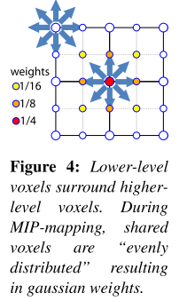

# Interactive Indirect Illumination Using Voxel Cone Tracing

本文主要基于分层的体素八叉树。通过一个常规的场景网格，加上**近似体素**锥跟踪（此技术允许对能见度和传入的能量进行**快速估算**），本文可以实时**生成和更新**这个体素八叉树。

本文可以在25~70 FPS的表现下，为`Lambertian`材料和`Glossy`材料添加 *2 light bounce*的GI，其性能表现几乎和场景无关、且**不局限于低频照明**。

> 它显示了几乎与场景无关的性能，因为我们尽量避免在我们的计算中涉及实际网格。
>
> 建议主题：Fluent

## 1. Introduction

离线不行；预计算限制太大。

本文方法的==核心==是**预过滤**场景几何的层次八叉树。考虑到效率，这个表示以==动态稀疏八叉树==的形式存储在GPU上。利用一种新的==voxel cone tracing technique==，我们依靠这种**预滤波**，来快速估计**可见性**，并将来自光源的**间接能量**投射到结构中。

八叉树首先基于场景的静态部分进行构建，然后根据移动物体，或场景改变，来进行**更新**。

## 2. Previous Work

当前最有效的实时方案几乎都基于屏幕空间，但是忽略了离屏信息。本文的工作推导出了场景的**分层表示**，产生了一个规则的结构，以促进光的传输，实现实时性能。

## 3. Algorithm overview

此算法主要按如图所示:arrow_up:的三步：

+ 首先将**来在静态光源**的入射光（能量和方向）注入到**稀疏体素八叉树**的叶子中。具体做法：从所有光源，来对场景进行光栅化，然后对每一个可见的表面片元，溅射一个光子(==splatting a photon==)。

  > This is done by rasterizing the scene from all light sources and splatting a photon for each visible surface fragment. 

+ 对入射辐射度值进行过滤，并将值存入八叉树的更上级（**mipmap**）。本文依靠一个紧凑的==高斯波瓣表示==，来存储入射光的**过滤分布**——通过屏幕空间四叉树分析`screen-space quad-tree analysis`，这是个并行过程。

  > 本文的体素滤波方案也以视图相关的方式处理NDF(正态分布函数)和BRDF

+ 最后，从相机角度，进行渲染。作者使用==近似圆锥追踪==，来进行最后的采集——在整个半球上发送几个圆锥，来收集分布在**八叉树**中的照明。对于**类Phong的BRDF**，使用**5**个左右的宽锥来近似整个场景的漫反射能量，而在反射方向上（视线的），则使用**一个紧凑的圆锥**来捕捉高光。

## 4. our hierarchical voxels structure

正如之前所言，本文的核心想法是：构建场景几何的**预过滤分层体素表示**，考虑到效率，这个表示用**稀疏八叉树**存储。

### 4.1 Structure description

根节点代表整个场景，其子节点代表场景的1/8，迭代这个过程。这种结构允许我们查询过滤后的场景信息，并通过**树层次的下降**来增加精度。

**GPU** **representation**：树节点存储在**线性GPU内存**中，节点被分组为2×2×2的`tiles`。这个分组允许我们存储一个**指向所有2×2×2个子节点的**指针。此外，每个节点都包含一个**指针**，指向存储在**纹理内存**中的==voxel volume==，`a brick`。这种表示是**稀疏的**，意味着空节点可以被压缩，同时每个节点的信息存储在内存中，意味着可以使用硬件的==三线性插值==。

但这种`brick`方法，不适用于小`birck`的场景，因为边界处的体素需要复制邻居体素，来保证**inter-brick**插值正确。==解决方法==：在使用$3\times3$的`brick`的同时，假设==体素中心==位于节点角落处，而不是节点中心:arrow_down:。这确保总是可以在一个包含2×2×2节点集的`brick`内计算插值。

> 冗余并没有被消除，但是与添加边界相比，为了相同的采样精度，我们使用了不到一半的内存。这种内存减少允许我们向结构中添加邻居点，使我们能够快速访问空间上的==邻近节点和父节点==。这些连接对于将直接照明分配到树的所有层次来说，是非常重要的。

### 4.2 Interactive voxel hierarchy construction and dynamic updates

本文通过使用GPU的光栅化通道，提出了一个新的实时**体素化方法**。为了扩展到非常大的场景，此方法避免了**全规则网格**来作为中间步骤，而是直接构造**八叉树**。

> 容易观察到：场景的大部分都是静态的，不需要每帧更新。

半静态对象和完全动态对象都存储在相同的八叉树结构中，以便于简单遍历和**统一过滤**。使用**时间戳机制**`time-stamp`来区分这两种类型，以防止半静态部分每帧更新。

本文的==结构创建算法==主要是两步：**八叉树创建**和**Mips Mapping**

+ **八叉树创建**。

  + 首先使用**GPU光栅化管道**创建八叉树。沿着场景的三个主轴，对网格进行三次光栅化。

  + 通过禁用**深度测试**，来防止剔除，我们为每个**潜在存在的叶子节点**生成至少一个**片元着色器线程**。每个线程从上而下进行访问，直到找到正确的叶子节点，就写入数据（*纹理颜色、法线、材质*）。

    + 当一个节点需要被==细分==时，一组2×2×2的子节点被“**分配**”在全局共享`node buffer`内。这组子节点的地址被写入到原节点的“子”指针中，线程继续向下访问。

    > `global thread list`用来解决并行线程，同时拆分一个节点的冲突。

  + 叶子中的值，直接写入相关联的`brick`，其分配类似于节点，存入一个`shared brick buffer`中。

+ **Dynamic update**。

  + 更新动态物体，相对于上一部分，**唯一的区别**是，由这些对象生成的新体素不能覆盖结构中现有的静态部分。因此，动态物体的信息存储在缓冲区的末尾。

+ **Mips Mapping**

  + 对于一个n层的八叉树，只需要简单的$n-1$步。在每一层中，通过当前节点的子节点`brick`，进行过滤计算。每个节点包含一个$3\times3$体素brick（边界重用）。实践中，使用一个$3\times 3$高斯加权算子进行加权平均。

> MipMapping过程应该是从下至上的

### 4.3 Voxel representation

在一个给定级别上，每个`voxel`必须代表较低级别的`light behavior`（这样嵌套，就可以代表==整个场景跨度==）。为此，作者用**描述底层数据**的分布，来建模方向信息。我们将其应用于法线和光线方向。

本文选择仅存储**各向同性高斯波瓣**，其特征由**平均向量**D和**标准差**σ表示。为了简化插值，方差通过范数|D|进行编码，$\sigma^2=\frac{1-|D|}{|D|}$。在第七节，会描述如何使用这些数据。

## 5. Approximate Voxel Cone Tracing

此方法首先用于**过滤**，来**抗锯齿**。想法是：沿着射线步近，然后在本文的层次表示中，进行查找（**查找的层**和圆锥半径相关）。

我们跟踪遮挡α和潜在的颜色值c，代表指向**锥体原点**的反射光。每一步中，我们从**八叉树**中检索适当过滤的场景信息和遮挡值α~2~，来计算一个新的输出亮度c~2~。然后利用经典的`volumetric front-to-back accumulation`（体积前后累积法）更新数值：
$$
c=\alpha c+(1-\alpha)\alpha _2c_2\\
\alpha=\alpha+(1-\alpha)\alpha_2
$$
此外，为了确保良好的**集成质量**，即使对于大锥，沿着射线的**连续样本之间的距离d**并不与**当前体素大小d**一致。因此使用了校正：$\alpha_s^/=1-(1-\alpha_s)^{d^//d}$。

## 6. Ambient Occlusion

这里对于AO，使用函数$f(r)$进行距离衰减。因此，调整后的遮挡因子为：
$$
\alpha_f(p+rw):=f(r)\alpha(p+rw)
$$

## 7. Voxel Shading

本文考虑了Phong-BRDF，即一个大的**漫射波瓣**，和一个可以表示为高斯波瓣的**镜面波瓣**。尽管如此，我们的照明方案可以很容易地扩展到任何叶混合的BRDF。

## 8. Indirect Illumination

主要分两步：

- 在场景表示的叶子中捕捉光源的入射光。**储存入射光，而不是射出光，将允许我们模拟光滑表面**。然后将过滤输入光，并分配到八叉树的所有层次上。
- 进行==近似锥跟踪==，在八叉树结构中记录入射光是复杂的，因此，在详细描述这个过程之前，我们暂时假设它已经存在于八叉树结构中。

### 8.1 Two-bounce indirect illumination

首先使用延迟渲染，来决定哪些表面点需要计算**间接照明**。然后发送几个锥，来查询八叉树中的光照，来执行最后的收集`gathering`。

### 8.2 Capturing Direct Illumination

**这里主要来介绍如何存储入射辐射度**。基本上，每个像素代表一个我们想要在场景中反弹的光子`photon`。作者称之为==light-view map==。接下来，要把这些**光子**存储在**八叉树表示法**中，准确地说，我们希望将它们存储为一个**方向分布**和**能量**。

为了溅射光子`splat the photons`，使用一个片元着色器（每个**light-view map**像素都有一个线程）。因为其**分辨率**通常高于voxel网格的最低层，因此可以假设：可以直接将光子溅射到八叉树的**叶子节点**上，而不需要引入`Gaps`。

> 此外，光子总是可以被放置在体素结构最精细的层次上，因为它们存储在表面，而只有折叠空体素才能产生稀疏的表示。

**Value Transfer to Neighboring Bricks**

为了简化这个解释，假设八叉树是完整的，这样就可以在每个叶节点上启动一个**线程**。

将执行六次==Pass==，每根轴（x、y、z）两次。在第一个x轴通道中（图9，只有左侧），每个线程将把当前节点的体素数据添加到其右侧砖块的相应体素中。x轴的下一次==Pass==将通过复制值，把数据从右边(我们现在有总和的地方)传输到左边。

**Distribution over levels**

在八叉树的最低层次上有了**相干的信息**，下一步是过滤这些值，并将结果存储到更高的层 (==MIP-map==)中。

一个简单的解决方案是：在上层的每个voxel上启动一个线程，从下层获取数据。然而，这有一个**重要的缺点**。对于共享的voxels，**同样的计算要执行多次（最多8次）**。同时，线程的计算成本也因处理的==voxel==不同而不同，导致调度不平衡。

本文的**解决方案**是：执行三个单独的==Pass==，其中所有线程的代价大致相同。其想法是**只计算部分过滤结果**，并使用之前==bricks==之间的转移来完成结果。

- 第一次==Pass==使用较低层次上涉及的**27个体素值**，来计算中心体素（==黄色==）。
- 第二次==Pass==，计算位于**节点面中心**（==蓝色==）的体素的==过滤响应==的一半。因为只计算了一半的值，所以只涉及18个体素值。
- 最后，第三次==Pass==启动**corner voxels**（绿色）的线程，则只计算一个octant内的像素。

然后，可以使用那个转移过程。

**Sparse Octree**

到目前为止，我们假设八叉树是**完整的**，但实际上，我们的结构是**稀疏的**。此外，上面描述的**解决方案**消耗了很多资源：在过滤过程中，启动了所有节点线程，即使是那些不包含任何光子的节点。

**直射光**往往只影响到场景的一小部分，所以避免零值的过滤是至关重要的。一个**解决方案**是为每个光景图像素启动一个线程，在层级中找到**应该应用过滤的**节点并执行它。

本文的想法是减少线程的数量，并获得接近每个过滤通道的**最佳线程集**——依靠从==光景图==导出的==二维节点图==`2D node map`。这个节点图实际上是一个==MIP图金字塔==。最低一级节点图的像素（最高分辨率）存储了包含光景图中相应光子的**3D叶子节点**的索引。更高层次的节点图像素（分辨率较低）存储了上一层次节点的==最低公共祖先节点==的索引。

在我们的==八叉树结构==中，仍然每个像素启动一个线程，来计算**最低节点映射**的每一个mip映射==Pass==。但是，当一个线程在树中向下查找**它必须为之计算mip映射值**的节点时，它首先查找节点映射的当前级别，以验证是否与另一个线程没有共同祖先。如果存在，除了左上角的线程外，所有检测到这个共同祖先的线程都终止，然后左上角的线程负责计算剩余的过滤值。这个策略是相当成功的，我们获得了> 2加速。

## 9. Anisotropic voxels for improved cone-tracing

## 10. Results and Discussion

本文的方法和LPV方法都存在==light leaking==，上图的墙壁。

内存的高占用是个问题。​

