# A Survey of Temporal Antialiasing Techniques	

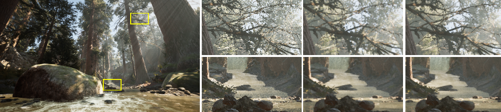

## 1. Introduction

由于`MSAA`不适用于**延迟渲染**，很多基于屏幕空间的**后处理抗锯齿算法**被应用于游戏引擎。但由于缺乏足够的信息来恢复**真正的像素值**，它们中的许多存在**时间稳定性问题**。

而`TAA`复用之前帧的数据，在质量上，不仅**抗锯齿**效果很好，而且**时域上更加稳定**。实现上，通常为一个的后处理`pass`。

`TAA`也产生了之前方法很难遇见的问题，例如重影`ghosting`和**闪烁**（Games202比较详细的展示过）

### 算法前瞻

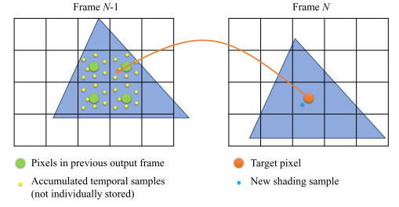

`TAA`的关键思想是复用**过去帧**中积累的**子像素样本**，有效实现超采样。假设在第`N`帧之前为每个像素收集了一些样本（黄点），平均化，作为**每个像素的单色值**（绿点）存储在**缓冲区**。对于第`N`帧中的每个像素，根据**场景运动**将其**中心位置**（橙色点）映射到前一帧`N-1`，并对**缓冲区**进行重采样，以获得该像素的`history color`。对于当前的第N帧，我们在一个**抖动的位置**渲染一个新的样本（蓝点），并将结果与`history color`合并。

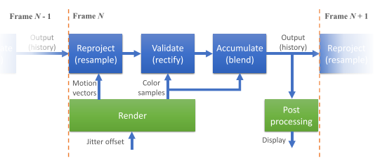

由于遮挡、光照或内容的变化，获取的**历史数据**可能是过时的，并与**当前帧的数据**不一致。未检查而使用数据会产生**重影**和**图像延迟效应**。`History validation`是**TAA算法**的一个关键组成部分，因为它可以识别过时的历史数据，并**拒绝或纠正数据**。

最近有一个趋势，就是在`TAA`中把输入的**渲染样本密度**降低到**每像素一个样本**以下。到每像素一个样本以下，这实际上使其成为一个`spatial upscaling`的解决方案。这种技术通常被称为`temporal upsampling`。即使场景在每一帧中都**光栅化**和**粗略渲染**，在多帧中收集的样本可以共同提供**更高密度和分辨率的数据**。`temporal upsampling`技术利用这些数据来恢复**精细的细节**，并且在质量上通常优于纯粹的空间`upsampling`技术。鉴于今天在超高分辨率下玩游戏的需求越来越大，`temporal upsampling`及其变体正逐渐成为**现代游戏引擎的新标准**。

## 2. A brief history of Temporal Antialiasing

略。

## 3. Accumulating temporal samples

### Jittering samples

大多数`TAA`实现在每一帧中每像素渲染一个样本。在每一帧中为所有像素生成不同样本的一种常见方法是：向**摄像机投影矩阵**添加一个**视口亚像素抖动偏移量**。每帧抖动偏移通常来自一个**均匀分布的采样序列**，这样每个像素都被多帧生成的样本**均匀覆盖**。

由于一个物体可以在任何时候**出现或消失**，开始累积的第一个样本可以从**序列中的任何索引**开始。为了实现快速收敛，**一个理想的序列**必须具有这样的特性：**任何长度的子序列都必须在一定程度上均匀分布在像素域**。某些低差异序列，如`Halton`或`Sobol`，具有这种特性。根据目标质量和有效的累积样本数，**序列的长度**通常可以被限制在**一个相对较小的数字**。例如，**UE4**默认使用$Halton(2, 3)$的8采样序列，**Inside**使用$Halton(2, 3)$的16采样序列。当目标**抗锯齿滤波器内核**是除**普通盒式滤波器**之外的**任何非负数内核**时，可以使用**重要性采样**来对域进行有效采样，并避免对单个样本进行**明确的加权**。

**场景运动**可能会扰乱一个精心设计的**采样模式**。对于一个短的循环序列，**一定的运动速度**可能会导致来自多个帧的样本位置在世界空间中**聚集**，从而导致有偏结果（**模糊或锯齿**）。这是运动下`TAA`质量下降的原因之一。通过**随机化抖动模式**，我们可以打破模式中的**规律性循环**，降低遇到这些错误的风险。

通过`TAA`，对**像素区域**进行采样和积分，为几何体和纹理提供**抗锯齿**。由于纹理通常使用`mip mapping` 进行过滤，它们可能有被`TAA`**过度模糊**的风险。因此，通常在对纹理进行采样的**前向通道**中应用**mipmap偏置**。这对`temporal upsampling`尤其重要。`mipmap bias`的水平应该补偿**有效采样密度**和**输入像素密度**之间的比率。例如，如果每个输入像素的有效样本数预计为`4`，那么mipmap bias计算为$-\frac{1}{2}log_2{4}= -1.0$。

由于TAA本质上是一个摊销采样过程，它也可以应用于**其他需要采样积分的效果**，如环境遮蔽、阴影、次序无关的透明度、反射和漫反射全局照明。为这些效果提供随机的输入，将允许`TAA`将它们与屏幕空间抗锯齿采样一起积分。例如，虚幻引擎4依靠`TAA`对许多使用随机采样和抖动的效果进行去噪。

### Data reprojection between frames

由于帧之间的场景运动，每个像素需要计算其在**前一帧中的相应位置**以获取历史数据。==反向重投影==被广泛用于执行这一步骤。在场景光栅化过程中，几何体被转换了两次，一次使用前一帧的数据，另一次使用当前帧的数据。然后，每个像素的**当前位置和先前位置之间的偏移量**被存储到**运动矢量纹理**中，随后被**TAA算法**用来获得每个目标像素的**重投影历史缓冲区坐标**。

为了节省**帧缓冲区的带宽**，一些引擎只明确地计算和存储**动画**和**移动物体**的运动矢量，并将所有受影响的像素标记在`stencil texture`中。对于没有被标记的像素，它们在前一帧中的位置可以在`TAA Pass`中通过使用**深度缓冲**重建每个像素的**裁剪空间坐标**来确定，并使用**当前帧**和**前一帧的摄像机矩阵**将其投影到前一帧。

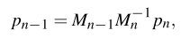

其中，$p_n=(\frac{2x}{w}-1,\frac{2y}{h}-1,z,1)$是当前帧的**裁剪空间坐标**。（UE4默认使用的）

历史缓冲区中的**重投影坐标**往往包含一个**子像素的偏移**，源帧和目标帧之间不再有$1:1$的**像素映射**。为了获得每个像素的历史记录，需要一个重采样步骤，这样就不会引入失真伪影。

由于**运动矢量不能抗锯齿**，使用**运动矢量**进行重投影可能会对移动物体的**平滑抗锯齿边缘**重新引入**锯齿伪影**。避免这种伪影的一个简单方法是：在对运动向量采样时，**对前景物体进行扩张**，这样所有被边缘触及的边界像素都会和这些物体一起被重新投影。通常情况下，使用一个小的`4 tap`扩张窗口。

### Sample accumulation

在大多数TAA的实现中，每个像素的累积采样被**平均化**并存储为一种颜色，它既是当前帧的输出，又是下一帧的历史输入。这个迭代累积的过程可以写为 {**2**}

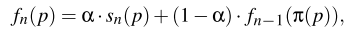

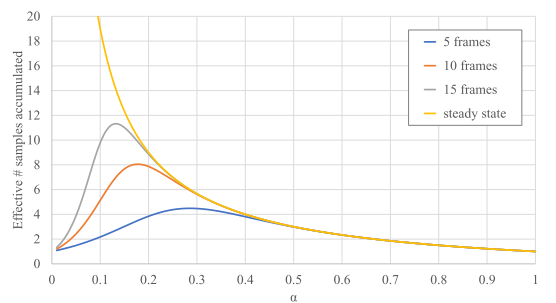

作为平等加权采样的替代方案，我们可以在历史缓冲区的$\alpha$通道中存储每个像素的**累积样本数**$N_t(p)$。每当像素被刷新时，这个值就被初始化为`1`，并且每一帧都增加。通过设置$\alpha=1/N_t(p)$。

当α较小时，结果容易受到**重采样误差**或**时间滞后**的影响。为了避免这些错误，$\alpha$存在在一个下限。Yang等人提出了一个理论，根据**分数运动速度**推导出一个**自适应的α下限**，这样就可以防止**双线性重采样误差的积累**了。CryEngine 3 和Unreal Engine 4使用**简单的启发式方法**来增加较大运动速度下的$\alpha$。

#### Sample accumulation in HDR color space

在大多数渲染引擎中，**物理校正的后期处理效果**是在**线性HDR色彩空间**中实现的。最好是将`TAA`放在所有这些效果之前，以避免高能量伪影被诸如`bloom`或`lens flare`的效果所夸大。这就要求`TAA`在**线性HDR空间**中获取输入样本。另一方面，由于**色调映射**通常是非线性的，过滤操作最好在**色调映射后**的空间中应用。解决这个冲突的一个变通方法是在应用`TAA`之前对样本进行`tonemap`，并将`tonemap`输出反转为**线性HDR空间**，以供给**后期处理链**的其余部分。在实践中，这通常是通过一个可倒置的**色调映射算子**来实现的，比如**Reinhard算子**$1/(1+x)$。

为了避免色调映射时的**颜色不饱和**，Kar在将新的样本积累到历史中时，使用了一个亮度适应性的权重：

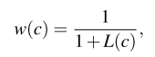

$w(c)$是使用公式2时作为**双边`bilateral`权重**应用。

## 4. Validating history data

### History rejection

处理**陈旧或无效数据**的一个直接方法是在检测到错误时拒绝数据。一般来说，有两类来源可以用来确定可信度：**几何数据**（深度、法线、物体ID和运动矢量），以及**颜色数据**。

几何数据通常用于处理**遮挡变化**。通过比较**重新投射的深度**p和**以前的深度**$\pi_{t-1}(p)$（一个小的误差容限），可以识别出像`p1`这样的像素，并避免复用。为了实现更稳健的匹配，其他几何信息如**表面法线**和**物体ID**也可以作为额外指标。

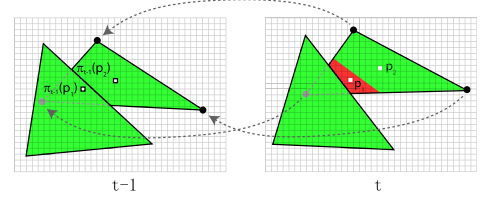

在《孤岛惊魂2》的TAA实现中，除了基于深度的一致性检查外，还提出在运动速度增加时增$\alpha$。尽管几何信息往往与**渲染颜色**密切相关，但它只是输入的一部分。像照明、阴影和反射等**效果变化**不能用**几何信息**来检测。**几何数据的不可过滤性**可能会重新引入锯齿。因此，仅仅依靠几何信息来拒绝，往往是一个脆弱的解决方案。

比较历史缓冲区和当前帧之间的**颜色样本**，可以为**历史数据的有效性**提供一个**更直接的指标**。这对于检测历史数据是否因**可见的光照或阴影变化**而过时，是很有用的。由于当前帧样本$s_n$预计会有伪影，直接比较$f_{n-1}(p)$和$s_n(p)$会使我们对**误差的估计**有偏差，这意味着它在空间和时间上都可能是不稳定的。Yang等人观察到这一点，并建议对误差估计进行过滤：{**5**}

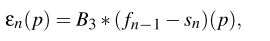

`B3`是半径为`3`的`box filter`，然后用**误差估计**来设置**α的下限**，以强制执行**最小数量的历史刷新**。Malan计算当前帧样本中**邻域的颜色范围**（边界框）。如果**历史颜色**在边界框内或接近边界框，则保留**历史颜色**。该技术还根据颜色边界框的范围对α进行偏置：一个小的边界框（平坦的颜色）会增加α以避免**可见的重影**，而一个大的边界框（尖锐的不连续）会减少α以**增加累积样本**并**抑制时间伪影**。

### History rectification

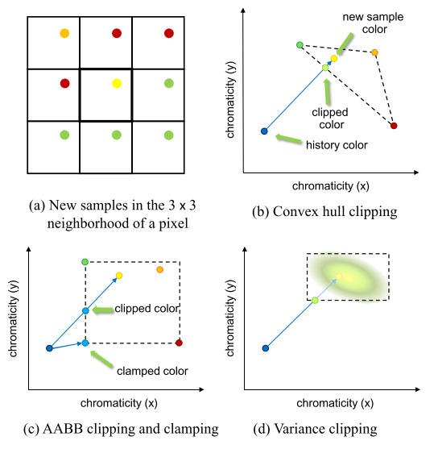

拒绝无效数据可以有效地重置逐像素的积分过程，但可能导致**时域伪影的增加**。**历史修正**通过使**被拒绝的数据**与**新样本**更一致来改善这个问题。

大多数**历史校正算法**都假设**当前帧样本**提供了**每个像素所覆盖的颜色范围的可靠信息**。由于当前画面的采样通常是**稀疏的和有锯齿的**，所以每个像素的$3×3$或更大的邻域被考虑用来**提取颜色信息**。色彩空间中**邻域样本的凸壳**`convex hull `代表了对中心像素周围颜色的预期范围。如果**历史颜色**落在`convex hull`内，则假定它与当前帧**数据一致**，可以复用。

如果它落在`convex hull`之外，需要进行矫正，使其与**当前帧的数据**相一致。通过将历史颜色与当前帧的样本颜色相连接，并其与`convex hull`相交。交叉点是对历史的**最佳估计**。（`clamp`）

在实践中，上诉做法可能非常昂贵。一个常见的近似方法是使用**最小/最大滤波器**计算颜色的**轴对齐边界盒**（`AABB`），然后将历史颜色`clamp`在`AABB`中。`AABB`被用来接受或拒绝历史数据。虽然AABB的计算很简单，但以牺牲**时间稳定性**为代价，增加了重影的可能性。Karis通过在**YCoCg空间**中剪切AABB来进一步减少重影。与RGB相比，YCoCg空间通常会导致**更严格的AABB**。

**方差剪裁**`Variance clipping`通过使用**颜色的平均值和标准差**来确定校正用的**颜色范围的中心和大小**，来处理离群值：{**6**}

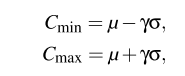

γ是一个**标量参数**，通常选在`0.75`到`1.25`之间。计算出的$C_{min}$和$C_{max}$用来代替AABB范围。

## 5. Temporal upsampling

`Temporal upsampling`是TAA的自然延伸，通过进一步降低**有效采样率**，从每像素一个样本到每像素一个一下样本。这通常是**像素工作量大的应用**所需要的，而且在以**高分辨率显示器**为目标的游戏中越来越受欢迎。`Temporal upsampling`本质上是积累**低分辨率的着色结果**，并产生更高分辨率的图像。尽管它与`TAA`共享许多基本构件，如**样本抖动、重投影和历史验证技术**，但累积步骤需要**特殊处理**以达到最佳图像质量。在这一节中，作者提出了一个涵盖现有各种**上采样技术**的一般框架，并讨论了一些改进策略。

### Scaling-aware sample accumulation

`Temporal upsampling`与`TAA`的不同之处在于：**输入样本**被累积到一个更高像素密度的缓冲区中。由于输入样本和输出像素之间不再存在$1:1$的映射，首先使用以下方法将输入样本升级为输出分辨率：{**7**}

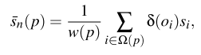

其中Ω(p)是在输出像素`p`的**固定大小的邻域内**的输入样本集合，$s_i$是第`i`个采样，$o_i$是$s_i$和$p$之间的距离，$\delta$是**重建过滤核**。**归一化因子**$w(p)$为权重之和：{**8**}

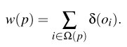

本质上，公式7计算了目标像素**重构核**$\delta$下的**输入样本的加权和**。**重构核**$\delta$可以是一个高斯核。（邻域Ω(p)匹配过滤器的大小）

虽然放大的输入样本$\overline{s}_n(p)$可以直接插到**公式2**中进行累加，但这样做并不能产生**具有理想清晰度的输出图像**。根据升频`upscaling`的性质，与输入样本**相近的样本**得到了这些样本的**直接拷贝**（质量较高），而其他的则是从较远的样本中插值出来的（质量较低）。在**抖动模式**下，**一个输出像素应该每隔几帧就收到一个更高质量的样本**。

==高质量的关键==是根据为每个输出像素`p`定义的**质量置信度系数**$\beta(p)$，有选择地将**输入样本**混合到`history`中。为此，递归累积步骤（公式2）可以重写为：

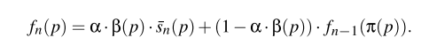

置信度$\beta(p)$是一个$[0,1]$的值，旨在当$\overline{s}_n(p)$的**质量预期**较低时，偏向于**保留历史**。UE4使用以下术语来计算置信度：

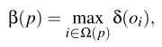

> 其他大多数将样本分散到高分辨率累积缓冲区的`Temporal upsampling`算法可以被看作是使用一个与目标像素大小相匹配的**盒式内核**

### Miscellaneous improvements

`Temporal upsampling`的**历史验证**与`TAA`的挑战相同，但更困难，因为相对于输出像素，输入样本更稀疏，**提供的真实内容信息更不可靠**。当输入样本稀疏时，历史校正的质量会受到影响，这最终会导致重影、时间不稳定和模糊伪影。

在`Temporal upsampling`过程中，在输入图像中用于计算**颜色边界框**的、典型的**3×3邻域**现在覆盖了目标图像中**超过3×3像素的区域**，导致**高估色域的可能**增加。为了避免这种情况，**UE4**计算了一个基于子像素偏移的缩小邻域，用于计算**颜色包围盒**。远离目标像素中心的样本不包括在边界框中，从而减少了重影伪像。

### Checkerboard rendering

棋盘式渲染（`CBR`）是一种特殊类型的`temporal up-scaling`技术。在PlayStation 4 Pro和XBox One X等游戏机平台将其作为**目标4K分辨率**的工具之后，它开始流行起来。与其他依靠**随机抖动**的样本来覆盖**目标像素网格**的时间放大技术不同，**CBR在一帧中确定地对每个2×2像素的四边形（因此被称为 "棋盘"）的对角线上的两个相对的像素进行着色**，并在下一帧中**翻转该模式**来对四边形的其他两个像素进行着色。在棋盘模式中渲染样本的技术可以是45◦旋转的帧缓冲器，硬件加速的**2×MSAA**，可编程的采样位置。

由于每一帧都只渲染一半的目标像素，因此需要时间上的数据重用，以便在每一帧中生成完整的图像。常见的TAA和时间放大技术，如重投影、样本积累和`histiry clamp`，直接适用于**CBR**。但是，由于**非标准的样本布局**以及大量的着色和后处理`pass`与之交互，CBR的实现通常需要对引擎代码进行重大修改。像`temporal scaling`一样，CBR技术通常在一个`pass`中解决**缩放和抗锯齿**。一个特殊的后处理通道可以用来避免在最终渲染中产生可见的锯齿状图案。

## 6. Challenges

### Blurriness

有两个来源可以解释`TAA`结果的**“软”外观**：当历史被**重投射**时，重采样所引入的误差，以及**历史修正所引入的误差**，在历史颜色中累积的细节被`clip`和`clamp`。

#### Resampling blur

当**运动**导致**目标像素**重新投射到前一帧中的**分数像素位置**时，就会发生**重采样**。使用硬件加速的**双线性纹理过滤**可以有效地插值**历史缓冲区**中四个最近的像素的颜色值，围绕重新投影的像素中心（公式2中的π（p））。然而，**双线性滤波器软化了重新采样的图像**，因为它们在**保留高频内容方面**表现不佳。由于历史数据在每一帧中都被重新投射，**滤波误差不断累积**，很快就会造成令人讨厌的模糊外观。这种模糊可以通过统计分析来量化。这种分析产生了**避免过度模糊**的策略，即根据**运动速度**将α夹紧到一个**自适应的较低阈值**（因为模糊量随分数运动速度而变化），并使用**更高分辨率的历史缓冲区**。

#### History rectification-induced blur

**历史矫正技术**是基于这样的假设：每个像素附近的当前帧样本包含**该像素所覆盖的整个表面颜色范围**。由于当前帧样本是稀疏的（每个像素≤1个样本），我们希望几何或渲染中的**任何细小特征**至少被它所接触的任何**3×3邻域**中的一个像素所覆盖。不幸的是，对于**高度详细的内容**，这个假设经常被违反。

由于历史修正在大多数现代TAA的实现中是必不可少的，而且必须进行调整以避免**更严重的伪影**，如重影，所以有时会牺牲**细节保护**。为了恢复一些**锐利的细节外观**，一些渲染器对**TAA输出的结果**应用了一个**锐化滤波器**。

### Ghosting and temporal lag

`Ghosting`是屏幕空间**时间数据重用技术**中常见的一种伪影。`Ghosting`通常出现在由移动物体引起的、新的排除区域，在那里，无效的历史数据没有被**历史拒绝或纠正技术**从当前帧中完全删除。然后，该区域可能会出现**移动物体的第二份拷贝**，并可能在随后的帧中被延续。除了剔除之外，**不正确的运动矢量**也会导致。产生不正确的运动矢量的常见效果是**透明度、粒子和反射**。

为了避免**重影伪影**，**UE4**中的`TAA`在**半透明的材质**上添加了一个 " responsive AA "标志，该标志被写入**模版缓冲区**并被`TAA pass`使用以增加$\alpha$，并允许更快地刷新错误的历史。

### Temporal instability

TAA的主要目标之一是减少锯齿帧的**时间不稳定性**，例如闪烁。由于每一帧都有**不同的抖动偏移量**被应用到视口中，因此即使摄像机保持静止，为一个像素计算的渲染样本每一帧都会发生变化。通常情况下，该差异被样本积累步骤吸收，以提供正确的过滤像素。然而，由于抖动引起的样本颜色变化，历史拒绝算法可能会错误地使历史无效或`clamp`。**低频摩尔纹**导致一些像素附近的色域完全改变，迫使**历史颜色**被`clip`或`clamp`到每一帧的新样本值，有效地使累积失效。禁用或`soft`历史`rectificatio`可以避免闪烁，但可能会使输出出现**重影或时间滞后**。事实上，**避免重影和闪烁**往往是设计历史拒绝或修改算法的**矛盾目标**。

有几种启发式算法可以在某些情况下减少**时间上的不稳定性**。对前一帧和当前帧之间的**运动一致性的测试**可以提供额外的输入，使`clamp`偏向于保留更多的历史，但只有在已知阴影是稳定的情况下。Karis在历史接近`clamp`时减少混合系数α，以`soft`夹紧发生后的时间变化。

### 7. Performance

在现代渲染引擎中，`TAA`通常被实现为一个**计算着色器**或一个**全屏像素着色器**。优化的TAA实现在现代GPU上运行得相当快。表1显示了**UE4**中`TAA`的典型成本。作为一种图像空间技术，TAA或`Temporal upsampling`的成本是相对于输出图像的分辨率而言的。因此，它通常是稳定的和与场景无关的，这对于保持恒定帧率的引擎来说是一个理想的属性。相比之下，与**前向着色通道**相关的`MSAA`的成本根据几何体密度、深度复杂性、多采样数和硬件实现特性等因素而变化。也就是说，在低端平台（尤其是基于`tile`的移动GPU）上，`MSAA`通常比`TAA`更便宜，而且有时是**前向渲染器的首选方案**。

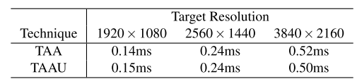

