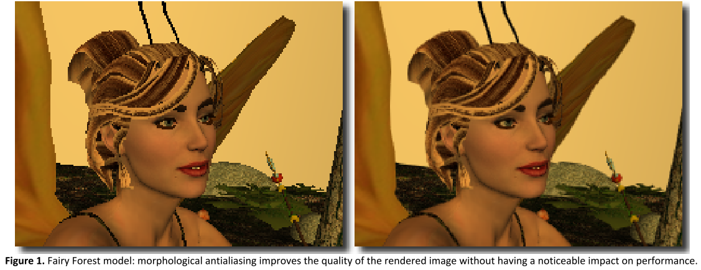
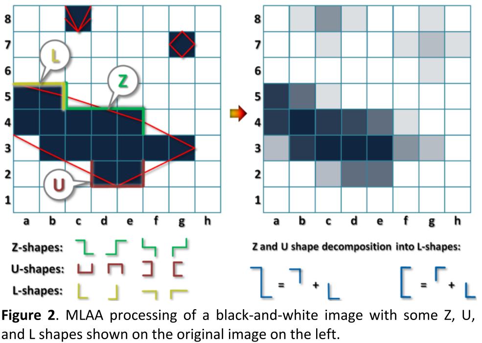
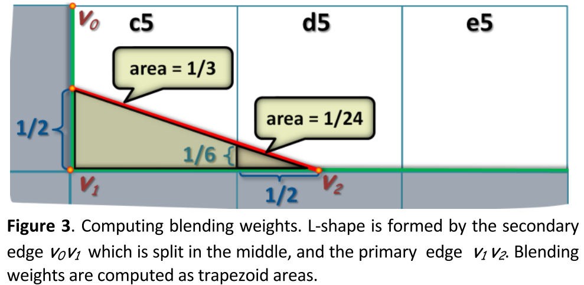
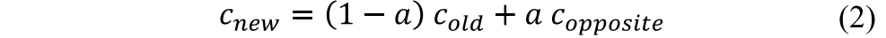
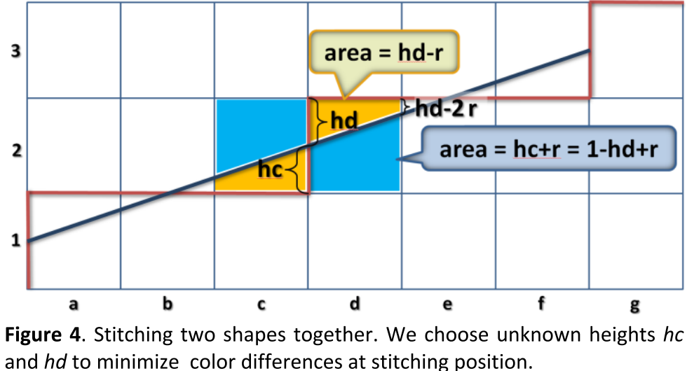
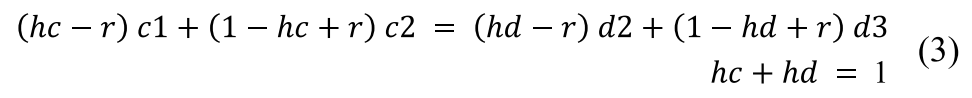
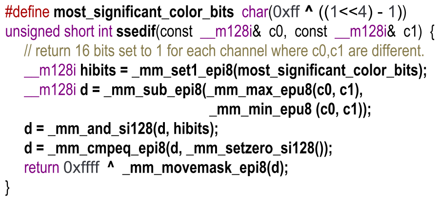

# Morphological Antialiasing

## 1. 介绍

`MLAA`基于识别图像中的某些**模式**（`patterns`）。作者从计算机视觉算法中获得灵感，特别是**基于形态学的图像分析**。一旦发现这些`patterns`，就在这些模式周围**混合颜色**。

> 算法的主要缺点是：它不能处理**小于奈奎斯特极限的特征**。

## 2. MLAA

`MLAA`主要包含三个步骤：

1. 在给定的图像中找到**像素之间的不连续点**。
2. 识别**预定义的模式**。
3. 在这些`patterns`的附近混合颜色

> 为了简单起见，首先描述的`MLAA`技术，将用于**黑白图像**。

### 2.1 BLENDING HARD SHADOWS

`MLAA`的黑白实现的实际应用是**硬阴影的抗锯齿**——它接近于**阴影剪影图**（`shadow silhouette maps`），其允许构建一个对真实阴影的**片断-线性近似**（`piecewise-linear`）。主要的区别是，**`MLAA`的实现始终是像素级的**。

见图2左，作者想对黑白像素之间的边界进行**片断-线性近似**（`piecewise-linear`）（显示为**红色轮廓**），以获得**右侧的抗锯齿图像**。

作者用**国际象棋的符号**来表示**这幅图上的像素**：左上角的像素将是`a8`，以此类推。`l`、`r`、`t`和`b`将定义一个**特定像素的边缘**，所以`a8`的**右边缘**是`a8r`，它的**底边缘**是`a8b`。一条边最多可以有两个不同的标签（`a8b` = `a7t`）。一个简单的**速记符号**也将被用于**像素组**，例如：`{cd}4`代表`{c4,d4}`。

:one:在==算法的第一步==，我们搜索所有**分隔黑色像素和白色像素的线**，保留最长的线——通过比较每个相邻的两行和两列（感觉就是**十字架邻域**）。例如，对于第`4`行和第`5`行，我们将找到一条**分离线** `{c4t,d4t,e4t}`（==论文中是`u`，不知道是什么意思==），而`g`列和`h`列将有`2`条不同的分离线`g3r`和`g7r`。我们还将假设**边界像素**被扩展到**额外的假想行和假想列**，因此像素`c9`将是黑色的，以此类推。**==每条分离线由它的两个最远的顶点定义==**。

:two:在==算法的第二步==，我们在**最远的顶点**寻找**与当前分离线正交的其他分离线**。大多数分离线都有`2`条正交线，但源自图像边缘的分离线除外。这一观察使我们能够==将分离线分为以下三类==：

1. 如果两条正交线穿过当前分离线形成的两个半平面，就会出现一个==Z形图案==。
2. 一个==U形图案==，其正交线是在同侧。
3. 一个==L形图案==，只有在分离线起源于图像边界时才会发生。

一条分离线可以是多个`patterns`的一部分（最多`4`个）。例如，如果像素`h4`是黑色的，就会发生这种情况。该算法没有考虑到这一点，一旦发现任何`pattern`，就立即进行处理。这导致了**轻微的模糊**，从而进一步减弱了图像中**不必要的高频**。同样地，**一个像素可以被多条分离线所包围**，导致这类像素的**额外混合**（例如图2中的`c8`和`g7`）。

:three:**Z形**和**U形**可以被分割成**两个L形**，所以在==算法的第三步==描述**L形的处理**就足够了。作者认为**L形**是由**第一步发现的一条主边**和**第二步发现的一条次边**形成的。主边的长度为`0.5`像素或更多（由于`Z`或`U`形的分割而产生的分数），而每个次边的长度等于`1`（即使它可以是**更长的分离线的一部分**，我们只对**紧贴主边的片段**感兴趣）。任何`L`型都是由**这三个顶点**形成的。为了找到**混合权重**，我们将**次要边缘的中间点**与**主要边缘的剩余顶点**连接起来（如图`3`的**红线**所示）。

**这条连接线**将连接在**L型上的每个单元格**分割成**两个梯形**。我们计算**连接到主边的每个梯形的面积`a`**，并使用它来计算这些单元的新颜色，如下所示：

$c_{old}$是单元格的旧颜色，$c_{opppsite}$是**主边对面的单元格的颜色**。对于单元格`c5`，$a=(1/2+1/6)/2=1/3$。它的新颜色将被计算为$2/3\cdot1+1/3\cdot 0$。 

:four:需要注意的是，这种`one-size-fits-all`的方法（二级边缘总是被分成两半）在**面积和颜色计算**上会产生**系统误差**。然而，方差会减少，从而产生更平滑、更好看的图像。

### 2.2 PROCESSING COLOR IMAGES

#### DISCONTINUITIES IN COLOR IMAGE

要找到**图像中的不连续性**，既可以依靠相邻像素之间的**颜色差异**，也可以依靠一些额外的信息，如几何信息。第一种方法（使用颜色）的**最大优点**是：这种方法**不处理颜色相似的像素**，从而**避免了额外工作**（可能不会以任何有意义的方式改变这些像素的颜色）。**缺点**是，这种方法也可能引发对（那些只通过纹理映射而获得明显颜色差异的）像素的**多余处理**。

在本文的其余部分，作者将使用**基于阈值的颜色差异**，没有任何附加信息。只使用**4个最重要的比特**作为每个8位红、绿、蓝通道的**相似性衡量标准**。

#### PATTERN SEARCH

图4显示了**两个相邻的Z字形**，在这个特殊的情况下，由一个**线性剪影边缘**形成。红色分离线以下的所有像素的颜色都是相似的，红线以上的像素的颜色也是如此。对于**黑白图像**，$hc=hd=1/2$ 和 $r=hd/l$，其中 $l$ 是**Z形的长度**。该比值表征了**两个梯形底之间的关系**，而==梯形的面积是其两个底的平均值==。如果两个相连的`shape`的长度相同，那么两个蓝色（较大）的梯形是**全等的**，两个黄色（较小）的梯形也是如此。作者用单元格名称来表示它们的颜色。为了说明**两个形状之间平滑过渡的要求**，作者使用每个形状的参数，计算两次相同的混合颜色：

> 所以上诉方程的本质目的就是：通过因变量颜色，求得hc、hd

对于$c1=d2$（红线下两个像素）和$c2=d3$（以上）的图像，第一个方程简化为$hc=hd$。解决方案是$hc=hd=1/2$，这与**黑白版的`MLAA`**完全一致。对于**彩色图像**，我们想解决这些方程的==未知分割变量==$hc$和$hd$。我们需要对这些方程中的`c1`、`c2`、`d2`和`d3`变量进行定义。

一种方法是：**对每个通道分别求解方程（3），然后对解进行平均**。作者采用了另一种更简单的方法，将三个红、绿、蓝值相加，形成一个单一的数值，来代表一个给定的像素。为了避免整数和浮点数的混合，对于**CPU版本的MLAA**，作者没有给不同的通道分配不同的权重，将更高级的亮度处理推迟到GPU实现。这些集合值只用于寻找==分割值==$hc$和$hd$，**颜色混合**将为每个通道单独进行。

为了找到导致平滑的颜色混合的`patterns`，我们将通过解决**线性方程（3）**来测试**所有可能的候选者**。如果发现$hc$和$hd$的值在$[0, 1]$区间内，我们就处理这个**被测试的形状**，否则忽略它。有可能出现这样的情况——即一条分离线形成多个有效`patterns`，特别是在**有纹理的区域**。为了简单起见，作者只处理第一个发现的`pattern`（两个可能的Z形和两个U形），然后继续前进。

通过提供一个额外的接受或拒绝测试`patterns`的标准，避免了由于**颜色不连续阈值设置过低**而导致的不必要的计算。此外，保证了连接形状之间的平滑过渡。

### 2.3 TEXTURES

根据设计，作者并不特别关注==纹理==，认为它们是**给定图像的一个组成部分**。对于相邻像素之间有较大色差的纹理，这将导致像素的混合。这应该在一开始就通过使用`mipmapping`来完成。

TODO.

### 2.4 OPTIMIZATION

`MLAA`的第一步（==搜索颜色的不连续性==）是针对每个像素执行的。幸运的是，它允许有效的**SSE实现**。通过使用`8`比特的颜色通道，**每个RGBA颜色**需要`32`比特，所以`4`个RGBA像素将适合于一个**SSE寄存器**。下面的`C++`代码片段显示了`ssedif()`函数的实现，它使用**SSE2指令集**对`4`个RGBA值进行比较。

> 直接机翻了：（TODO）
>
> 实现起来非常简单，允许对16个8位的数值进行模拟处理。我们计算4个RGBA颜色（变量d）的绝对差异，只保留最重要的位，并将结果与0进行比较。注意，我们不能将变量d直接与阈值进行比较，因为在SSE®集中没有对无符号8位值的比较操作。如果需要一个任意的阈值，这个函数可以很容易地用现有指令重新实现，尽管效率较低。
>
> 我们用这个函数来寻找原始图像中每两个相邻的行和每两个列之间的不连续点。由于像素是按行存储在帧缓冲器中的，访问一行中的4种颜色（16个8位通道）可以通过一条_mm_load_si128指令来实现。对于列，我们使用_MM_TRANSPOSE4_PS宏[Intel]将数据转换成SSE友好格式。

## 3. MLAA LIMITATIONS

`MLAA`最大的限制是：==它无法处理像素大小的特征==。

`MLAA`的一个不太明显的缺点是：它对边界像素的处理，对于这些像素，没有关于邻域的全部信息。

另一种类型的问题是`MLAA`特有的。因为`MLAA`只使用**图像数据**进行重建，**变化非常缓慢的场景可能在帧之间产生不平滑的过渡**。

