# SMAA Enhanced Subpixel Morphological Antialiasing

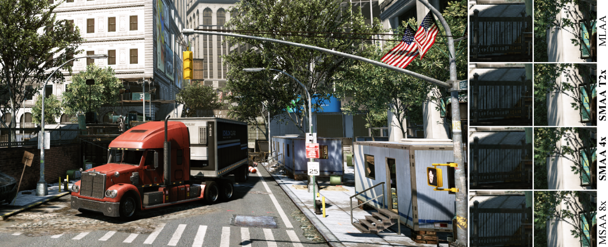

## 1. 介绍

==形态学抗锯齿==（`MLAA`）方法催生了**实时抗锯齿技术**的爆发，其质量可与`MSAA`的结果相媲美。然而，分析目前这一代**基于滤波器的抗锯齿技术**，它们至少都有以下一些问题：

- 大多数**边缘检测方法**只考虑到像素之间的**数字差异**，忽略了**边缘的周围环境**也会影响人类对它们的看法。
- **物体的原始形状**并不总是被保留下来；大多数情况下，在文字、尖角和亚像素特征中可以清楚地看到**角落的整体变圆**。
- 大多数方法被设计为只处理**水平或垂直的模式**，而忽略了**对角线**。
- 真正的子像素特征和子像素运动没有得到充分的处理。
- **镜面和阴影锯齿**没有被完全消除，特别是当它发生在**子像素层面**时。

要解决所有这些问题，同时保持**实时性能**，是一个真正的挑战。作者提出了一种新的后处理抗锯齿技术，即==增强型亚像素形态学抗锯齿==（`SMAA`）。作者的方法遵循**分而治之的范式**，分别处理这些复杂的问题，提供简单的、模块化的解决方案。

首先，作者扩展了**边缘模式的数量和类型**，以便在处理**对角线**的同时保持**清晰的几何特征**。其次，通过在**形态学抗锯齿**中加入**多重/超采样和时间重投影**，作者能够重建**真实的子像素特征**并处理**子像素运动**。最后，作者引入了一个**稳健的边缘检测**，利用**局部对比度**和加速但精确的**距离搜索**来实现**更准确的模式分类**。

> 作者在http://iryoku.com/smaa/，公开了所有的源代码。
>

## 2. Morphological Antialiasing

**形态学抗锯齿**（`MLAA`），试图估计**原始几何的像素覆盖率**。为了准确地光栅化一个抗锯齿的三角形，必须计算三角形内**每个像素的覆盖面积**，以使其与背景适当地融合（假设是从后到前的渲染顺序）。`MLAA`从没有抗锯齿的图像开始（在光栅化过程中没有考虑**覆盖面积**），所以它通过**重新矢量化剪影**来反转这个过程，以估计这种**覆盖面积**。 然后，由于**光栅化后的背景**无法得知，`MLAA`与一个邻居混合，假设其值与**原始背景**相似。下图描述了这个过程。

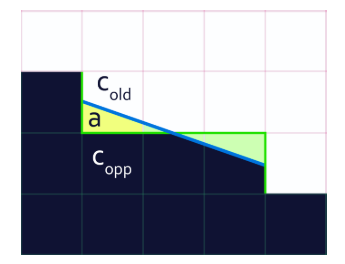

在诸多`MLAA`的实现中，作者选择`Jimenez`的`MLAA`（`Practical Morphological Anti-Aliasing Jorge`）实现作为**本文算法的起点**。

## 3. SMAA: Features and Algorithm

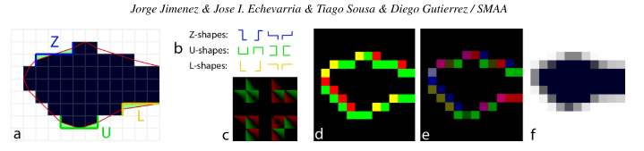

### 3.1 Edge detection

==边缘检测==在所有的**AA滤波器**中都是至关重要的，因为每一个**未被检测的边缘**都会在最终的图像上**保持伪影**。另一方面，`over Blur`会降低**抗锯齿图像的质量**，同时造成**不必要的性能损失**。不同的信息可以被用于**边缘检测**：RGB颜色、`luma`、深度、表面法线、物体ID或它们的组合。

作者选择使用`luma`是基于四个方面的观察：首先，`MLAA`希望边缘来自于**基于颜色的（`luma`或`RGB`）不连续**；第二，相对于深度和法线，==颜色信息总是可用的==。第三，它可以处理阴影锯齿。第四，它比**RGB颜色**更快，同时通常能产生**类似的结果**。为了提高效率，只在**每个像素的顶部和左侧边界**搜索边缘，因为**底部和右侧的边缘**（这个我在`MLAA`那边博客里面详细介绍了）可以从邻居那里检索到。

***Local contrast adaptation***

`HVS`倾向于在周围地区存在**高得多的对比度**时掩盖**低对比度的边缘**。因此，**完全基于局部数字差异的彩色边缘检测**将产生**虚假的边缘**（通常是人类无法检测到的），这将影响`pattern`分类，降低图像质量和时间稳定性（见图`5`，顶部）。为了避免这些**虚假的边缘**，作者执行了一个**自适应的双重阈值**，它允许：

+ 防止**边缘搜索**停止在**非感知可见的交叉边缘**；
+ 当一个像素上有**两条平行的边缘**（顶部-底部，或左侧-右侧）时，选择**主导的（对比度更高的）边缘**。

这与以前的方法不同，以前的方法考虑到**局部对比度**，只是简单地检查在**当前像素及其`4`邻域**中发现的`lumas`范围，因此边缘之间**没有感知掩蔽的概念**。

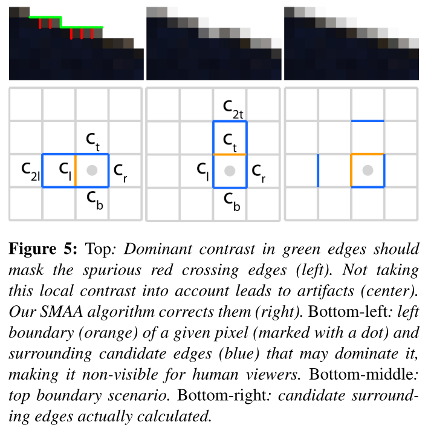

上图，左下角，显示了一个**给定像素（灰点）**的**左边缘（橙色）**的情况，加上周围**可能掩盖它的候选边缘（蓝色）**。计算这些边缘的**最大对比度**$c_{max}$，并将其与**左边缘的对比度**进行比较。如果后者高于$0.5\cdot c_{max}$的阈值，该边缘就被保留下来；否则，它就被忽略。**这个阈值是根据经验选择的**，并在作者所有的测试中提供了良好的结果。中下图显示了**顶部边缘的类似情况**。由于计算所有这些边缘涉及**太多的内存访问**，作者选择了一个**产生满意结果的子集**（右下）。

对于左侧边界的情况，一个直接的算法将计算：$e_l = |L-L_l |> T$，其中$e_l$是**编码边缘**是否`active`的布尔值，$L$和$L_l$分别代表**当前和左侧像素的luma值**，`T`是一个给定的阈值（通常在`0.05`和`0.2`之间）。 作者用一个**额外的测试**来完善这个方法，这个测试可以表示为：

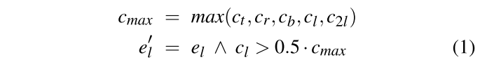

其中，$c_t , c_r, c_b, c_l , c_{2l}$是图5中所示的**边的对比度**，$e_l^/$代表**左边边缘边界的最终布尔值**。顶部也是一样的方式。

> 总结来说：作者是使用`luma`作为检测标准，然后查询的应该是**十字领域**外加**对于边缘的额外凸起**（也就是**六个采样点**），然后计算得到**五个对比度**，最后利用这五个对比度来决定**边缘的与否**。

### 3.2 Pattern handling

***Sharp geometric features***

`MLAA`的**剪影的重新矢量化**倾向于**使图像上的角变圆**。鉴于**用于模式检测的交叉边缘**只有一个像素长，不可能将**锯齿状的边缘**与物体的**实际角落**区分开来。

为了避免这种情况，作者做了一个**关键的观察**，即**轮廓线上的交叉边缘**
**等高线的边缘**最大尺寸为一个像素，而对于`sharp corners`，这个长度很可能更长。（这个实际也是可以想到的，锯齿边的交叉边确实一般只会是一个像素）因此，作者取**两像素长的交叉边缘**来代替；这可以检测到**实际的角落**，并应用一个**不太积极的处理**，从而更紧密地保留**物体的真实形状**。应用的处理程度是由一个==舍入因子==`r`定义的，它对**由一像素长的交叉边缘获得的原始覆盖区域**进行缩放。建议`r`的范围是$[0.0-1.0]$。例如，$r=1.0、0.5、0.0$ 的值分别产生蓝色、黄色和粉红色的线条。

·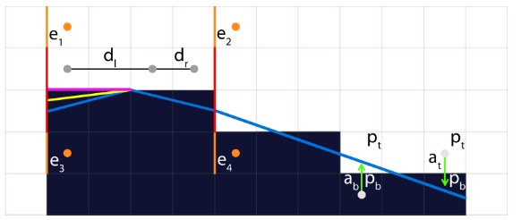

对于水平线情况，作者对**Jimenez的MLAA覆盖区域计算**进行了如下修改：

1. 进行原始模式的检测，使用**常规的交叉边缘**（上图中的红色边缘）。这就产生了属于模式的两个区域$a_b$和$a_t$。$a_b$用于将底部像素$p_b$与它的顶部邻居$p_t$混合，而$a_t$则用于将$p_t$与$p_b$混合。（关于这点，我也在自己的`MLAA`的博客里面进行详细的介绍）。

2. 根据以下几点来细化区域$a_b$和$a_t$：

   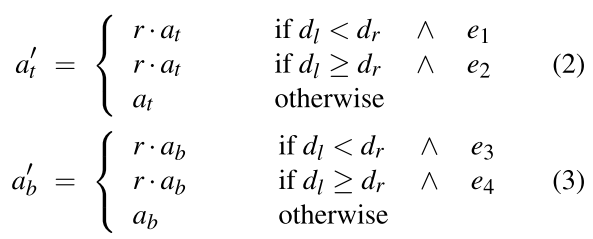

   $d_l$和$d_r$是当前像素到线的左边和右边的距离，而$e_i$是表示一个边缘是否`active`的布尔值。

***Diagonal patterns***

大多数现有的**基于过滤器的技术**搜索**完全由水平和垂直边缘组成的模式**。这就导致了**对角线的严重失真结果**。作者介绍了一种**新的对角线模式检测方法**，它可以检测到这些情况。在这些情况下，==对角线的重新矢量化==（图7，中间）被用来产生覆盖区域，而不是原来的**正交重新矢量化**（图7，左边）。

处理对角线模式的机制是受**Jimenez的MLAA的正交模式处理**的启发。作者引入了一个**预计算的纹理**，将**对角线模式**作为输入，由对角线两端的距离和对角线交叉边缘信息定义（图7，右）；并输出**准确的覆盖区域**。图8显示了可能的对角线模式及其相应的预先计算的区域。

对于从**左上到右下**和从**左下到右上**的对角线情况，计算对角线覆盖区域包括以下步骤：

1. 搜索对角线的左端和右端的对角线距离$d_l$和$d_r$。
2. 获取交叉边$e_1$和$e_2$。
3. 作者使用这些输入信息$(d_l , d_r, e_1, e_2)$，定义**特定的对角线模式**，以访问预先计算的区域纹理，产生区域$a_b$和$a_t$。

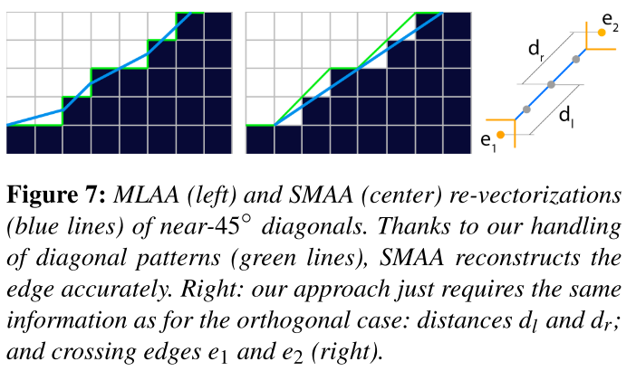

在==覆盖区域的计算==中，作者在**正交模式之前**进行这个**对角线模式的检测**。如果**对角线模式**检测失败，作者就触发**正交检测**。否则，就使用对角线模式检测产生的区域。

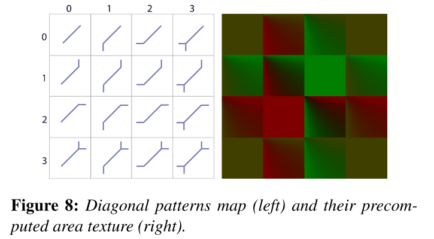

***Accurate distances search***

==模式检测和分类的关键==是获得**准确的边缘距离**（到线的两端的长度）。Jimenez的MLAA广泛使用**硬件插值（双线性过滤）**来加速这一过程。硬件双线性滤波可以作为一种方式，通过**一次内存访问**来获取和编码**多达四个不同的值**。这被用来一次获取两条边，可以部分地减少**带宽的使用**（见图9，左下角）。然而，它在搜索过程中不检查交叉边，这可能导致**模式检测的不准确**。

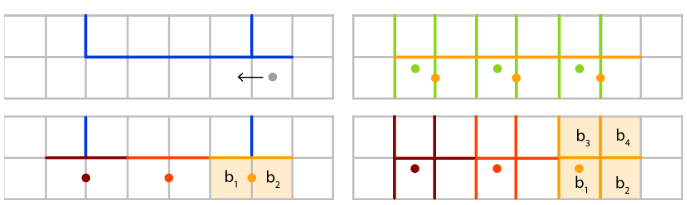

按照他们的方案**在搜索循环中获取交叉边缘**将意味着每次迭代都要进行**两次线性过滤访问**，使带宽的使用**增加一倍**。作者把这个方法推广到**二维访问**，能够用**一次内存访问获取四个不同的值**（图9，右下角）。

`Jimenez`的`MLAA`使用两个二进制值的线性内插，产生一个**单一的浮点值**：

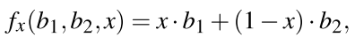

关于上诉公式，还是看之前的博客，有解释。`SMAA`对四个二进制值进行了双线性插值，如下所示：

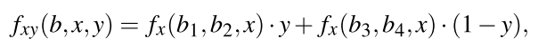

其中`y`是第二维的插值。通过选择$y=0.5x$，可以创建一个**二进制基数**，允许将四个二进制值之间的双线性插值编码为一个**单一的值**，并且仍然能够恢复`16`个可能的原始值。作者利用这一事实来获取**b1、b2、b3和b4的二进制边缘值**。。

### 3.3 Subpixel rendering

**MLAA算法的工作原理**是对每个像素进行单一采样——这使得它无法恢复**真正的子像素特征**。每个像素有更多的样本可以更好地重建**抗锯齿的图像**。一个简单的扩展是将`MLAA`与`MSAA`结合起来使用，将其分别应用于**每个子样本组**，然后将其**平均化**。然而，使用这样一个简单的方法会导致**模糊的结果**。这是由于`MLAA`和`MSAA`对样本的覆盖率做了不同的假设，所以即使增加**每个像素的样本数**，它们也不能收敛。

作者的解决方案是：考虑到每个子样本**在像素边上的偏移位置**，以便正确计算**它们的覆盖区域**（`FXAA`里面的思想？）。这样，当不同的子样本组被混合在一起时，作者就得到了**像素中心的平均颜色**（见图11，左边和中间）。然后，对管道的唯一重新要求的改变是：对每个子样本位置使用**不同的预计算区域纹理**。这种方法足够通用，可以处理**来自标准方法的额外样本**，如时间超采样和空间多采样，因此可以有几种配置。特别是，作者发现从性能/质量的角度来看，以下模式是最有趣的：

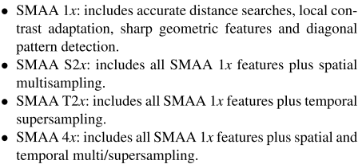

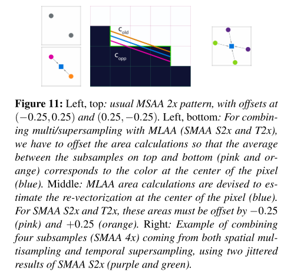

### 3.4 Temporal reprojection

虽然**时间上的超采样**可以有效地渲染**子像素特征**，但将其与**线性混合等方法**结合起来，会产生**非常明显的残留伪影**，通常被称为**鬼影**。一个更好的解决方案是：将前一帧的子样本重新投射到当前帧中。然而，排除的区域仍然会有残留的伪影。为了最大限度地减少它们，作者用`w`对前一个子样本进行加权，这取决于相对于当前子样本的**速度差异**：

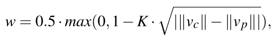

其中$v_c$和$v_p$是**当前帧和前一帧的速度**，`K`是一个常数，它决定了作者根据速度差异对前一帧的**衰减程度**（在所有的例子中，作者使用`30`的值）。然后，最后的解析按以下方式进行：

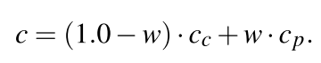

其中，$c_c$是当前帧的颜色，$c_p$是前一帧的颜色。这样的解决方案可以稳健地处理**不排除的区域**，但代价是这些区域**没有抗锯齿**。尽管如此，技术的其他部分（MLAA或空间多重采样）通常会对这些区域进行抗混叠，有效地消除了这个问题。

将**速度加权**与**形态学策略**相结合的另一个问题是：**形态学抗锯齿**实际上是在**亚像素水平**上混合**物体轮廓两侧的像素**。然而，**速度map**仍然是锯齿的，因此速度不会**传播**`propagate`到抗锯齿的像素上，这就在运动的物体后面留下了**混合像素的痕迹**。解决办法是在速度缓冲区上也应用`SMAA`，以便将**速度**传播到混合像素上（不懂`propagate`是啥意思）。为了有效地执行这一步骤，作者将速度粗略地存储在**颜色缓冲区的alpha通道**中，这样`SMAA`就可以免费处理它了。

