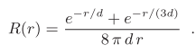

# Approximate Reflectance Profiles for Efficient Subsurface Scattering

==本文提出了三个BSSRDF模型的参数化，都基于经验得到的<u>反射剖面</u>==`reflectance profile`。这个模型非常简单，但是通过适当的参数化，对于许多常见的材料而言，它比最先进的基于物理的模型（`quantized diffusion`和`photon beam diffusion`），都更好地匹配蒙特卡洛方法得到的结果（Ground Truth）。

==每个反射剖面都是指数的求和==，而每个指数的高度和宽度都依赖于表面反射率`albedo`和<u>平均自由路径长度</u>`mean free path length`。垂直照明`perpendicular illumination`、漫反射传输（照明方向无关）以及一种可选的测量散射距离的方法，都确定了参数化。

我们的近似对于渲染<u>光线追踪</u>和<u>基于点的次表面散射</u>都很有用。

## 1. Introduction

本文介绍了一个经验模型的三个参数化，该模型与偶极子一样简单，但效果极佳。==用近似代替基于物理的模型的主要原因是==：

- 无需对表面反射率和平均自由路径长度进行==数值反演==`numerical inversion`，将其转换为不太直观的体积散射和吸收系数。

> No need for numerical inversion [Jensen and Buhler 2002; Habel et al. 2013] of the user-friendly surface albedo and mean free path length input parameters to less intuitive volume scattering and absorption coefficient

- 内置单散射项。
- 更快的计算，更简单的代码和不需要查找表。
- 没有特别的校正因子κ(r)，使理论符合蒙特卡洛参考。
- A simple cdf for importance sampling。

## 2. Background and related work

### 2.1 Monte Carlo simulation and BSSRDFs

计算次表面散射最常用的方法是：将物体看作一个体积并进行蛮力蒙特卡罗模拟。（昂贵）

以及BSSRDF方法。

### 2.2 Physically based reflectance profile

==BSSRDF== S通常被简化为：径向对称（1D）漫反射剖面R，两个定向的菲涅尔透射项F~t~和一个常数C的乘积：

==偶极子扩散模型==是对==经过多次散射事件后扩散的次表面散射==的近似。这种模型简单，计算速度快，使用范围广；但是，它也过于模糊，导致看起来像蜡一样。次表面散射被参数化成：体积散射和吸收系数$\sigma_s、\sigma_a$，或者等价于：体积散射反射率和体积平均自由长度$\alpha、\zeta$，关系如下：
$$
\begin{align}
\alpha&=\sigma_s/(\sigma_s+\sigma_a) \\
\zeta&=1/(\sigma_s+\sigma_a)
\end{align}
$$
d 'Eon引入了==量子化扩散==`quantized diffusion`：改进的扩散理论和一个扩展的源项，而不仅仅是偶极子。这带来了更逼真的外观和，但对更耗时。这个算法所得到的漫反射剖面近似为高斯函数的和，而本文的近似值更精确，计算起来也更简单。

`photon beam diffusion`：相比量子化扩散更加精确且迅速。对于对称散射（垂直照明或理想漫射表传输），本文的进行更快也更准确，而在中等距离上，则是光子方法更好。

以上所有的扩散模型都要求单独处理散射，要么通过显式射线追踪，要么通过单独积分。这两种方法都很慢。==本文的模型包括单次散射，因此不需要额外的计算==。

### 2.3 Approximate reflectance profiles

我们的灵感来自于==用简单函数逼近复杂函数==这种常用技术，菲涅耳反射和折射就是一个很好的例子。根据物理学（麦克斯韦方程和能量约束），菲涅耳反射和折射可以被建模为两项的和，一项用于垂直偏振光，另一项用于平行偏振光。但是Schlick[1994]观察所得到的曲线可以用一个简单的多项式近似，这种近似被广泛应用于计算机图形学中，因为它更简单，计算速度更快，并且没有明显的区别。作者希望对次表面散射有一个类似的近似。

反射剖面已经用<u>零均值高斯函数之和</u>`a sum of zero-mean Gaussians`，进行了合理的近似；甚至用单个高斯或立方多项式进行了更粗略的近似（4S方法）。

Burley指出，漫反射剖面的形状可以用==两个指数函数之和除以距离r==的曲线来近似：**{2}**

其中，参数d控制曲线的高度和宽度，并且可以根据艺术喜好进行设置，也可以根据物理参数进行确定。在R(r)的这个表达式中，d的任何正值都可以得到表面反射率1，因此Burley将其命名为==归一化漫反射==。通过乘以表面反射率A并选择一个合适的d值，我们可以获得许多常见材料的精确拟合。这个技术在迪士尼电影中得到了使用，如下图:arrow_down:。

在下面的章节中，作者提出了简单的分析——如何最好的==缩放和拉伸==`normalized diffusion curve`，来匹配整个反射率范围内的蒙特卡洛结果。换句话说，确定了从物理参数到d的适当 "转换"。

## 3. Searchlight configuration

我们首先考虑所谓的<u>探照灯配置</u>`searchlight configuratio`，即一束聚焦的光入射到半无限均匀介质中（如下图:arrow_down:）。大部分光被物质吸收或逃逸回表面，从表面出来的光子分布，形成一个反射波瓣$R(r)$。

==在这一节中，作者假设：光子首先垂直于表面，直线向下传播==。作者也假设：<u>相位函数</u>`phase function`是各向同性的。

### 3.1 Monte Carlo references

以下是使用蒙特卡洛方法计算的参考剖面，是本文方法拟合的目标。

### 3.2 Functional approximation

我们需要决定d和平均自由距离的合适值。如果考虑两者具有一定联系，则可设置$d=\zeta/s$，然后公式(2)转化成：**{3}**

==接下来，注意到，为了用曲线拟合来确定s，只要考虑$\zeta=1$就行==，因为给定A的Monte Carlo曲线的形状与$\zeta$无关：$R(r,\zeta)=R_{\zeta=1}(\frac{r}{\zeta})/\zeta^2$。因此，对于曲线拟合，我们只需要考虑：**{4}**

接下来要在A的合理范围内决定s的值。具体做法：在s的参数空间内进行随机采样，来最小化相关误差：$r_i:\sum_i\frac{|R(r_i)-R_{MC}(r_i)|}{R_{MC}(r_i)}$，来决定s的值。

我们可以为$A=0.01,0.02,0.03,....,0.99$生成一个s值表，其中一些值落在拟合的曲线上:arrow_down:。我们手工调整得到的结果，相对于MC的误差只要$4.9\%$。==但作者给出一个简单的函数，它更紧凑，更容易求值==。

拟合公式如下：（其拟合曲线如上图:arrow_up:）
$$
s=1.85-A+7|A-0.8|^3
$$
这个曲线拟合在全区域上的平均误差是$5.5\%$，

## 4. Diffuse surface transmission

之前都是假设光线垂直射入平面，在本节中，==我们将模拟理想漫反射传输后的，次表面散射的反射剖面==。对于粗糙的表面材料，如干燥皮肤、大多数水果和粗糙大理石，这可能是一个更合适的模型。

图8:arrow_down:显示了理想漫反射表面传输后（余弦分布）的次表面散射的反射剖面$R(r)$，再次用MC模拟计算，重复上一节的步骤。

==再次使用手动曲线拟合，作者发现这个s表达式可以很好地拟合最优值==：
$$
s=1.9-A+3.5(A-0.8)^2
$$
此时的平均误差只有$3.9\%$:arrow_down:

实际上，第三节和第四节在视觉上差异不大，所以使用时，不用刻意区分。

## 5. dmfp as parameter

回到第三节的探照灯配置，可以使用另一种散射距离的参数化：表面的<u>漫反射平均自由路径</u>`diffuse mean free path`（==dmfp==）$\zeta_d$，而不是平均自由路径$\zeta$（mfp）。为了计算和$\sigma_s,\sigma_a$相关的dmfp，我们可以首先计算扩散系数：
$$
D=(\sigma_t+\sigma_s)/(3\sigma_t^2)
$$
给定D，我们可以计算有效的<u>传输衰减系数</u>`transport extinction coefficien`：$\sigma_{tr}=\sqrt{\sigma_a/D}$，而$\zeta_d=1/\sigma_{tr}$。为了计算蒙特卡洛参考曲线，我们只需确定哪一对$\sigma_s$和$\sigma_a$的值，能给出所需的A值即可，然后设置$\zeta_d=1$，

用$\zeta_d$代替$\zeta$，传入公式3，并使用如下公式:arrow_down:计算s，来拟合曲线：
$$
s=3.5+100(A-0.33)^4
$$
拟合结果如下:arrow_down:，最优点和拟合解，其误差分别是$6.4\%$，$7.7\%$。

## 6. Practical detail: importance sampling

对于与 ==入口点与出口点的径向距离== 成比例的重要抽样，我们需要 ==$R(r)$与$2\pi r$的乘积== 所对应的<u>累积分布函数</u>`cumulative distribution function`（cdf）。对于基于物理的==BSSRDFs==，该cdf必须通过数值积分来计算，这既麻烦又降低性能。但幸运的是，Burley的归一化扩散$R(r)\times 2\pi$很容易积分，cdf是：

这个简单的cdf可以用我们的两个参数化：$d=\frac{\zeta}{s}$或$d=\frac{\zeta_d}{s}$。反向cdf`inverse cdf`是$r=cdf^{-1}(\xi)$，其中$\xi$是0到1的一个随机数，==不幸的是，cdf不是解析可逆的，但我们至少可以用三种方法处理==：

- 随机选择两个指数中的一个，用它的倒数作为cdf，然后用多重重要性抽样（==multiple importance sampling==）对结果进行加权。
- a few Newton iterations（牛顿迭代）。
- 将d=1的$cdf^{-1}$的预计算表，按d缩放。

## 7. Discussion and results

