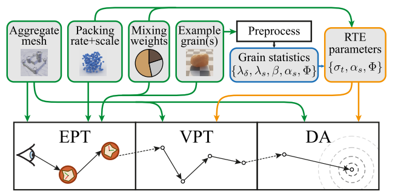
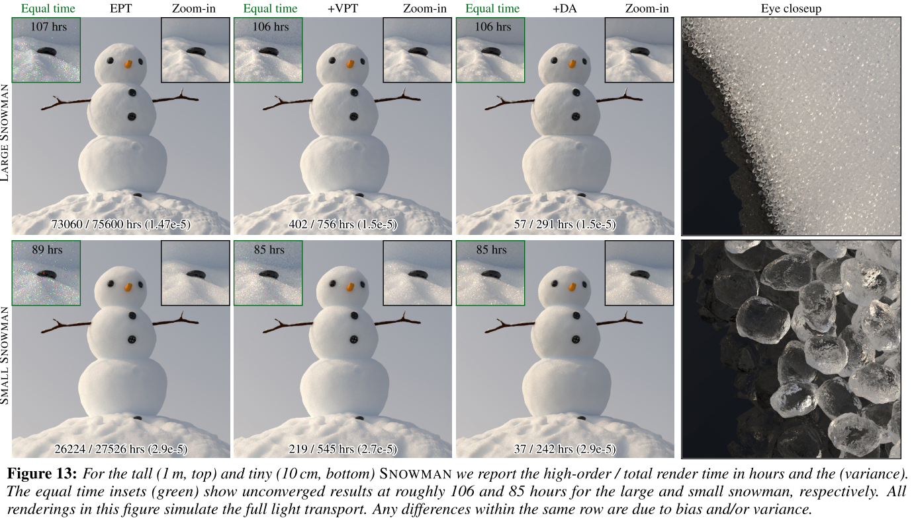
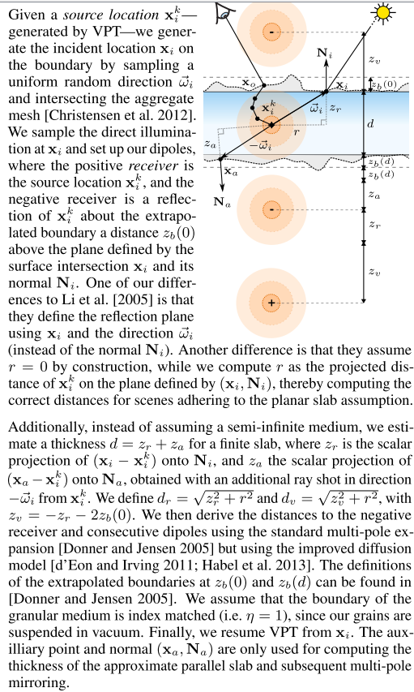

# Multi-Scale Modeling and Rendering of Granular Materials

本文主要处理颗粒材质的建模和渲染问题，例如：用沙堆砌的城堡（由大量朝向随机的颗粒组成）。本文提出了一个**多尺度**的建模和渲染框架，来适应不同尺度的**散射光结构**。本文只在最细微的尺度上对单个晶粒进行**路径追踪**，并通过将单个晶粒与它们的排列**解耦**，开发了一种**模块化**的方法来模拟较长尺度的**光传输**。

本文将光在**颗粒内部**和**颗粒之间**的相互作用，建模为单独过程，并利用这种分解，得到**辐射输运**`radiative transport`的参数，包括标准的**体积路径跟踪**和一种**漫反射方法**`diffusion method`——该方法可以快速总结**颗粒相互作用**而产生的大规模传输。

我们只需要对每个**样本颗粒**进行一次**预计算**，然后可以对任意形状，和不同包装率`packing rates `和尺度的晶粒进行重复使用。

### 1. Introduction

在本文中，作者渲染由**宏观颗粒**组成的材料。生活中有许多这样的例子:arrow_down:，这些例子的**共同点**是： 在颗粒的尺度上有可能出现详细的外观，但由于颗粒之间的多重散射，其大尺度外观是平滑的。

将每一个颗粒视为显式的**几何形状**，并使用*路径追踪*模拟全局光传输，这是一种**通用解决方案**，但仅适用于较小的颗粒集合。另一种极端是只考虑光滑的大尺度外观。但这两者的参数是**无法通用**的。

> 首次考虑体积光传输的经典论文：DURANT, S., CALVO-PEREZ, O., VUKADINOVIC, N., AND GR- EFFET, J.-J. 2007. *Light scattering by a random distribution of particles embedded in absorbing media*: full-wave Monte Carlo solutions of the extinction coefficient. Journal of the Optical Society of America 24, 9, 2953–2962

图1展示了本文的**渲染管道**，其输入包括描述**集合对象**的*几何结构*、颗粒的*包装率*(**密度**)和*尺寸*，以及单个颗粒的一个或多个类型的*几何*和*材料*属性。本文使用了三种光传输模型：

- 为了捕捉可见颗粒的外观，最详细的模型是**显示路径追踪**（EPT）；
- 为了捕获颗粒尺度以上的**大规模传输**，我们将颗粒材料近似为**连续介质**，并使用**体积路径跟踪**（VPT）对其进行跟踪。
- 为了避免跟踪**长路径**，对高于**体积介质**的*平均自由路径*的尺度，我们使用diffusion-based的近似。

使用这三个模型需要解决**两个问题**：

- 需要得到每种技术的渲染参数
- 确定什么时候使用哪一种模型

## 2. Related Work

Aggregate scattering solutions：将复杂几何结构的**聚类散射特性**压缩成更紧凑的散射函数一直是计算机图形学的研究课题。在本文的工作中，从聚合材料的单个颗粒中，预计算一个**散射函数**，通过将其与颗粒的排列、尺寸`scale`和`packing`解耦获得**模块化**。

> 所谓解耦，具体来讲，就是将这些参数从积分中提取出来。

Level-of-detail and prefiltering：和头发的渲染相似——其中单个纤维是可见的，因此需要建立**明确的模型**，但成本高且平滑的**大规模传输**是近似的。

Densely packed media：`packing density`$f$是粒子占据介质的**体积比例**。

Non-classical RTE methods outside graphics：理解高密度介质的*光学*和*热传导特性*在许多领域都很重要。一个流行的替代方法是使“**homogeneous phase approximation**”，其中高密度介质使用*标准RTE*进行（在低体积分数或长尺度传输上有效）。

## 3. Granular Model and Algorithm Overview

### 3.1 Stochastic Granular Model（随机粒子模型）

Tiled sphere packings：作者依靠一个程序化平铺的、填充球的**无限场**来填满*集合形状*的体积。每个球体包含一粒颗粒，由于球体不重叠，所以颗粒不能重叠。这简化了系统，但限制了粒子的$f$，特别是**非球形粒子**。

Randomized instantiation：把无限场的每个不同的球体作为一个**位置**，用于从*示例集*中随机选择一个粒子进行实例化。**示范颗粒**根据用户指定的混合概率（见图1）选择；集合网格（具有一致法线）定义了空间中粒子**实例化的区域**，并且每个实例**随机旋转**。

> 水密性`watertight`
>
> 关于这段，有几点需要解释。首先关于实例集，参照图一，有三个类别的粒子，然后根据传入的混合概率，进行随机选择，由于黄色的粒子的混合概率大，所以选择它的概率大，最后结果也是黄色粒子居多。
>
> 关于这段，唯一不明确的是，mesh和Packing rate怎么进行结合的。

### 3.2 Explicit Path Tracing

对于最细微的层次，作者使用一种算法，该算法针对刚才生成的**单个颗粒**的实际几何形状进行**显式路径跟踪**（EPT）（图4中说明了预期的输入）。这种方法的**核心挑战**是表示庞大的粒子集合，并有效追踪通过它的射线。

Ray tracing grains：在场景的射线遍历过程中，按需**程序实例化**和**丢弃颗粒**。为了方便起见，作者对边界网格进行体素化，每个v体素使用两个位，标记为 "完全在外面"、"完全在里面 "或 "部分在里面"。一个体素在大小和位置上，对应于` base tile`（？）的一个实例。

在光线追踪过程中，我们将光线与体素网格相交，以获得与“**完全在内部”或“部分在内部”**的体素的第一个**交集**。然后我们考虑体素内部的包围球：

- 如果体素被标记为“**完全在内部**”，则使用**第一个**相交的边界球。
- 如果它被标记为“**部分内部**”，首先必须确定包围球的中心是否包含在**聚合形状**中——通过追踪一条从球体中心到集合形状的光线来做到这一点。如果边界球被认为是在集合形状之外，沿着射线继续到下一个边界球，直到找到一个有效的边界球。

- 当击中一个边界球体时，根据混合权重选择一个随机的*实例粒子*（见上面的随机化实例），并将*射线*暂时转化到粒子的（**随机旋转**）局部坐标系中。
- 然后对*粒子几何*进行相交测试，以确定最后的交点。如果没有交集，寻找下一个边界球。

Rendering：有了这个**粒子相交**机制，作者采用了路径追踪（使用了*多重重要性采样*和*next event estimation*）作为他最好的层次渲染技术。此外，这里的大多数**颗粒材料**都是由具有**镜面边界**的颗粒组成，这使得阴影射线毫无用处，并强调了改用其他方法的必要性。

### 3.3 Volumetric Path Tracing

虽然**EPT**在低阶散射中保留了必要的**颗粒级细节**，但当光线不相干时，它就无法用于**高阶传输**。幸运的是，对于非相干射线，不需要精确命中具体的粒子，因此我们将转换为中阶传输的**连续体积表示**，并使用体积路径跟踪(**VPT**)来模拟这种传输。

对于这种渲染方法，我们假设每个**边界聚合形状**`bounding aggregate shape`都填充了一个与**索引匹配**的*同质参与介质*`homogeneous participating medium`。==这个介质由以下参数定义==：（如何获得，参见第四节）

- 消光系数 $\sigma_t$
- 单次散射的反射率 $\alpha_s$
- 散射的相位函数 $\Phi(\cos(\theta))$

除了**VPT**不需要实例化之外，转换到**VPT**允许我们利用颗粒介质内部的**阴影连接**，这是**EPT**不可能做到的。我们将在第6节看到，这允许**VPT**有效渲染（对于**EPT**来说）困难的场景，比如大量高光、非吸收**颗粒**的聚集。

### 3.4 Diffusion Approximation

虽然**VPT**比**EPT**具有低得多的*方差*，但对于需要**长传输路径**的高散射材料，**VPT**的计算成本仍然很高。因此，作者过渡到一种基于**快速漫反射近似**的渲染技术，来解释**高阶多次散射**引起的大规模传输。

> 可以缩短VPT的递归；直接模拟长距离散射。

我们通过在边界网格上采样一个位置，并估计漫反射传输来进行切换。

### 3.5 Importance of Using a Hybrid Method

虽然可以单独使用上述方法中的任何一种，但本文的**目标**是：将它们组合成一种**混合方法**。

## 4. Precomputation and RTE Parameters

在本节中，作者的目标是：推导出与**离散颗粒材料**的**统计散射行为**相匹配的**经典均质介质**的==RTE参数==。这个工作不是无关紧要的，因为==具有高填充率的颗粒材料实际上并不满足RTE的核心假设==——即**散射体足够小**且**分离良好**，因此每个相互作用可以被认为是**统计上独立**的。

为了处理这种*不兼容性*，我们首先(4.1节)介绍了一个统计的、非经典的**光传输模型**，称之为*传送传输*`teleportation transport`(**TT**)。这个**中间模型**允许我们推理颗粒材料中存在的**非点散射效应**`non-point scattering effects `，并将为**VPT**和**DA**方法提供一块垫脚石,来推导经典的*RTE参数*（第4.2节），而不需要依赖场景的**预计算**。

### 4.1 The Teleportation Transport Model

我们希望创建一个**纯统计模型**，该模型可以描述对**颗粒材料**进行**路径跟踪**所构建的路径，如3.2节所述。**TT模型**由两个交替发生的核心步骤组成：

- 第一步考虑**颗粒间的传输**，通过随机决定*在与颗粒边界球发生下一个相互作用之前，沿光线*移动多远。

- 在撞上一个球体后，考虑通过**散射**和 **"传送 "**，将射线直接传送到**出点**来进行**颗粒内传输**。从传入点和及其方向**随机选择**一个偏转角度和空间偏移，以产生出点和其方向，并继续路径。==这样做的方式是==，当对所有可能的**进入点**和**粒子方向**进行平均时，**连续分布**与**颗粒几何观察到**的相同。

    > 请注意，这个模型类似于RTE的**体积路径跟踪视图**，但由于传送，而引入了非点散射效应。

Inter-grain transport：我们需要确定从一个颗粒（填充球）到另一个颗粒（填充球）的**距离分布**。其指数模拟公式如下：**{1}**

其中，R是填充球的半径，$f$是球的`packing rate`，$\lambda_b=1/\sigma_b$是球之间的平均距离，Z是颗粒半径。

Intra-grain transport：**颗粒内传输**的目标是：对**随机射线**与**随机取向的颗粒**的相互作用进行**统计建模**。在与粒子相互作用零次或多次后，路径要么离开边界球，要么被吸收。描述这个过程的函数是*teleportation scattering distribution function*（**TSDF**），它参数化了进入和离开空间的一整套光线。

> PHARR, M., AND HANRAHAN, P. M. 2000. *Monte carlo evaluation of non-linear scattering equations for subsurface reflection*. In Proc. of ACM SIGGRAPH, 75–84.

> WESTIN, S. H., ARVO, J. R., AND TORRANCE, K. E. 1992. *Predicting reflectance functions from complex surfaces*. In Computer Graphics (Proc. SIGGRAPH), 255–264.

我们可以围绕*teleportation transport model*，创建一个完整的渲染算法，这就需要存储**TSDF**，并对其和公式（1）进行**交替采样**。

作者在**补充材料**中，提供了更多的细节和对一个**原型实现**的分析。然而，在实践中，我们发现，我们可以获得类似的视觉保真度(见图7)，而只使用*TT模型*来获得经典的*RTE参数*，其**实施复杂度**明显降低。

### 4.2 Classical RTE & Diffusion Parameters

使用上一节的*TT模型*，来得到*RTE参数*。我们的**目标**是将**TSDF**的所有*方向性影响*提取到相位函数$\Phi$中，并将TSDF的**位置性影响**和**粒间传输**结合成有效的**消光系数**$\sigma_t$。

#### 4.2.1 The Phase Function & Albedo

在经典RTE中，*散射相互作用*被假定为发生在一个点上。这相当于假设**出射方向**只取决于**入射方向**。因此，我们可以提取TSDF的方向分量，并将其直接作为相位函数$\Phi$。

作者指出，**相位函数**只依赖于出、入射光的**余弦值**，这允许我们只建立一张一维表。单位球上一维分布的积分是有效的*颗粒反照率*`grain albedo` $\alpha_s$（即击中颗粒后，脱离边界球的**光比率**）。

#### 4.2.2 Combined Free-Flight Distribution

为了总结**散射**之间的*the overall free-flight distribution*，我们需要通过两种方式，来增强约束球体之间的*the free-flight distribution*，即公式（1）。首先，考虑到完全不散射，通过约束球的情况；其次，考虑那些散射的。我们依次处理每一种效应。

Accounting for delta scattering：如上图，有些射线不会击中球内的颗粒，其概率$\beta$被称为**击中概率**（直接从`scatterometer simulations`中估计它），==与之相关联的是未散射光线的平均空间偏移量==$\lambda_{\delta}$。现在，感兴趣的是到达下一个击中球的**移动距离**$\lambda_{\beta}$：**{2} {3}**

其中。$\beta=1$表示填充球被颗粒完全填充，而$\beta=0$则相反。$\lambda_b$可由公式1计算。

Account for teleportation：考虑吸收（*albedo* $\alpha_s$）和*teleportation*，我们最终得到了**颗粒相互**作用**出口点**之间的*exponential free-flight distribution*：**{4}**

### 4.2.3 Effective RTE and Diffusion Parameters

总之，从z作者的==颗粒散射计模拟==*grain scatterometer simulations*中提取了两个平均距离，两个概率和一个一维分布：$\{\lambda_{\delta},\lambda_{s},\alpha_s,\beta,\Phi(\cos{\theta})\}$。

对于混合物：通过计算不同**颗粒混合物**的统计量的**加权平均值**，来计算它们的有效*RTE参数*。然后，我们通过计算$\Phi(\cos{\theta})$的*平均散射余弦*g来推导漫反射参数，并得到减弱的*散射系数*$\sigma_s^/=(1-g)\alpha_s\sigma_t$，得到减弱的*消光系数*$\sigma_t^/=\sigma_s^/+(\sigma_t-\sigma_s)$，以及减弱的*反射率*$\alpha_s^/=\sigma_s^//\sigma_t^/$。

关于方法效果的验证，具体见论文。

## 5. Switching between Rendering Techniques

我们假设初级射线*primary rays*是在**颗粒材料**之外产生的，并开始使用EPT，来对**颗粒几何形状**进行渲染。我们从**EPT**开始，因为能渲染**高频细节**。为了说明为什么从 **EPT** 转换到 **VPT** 和 **DA** 既有利又安全，我们考虑属于一个像素的**射线束**。

==只要这些光线有一定的连贯性，EPT就会有相当好的表现==。然而，一旦这些光线在不同的方向上散射，而成为*统计学上独立的光线*，**EPT**的**方差**就会变得巨大，因为随机击中小光源的机会趋于零。但此时，我们也不需要精确*哪条射线打中哪个颗粒*，就可以平滑转换到**VPT**或**DA**。

因此，**本节的目标**是开发一种*自动切换标准*——在需要时使用EPT（当射线在像素尺度上仍然相干时），以及在射线变得不相干时切换到更平滑的VPT和DA技术。

> 具体来说，就是物体远近尺度的问题，来进行切换

EPT→VPT：每个像素衍生一个N = 16的**路径束**，这些路径通过颗粒进行**同步跟踪**。在第$k$次*bounce*，我们通过计算未终止$N_k$顶点位置$(x_1^k,...,x^k_{N_k})$的**标准差**$\sigma_k$，来测量射线的*相干水平*。当满足如下关系时，转换到**VPT**：**{5}**

> 注意到，在不断击中的过程中，光线可能会*死亡*，所以$N_K<16$

其中，$\tau$是用户指定的*最大颗粒半径r*的倍数。$N_k/N$因子==意味着存活光线越少，转换越快==。对于所有的场景，作者使用值为**4个颗粒半径**的阈值。当$\sigma_k$超过这个阈值时，就会立即切换；如果一个束中只剩下一条射线，也立即切换。

这个过程可以通过**剪枝**进行加速，这里采用的是**Russian roulette**（带有阈值$P_a$，之后会解释如何自动计算）

VPT → DA：虽然**漫反射**可以有效估计**多重散射**，但它也引入了一些近似和假设（最明显的是*各向同性散射*和*平面边界几何*），限制了它在一般环境下的**准确性**。对于从*VPT到DA*的切换，作者采用了一个旧有的工作，其目的是只允许DA在*近似不会太明显的情况*下进行。

切换到**漫反射**的主要标准是：*VPT路径顶点*$X_i^k$和*边界网格表面*之间的最小距离。使用的阈值是：$d_{DA}=min\{1/\sigma_t^/,0.5/\sigma_{tr}\}$。

High Order Acceptance Rate：由于用**EPT**计算的*低阶路径的收敛速度*通常比VPT或DA计算的*高阶路径的收敛速度*要慢，因此，我们通常可以通过将更多的**样本预算**用于低阶路径来降低图像的总方差。

我们的方法需要一个**相对便宜的预处理**（占用约1%的总渲染时间），在这期间，作者渲染了一个缩小的图像（在两个维度上各自缩小了**10倍**），每个像素的总样本数与最终图像相同。对于低分辨率预览中的每个像素，我们逐步估计低阶$V_L(x，y)$和高阶$V_H(x，y)$贡献的**样本方差**，我们还将计算这些贡献的**总CPU时间**$t_L(x，y)$和$t_H(x，y)$。

组合图像的方差作为*样本数*n和*接受率*$P_a$的函数，近似为：**{6}**

其中，$V_L$和$V_H$分别是$V_L(x，y)$和$V_H(x，y)$在*图像上的平均值*。图像所需的总时间约为：

通过求解使t最小的$P_a$值，可得：

## 6. Results

作者在Mitsuba**[Jakob 2010]**中实现了本文的方法，其作为积分器，以及颗粒体的*Shape primitive*。

## 7. Conclusion & Discussion

在本文中，我们已经展示了如何用平滑辐射传输模型来近似颗粒介质的大规模行为。通常情况下，对像雪这样的高反射率颗粒介质进行路径追踪是完全不切实际的，因为非常长、非常高变异的路径贡献了大部分的光照。我们的方法使用平滑近似来减少路径的差异（通过启用阴影连接）和长度（通过使用扩散），大大减少了花在高阶散射上的时间。其结果是，渲染时间不再被长路径所支配，而是将计算时间用于渲染由于低阶散射而产生的颗粒的可见结构。正如我们的结果所示，这使得渲染许多实际相关的场景变得可行，否则，这些场景的收敛时间将长得令人难以接受。

> :star:以上核心的观点是：如果直接使用EPT来渲染雪人这样的场景，其收敛速度是无法接收的，因为高阶路径十分多（有很多颗粒嘛），而又占据了视觉效果的大部分。这里的优化思路，就是只保留低阶的EPT，来产生颗粒的几何特征，而高阶情况，则使用VPT，或DA进行代替，来产生粒子的光学特征。

本文方法的**速度**限制了路径跟踪的**低阶贡献**（创建可见的颗粒结构）；在许多情况下，**作者成功地将高阶路径的代价降至零**，因此，为了**获得进一步的加速**，必须转向一个新的问题，即在*不平滑外观*的情况下，更快地呈现*闪光的、结构化的低阶贡献*。

Limitations in packing density：依靠**球状填料**的良好特性，我们可以解耦**粒间**和**粒内**的传输效应；然而，它也带来了一些*实际的限制*。我们假设一个单一半径的**球体填料**，并在这些边界球体中实例化单个物理尺寸较小的晶粒。==这在本质上限制了实际颗粒的紧密程度。==

Generality and mixtures：（普遍性和混合物）虽然我们的方法允许在单一介质中混合不同的颗粒类型，但目前我们假设混合比例在集合体的尺度上是均匀的。

## 附录A

